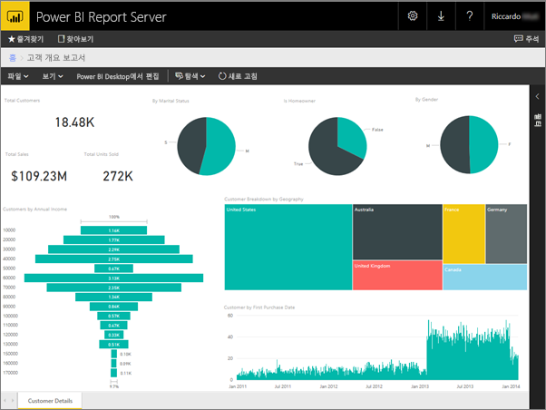
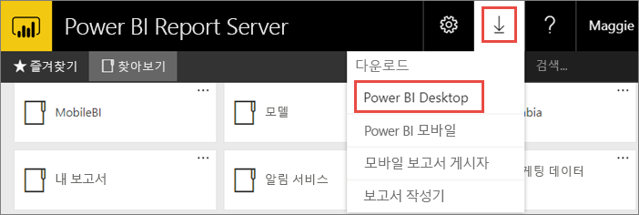
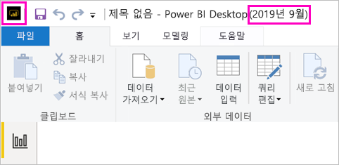
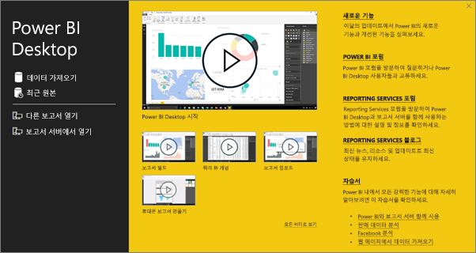
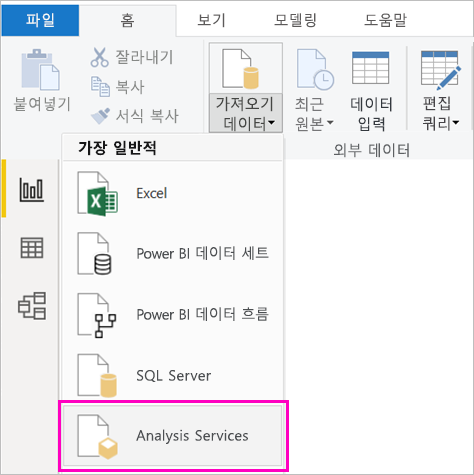
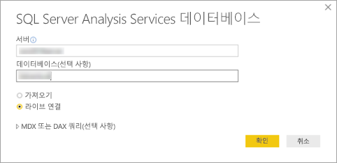
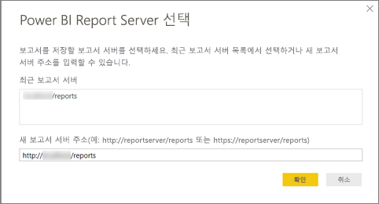
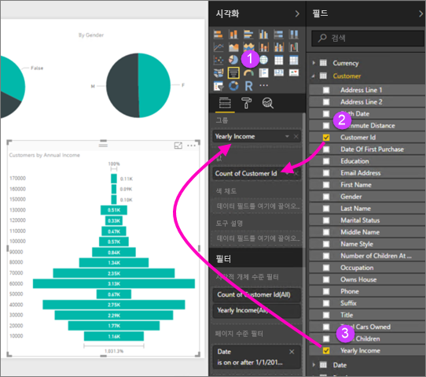
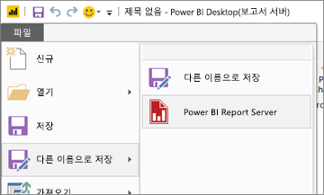

# Power BI Report Server용 Power BI 보고서 만들기
Power BI 서비스 (https://powerbi.com) 에서 클라우드에 Power BI 보고서를 저장할 수 있는 것과 마찬가지로 Power BI Report Server 웹 포털에서 Power BI 보고서 온-프레미스를 저장하고 관리할 수 있습니다. Power BI Desktop에서 보고서를 만들고 편집하고 웹 포털에 게시합니다. 그런 다음 조직의 보고서 판독기는 모바일 디바이스의 브라우저 또는 Power BI 모바일 앱에서 해당 보고서를 볼 수 있습니다.

작업을 시작하는 네 가지 빠른 단계는 다음과 같습니다.

## 1단계: Power BI Report Server에 최적화된 Power BI Desktop 설치

Power BI Desktop에서 Power BI 보고서를 이미 만든 경우 Power BI Report Server용 Power BI 보고서를 만들 준비가 거의 완료된 것입니다. 사용자가 서버를 알고 앱이 항상 동기화되도록 Power BI Report Server에 최적화된 버전의 Power BI Desktop을 설치하는 것이 좋습니다. 동일한 컴퓨터에 두 가지 버전의 Power BI Desktop을 설치할 수 있습니다.

1. 보고서 서버 웹 포털에서 **다운로드** 화살표 > **Power BI Desktop**을 선택합니다.

    

    또는 [Power BI Report Server](https://powerbi.microsoft.com/report-server/) 홈페이지로 이동하고 **고급 다운로드 옵션**을 선택합니다.

2. 다운로드 센터 페이지에서 **다운로드**를 선택합니다.

3. 컴퓨터에 따라 다음 중에서 선택합니다.

    - **PBIDesktopRS.msi**(32비트 버전) 또는

    - **PBIDesktopRS_x64.msi**(64비트 버전).

4. 설치 프로그램을 다운로드한 후에는 Power BI Desktop(2019년 9월) 설치 마법사를 실행합니다.

2. 설치가 끝나면 **지금 Power BI Desktop 시작**을 선택합니다.
   
    그러면 자동으로 시작되어 사용할 준비가 됩니다. 제목 표시줄에 **Power BI Desktop(2019년 9월)** 이라고 표시되면 올바른 버전이 준비된 것입니다.

    

3. Power BI Desktop에 익숙하지 않은 경우 시작 화면에서 비디오를 시청하는 것이 좋습니다.
   
    

## 2단계: 데이터 원본 선택
다양한 데이터 원본에 연결할 수 있습니다. [데이터 소스에 연결](connect-data-sources.md)하는 방법에 대해 자세히 알아봅니다.

1. 시작 화면에서 **데이터 가져오기**를 선택합니다.
   
    또는 **홈** 탭에서 **데이터 가져오기**를 선택합니다.
2. 데이터 원본을 선택합니다. 이 예제에서는 **Analysis Services**입니다.
   
    
3. **서버** 및 선택적으로 **데이터베이스**를 입력합니다. **라이브 연결** > **확인**을 선택했는지 확인합니다.
   
    
4. 보고서를 저장할 보고서 서버를 선택합니다.
   
    

## 3단계: 보고서 디자인
재미있는 부분은 데이터를 보여 주는 시각적 개체를 만드는 것입니다.

예를 들어 연간 소득에 따라 고객 및 그룹 값의 깔대기형 차트를 만들 수 있습니다.

1. **시각화**에서 **깔때기형 차트**를 선택합니다.
2. 필드를 끌어서 **값**으로 계산합니다. 숫자 필드가 아닌 경우 Power BI Desktop에서는 자동으로 해당 필드를 값*의 갯수*로 만듭니다.
3. 필드를 끌어서 **그룹**에 그룹화합니다.

[Power BI 보고서 디자인](../desktop-report-view.md)에 대해 자세히 알아봅니다.

## 4단계: Report Server에 보고서 저장
보고서가 준비되면 2단계에서 선택한 Power BI Report Server에 저장합니다.

1. **파일** 메뉴에서 **다음 이름으로 저장** > **Power BI Report Server**를 선택합니다.
   
    
2. 이제 웹 포털에서 볼 수 있습니다.
   
    

## 다음 단계
### Power BI Desktop
Power BI Desktop에는 보고서를 만들기 위한 유용한 리소스가 많이 있습니다. 이 링크로 시작하는 것이 좋습니다.

* [Power BI Desktop 시작](../desktop-getting-started.md)
* 단계별 학습: [Power BI Desktop 살펴보기](/learn/modules/get-data-power-bi/2-getting-started-power-bi-desktop)

### Power BI Report Server
* [Power BI Report Server에 최적화된 Power BI Desktop 설치](install-powerbi-desktop.md)  
* [Power BI Report Server란?](get-started.md)  

궁금한 점이 더 있나요? [Power BI 커뮤니티에 질문합니다.](https://community.powerbi.com/)
