# <a name="quickstart-embed-a-power-bi-report-server-report-using-an-iframe-in-sharepoint-server"></a>빠른 시작: SharePoint Server에서 iFrame을 사용하여 Power BI Report Server 보고서 포함

이 빠른 시작에서는 SharePoint 페이지에서 iFrame을 사용하여 Power BI Report Server 보고서를 포함하는 방법을 알아봅니다. SharePoint Online에서 작업하는 경우 Power BI Report Server에 공개적으로 액세스할 수 있어야 합니다. SharePoint Online에서는 Power BI 서비스에서 작동하는 Power BI 웹 파트가 Power BI Report Server에서 작동하지 않습니다. 

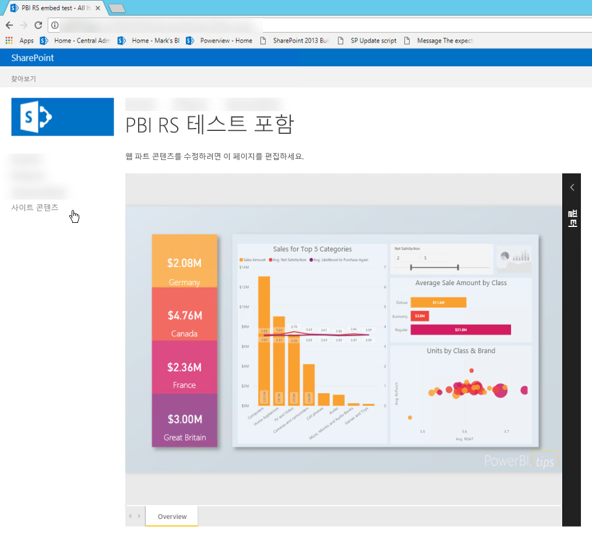
## <a name="prerequisites"></a>필수 조건
* [Power BI Report Server](https://powerbi.microsoft.com/report-server/)를 설치하고 구성해야 합니다.
* Power BI Report Server에 최적화된 [Power BI Desktop](install-powerbi-desktop.md)을 설치해야 합니다.
* [SharePoint](https://docs.microsoft.com/sharepoint/install/install) 환경을 설치하고 구성해야 합니다.

## <a name="creating-the-power-bi-report-server-report-url"></a>Power BI Report Server 보고서 URL 만들기

1. GitHub에서 샘플 다운로드 - [블로그 데모](https://github.com/Microsoft/powerbi-desktop-samples).

    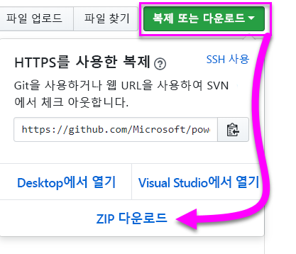

2. **Power BI Report Server에 최적화된 Power BI Desktop**에서 GitHub의 샘플 PBIX 파일을 엽니다.

    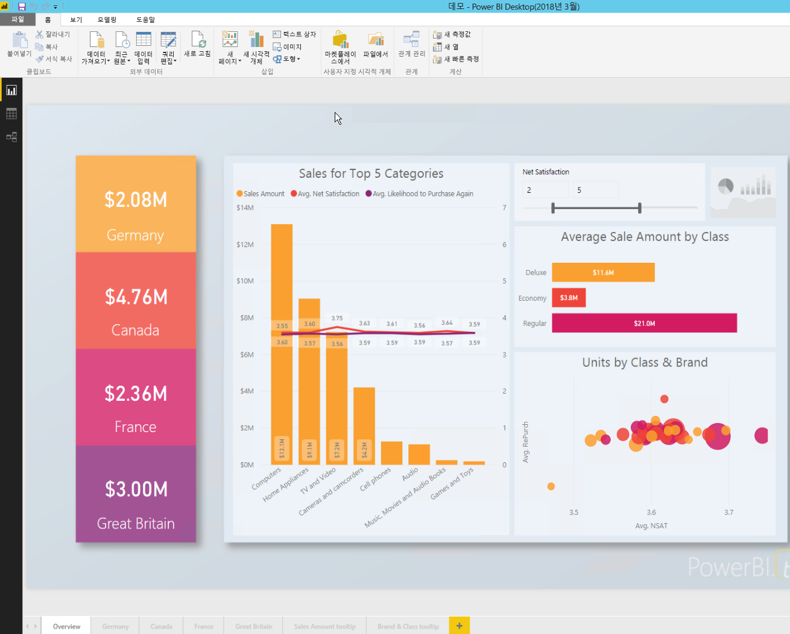

3. 보고서를 **Power BI Report Server**에 저장합니다. 

    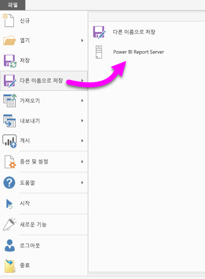

4. **웹 포털**에서 보고서를 봅니다.

    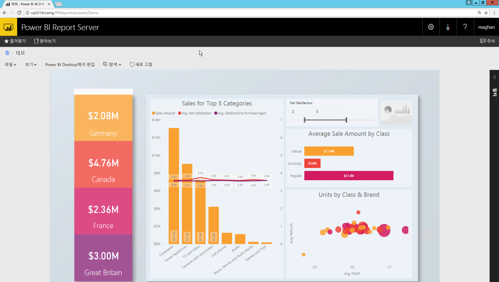

### <a name="capturing-the-url-parameter"></a>URL 매개 변수 캡처

URL이 있으면 보고서를 호스트하기 위해 SharePoint 페이지 내에서 iFrame을 만들 수 있습니다. Power BI Report Server 보고서 URL의 경우 `?rs:embed=true`의 querystring 매개 변수를 추가하여 보고서를 iFrame에 포함할 수 있습니다. 

   예:
    ``` 
    http://myserver/reports/powerbi/Sales?rs:embed=true
    ```
## <a name="embedding-a-power-bi-report-server-report-in-a-sharepoint-iframe"></a>SharePoint iFrame에 Power BI Report Server 보고서 포함

1. SharePoint **사이트 콘텐츠** 페이지로 이동합니다.

    

2. 보고서를 추가할 페이지를 선택합니다.

    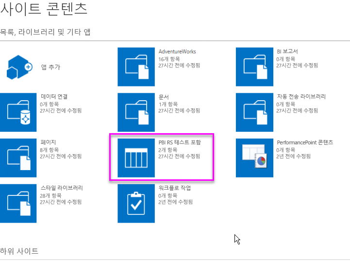

3. 오른쪽 위에서 기어를 선택하고 **페이지 편집**을 선택합니다.

    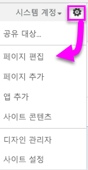

4. **웹 파트 추가**를 선택합니다.

    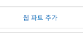

5. **범주** 아래에서 **미디어 및 콘텐츠**를 선택하고, **파트** 아래에서 **콘텐츠 편집기**를 선택한 다음, **추가**를 선택합니다.

    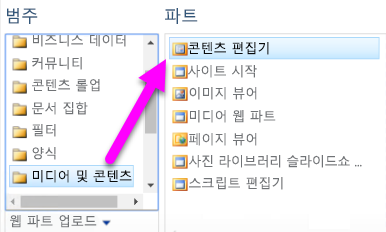 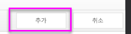

6. **새 콘텐츠를 추가하려면 여기를 클릭**을 선택합니다.

    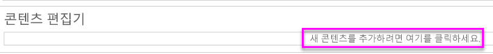

7. 리본에서 **텍스트 서식 지정** 탭을 선택한 다음, **원본 편집**을 선택합니다.

     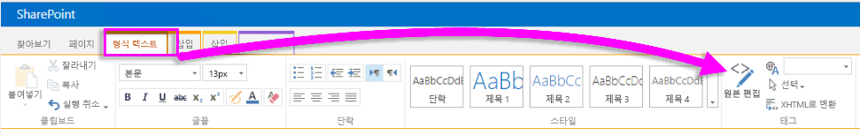

8. [원본 편집] 창에서 iFrame 코드를 붙여넣고 [확인]을 선택합니다.

    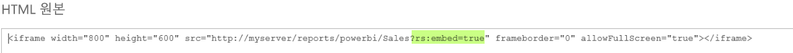

     예:
     ```html
     <iframe width="800" height="600" src="http://myserver/reports/powerbi/Sales?rs:embed=true" frameborder="0" allowFullScreen="true"></iframe>
     ```

9. 리본에서 **페이지** 탭을 선택하고 **편집 중지**를 선택합니다.

    

10. 이제 페이지에 보고서가 표시됩니다.

    

## <a name="next-steps"></a>다음 단계

[빠른 시작: Power BI Report Server용 Power BI 보고서 만들기](quickstart-create-powerbi-report.md)  
[빠른 시작: Power BI Report Server에 페이지를 매긴 보고서 만들기](quickstart-create-paginated-report.md)  

궁금한 점이 더 있나요? [Power BI 커뮤니티에 질문합니다.](https://community.powerbi.com/) 