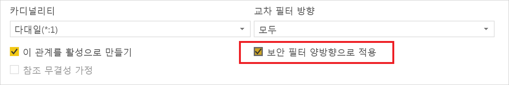
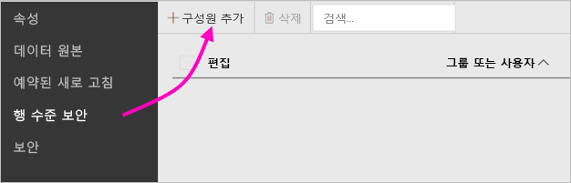
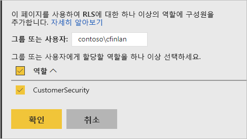
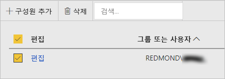

# Power BI Report Server의 RLS(행 수준 보안)

Power BI Report Server를 사용하는 RLS(행 수준 보안)를 설정하면 지정된 사용자의 데이터 액세스를 제한할 수 있습니다. 필터는 행 수준에서 데이터 액세스를 제한하고 역할 내에서 필터를 정의할 수 있습니다.  Power BI Report Server에서 기본 권한을 사용하는 경우, Power BI 보고서에 대한 게시자 또는 콘텐츠 관리자 권한이 있는 사용자는 해당 보고서의 역할에 멤버를 할당할 수 있습니다.    

Power BI Desktop으로 Power BI로 가져온 보고서에 대한 RLS를 구성합니다. SQL Server와 같이 DirectQuery를 사용하는 보고서에서 RLS를 구성할 수도 있습니다. DirectQuery 연결에서 보고서 읽기 권한자에 대한 통합 인증을 사용하는 경우에는 RLS가 준수되지 않는다는 점을 명심하세요. Analysis Services 라이브 연결의 경우 온-프레미스 모델에서 행 수준 보안을 구성합니다. 라이브 연결 데이터 세트에는 보안 옵션이 표시되지 않습니다. 

[!INCLUDE [rls-desktop-define-roles](../includes/rls-desktop-define-roles.md)]

## 양방향 교차 필터링

기본적으로 행 수준 보안 필터링은 관계가 단방향 또는 양방향으로 설정되었는지 여부에 관계없이 단방향 필터를 사용합니다. 행 수준 보안을 사용하여 양방향 교차 필터를 수동으로 활성화할 수 있습니다.

- 관계를 선택하고 **양방향으로 보안 필터 적용** 확인란을 선택합니다.

    

사용자 이름 또는 로그인 ID를 기반으로 하는 [동적 행 수준 보안](https://docs.microsoft.com/sql/analysis-services/supplemental-lesson-implement-dynamic-security-by-using-row-filters)을 구현할 때 이 상자를 선택합니다. 

자세한 내용은 [Power BI Desktop에서 DirectQuery를 사용하여 양방향 교차 필터링](../desktop-bidirectional-filtering.md) 및 [테이블 형식 BI 의미 체계 모델 보안](http://download.microsoft.com/download/D/2/0/D20E1C5F-72EA-4505-9F26-FEF9550EFD44/Securing%20the%20Tabular%20BI%20Semantic%20Model.docx) 기술 백서를 참조하세요.

[!INCLUDE [rls-desktop-view-as-roles](../includes/rls-desktop-view-as-roles.md)]

## 역할에 멤버 추가 

보고서를 Power BI Report Server에 저장한 후에는 보안을 관리하고 서버에 멤버를 추가 또는 제거합니다. 보고서에 대한 게시자 또는 콘텐츠 관리자 권한이 있는 사용자만 사용 가능한 행 수준 보안 옵션이 있으면 회색으로 표시되지 않습니다.

 보고서에 필요한 역할이 없으면 Power BI Desktop에서 보고서를 열고 역할을 추가 또는 수정한 다음, Power BI Report Server에 다시 저장해야 합니다. 

1. Power BI Desktop에서 보고서를 Power BI Report Server에 저장합니다. Power BI Report Server에 최적화된 Power BI Desktop 버전을 사용해야 합니다.
2. Power BI 보고서 서비스에서 보고서 옆에 있는 줄임표( **...** )를 선택합니다. 

3. **관리** > **행 수준 보안**을 선택합니다. 

     

    **행 수준 보안** 페이지의 Power BI Desktop에서 생성한 역할에 멤버를 추가합니다.

5. 멤버를 추가하려면 **멤버 추가**를 선택합니다.

1. 사용자 이름 형식(도메인\사용자) 텍스트 상자에 사용자 또는 그룹을 입력하고 할당할 역할을 선택합니다. 멤버는 조직 내에 있어야 합니다.   

    

    Active Directory 구성 방식에 따라 여기에 사용자 계정 이름을 입력해도 작동합니다. 이 경우 보고서 서버는 해당 사용자 이름을 목록에 표시합니다.

1. 적용하려면 **확인**을 클릭합니다.   

8. 구성원을 제거하려면 이름 옆의 확인란을 선택하고 **삭제**를 선택합니다.  한 번에 여러 멤버를 삭제할 수 있습니다. 

    

## username() 및 userprincipalname()

데이터 세트 내에서 DAX 함수 username() 또는 userprincipalname()을 사용할 수 있습니다. Power BI Desktop의 식 내에서 사용할 수 있습니다. 모델을 게시할 때 Power BI Report Server에서 모델을 사용합니다.

Power BI Desktop 내에서 username()은 DOMAIN\User 형식으로 사용자를 반환하고 userprincipalname()은 user@contoso.com 형식으로 사용자를 반환합니다.

Power BI Report Server 내에서 username()과 userprincipalname() 둘 다 이메일 주소와 유사한 사용자의 UPN(사용자 계정 이름)을 반환합니다.

Power BI Report Server에서 사용자 지정 인증을 사용하는 경우 사용자에 대해 설정한 사용자 이름 형식을 반환합니다.  

## 제한 사항 

다음은 Power BI 모델의 행 수준 보안에 대한 현재 제한 사항입니다. 

username() DAX 함수를 사용하여 보고서를 작성한 사용자는 통합 보안이 있는 DirectQuery를 사용할 때를 제외하고 UPN(사용자 계정 이름)이 반환되는 새 동작을 알 수 있습니다.  해당 시나리오에서는 RLS가 준수되지 않으므로 해당 시나리오의 동작은 변경되지 않습니다.

Power BI Desktop으로 생성된 데이터 세트에서만 RLS를 정의할 수 있습니다. Excel로 만든 데이터 세트에 RLS를 사용하려면 먼저 파일을 Power BI Desktop(PBIX) 파일로 변환해야 합니다. [Excel 파일 변환](../desktop-import-excel-workbooks.md)에 대해 자세히 알아봅니다.

저장된 자격 증명을 사용하는 추출, 변환, 로드(ETL) 및 DirectQuery 연결만 지원됩니다. 통합 인증을 사용하는 Analysis Services 및 DirectQuery 연결에 대한 라이브 연결은 데이터 원본에서 처리됩니다. 

DirectQuery와 함께 통합 보안을 사용하는 경우 다음과 같은 사항을 사용자에게 알릴 수 있습니다.
- RLS가 비활성화되고 모든 데이터가 반환됩니다.
- 사용자는 해당 역할 할당을 업데이트할 수 없으며, RLS 관리 페이지에서 오류가 발생합니다.
- DAX username 함수의 경우 계속해서 사용자 이름을 DOMAIN\USER로 수신합니다. 

보고서 작성자는 보고서를 업로드한 후 그에 따라 역할을 할당할 때까지 Power BI Report Server의 보고서 데이터를 볼 수 있는 액세스 권한이 없습니다. 

 

## FAQ 

### Analysis Services 데이터 원본에 대해 이러한 역할을 만들 수 있나요? 

데이터를 Power BI Desktop으로 가져온 경우 사용할 수 있습니다. 라이브 연결을 사용하는 경우 Power BI 서비스 내에서 RLS를 구성할 수 없습니다. RLS는 Analysis Services 모델 온-프레미스 내에서 정의됩니다. 

### RLS를 사용하여 내 사용자가 액세스할 수 있는 열이나 측정값을 제한할 수 있나요? 

아니요. 사용자가 데이터의 특정 행에 대한 액세스 권한이 있는 경우 해당 행에 대한 데이터의 모든 열을 볼 수 있습니다. 

### RLS를 사용하면 자세한 데이터를 숨기고 시각적 개체에서 요약된 데이터에 대한 액세스 권한을 부여할 수 있나요? 

아니요, 데이터 개별 행의 보안을 유지할 수 있지만 사용자는 요약된 데이터 또는 세부 정보를 확인할 수 있습니다. 

### 기존 역할과 멤버가 이미 할당되어 있는 경우 Power BI Desktop에 새 역할을 추가할 수 있나요? 

예, 기존 역할이 이미 정의되어 있고 Power BI Report Server에 멤버가 할당되어 있는 경우 추가 역할을 수행하고 현재 할당에 영향을 주지 않고 보고서를 다시 게시할 수 있습니다. 
 

## 다음 단계

[Power BI Report Server란?](get-started.md) 
[관리자 안내서](admin-handbook-overview.md)  

궁금한 점이 더 있나요? [Power BI 커뮤니티에 질문합니다.](https://community.powerbi.com/)
