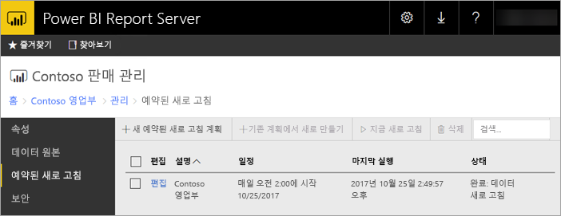

# Power BI Report Server에서 Power BI 보고서 예약된 새로 고침
Power BI 보고서에 대해 예약된 새로 고침을 통해 보고서에 대한 데이터를 최신 상태로 유지할 수 있습니다.

예약된 새로 고침은 포함된 모델이 있는 Power BI 보고서에 해당됩니다. 즉, 라이브 연결 또는 DirectQuery를 사용하는 대신 보고서로 데이터를 가져오는 것을 의미합니다. 데이터를 가져올 때 원래 데이터 원본에서 연결이 끊어지며 데이터를 최신 상태로 유지하도록 업데이트해야 합니다. 예약된 새로 고침은 데이터를 최신 상태로 유지하는 방법입니다.

예약된 새로 고침은 보고서의 관리 섹션 내에서 구성됩니다. 예약된 새로 고침을 구성하는 방법에 대한 자세한 내용은 [Power BI 보고서 예약된 새로 고침을 구성하는 방법](configure-scheduled-refresh.md)을 참조하세요.

## 작동 방식
Power BI 보고서에 대해 예약된 새로 고침을 사용하는 경우 몇 가지 구성 요소가 관련됩니다.

* 예약된 이벤트를 생성하는 타이머로서의 SQL Server 에이전트
* 예약된 작업이 보고서 서버 데이터베이스에서 이벤트의 큐 및 알림에 추가됩니다. 확장 배포에서 큐는 배포의 모든 보고서 서버에서 공유됩니다.
* 이벤트 예약의 결과로 발생하는 모든 보고서 처리는 백그라운드 프로세스로 수행됩니다.
* 데이터 모델은 Analysis Services 인스턴스 내에서 로드됩니다.
* 일부 데이터 원본의 경우 파워 쿼리 매시업 엔진은 데이터 원본에 연결하고 데이터를 변환하는 데 사용됩니다. 다른 데이터 원본은 Power BI Report Server에 대한 데이터 모델을 호스팅하는 데 사용되는 Analysis Services 서비스에서 직접 연결될 수 있습니다.
* 새 데이터는 Analysis Services 내에서 데이터 모델로 로드됩니다.
* Analysis Services는 데이터를 처리하고 필요한 계산을 실행합니다.

Power BI Report Server는 모든 예약된 작업에 대한 이벤트 큐를 유지 관리합니다. 정기적으로 큐를 폴링하여 새 이벤트를 확인합니다. 기본적으로 큐는 10초 간격으로 검색됩니다. RSReportServer.config 파일에서 **PollingInterval**, **IsNotificationService** 및 **IsEventService** 구성 설정을 수정하여 간격을 변경할 수 있습니다. **IsDataModelRefreshService**는 보고서 서버가 예약된 이벤트를 처리하는지 여부를 설정하는 데 사용될 수도 있습니다.

### Analysis Services
Power BI 보고서 렌더링뿐만 아니라 예약된 새로 고침을 수행하는 데에는 Analysis Services에서 Power BI 보고서의 데이터 모델 로딩이 필요합니다. Analysis Services 프로세스는 Power BI Report Server와 함께 실행됩니다.

## 고려 사항 및 제한 사항
### 예약된 새로 고침을 사용할 수 없는 경우
모든 Power BI 보고서에 생성된 예약된 새로 고침 계획이 있을 수 없습니다. 다음은 예약된 새로 고침 계획을 만들 수 없는 Power BI 보고서의 목록입니다.

* 보고서는 라이브 연결을 사용하는 하나 이상의 Analysis Services 데이터 원본을 포함합니다.
* 보고서에는 DirectQuery를 사용하는 하나 이상의 데이터 원본이 포함되어 있습니다.
* 보고서는 데이터 원본을 포함하지 않습니다. 예를 들어, 데이터가 *데이터 입력*을 통해 수동으로 입력되거나 보고서가 이미지, 텍스트 등과 같은 정적 콘텐츠만 포함하는 경우입니다.

위의 목록 외에도 새로 고침 계획을 만들 수 없는 *가져오기* 모드에서 데이터 원본이 있는 특정 시나리오가 있습니다.

* *파일* 또는 *폴더* 데이터 원본이 사용되고 파일 경로가 로컬 경로(예: C:\Users\user\Documents)인 경우 새로 고침 계획을 만들 수 없습니다. 경로는 보고서 서버가 네트워크 공유와 같은 작업에 연결할 수 있는 경로여야 합니다. 예를 들어, *\\myshare\Documents*입니다.
* OAuth(예: Facebook, Google Analytics, Salesforce 등)만을 사용하여 데이터 원본을 연결할 수 있는 경우 캐시 새로 고침 계획을 만들 수 없습니다. 현재 RS는 페이지를 매긴, 모바일 또는 Power BI 보고서에 대한 것인지에 관계없이 모든 데이터 원본에 대한 OAuth 인증을 지원하지 않습니다.

### 메모리 제한
보고서 서버에 대한 기존의 작업은 웹 응용 프로그램과 유사했습니다. 가져온 데이터 또는 DirectQuery를 사용하여 보고서를 로드하는 기능 및 예약된 새로 고침을 수행하는 기능은 보고서 서버와 함께 호스팅되는 Analysis Services 인스턴스를 사용합니다. 결과적으로, 서버에서 예기치 않은 메모리 부족이 발생할 수 있습니다. Analysis Services에서 보고서 서버와 함께 메모리를 사용할 수 있다는 것을 아는 것에 따라 서버 배포를 계획합니다.

Analysis Services 인스턴스를 모니터링하는 방법에 대한 자세한 내용은 [Analysis Services 인스턴스 모니터링](https://docs.microsoft.com/sql/analysis-services/instances/monitor-an-analysis-services-instance)을 참조하세요.

Analysis Services 내의 메모리 설정에 대한 자세한 내용은 [메모리 속성](https://docs.microsoft.com/sql/analysis-services/server-properties/memory-properties)을 참조하세요.

### 인증 및 Kerberos
데이터 원본이 Windows 자격 증명을 사용하도록 설정된 경우 Kerberos 제한된 위임은 작동하도록 구성되어야 합니다. 자세한 내용은 [보고서 서버에서 Windows 인증 구성](https://docs.microsoft.com/sql/reporting-services/security/configure-windows-authentication-on-the-report-server)을 참조하세요.

## 다음 단계
Power BI 보고서에서 [예약된 새로 고침](configure-scheduled-refresh.md)을 구성합니다.

궁금한 점이 더 있나요? [Power BI 커뮤니티에 질문합니다.](https://community.powerbi.com/)

