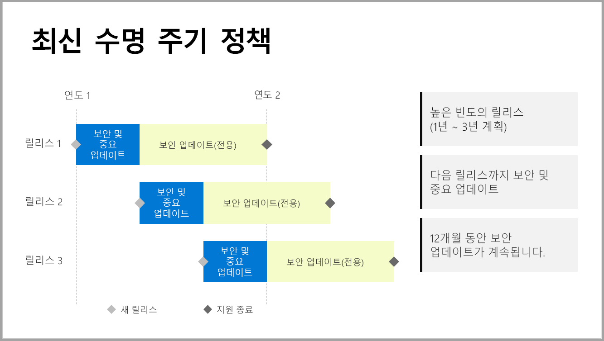

# Power BI Report Server에 대한 타임라인 지원

Power BI Report Server는 매해 몇 번씩 릴리스됩니다. 보안 및 중요 업데이트는 다음 릴리스가 GA(일반 공급) 상태가 될 때까지 사용할 수 있습니다. 다음 릴리스 이후에도 이전의 릴리스는 12개월 릴리스 수명의 나머지 기간 동안 계속 보안 업데이트를 수신합니다.

이 지원 정책을 사용하면 고객에게 신속하게 혁신을 제공하는 동시에 고객이 자신의 속도로 혁신에 적응할 수 있는 유연성도 제공할 수 있습니다.

* 보안 및 중요 업데이트 서비스 단계 - 현재 최신 버전의 Power BI Report Server을 실행하는 경우 보안 및 중요 업데이트가 모두 표시됩니다.
* 보안 업데이트(전용) 서비스 단계 - 새로운 버전이 릴리스된 이후에도 이전 버전에 대한 지원은 12개월 릴리스 수명의 나머지 기간 동안 보안 업데이트를 감소시킵니다(그림 1에서 표시됨).

    

## 버전 기록

| **버전** | **가용성 날짜** | **지원 종료 날짜** |
| --- | --- | --- |
| 2017년 6월 |2017년 6월 12일 |지원되지 않음 |
| 2017년 10월 |2017년 10월 31일 |2018년 10월 31일 |
| 2018년 3월 | 2018년 3월 19일 | 2019년 3월 19일 |
| 2018년 8월 | 2018년 8월 15일 | 2019년 8월 15일 |

Power BI Report Server 및 Report Server에 최적화된 Power BI Desktop을 다운로드하려면 [Power BI Report Server를 사용하여 온-프레미스 보고](https://powerbi.microsoft.com/report-server/)로 이동합니다.

## 다음 단계
[Power BI Report Server의 새로운 기능](whats-new.md)  
[Power BI Report Server란?](get-started.md)
[관리자 개요](admin-handbook-overview.md)  
[Power BI Report Server 설치](install-report-server.md)  

궁금한 점이 더 있나요? [Power BI 커뮤니티에 질문합니다.](https://community.powerbi.com/)