# 자습서: VM에서 Power BI Report Server 웹 포털 탐색
이 자습서에서는 샘플 Power BI 및 페이지를 매긴 보고서와 KPI를 표시, 편집 및 관리해 볼 수 있도록 Power BI Report Server가 이미 설치된 Azure 가상 머신을 만듭니다.

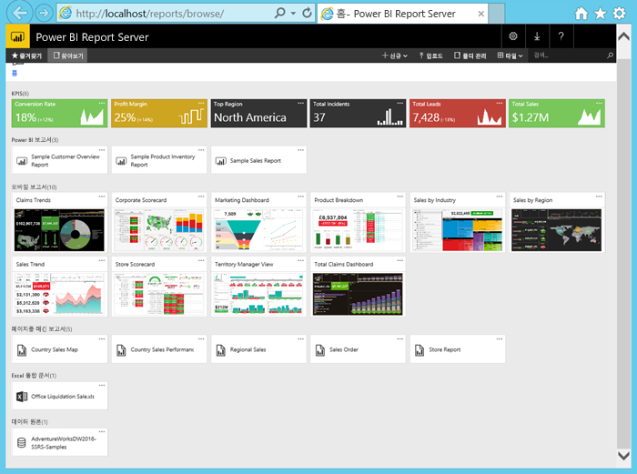

다음은 이 자습서에서 수행할 작업입니다.

> [!div class="checklist"]
> * VM 만들기 및 연결
> * Power BI Report Server 웹 포털 시작 및 탐색
> * 즐겨찾기 항목 태그 지정
> * Power BI 보고서 보기 및 편집
> * 페이지를 매긴 보고서 보기, 관리 및 편집
> * Excel Online에서 Excel 통합 문서 보기

이 자습서를 사용하려면 Azure 구독이 필요합니다. 구독이 없는 경우 시작하기 전에 [체험 계정](https://azure.microsoft.com/free/?WT.mc_id=A261C142F)을 만드세요.

## Power BI Report Server VM 만들기

다행히 Power BI 팀은 Power BI Report Server가 설치되어 제공되는 VM을 만들었습니다.

1. Azure Marketplace에서 [Power BI Report Server](https://azuremarketplace.microsoft.com/marketplace/apps/reportingservices.technical-preview?tab=Overview)를 엽니다.  

2. **지금 받기**를 선택합니다.
3. 공급자의 사용 약관 및 개인 정보 취급 방침에 동의하려면 **계속**을 선택합니다.

    

4. **1단계 기본 내용**, **VM 이름**으로 **reportservervm** 지정.

5. 사용자 이름 및 암호를 만듭니다.

6. **리소스 그룹**의 경우 **새로 만들기**를 유지하고 이름을 **reportserverresourcegroup**으로 지정합니다.

    이 자습서를 두 번 이상 진행하는 경우 두 번째에는 리소스 그룹에 다른 이름을 지정해야 합니다. 하나의 구독에 동일한 리소스 그룹 이름을 두 번 사용할 수 없습니다. 

7. 다른 기본값을 유지한 다음, **확인**을 선택합니다.

    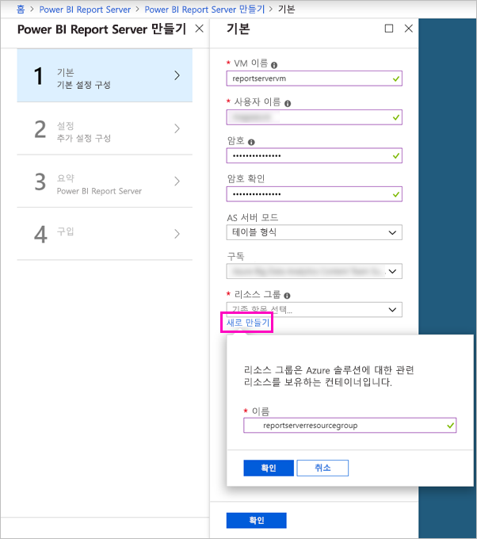

8. **2단계 설정**, 기본값 유지 > **확인**.

9. **3단계 요약** > **확인**.

10. **4단계**, 사용자 약관 및 개인 정보 취급 방침 검토 > **만들기**.

    **Power BI Report Server에 대한 배포 제출** 프로세스에 몇 분이 소요됩니다.

## 가상 머신에 연결

1. Azure 왼쪽 탐색 창에서 **가상 머신**을 선택합니다. 

2. **이름으로 필터링** 상자에 “보고서”를 입력합니다. 

3. 이름이 **REPORTSERVERVM**인 VM을 선택합니다.

    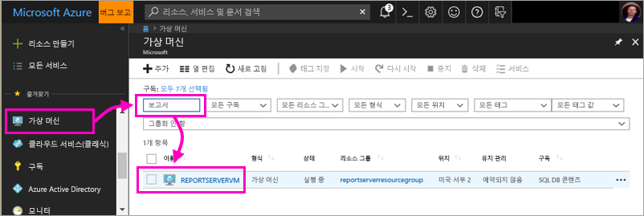

4. REPORTSERVERVM 가상 머신 아래에서 **연결**을 선택합니다.

    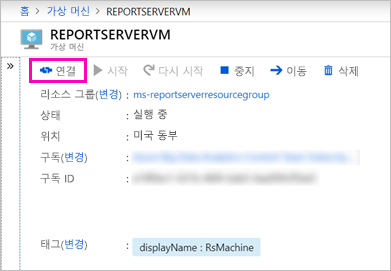

5. [원격 데스크톱 연결] 대화 상자에서 **연결**을 선택합니다.

6. VM에 대해 만든 이름 및 암호를 입력한 다음, **확인**을 선택합니다.

7. 다음 대화 상자에는 원격 컴퓨터의 ID가 식별될 수 없다고 표시됩니다. **예**를 선택합니다.

   새 VM이 열립니다.

## VM의 Power BI Report Server

VM이 열리면 다음 항목이 데스크톱에 표시됩니다.

|숫자  |의미  |
|---------|---------|
| | 페이지를 매긴(.RDL) 보고서를 만들기 위한 SQL Server Data Tools 시작 |
| | 샘플 Power BI(.PBIX) 보고서  |
| | Power BI Report Server 설명서에 대한 링크   |
| | Power BI Report Server에 최적화된 Power BI Desktop 시작(2018년 3월)  |
| | 브라우저에서 Power BI Report Server 웹 포털 열기   |

**보고서 서버 웹 포털** 아이콘을 두 번 클릭합니다. 브라우저에서 `http://localhost/reports/browse`가 열립니다. 웹 포털에서 유형별로 그룹화된 다양한 파일이 표시됩니다. 

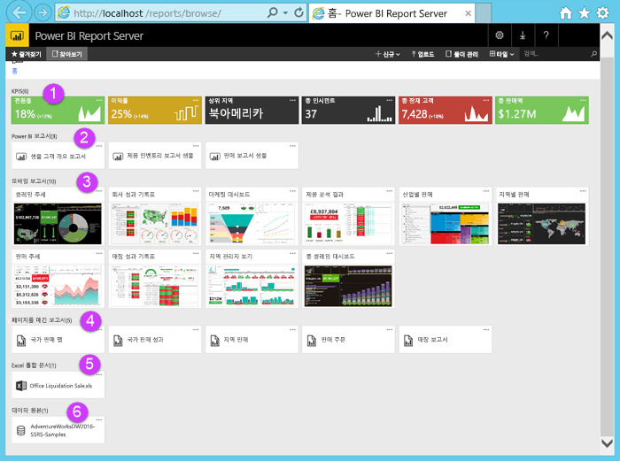

|숫자  |의미  |
|---------|---------|
| | 웹 포털에서 만들어진 KPI |
| |  Power BI(.PBIX) 보고서  |
| | SQL Server 모바일 보고서 게시자에서 만들어진 모바일 보고서  |
| |  보고서 작성기 또는 SQL Server Data Tools에서 만들어진 페이지를 매긴 보고서  |
| | Excel 통합 문서   | 
| | 페이지를 매긴 보고서의 데이터 원본 | 

## 즐겨찾기 태그 지정
즐겨찾기에 추가하려는 보고서 및 KPI를 태그로 지정할 수 있습니다. 웹 포털 및 Power BI 모바일 앱 모두에서 단일 즐겨찾기 폴더에 수집되기 때문에 쉽게 찾을 수 있습니다. 

1. **Profit Margin** KPI > **즐겨찾기에 추가**의 오른쪽 위 모서리에서 줄임표(**…**)를 선택합니다.
   
    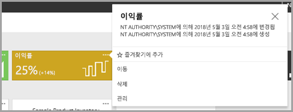
2. 웹 포털의 즐겨찾기 페이지에서 다른 즐겨찾기와 함께 보려는 **즐겨찾기**를 웹 포털 리본에서 선택합니다.
   
    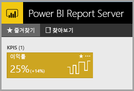

3. **찾아보기**를 선택하여 웹 포털로 돌아갑니다.
   
## 목록 보기에서 항목 보기
기본적으로 웹 포털은 타일 보기에 해당 콘텐츠를 표시합니다.

한 번에 여러 항목을 쉽게 이동하거나 삭제하는 목록 보기로 전환할 수 있습니다. 

1. **타일** > **목록**을 선택합니다.
   
    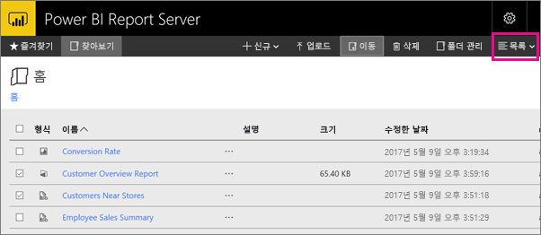

2. 타일 보기로 돌아갑니다. **목록** > **타일**을 선택합니다.

## Power BI 보고서

웹 포털에서 Power BI 보고서를 보고 조작하고 웹 포털에서 바로 Power BI Desktop을 시작할 수 있습니다.

### 새 Power BI 보고서

1. **Power BI 보고서** 아래 웹 포털에서 **샘플 고객 개요 보고서**를 선택합니다. 보고서가 브라우저에서 열립니다.

1. 트리 맵에서 미국 블록을 선택하여 다른 시각적 개체의 관련 값을 강조 표시하는 방법을 확인합니다.

    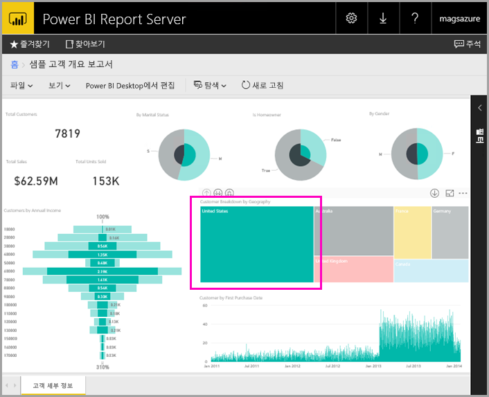

### Power BI Desktop에서 편집

1. **Power BI Desktop에서 편집**을 선택합니다.

1. **허용**을 선택하여 이 웹 사이트가 컴퓨터에서 프로그램을 열도록 허용합니다. 

     보고서가 Power BI Desktop에서 열립니다. 위쪽 막대에서 이름 “Power BI Desktop(2018년 3월)”을 확인합니다. Power BI Report Server에 최적화된 버전입니다.

    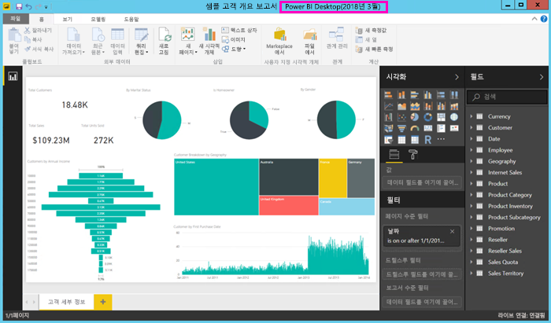

     VM에 설치된 Power BI Desktop의 버전을 사용합니다. 도메인 간 이동하여 보고서를 업로드할 수 없습니다.

3. [필드] 창에서 Customers 테이블을 확장하고 직업 필드를 보고서 수준 필터로 끌어옵니다.

    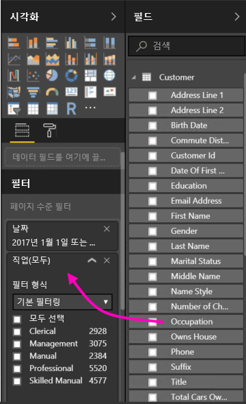

1. 보고서를 저장합니다.

1. 브라우저에서 보고서로 돌아가서 브라우저 **새로 고침** 아이콘을 선택합니다.

    

8. 오른쪽의 **필터** 창을 확장하여 추가한 **직업** 필터를 확인합니다. **전문가**를 선택합니다.

    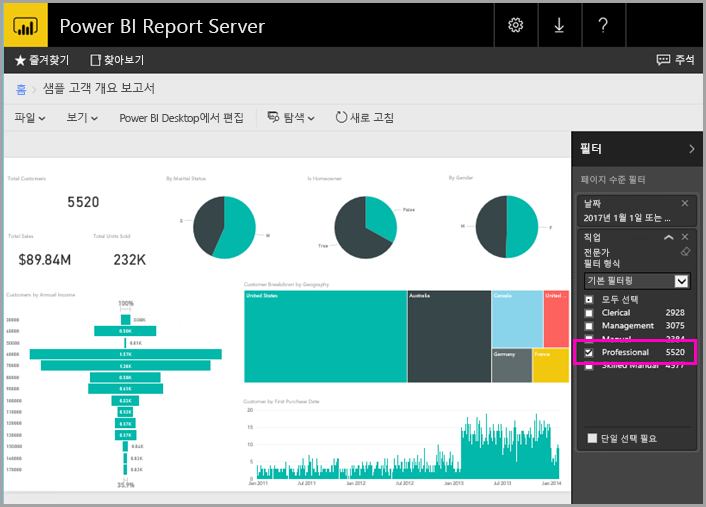

3. **찾아보기**를 선택하여 웹 포털로 돌아갑니다.

## 페이지를 매긴(.RDL) 보고서

웹 포털에서 페이지를 매긴 보고서를 보고 관리하고 보고서 작성기를 시작할 수 있습니다.

### 페이지를 매긴 보고서 관리

1. **페이지를 매긴 보고서** 아래 웹 포털에서 **판매 주문** > **관리** 옆에 있는 줄임표(...)를 선택합니다.

1. **매개 변수**를 선택하고 **SalesOrderNumber**의 기본값을 **SO50689**로 변경하고  >  **적용**을 선택합니다.

   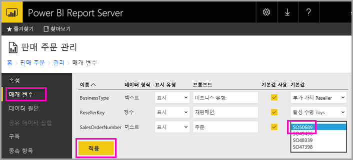

3. **찾아보기**를 선택하여 웹 포털로 돌아갑니다.

### 페이지를 매긴 보고서 보기

1. 웹 포털에서 **판매 주문**을 선택합니다.
 
3.  보고서가 설정한 **Order** 매개 변수, **SO50689**로 열립니다. 

    

    기본값을 변경하지 않고 여기서 다른 매개 변수와 함께 해당 매개 변수를 변경할 수 있습니다.

1. **Order** **SO48339** > **보고서 보기**를 선택합니다.

4. 이는 2페이지 중 1페이지입니다. 오른쪽 화살표를 선택하여 두 번째 페이지를 표시합니다. 테이블이 해당 페이지에서 계속됩니다.

    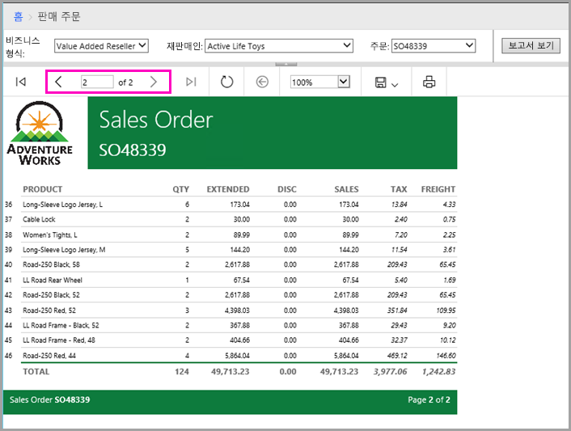

5. **찾아보기**를 선택하여 웹 포털로 돌아갑니다.

### 페이지를 매긴 보고서 편집

보고서 작성기에서 페이지를 매긴 보고서를 편집할 수 있고 브라우저에서 바로 보고서 작성기를 시작할 수 있습니다.

1. 웹 포털에서 **판매 주문** > **보고서 작성기에서 편집** 옆에 있는 줄임표(...)를 선택합니다.

1. **허용**을 선택하여 이 웹 사이트가 컴퓨터에서 프로그램을 열도록 허용합니다.

1. 판매 주문 보고서가 보고서 작성기의 디자인 보기에서 열립니다.

    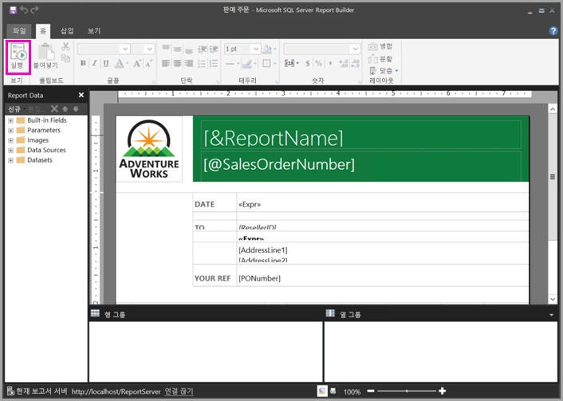

1. **실행**을 선택하여 보고서를 미리 봅니다.

    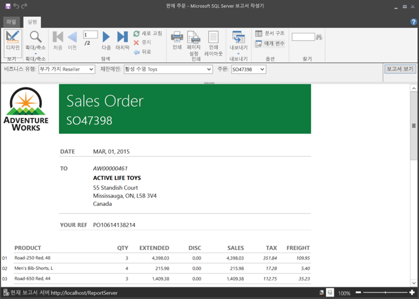

5. 보고서 작성기를 닫고 브라우저로 돌아갑니다.

## Excel 통합 문서 보기

Power BI Report Server의 Excel Online에서 Excel 통합 문서를 보고 조작할 수 있습니다. 

1. Excel 통합 문서 **Office Liquidation Sale.xlsx**를 선택합니다. 자격 증명을 요청하는 메시지가 표시될 수 있습니다. **취소**를 선택합니다. 
    웹 포털에서 열립니다.
1. 슬라이서에서 **어플라이언스**를 선택합니다.

    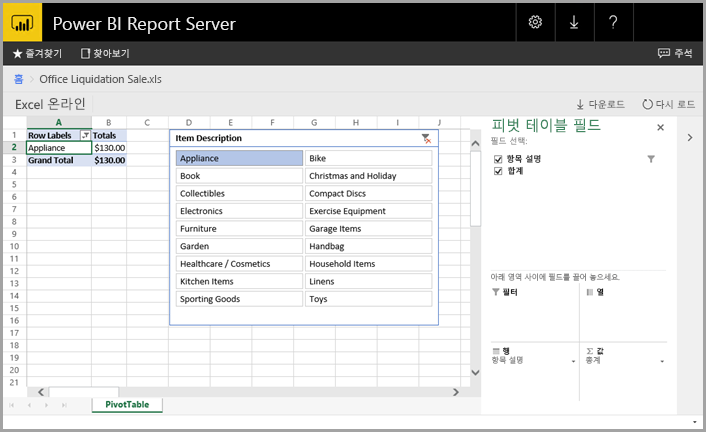

1. **찾아보기**를 선택하여 웹 포털로 돌아갑니다.

## 리소스 정리

이제 이 자습서를 완료했으므로 리소스 그룹, 가상 머신 및 모든 관련 리소스를 삭제합니다. 

- 이를 수행하려면 VM에 대한 리소스 그룹을 선택하고 **삭제**를 선택합니다.

## 다음 단계

이 자습서에서는 Power BI Report Server를 사용하여 VM을 만들었습니다. 웹 포털의 일부 기능을 사용해 보았고 각 편집기에서 Power BI 보고서와 페이지를 매긴 보고서를 열었습니다. 이 VM에는 SQL Server Analysis Services 데이터 원본이 설치되어 있으므로 동일한 데이터 원본을 사용하여 사용자 고유의 Power BI 및 페이지가 매겨진 보고서를 만들어 볼 수 있습니다. 

Power BI Report Server에 대한 보고서를 만드는 방법을 자세히 알아보려면 계속 진행합니다.

> [!div class="nextstepaction"]
> [Power BI Report Server용 Power BI 보고서 만들기](./quickstart-create-powerbi-report.md)

