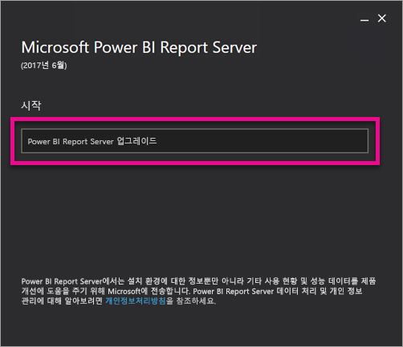
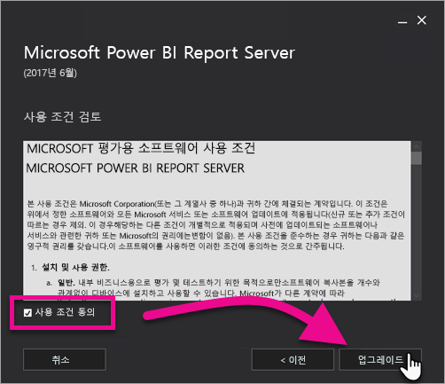
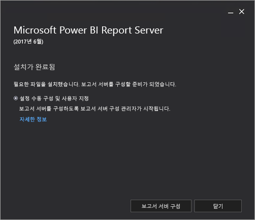

# Power BI Report Server 업그레이드

Power BI Report Server를 업그레이드하는 방법을 알아봅니다.

 **다운로드** 

Power BI Report Server 및 Report Server에 최적화된 Power BI Desktop을 다운로드하려면 [Power BI Report Server를 사용하여 온-프레미스 보고](https://powerbi.microsoft.com/report-server/)로 이동합니다.

## 시작하기 전에

보고서 서버를 업그레이드하기 전에 다음 단계에 따라 보고서 서버를 백업하는 것이 좋습니다.

### 암호화 키 백업

처음으로 보고서 서버 설치를 구성하는 경우 암호화 키를 백업해야 합니다. 또한 서비스 계정의 ID를 변경하거나 컴퓨터 이름을 바꿀 때는 항상 키를 백업해야 합니다. 자세한 내용은 [Reporting Services 암호화 키 백업 및 복원](https://docs.microsoft.com/sql/reporting-services/install-windows/ssrs-encryption-keys-back-up-and-restore-encryption-keys)을 참조하세요.

### 보고서 서버 데이터베이스 백업

보고서 서버는 상태 비저장 서버이므로 모든 애플리케이션 데이터는 SQL Server 데이터베이스 엔진 인스턴스에서 실행되는 **reportserver** 및 **reportservertempdb** 데이터베이스에 저장됩니다. SQL Server 데이터베이스 백업에 지원되는 방법 중 하나를 사용하여 **reportserver** 및 **reportservertempdb** 데이터베이스를 백업할 수 있습니다. 보고서 서버 데이터베이스에 적용되는 권장 사항은 다음과 같습니다.

* 전체 복구 모델을 사용하여 **reportserver** 데이터베이스를 백업합니다.
* 단순 복구 모델을 사용하여 **reportservertempdb** 데이터베이스를 백업합니다.
* 각 데이터베이스에 서로 다른 백업 일정을 사용할 수 있습니다. **reportservertempdb**를 백업하는 유일한 이유는 하드웨어 오류가 발생할 경우 다시 만들 필요가 없도록 하는 것입니다. 하드웨어 오류 시 **reportservertempdb**의 데이터는 복구하지 않아도 되지만 테이블 구조는 필요합니다. **reportservertempdb**가 손실된 경우 복구하는 유일한 방법은 보고서 서버 데이터베이스를 다시 만드는 것입니다. **reportservertempdb**를 다시 만들 때는 주 보고서 서버 데이터베이스와 같은 이름을 지정해야 합니다.

SQL Server 관계형 데이터베이스의 백업 및 복구에 대한 자세한 내용은 [SQL Server Databases 백업 및 복원](https://docs.microsoft.com/sql/relational-databases/backup-restore/back-up-and-restore-of-sql-server-databases)을 참조하세요.

### 구성 파일 백업

Power BI Report Server는 구성 파일을 사용하여 애플리케이션 설정을 저장합니다. 서버를 처음 구성할 때와 사용자 지정 확장 프로그램을 배포한 후에 파일을 백업해야 합니다. 백업할 파일은 다음과 같습니다.

* config.json
* RSHostingService.exe.config
* Rsreportserver.config
* Rssvrpolicy.config
* Reportingservicesservice.exe.config
* 보고서 서버 ASP.NET 애플리케이션에 대한 Web.config
* ASP.NET에 대한 Machine.config

## 보고서 서버 업그레이드

Power BI Report Server를 간단히 업그레이드할 수 있습니다. 몇 가지 단계를 거쳐 파일을 설치할 수 있습니다.

1. PowerBIReportServer.exe의 위치를 확인하고 설치 관리자를 시작합니다.

2. **Power BI Report Server 업그레이드**를 선택합니다.

    

3. 사용 약관 및 조건을 읽고 동의한 후 **업그레이드**를 선택합니다.

    

4. 성공적으로 업그레이드한 후에 **Report Server 구성**을 선택하여 Reporting Services 구성 관리자를 시작하거나 **닫기**를 선택하여 설치 관리자를 종료합니다.

    

## Power BI Desktop 업그레이드

보고서 서버를 업그레이드한 후, 모든 Power BI 보고서 작성자가 서버와 일치하는 Power BI Report Server용으로 최적화된 Power BI Desktop 버전으로 업그레이드되었는지 확인하려고 합니다.

## 다음 단계

* [관리자 개요](admin-handbook-overview.md)  
* [Power BI Report Server에 최적화된 Power BI Desktop 설치](install-powerbi-desktop.md)  
* [Reporting Services 설치 확인](https://docs.microsoft.com/sql/reporting-services/install-windows/verify-a-reporting-services-installation)  
* [Report Server 서비스 계정 구성](https://docs.microsoft.com/sql/reporting-services/install-windows/configure-the-report-server-service-account-ssrs-configuration-manager)  
* [Report Server URL 구성](https://docs.microsoft.com/sql/reporting-services/install-windows/configure-report-server-urls-ssrs-configuration-manager)  
* [Report Server 데이터베이스 연결 구성](https://docs.microsoft.com/sql/reporting-services/install-windows/configure-a-report-server-database-connection-ssrs-configuration-manager)  
* [Report Server 초기화](https://docs.microsoft.com/sql/reporting-services/install-windows/ssrs-encryption-keys-initialize-a-report-server)  
* [Report Server에서 SSL 연결 구성](https://docs.microsoft.com/sql/reporting-services/security/configure-ssl-connections-on-a-native-mode-report-server)  
* [Windows 서비스 계정 및 사용 권한 구성](https://docs.microsoft.com/sql/database-engine/configure-windows/configure-windows-service-accounts-and-permissions)  
* [Power BI Report Server에 대한 브라우저 지원](browser-support.md)

궁금한 점이 더 있나요? [Power BI 커뮤니티에 질문합니다.](https://community.powerbi.com/)