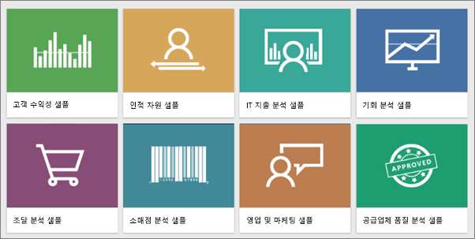
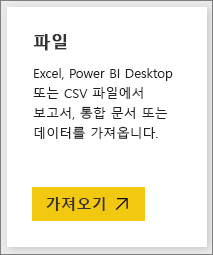
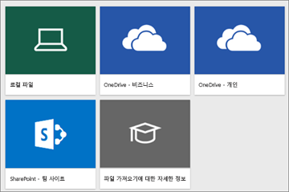
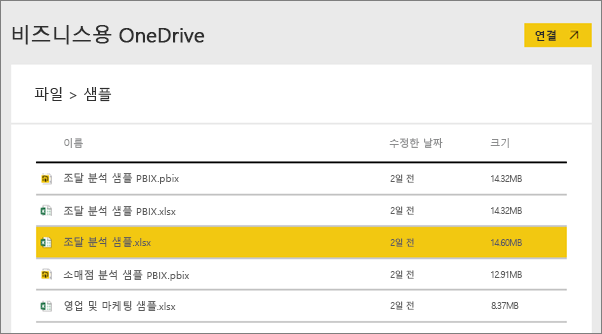
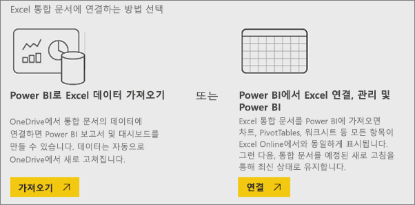
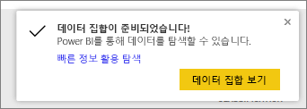
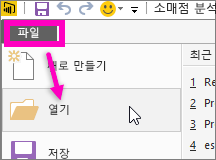

# Power BI와 함께 사용 가능한 샘플 데이터는 무엇입니까?
Power BI를 처음 접하고, 사용해 보고 싶지만 데이터가 없는 경우가 있습니다.  또는 데이터 집합이 있지만 Power BI의 작동 원리를 아직 잘 모르기 때문에 데이터 집합이 조금이라도 손상될까봐 걱정하는 분들이 있습니다.

이 경우 스트레스를 받을 필요가 없습니다. obviEnce([www.obvience.com](http://www.obvience.com/)) 및 Microsoft는 사용자가 Power BI에 익숙해질 때까지 사용할 수 있는 샘플을 만들었습니다.  데이터는 익명으로 처리되며 재무, HR, 판매 등 다양한 분야를 나타냅니다. 그리고 온라인 설명서를 읽어 보면 이와 동일한 샘플을 사용하는 자습서 및 예제가 있으므로 따라 할 수 있습니다.      

   

이러한 각각의 샘플은 콘텐츠 팩, 개별 Excel 통합 문서 및 .pbix 파일과 같은 여러 가지 형식으로 제공됩니다. 이러한 것들이 무엇인지 모르거나 어떻게 입수해야 할지 모르는 경우에도 걱정하지 마세요. 이 문서의 뒷부분에서 모두 설명해 드리겠습니다. 그리고 각 샘플에 대한 *둘러보기* 도 만들었습니다. 샘플의 뒷이야기를 들려주고 여러 가지 시나리오를 안내하는 일종의 문서입니다. 관리자를 위해 질문에 대답하는 시나리오가 있을 수 있고, 경쟁력 있는 정보를 찾거나 공유할 보고서 및 대시보드를 만들거나 비즈니스 전환을 설명하는 시나리오도 있을 수 있습니다.   

하지만 시작하기 전에 샘플 사용 방법에 대한 이러한 법적 지침을 끝까지 읽어보세요. 완료되면 샘플을 소개하고 사용하는 방법을 보여드리겠습니다.   

## Power BI 샘플 Excel 통합 문서에 대한 사용 지침
Power BI 샘플을 사용하기 전에 이 정보를 읽어 보세요.

©2015 Microsoft Corporation. All rights reserved. 문서 및 통합 문서는 “있는 그대로" 제공됩니다. URL 및 기타 인터넷 웹 사이트 참조를 포함하여 통합 문서에 명시된 정보 및 보기는 통지 없이 변경될 수 있습니다. 해당 사용으로 인해 발생하는 모든 위험은 귀하의 책임입니다. 일부 예제는 설명 목적으로만 제공되는 가상의 예제이며, 어떠한 실제 사례와도 연관시킬 의도가 없으며 그렇게 유추해서도 안 됩니다. Microsoft는 여기에 제공된 정보에 대해 어떠한 명시적이거나 묵시적인 보증도 하지 않습니다.

이 통합 문서는 Microsoft 제품의 지적 소유권에 대한 법적 권한을 사용자에게 제공하지 않습니다. 이 통합 문서는 내부 참조용으로만 복사 및 사용할 수 있습니다.

통합 문서 및 관련 데이터는 obviEnce에서 제공됩니다. [www.obvience.com](http://www.obvience.com)

ObviEnce는 Microsoft Business Intelligence에 주력하는 ISV이자 IP(Intellectual Property) Incubator입니다. ObviEnce는 Microsoft와 긴밀한 협력을 통해 Microsoft Business Intelligence 솔루션 구현 및 배포를 위한 모범 사례 및 사고 리더십을 개발하고 있습니다.

통합 문서 및 데이터는 obviEnce, LLC의 재산이며 산업 샘플 데이터로 Power BI의 기능을 보여주기 위한 용도로만 공유된 것입니다.

통합 문서 및/또는 데이터의 모든 사용에는 위의 고지 사항이 포함되어야 하며 각 통합 문서에 포함된 정보 워크시트의 경우도 마찬가지입니다. 통합 문서 및 모든 시각화에는 저작권 표시obviEnce ©가 함께 수반되어야 합니다.

아래 링크를 클릭하여 Excel 통합 문서 파일 또는 .pbix 파일을 다운로드하면 위의 약관에 동의하는 것입니다.

## 사용 가능한 샘플
8개의 샘플을 사용할 수 있습니다.  각각 다른 업계를 나타냅니다.

### 고객 수익성 샘플  
[고객 수익성 샘플 둘러보기](sample-customer-profitability.md)

이 업계 샘플은 CFO의 임원, 제품 및 고객에 대한 주요 메트릭을 분석합니다. 회사의 수익성에 영향을 주는 요소를 조사할 수 있습니다.

### 인적 자원 샘플  
[HR 샘플 둘러보기](sample-human-resources.md)

이 업계 샘플은 신입 사원, 재직 중인 직원 및 퇴사한 직원을 분석하여 회사의 채용 전략에 집중합니다.  데이터를 조사하여 채용 전략의 자발적 이직 및 선호에서 추세를 찾을 수 있습니다.

### IT 지출 분석 샘플 
[IT 지출 분석 샘플 둘러보기](sample-it-spend.md)

이 업계 샘플은 회사 IT 부서의 계획된 비용과 실제 비용을 비교 분석합니다. 이러한 비교는 회사에서 한 해를 얼마나 잘 계획하는지 이해하고 계획과 편차가 큰 영역을 조사하는 데 도움이 됩니다. 이 예제의 회사는 연간 계획 주기를 거친 다음 분기별로 새로운 LE(Latest Estimate)를 생성하여 회계 연도 동안 IT 지출의 변화를 분석합니다.

### 영업 기회 분석 샘플  
[기회 분석 샘플 둘러보기](sample-opportunity-analysis.md)

이 업계 샘플은 소프트웨어 회사의 판매 채널을 둘러봅니다. 판매 관리자는 지역, 거래 규모 및 채널별로 기회 및 수익을 추적하여 직접 판매 및 파트너 판매 채널을 모니터링합니다.

### 조달 분석 샘플  
[조달 분석 샘플 둘러보기](sample-procurement.md)

이 업계 샘플은 CFO의 임원, 제품 및 고객에 대한 주요 메트릭을 분석합니다. 회사의 수익성에 영향을 주는 요소를 조사할 수 있습니다.

### 소매점 분석 샘플  
[소매점 분석 샘플 둘러보기](sample-retail-analysis.md)

이 업계 샘플은 여러 상점과 구역에서 판매된 항목의 소매점 판매 데이터를 분석합니다. 메트릭은 새 상점 분석뿐 아니라 판매, 단위, 총 수익 및 차이 영역에서 작년과 금년의 실적을 비교합니다.

### 영업 및 마케팅 샘플  
[영업 및 마케팅 샘플 둘러보기](sample-sales-and-marketing.md)

이 업계 샘플은 VanArsdel Ltd.라는 제조 회사를 분석합니다. 이 샘플 콘텐츠 팩을 통해 최고 마케팅 경영자는 VanArsdel의 업계 및 시장 점유율을 조사할 수 있습니다.  이 샘플을 조사하여 회사의 시장 점유율, 제품 볼륨, 판매 및 여론을 확인할 수 있습니다.

### 공급업체 품질 샘플  
[공급업체 품질 샘플 둘러보기](sample-supplier-quality.md)

이 업계 샘플은 일반적인 공급망 문제 중 하나인 공급업체 품질 분석에 집중합니다. 이 분석에서 중요한 두 가지 기본 메트릭은 총 결함 수와 이러한 결함으로 인한 총 가동 중지 시간입니다. 이 샘플의 두 가지 주요 목표는 품질과 관련하여 최고 및 최악의 공급업체를 파악하고 결함을 발견하고 거부하는 작업을 더 효율적으로 수행하여 가동 중지 시간을 최소화하는 공장을 식별하는 것입니다.

이제 어떤 샘플을 사용할 수 있는지 알게 되셨을 것입니다. 그러면 이러한 샘플을 입수하는 방법을 알아보겠습니다.  

## 샘플을 입수하는 방법
앞서 말씀드렸다시피 샘플은 콘텐츠 팩, Excel 통합 문서 및 .pbix 파일과 같은 여러 가지 형식으로 제공됩니다. 이러한 각각의 샘플을 사용하는 방법을 콘텐츠 팩부터 설명하겠습니다.

## 콘텐츠 팩 형식의 Power BI 샘플
콘텐츠 팩은 Power BI 내에서 사용할 수 있는 유일한 샘플 형식입니다. Power BI를 종료할 필요 없이 찾을 수 있습니다. 콘텐츠 팩은 기본적으로 다른 사람이 만들고, Power BI 서비스에서 사용할 수 있는 하나 이상의 대시보드, 데이터 집합 및 보고서의 묶음을 말합니다. 사용자는 동료와 공유하기 위해 콘텐츠 팩을 만듭니다. 각 Power BI 샘플 콘텐츠 팩에는 데이터 집합, 보고서 및 대시보드가 포함되어 있습니다.  Power BI Desktop에서는 콘텐츠 팩을 사용할 수 없습니다. 콘텐츠 팩에 대해 자세히 알아보려면 [Power BI의 콘텐츠 팩 소개](service-organizational-content-pack-introduction.md)를 읽어 보세요.

### Power BI 서비스에서 샘플 콘텐츠 팩을 가져와 열기
1. Power BI 서비스(app.powerbi.com)를 열고 로그인합니다.
2. 왼쪽 아래 모서리에서 **데이터 가져오기**를 선택합니다.

    
3. 데이터 가져오기 페이지가 표시되면 **샘플** 아이콘을 선택합니다.

   
4. 샘플 중 하나를 선택하여 해당 샘플에 대한 설명을 엽니다. 그런 다음 **연결**을 선택합니다.  

   
5. Power BI에서 콘텐츠 팩을 가져와 새 대시보드, 보고서 및 데이터 집합을 현재 작업 영역에 추가합니다. 새 콘텐츠에는 노란색 별표가 표시됩니다. 샘플을 사용하여 Power BI 실행을 테스트해 보세요.  

   

데이터가 있으니 원하는 대로 할 수 있습니다.  샘플 콘텐츠 팩을 사용하여 자습서를 따라 하거나 Power BI 서비스를 열고 둘러보세요.

## Excel 파일 형식의 Power BI 샘플
각 샘플 콘텐츠 팩은 Excel 통합 문서로도 제공됩니다. Excel 통합 문서는 Power BI 서비스와 함께 사용할 수 있게 설계되었습니다.  

1. 아래 링크에서 파일을 개별적으로 다운로드하거나 [모든 샘플 파일의 zip 파일을 다운로드](http://go.microsoft.com/fwlink/?LinkId=535020)합니다. 고급 사용자는 Excel 통합 문서를 다운로드하여 데이터 모델을 탐색하거나 편집할 수 있습니다.

   * [소매점 분석 샘플](http://go.microsoft.com/fwlink/?LinkId=529778)
   * [공급업체 품질 분석 샘플](http://go.microsoft.com/fwlink/?LinkId=529779)
   * [인적 자원 샘플](http://go.microsoft.com/fwlink/?LinkId=529780)
   * [고객 수익성 샘플](http://go.microsoft.com/fwlink/?LinkId=529781)
   * [기회 추적 샘플](http://go.microsoft.com/fwlink/?LinkId=529782)
   * [IT 지출 분석 샘플](http://go.microsoft.com/fwlink/?LinkId=529783)
   * [조달 분석 샘플](http://go.microsoft.com/fwlink/?LinkId=529784)
   * [영업 및 마케팅 샘플](http://go.microsoft.com/fwlink/?LinkId=529785)
2. 다운로드한 파일을 저장합니다. 파일을 저장하는 위치에 따라 차이가 발생합니다.

   *  **로컬** - 파일을 사용자 컴퓨터의 로컬 드라이브 또는 조직의 다른 위치에 저장하는 경우 Power BI에서 파일을 Power BI로 가져올 수 있습니다. 파일은 사실 로컬 드라이브에 그대로 남아 있으므로, 전체 파일을 실제로 Power BI로 가져온 것은 아닙니다. 실제로는, 새 데이터 집합이 Power BI에서 만들어지고 데이터, 그리고 일부 경우에는 데이터 모델이 데이터 집합으로 로드됩니다. 파일에 보고서가 있을 경우 Power BI의 보고서에 나타납니다.
   *  **OneDrive - 비즈니스** – 비즈니스용 OneDrive가 있을 경우 Power BI에 로그인할 때 비즈니스용 OneDrive와 동일한 계정을 사용하여 로그인하면 Excel, Power BI 또는 .CSV 파일의 작업을 가장 효과적으로 Power BI의 데이터 세트, 보고서 및 대시보드와 동기화 상태로 유지할 수 있습니다. Power BI와 OneDrive가 모두 클라우드에 있으므로 Power BI는 매시간 OneDrive의 파일에 연결합니다. 변경 내용이 발견되면 데이터 집합, 보고서 및 대시보드가 Power BI에서 자동으로 업데이트됩니다.
   *  **OneDrive - 개인** – 본인의 OneDrive 계정으로 파일을 저장할 경우 비즈니스용 OneDrive에 제공하는 것과 동일한 많은 혜택을 누릴 수 있습니다. 가장 큰 차이점은 파일에 처음 연결할 때(‘데이터 가져오기’ > ‘파일’ > ‘OneDrive - 개인’ 사용) Microsoft 계정으로 OneDrive에 로그인해야 한다는 점이 가장 큰 차이점이며, 일반적으로 Power BI에 로그인하기 위해 사용하는 것과는 다릅니다. Microsoft 계정으로 OneDrive에 로그인할 경우 로그인 유지 옵션을 선택해야 합니다. 이러한 방식으로 Power BI는 매시간 파일에 연결할 수 있으며 Power BI의 데이터 집합은 동기화를 유지하게 됩니다.
   *  **SharePoint 팀 사이트** – Power BI 파일을 SharePoint 팀 사이트에 저장하는 것은 비즈니스용 OneDrive에 저장하는 것과 거의 마찬가지입니다. 가장 큰 차이점은 Power BI에서 파일에 연결하는 방법입니다. URL을 지정하거나 루트 폴더에 연결할 수 있습니다.
3. Power BI 서비스(app.powerbi.com)를 열고 로그인합니다.

   > [!TIP]
   > 이때 새 대시보드를 만들고, 가져오려는 파일의 이름으로 지정하는 것이 좋습니다.  그러지 않으면 Excel 데이터 집합을 가져올 때 Power BI에서 샘플의 이름을 딴 새 대시보드를 만들지 않고 현재 열어본 적이 있는 대시보드에 타일을 추가합니다. 해당 타일을 선택하면 데이터 집합의 보고서로 이동합니다. 이 새 대시보드는 나중에 언제든 만들 수 있으므로 큰 문제가 되지는 않지만 새 대시보드로 시작하면 한두 단계를 건너뛸 수 있다는 장점이 있습니다.
   >
   >
4. 왼쪽 아래 모서리에서 **데이터 가져오기**를 선택합니다.

    
5. 데이터 가져오기 페이지가 표시되면 **파일 > 가져오기**를 선택합니다.

     
6. 샘플을 다운로드하고 저장한 위치로 이동합니다.

   
7. 비즈니스용 OneDrive에 저장된 **조달 분석 샘플.xlsx** 파일을 선택하고 **연결**을 선택합니다.

   
8. Power BI로 통합 문서를 가져올지, 데이터를 가져올지 선택하고 온라인 Excel과 똑같은지 확인합니다.

    
9. **가져오기**를 선택하면 Power BI에서 샘플 통합 문서를 가져와 **조달 분석 샘플**이라는 새 데이터 집합으로 추가합니다.  통합 문서에 파워 뷰 시트, 테이블 또는 범위나 데이터 모델이 있을 경우 Power BI에서 같은 이름의 보고서도 만듭니다. 열려 있는 대시보드가 아직 없을 경우 Power BI에서 새 대시보드를 만듭니다. (**데이터 가져오기**를 클릭할 때 대시보드가 열려 있으면 해당 대시보드에 새 빈 타일이 표시됩니다.  해당 타일을 클릭하면 방금 추가한 데이터 집합에 대한 보고서로 이동합니다). 새 콘텐츠에는 샘플의 이름을 딴 이름이 지정되며, 노란색 별표가 표시됩니다.
10. **데이터 집합이 준비되었습니다!** 화면이 나타나면 **데이터 집합 보기** 또는 **빠른 정보 활용 탐색**을 선택하거나 간단히 Power BI 왼쪽 탐색 모음을 사용하여 연결된 보고서 또는 대시보드를 엽니다.  

     

### (선택 사항) 내부 Excel 자체에서 Excel 샘플 살펴보기
Excel 통합 문서의 데이터가 Power BI 데이터 집합 및 보고서로 어떻게 변환되는지 알고 싶으신가요? ***Excel에서*** Excel 샘플을 열고 통합 문서를 살펴보면 궁금증이 조금 풀릴 것입니다.

* Excel에서 처음으로 샘플 통합 문서를 열면 두 가지 경고가 표시될 수 있습니다. 첫 번째는 통합 문서가 제한된 보기 상태라는 메시지입니다. **편집 사용**을 선택합니다. 두 번째는 통합 문서에 외부 데이터 연결이 있다는 메시지입니다. **콘텐츠 사용**을 선택합니다.
* 각 통합 문서에는 여러 개의 시트가 있습니다. 이러한 Excel 샘플은 모두 시각화 요소가 있는 파워 뷰 시트를 하나 이상 포함하고 있기 때문에 Power BI로 Excel 파일을 가져오면 데이터 집합 **및** 보고서가 생성됩니다.

   [파워 뷰 추가 기능을 사용하도록 설정](https://support.office.com/article/Create-a-Power-View-sheet-in-Excel-2013-B23D768D-7586-47FE-97BD-89B80967A405#__toc328591957)해야 할 수 있습니다.
* 그렇다면 실제 데이터는 어디에 있을까요? 파워 피벗 데이터 모델에 있습니다. 데이터를 보려면 **PowerPivot** 탭에서 **데이터 모델 관리**를 선택합니다.

    PowerPivot 탭이 표시되지 않는 경우 [파워 피벗 추가 기능을 사용하도록 설정](https://support.office.com/article/Start-Power-Pivot-in-Microsoft-Excel-2013-add-in-A891A66D-36E3-43FC-81E8-FC4798F39EA8)합니다.
* 정보 탭에서는 샘플을 만든 obviEnce 회사에 대한 정보를 제공합니다.

## .pbix 파일 형식의 Power BI 샘플
각 샘플 콘텐츠 팩은 Power BI .pbix 파일로도 제공됩니다. .pbix 파일은 Power BI Desktop과 함께 사용할 수 있게 설계되었습니다.  

1. 아래에 있는 링크를 사용하여 파일을 개별적으로 다운로드하세요. 이러한 링크를 선택하면 파일을 다운로드 폴더에 자동으로 저장합니다. 

   * [소매점 분석 샘플 PBIX](http://download.microsoft.com/download/9/6/D/96DDC2FF-2568-491D-AAFA-AFDD6F763AE3/Retail%20Analysis%20Sample%20PBIX.pbix)
   * [공급업체 품질 분석 샘플 PBIX](http://download.microsoft.com/download/8/C/6/8C661638-C102-4C04-992E-9EA56A5D319B/Supplier-Quality-Analysis-Sample-PBIX.pbix)
   <!-- Previous link doesn't work -->
   * [인적 자원 샘플 PBIX](http://download.microsoft.com/download/6/9/5/69503155-05A5-483E-829A-F7B5F3DD5D27/Human%20Resources%20Sample%20PBIX.pbix)
   * [고객 수익성 샘플 PBIX](http://download.microsoft.com/download/6/A/9/6A93FD6E-CBA5-40BD-B42E-4DCAE8CDD059/Customer%20Profitability%20Sample%20PBIX.pbix)
   * [기회 추적 샘플 PBIX](http://download.microsoft.com/download/9/1/5/915ABCFA-7125-4D85-A7BD-05645BD95BD8/Opportunity%20Analysis%20Sample%20PBIX.pbix)
   * [IT 지출 분석 샘플 PBIX](http://download.microsoft.com/download/E/9/8/E98CEB6D-CEBB-41CF-BA2B-1A1D61B27D87/IT%20Spend%20Analysis%20Sample%20PBIX.pbix)
   * [조달 분석 샘플 PBIX](http://download.microsoft.com/download/D/5/3/D5390069-F723-413B-8D27-5888500516EB/Procurement%20Analysis%20Sample%20PBIX.pbix)
   * [영업 및 마케팅 샘플 PBIX](http://download.microsoft.com/download/9/7/6/9767913A-29DB-40CF-8944-9AC2BC940C53/Sales%20and%20Marketing%20Sample%20PBIX.pbix)

1. Power BI Desktop에서 **파일 > 열기**를 선택하고 .pbix 샘플을 저장한 위치로 이동합니다.

   
4. Power BI Desktop에서 열 .pbix 파일을 선택합니다.

## 다음 단계
[Power BI 기본 개념](consumer/end-user-basic-concepts.md)

[자습서: Power BI 샘플에 연결](sample-tutorial-connect-to-the-samples.md)

[Power BI용 데이터 원본](service-get-data.md)

궁금한 점이 더 있나요? [Power BI 커뮤니티를 이용하세요.](http://community.powerbi.com/)
