# Power BI의 소매점 분석 샘플: 둘러보기

이 업계 샘플 대시보드 및 기본 보고서는 여러 상점과 구역에서 판매된 항목의 소매점 판매 데이터를 분석합니다. 메트릭은 새 상점 분석뿐 아니라 판매, 단위, 총 수익 및 차이 영역에서 작년과 금년의 실적을 비교합니다. 이 샘플은 익명화된 obviEnce([www.obvience.com](http://www.obvience.com))의 실제 데이터입니다.

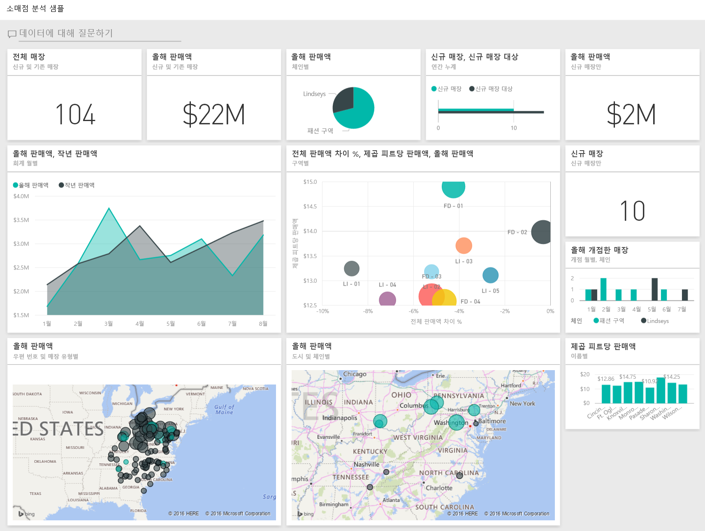

## 필수 조건

 이 샘플을 사용하려면 먼저 샘플을 [콘텐츠 팩](https://docs.microsoft.com/power-bi/sample-datasets#get-and-open-a-sample-content-pack-in-power-bi-service), [.pbix 파일](http://download.microsoft.com/download/9/6/D/96DDC2FF-2568-491D-AAFA-AFDD6F763AE3/Retail%20Analysis%20Sample%20PBIX.pbix) 또는 [Excel 통합 문서](http://go.microsoft.com/fwlink/?LinkId=529778)로 다운로드해야 합니다.

### 이 샘플의 콘텐츠 팩 가져오기

1. Power BI 서비스(app.powerbi.com)를 열고 로그인합니다.
2. 왼쪽 아래 모서리에서 **데이터 가져오기**를 선택합니다.
   
    
3. 데이터 가져오기 페이지가 표시되면 **샘플** 아이콘을 선택합니다.
   
   
4. **소매 분석 샘플**을 선택한 다음 **연결**을 선택합니다.  
  
   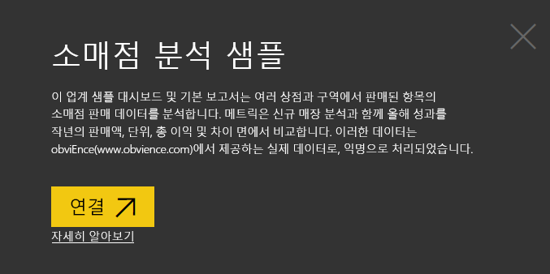
   
5. Power BI에서 콘텐츠 팩을 가져와 새 대시보드, 보고서 및 데이터 세트를 현재 작업 영역에 추가합니다. 새 콘텐츠에는 노란색 별표가 표시됩니다. 
   
   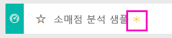
  
### 이 샘플의 .pbix 파일 가져오기

또는 Power BI Desktop에 사용하도록 설계된 .pbix 파일로 샘플을 다운로드할 수 있습니다. 

 * [소매점 분석 샘플](http://download.microsoft.com/download/9/6/D/96DDC2FF-2568-491D-AAFA-AFDD6F763AE3/Retail%20Analysis%20Sample%20PBIX.pbix)

### 이 샘플의 Excel 통합 문서 다운로드
[이 샘플에 대한 데이터 세트(Excel 통합 문서)만 다운로드](http://go.microsoft.com/fwlink/?LinkId=529778)할 수도 있습니다. 통합 문서에는 보고 수정할 수 있는 파워 뷰 시트가 포함됩니다. 원시 데이터를 보려면 **파워 피벗 > 관리**를 선택합니다.

## 대시보드 시작 및 보고서 열기
1. 대시보드에서 "Total Stores" 타일을 선택합니다.

   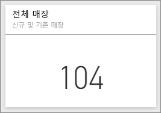  

   그러면 보고서의 "Store Sales Overview" 페이지로 이동합니다. 총 104개의 상점이 있고 그중 10개는 새 상점임을 알 수 있습니다. Fashions Direct 및 Lindseys라는 두 개의 체인이 있습니다. Fashions Direct 상점은 평균적으로 더 큽니다.
2. 원형 차트에서 **Fashions Direct**를 선택합니다.

   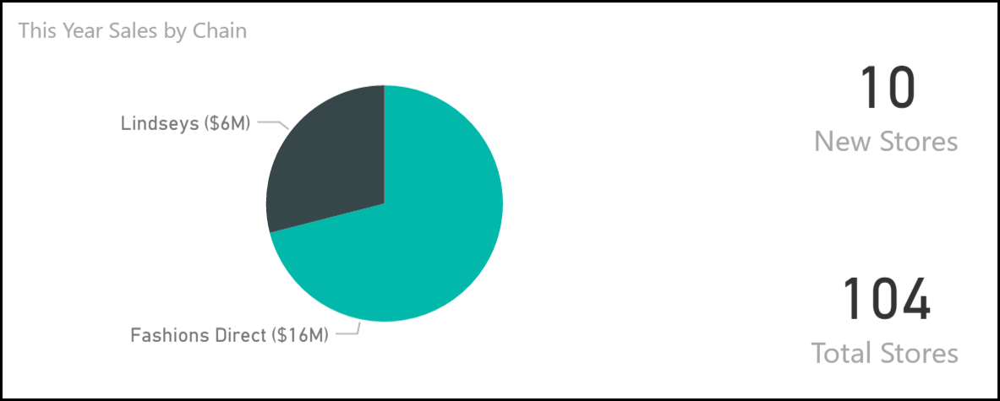  

   거품형 차트의 결과를 확인합니다.

   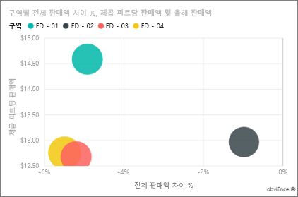  

   FD-01 구역에는 제곱 피터당 최고 평균 판매량이, FD 02에는 작년 대비 가장 차이가 적은 판매량이 있으며, FD-03과 FD 04는 전반적으로 가장 부진한 실적을 나타냅니다.
3. 개별 거품형 차트 또는 다른 차트를 선택하여 선택 항목의 영향을 보여 주는 교차 강조 표시를 확인합니다.
4. 대시보드로 돌아가려면 맨 위 탐색 모음에서 그 이름을 선택합니다(breadcrumbs).

   
5. 대시보드에서 "This Year’s Sales"라는 타일을 선택합니다.

   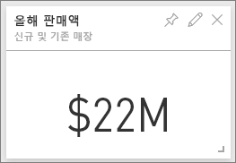

   이는 질문 상자에 "This year sales"를 입력하는 것과 같습니다.

   다음 화면이 표시됩니다.

   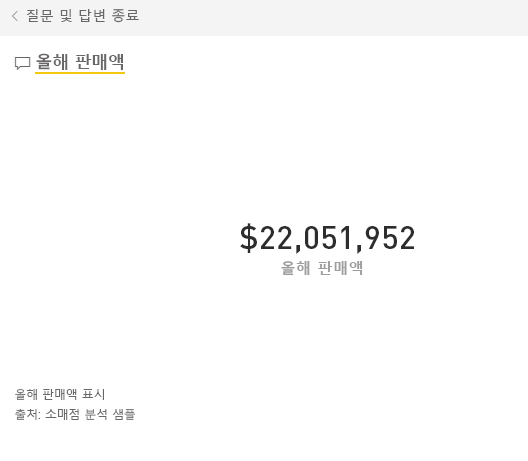

## Power BI 질문 및 답변을 사용하여 만든 타일 검토
보다 자세히 살펴보겠습니다.

1. 질문에 “this year sales **by district**”를 추가합니다. 결과를 확인합니다. 답변이 가로 막대형 차트에 자동으로 배치되며 다른 구를 제안합니다.

   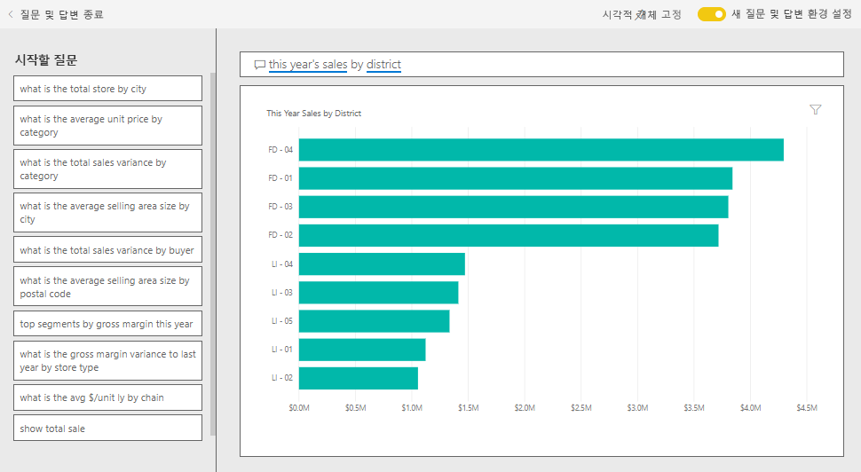
2. 이제 질문을 “this year sales **by zip and chain**”으로 변경합니다.

   적절한 차트를 사용하여 질문을 입력할 때 어떻게 답을 얻을 수 있는지 확인합니다.
3. 더 많은 질문을 입력하여 얻을 수 있는 결과의 종류를 확인합니다.
4. 준비가 되면 대시보드로 돌아갑니다.

## 데이터를 심층적으로 알아보기
이제 보다 자세한 수준에서 구역의 실적을 살펴보겠습니다.

1. 대시보드에서 올해와 작년의 판매를 비교하는 타일을 선택합니다.

   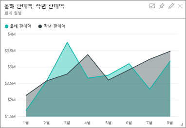

   작년에 대한 편차 %에서 큰 변화를 확인할 수 있으며 1월, 4월 및 7월은 특히 나쁜 달입니다.

   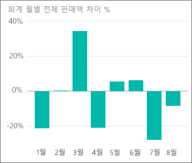

   문제가 발생할 수 있는 위치의 범위를 좁힐 수 있는지 살펴보겠습니다.
2. 거품형 차트를 선택하고 **020-남성복**을 선택합니다.

     

   4월에는 남성복 범주가 전체 비즈니스 만큼 심각하게 영향을 받지 않았지만, 1월과 7월은 여전히 문제의 달입니다.
3. 이제 **010-여성복의 거품형 차트**를 선택합니다.

   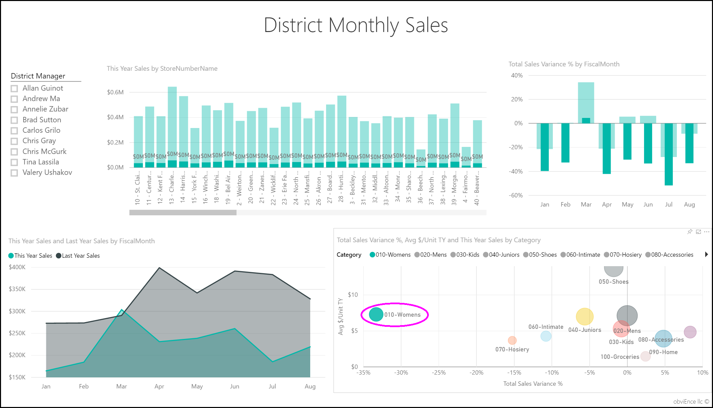

   여성복 범주는 모든 달에 걸쳐 전체 비즈니스보다 훨씬 부진하며, 전년도에 비해 거의 모든 달에서 훨씬 부진합니다.
4. 다시 거품을 선택하여 필터를 지웁니다.

## 슬라이서 사용해 보기
특정 구역에서는 어떻게 수행되는지 살펴보겠습니다.

1. 왼쪽 위에 있는 슬라이서에서 Allan Guinot을 선택합니다.

   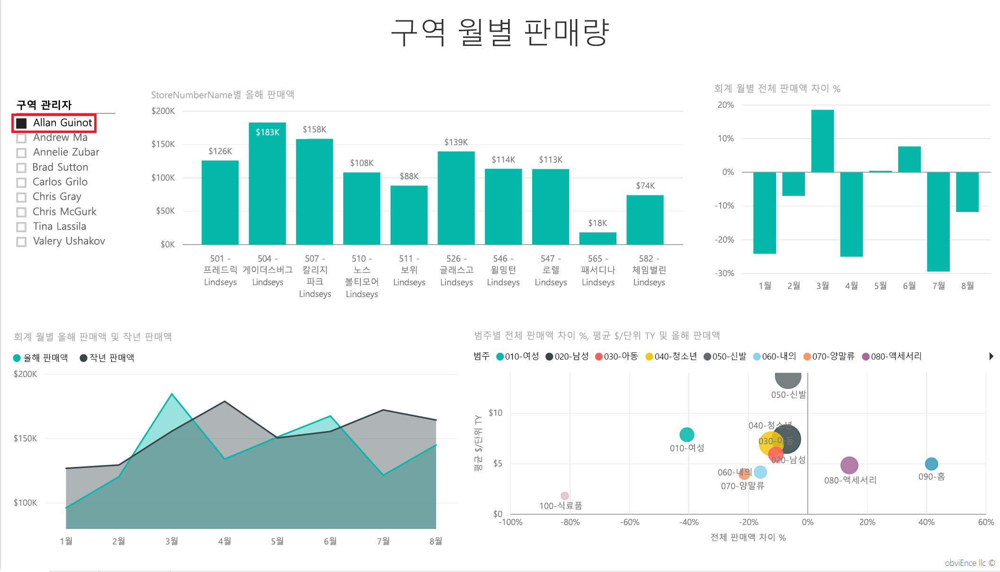

   Allan의 구역은 작년 3월과 6월의 실적이 우수했습니다.
2. 이제 Allan을 계속 선택한 상태에서 여성복 거품형 차트를 선택합니다.

   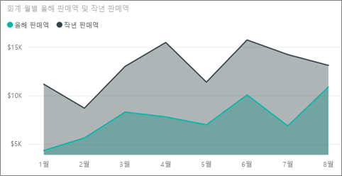

   여성복 범주의 경우, 그의 구역은 작년 물량을 충족하지 못했습니다.
3. 다른 구역 관리자 및 범주를 살펴봅니다. 어떤 사항을 파악할 수 있을까요?
4. 준비가 되면 대시보드로 돌아갑니다.

## 데이터는 올해 매출 성장에 대해 어떤 정보를 알려주나요?
마지막으로 살펴볼 영역은 성장으로 올해에 개업한 신규 매장입니다.

1. 'Stores Opened This Year' 타일을 선택합니다.

   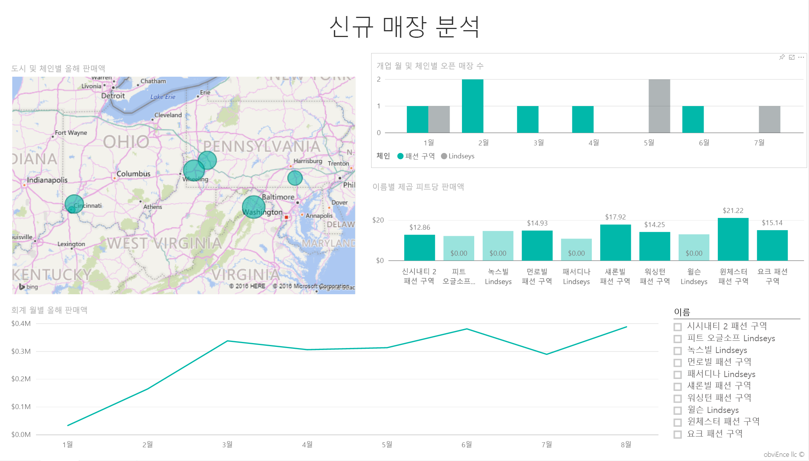

   타일에서 알 수 있듯이 올해 개업한 Lindseys 매장보다 더 많은 Fashions Direct 매장이 더 많습니다.
2. 'Sales Per Sq Ft by Name' 차트를 관찰합니다.

   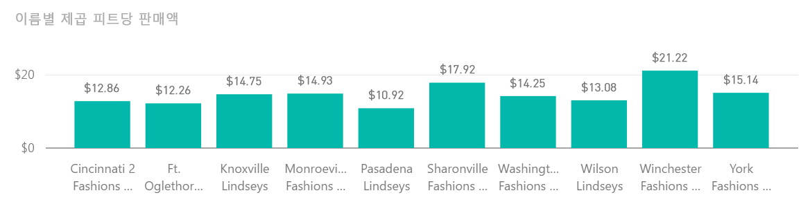

    신규 매장의 Average Sales per SQF에 약간의 차이가 있습니다.
3. 오른쪽 위 차트에서 Fashions Direct 범례 항목을 클릭합니다. 동일한 체인의 경우에도 최고 매장(Winchester Fashions Direct)과 최하위 매장(Cincinnati 2 Fashions Direct)의 실적이 각각 $21.22 대 $12.86로 최고 매장이 현저하게 우수함을 확인할 수 있습니다.

   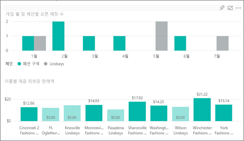
4. 슬라이서에서 Winchester Fashions Direct를 클릭하고 꺾은선형 차트를 관찰합니다. 첫 번째 판매 수치가 2월에 보고되었습니다.
5. 슬라이서에서 Cincinnati 2 Fashions Direct를 클릭합니다. 꺾은선형 차트에서 이 매장은 6월에 개업했으며 실적이 최악인 매장으로 보입니다.
6. 이전과 마찬가지로 전체 차트에서 막대형, 꺾은선형 및 거품형 차트를 클릭하여 검색할 수 있는 내용을 확인합니다.

이제 재생하는 데 안전한 환경입니다. 언제든지 변경 내용을 저장하지 않도록 선택할 수 있습니다. 그러나 변경 내용을 저장하면 언제든지 이 샘플의 새 복사본에 대해 데이터 가져오기로 이동할 수 있습니다.

## 데이터에 연결
이 둘러보기가 Power BI 대시보드, 질문 및 답변, 보고서를 통해 소매 데이터를 파악하는 방법을 확인하는 데 도움이 되었기를 바랍니다. 이제 사용자 데이터에 연결할 차례입니다. Power BI를 사용하여 다양한 데이터 소스에 연결할 수 있습니다. [Power BI 시작하기](service-get-started.md)에 대해 자세히 알아보세요.

## 다음 단계
* [소매점 분석 샘플 콘텐츠 팩 다운로드](sample-tutorial-connect-to-the-samples.md)
* [모든 샘플 파일의 zip 파일 다운로드](http://go.microsoft.com/fwlink/?LinkId=535020)    
* [이 Power BI 샘플에 대한 Excel 통합 문서 다운로드](http://go.microsoft.com/fwlink/?LinkId=529778)    
* [Power BI에 대한 데이터 가져오기](service-get-data.md)    
* [Power BI 서비스의 디자이너를 위한 기본 개념](service-basic-concepts.md)    
* 궁금한 점이 더 있나요? [Power BI 커뮤니티를 이용하세요.](http://community.powerbi.com/)
