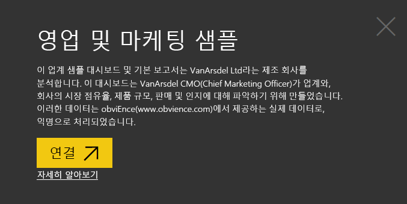

# Power BI의 영업 및 마케팅 샘플: 둘러보기

영업 및 마케팅 샘플에는 VanArsdel Ltd.라는 가상의 제조 회사에 대한 대시보드 및 보고서가 들어 있습니다. VanArsdel CMO(Chief Marketing Officer)는 업계와 회사의 시장 점유율, 제품 볼륨, 판매 및 감정을 파악하기 위해 이 대시보드를 만들었습니다.

VanArsdel은 수많은 경쟁사가 있으나 업계에서 시장 점유율이 가장 높은 기업입니다. CMO는 시장 점유율을 높이고 성장 기회를 모색하고자 합니다. 하지만 알 수 없는 이유로 VanArsdel의 시장 점유율이 떨어지기 시작했고 6월에 큰 폭으로 하락했습니다.

이 샘플은 비즈니스 중심 데이터, 보고서 및 대시보드가 포함된 Power BI를 사용하는 방법을 보여 주는 시리즈의 일부입니다. [obviEnce](http://www.obvience.com/)에서 익명화된 실제 데이터로 생성되었습니다. 데이터는 콘텐츠 팩, .pbix Power BI Desktop 파일 또는 Excel 통합 문서 등 여러 형식으로 사용할 수 있습니다. [Power BI용 샘플](sample-datasets.md)을 참조하세요. 

이 자습서에서는 Power BI 서비스의 영업 및 마케 샘플 콘텐츠 팩을 살펴봅니다. Power BI Desktop 및 Power BI 서비스의 보고서 환경은 비슷하므로 Power BI Desktop에서 샘플 .pbix 파일을 사용하여 이 자습서를 따라 해도 좋습니다. 

Power BI 라이선스가 없어도 Power BI Desktop의 샘플을 살펴볼 수 있습니다. Power BI Pro 라이선스가 없다면 샘플을 Power BI 서비스의 내 작업 영역에 저장하면 됩니다. 

## 샘플 가져오기

이 샘플을 사용하려면 먼저 샘플을 [콘텐츠 팩](#get-the-content-pack-for-this-sample), [.pbix 파일](#get-the-pbix-file-for-this-sample) 또는 [Excel 통합 문서](#get-the-excel-workbook-for-this-sample)로 다운로드해야 합니다.

### 이 샘플의 콘텐츠 팩 가져오기

1. Power BI 서비스(app.powerbi.com)를 열고 로그인한 다음, 샘플을 저장할 작업 영역을 엽니다.

   Power BI Pro 라이선스가 없다면 샘플을 내 작업 영역에 저장하면 됩니다.

2. 왼쪽 아래 모서리에서 **데이터 가져오기**를 선택합니다.
   
   
3. **데이터 가져오기** 페이지가 표시되면 **샘플**을 선택합니다.
   
4. **영업 및 마케팅 샘플**과 **연결**을 차례로 선택합니다.   
  
   
   
5. Power BI에서 콘텐츠 팩을 가져온 다음, 새 대시보드, 보고서 및 데이터 세트를 현재 작업 영역에 추가합니다.
   
   
  
### 이 샘플의 .pbix 파일 가져오기

또는 영업 및 마케팅 샘플을 Power BI Desktop에서 사용하도록 설계된 [.pbix 파일](http://download.microsoft.com/download/9/7/6/9767913A-29DB-40CF-8944-9AC2BC940C53/Sales%20and%20Marketing%20Sample%20PBIX.pbix)로 다운로드할 수 있습니다.

### 이 샘플의 Excel 통합 문서 다운로드

이 샘플의 데이터 원본을 보려면 [Excel 통합 문서](http://go.microsoft.com/fwlink/?LinkId=529785)로도 제공됩니다. 통합 문서에는 보고 수정할 수 있는 파워 뷰 시트가 포함됩니다. 원시 데이터를 보려면 데이터 분석 추가 기능을 사용하도록 설정한 다음, **파워 피벗 > 관리**를 선택합니다. 파워 뷰와 파워 피벗 추가 기능을 사용하도록 설정하려면 [내부 Excel 자체에서 Excel 샘플 살펴보기](sample-datasets.md#optional-take-a-look-at-the-excel-samples-from-inside-excel-itself)에서 자세한 내용을 참조하세요.

## 대시보드가 시사하는 점은 무엇입니까?
대시보드를 둘러보고 CMO가 고정하도록 선택한 타일을 살펴보겠습니다. 시장 점유율, 판매 및 인지에 대한 정보를 확인합니다. 데이터는 지역, 시간, 경쟁별로 분석됩니다.

* 왼쪽 열의 숫자 타일은 지난해 업계 판매량(50,000), 시장 점유율(32.86%), 판매량(16,000), 감정 점수(68), 감정 차이(4), 총 판매 단위(100만)를 보여 줍니다.
* 맨 위의 꺾은선형 차트( **% 단위 시장 점유율 및 % 단위 시장 점유율 12개월 기준**)는 시간 경과에 따른 시장 점유율 변동을 보여 줍니다. 6월에 대폭 하락한 것을 확인합니다. 한동안 증가했던 R12M(12개월 기준) 점유율도 현재 정체 상태입니다.
* 가운데 세로 막대형 차트 타일(**총 단위 YTD 차이 %** )에서 확인할 수 있듯이, 최대 경쟁업체는 Aliqui입니다.
* 대부분의 비즈니스는 동부 및 중부에서 이루어집니다.
* 맨 아래의 꺾은선형 차트(**2014년 총 단위**)는 6월 하락이 비수기에 따른 것이 아님을 보여 줍니다. 어떤 경쟁사도 동일한 추세를 보이지 않았습니다.
* 오른쪽에 있는 **총 단위 전체** 및 **총 단위 YTD** 타일은 판매된 단위를 부문별, 지역/제조업체별로 보여 줍니다. 업계의 최대 시장 부문은 **생산성** 및 **편의**입니다.

## Q & A를 사용하여 상세히 알아보기

질문 및 답변을 사용하여 데이터에서 추가 정보를 검색할 수 있습니다.

### 어떤 부문이 매출에 기여합니까? 업계 추세와 일치하나요?
1. **부문별 총 단위 전체** 타일을 선택합니다. 질문 및 답변이 열리고, *부문별 총 단위* 쿼리로 채워집니다.
2. 기존 쿼리의 끝에 *for VanArsdel*을 추가합니다. Q&A가 이 질문을 해석하고 업데이트된 차트를 답과 함께 표시합니다. 제품 볼륨은 대체로 **편의** 및 **중재** 부문에서 생성되었음을 확인합니다.

   
3. **중재** 및 **편의** 범주의 점유율은 높으며 회사에 경쟁력이 있는 부문입니다.
4. 위쪽 탐색 모음에서 **영업 및 마케팅 샘플**을 선택하여 대시보드로 돌아갑니다.

### 카테고리의 총 단위 시장 점유율이 어떻게 나타납니까?(지역 대비)
1. **제조업체별, 지역별 총 단위 YTD** 타일을 확인합니다. 범주별 총 단위 시장 점유율은 무엇인가요?

   
2. 대시보드 맨 위의 질문 상자를 선택하고 ‘제조업체별 총 단위 및 2014년 범주 트리맵’ 질문을 입력합니다.  질문을 입력하면 시각화가 어떻게 업데이트되는지 확인합니다.

   
3. 결과를 비교하려면 차트를 대시보드에 고정합니다. 흥미로운 사실은 다음과 같습니다. 2014년에 VanArsdel은 **Urban** 범주에서만 제품을 판매했습니다.
4. 대시보드로 돌아갑니다.

## 영업 및 마케팅 샘플 보고서

대시보드는 보고서의 진입점입니다. 타일이 기본 보고서를 통해 만들어진 경우 해당 타일을 선택하면 보고서가 열립니다.

대시보드에서 **% 단위 시장 점유율 및 % 단위 시장 점유율 12개월 기준** 차트의 **% 단위 시장 점유율 R12M** 선은 시장 점유율이 더 이상 시간에 따라 증가하지 않음을 보여 줍니다. 오히려 약간 감소하고 있습니다. 또한 6월에 시장 점유율이 대폭 하락한 이유는 무엇인가요? 

영업 및 마케팅 샘플 보고서에는 네 페이지가 있습니다.
 
### VanArsdel - 시장 점유율 페이지
보고서의 1페이지는 VanArsdel의 시장 점유율에 중점을 둡니다.

1. 대시보드에서 **% 단위 시장 점유율 및 % 단위 시장 점유율 12개월 기준** 차트를 선택하여 영업 및 마케팅 샘플 보고서의 **VanArsdel - 시장 점유율** 페이지를 엽니다.

   

2. 보고서 맨 아래에 있는 **월별 isVanArsdel의 총 단위** 세로 막대형 차트를 살펴보겠습니다. 검은색 열은 VanArsdel(자사) 제품, 녹색 열은 경쟁업체 제품을 나타냅니다. 2014년 6월 VanArsdel에 발생한 하락이 경쟁사에는 없었습니다.

3. 오른쪽에 있는 **부문별 총 범주 볼륨** 가로 막대형 차트가 필터링되어 VanArsdel의 상위 2개 부문을 표시합니다. 이 필터를 만든 방법을 살펴봅니다.  

   a. **부문별 총 범주 볼륨** 차트를 선택합니다.

   b. 오른쪽에서 **필터** 창을 선택하여 펼칩니다.  

   c. **시각적 수준 필터**에서 **부문**이 **편의** 및 **중재** 부문만 포함하도록 필터링되었습니다.  

   d. **부문**을 선택하여 펼친 다음, **생산성** 부문을 선택해서 추가하여 필터를 수정합니다.  

4. **월별 isVanArsdel의 총 단위** 차트의 범례에서 **예**를 선택하여 VanArsdel을 기준으로 페이지를 교차 필터링합니다. **부문별 총 범주 볼륨** 차트를 통해 **생산성** 부문에서는 경쟁력이 없음을 확인합니다.

5. 범례에서 **예**를 다시 선택하여 필터를 제거합니다.

6. **% 단위 시장 점유율 및 월별 % 단위 시장 점유율 R12M** 꺾은선형 차트을 살펴봅니다. 월별 시장 점유율과 12개월 기준 시장 점유율이 표시됩니다. 몇 개월 기준 데이터는 월별 변동을 평준화하여 장기적 추세를 파악하는 데 도움이 됩니다. **부문별 총 범주 볼륨** 가로 막대형 차트에서 **편의** 및 **중재**를 차례로 선택하여 각 부문의 시장 점유율 변동을 확인합니다. **중재** 부문의 시장 점유율 변동이 훨씬 더 큽니다.

6월에 시장 점유율이 대폭 하락한 원인을 아직 찾고 있습니다. 다음으로, 보고서의 **감정 분석** 페이지를 살펴보겠습니다.

### 감정 분석 페이지
보고서의 3페이지는 소비자 감정에 중점을 둡니다.

트윗, Facebook, 블로그, 기사는 모두 페이지 왼쪽의 두 꺾은선형 차트에 표시된 소비자 감정에 영향을 줍니다. 왼쪽 위에 있는 **VanArsdel - 월별 감정** 차트는 제품에 대한 감정이 2월까지 대체로 중립적이었음을 보여 줍니다. 그런 후에 2월부터 크게 떨어지기 시작해 6월에 바닥을 찍었습니다. 이러한 인지 하락의 원인은 무엇일까요? 

외부 원인을 살펴보겠습니다. 2월에 여러 기사와 블로그에서 VanArsdel의 고객 서비스가 업계 최악이라고 평가했습니다. 이러한 적대적 언론보도가 고객의 인지와 판매에 직접적인 상관 관계가 있었습니다. VanArsdel은 고객 서비스를 개선하기 위해 많은 노력을 기울였고 고객과 업계가 주목했습니다. 7월에 긍정적인 감정이 상승하기 시작해 60년대의 역대 최고 수준에 도달했습니다. 이 감정 상승은 보고서의 1페이지와 2페이지에 있는 **월별 총 단위** 차트에 반영되었습니다. 아마도 이 사실이 부분적으로 6월의 시장 점유율 하락을 설명해 줄 수 있을 것입니다.

감정 차이도 살펴봐야 할 영역일 수 있습니다. 어느 구역에서 감정 차이가 가장 큰지, 경영진이 이 데이터를 어떻게 이용할 수 있는지, 다른 구역에서 어떻게 재현할 수 있는지 등을 살펴볼 수 있습니다.

### YTD 범주 추세 분석 페이지
보고서의 2페이지는 연간 누계 범주 추세에 중점을 둡니다.

다음 세부 정보를 확인합니다.
* VanArsdel은 이 범주에서 가장 큰 회사이며 주요 경쟁업체는 Natura, Aliqui 및 Pirium입니다. 경쟁사를 지켜볼 것입니다.
* Aliqui는 성장하는 기업이지만 제품 규모가 자사에 비해 여전히 적습니다.
* 트리맵에는 VanArsdel이 녹색으로 표시되어 있습니다. 동부 지역의 고객은 경쟁업체를 선호하지만 중부 지역에서는 선전하고 있습니다. 동부 지역의 점유율이 가장 낮습니다.
* 지리적 요인이 판매 단위에 영향을 미칩니다. 동부 지역은 대부분의 제조업체에서 중심 지역이며, VanArsdel은 중부 지역에서도 강력한 입지를 구축하고 있습니다.
* 오른쪽 아래의 **월별, 제조업체별 총 단위 YTD 차이 %** 차트에서 긍정적인 신호인 양수 차이가 있는 것을 확인합니다. 작년보다 실적이 개선되었지만 경쟁업체인 Aliqui도 마찬가지입니다.

### 성장 기회 페이지
보고서의 4페이지는 경쟁 제품 분석에 중점을 둡니다.

다음 세부 정보를 확인합니다.
* 왼쪽 아래에 있는 **부문별 총 단위** 차트는 VanArsdel의 가장 강력한 두 부문을 제외한 모든 범주 부문을 보여 줍니다. 각 부문을 차례로 선택하여 VanArsdel의 잠재적 확장 영역을 확인합니다. 
* **익스트림** 및 **생산성** 부문은 다른 항목보다 빠르게 성장하고 있습니다. 그러나 해당 부문에서는 경쟁력이 없습니다. 이 부문으로 진입한다면 데이터를 사용하여 어떤 지역에서 어떤 부문이 인기가 높은지 확인할 수 있습니다. 추가로, 어떤 지역이 더 빠르게 성장하고 있고 해당 부문에서 누가 가장 큰 경쟁업체인지와 같은 질문을 조사할 수 있습니다.
* 6월에 시장 점유율이 급격히 하락한 사실을 상기해 봅니다. 6월은 자사에 경쟁력이 전혀 없는 부문인 **생산성** 부문에서 중요한 달입니다. 이 세부 정보는 6월의 점유율 하락을 설명하는 데 도움이 될 수 있습니다.

VanArsdel, 부문, 월, 지역별로 시각화를 필터링하면 VanArsdel의 성장 기회를 모색할 수 있습니다.

## 다음 단계: 데이터에 연결
이 환경은 변경 내용을 저장하지 않도록 선택할 수 있으므로 안전하게 이용할 수 있습니다. 그러나 변경 내용을 저장하면 언제든지 이 샘플의 새 복사본에 대해 **데이터 가져오기**를 선택할 수 있습니다.

이 둘러보기가 Power BI 대시보드, 질문 및 답변, 보고서를 통해 HR 데이터 정보를 확인하는 데 도움이 되었기를 바랍니다. 이제 사용자 데이터에 연결할 차례입니다. Power BI를 사용하여 다양한 데이터 원본에 연결할 수 있습니다. 더 자세히 알아보려면 [Power BI 서비스 시작하기](service-get-started.md)를 참조하세요.
