# Power BI용 공급업체 품질 분석 샘플: 둘러보기

## 공급업체 품질 분석 샘플의 간단한 개요
이 업계 샘플 대시보드 및 기본 보고서에서는 일반적인 공급망 문제 중 하나인 공급업체 품질 분석에 집중합니다.
이 분석에서 중요한 두 가지 기본 메트릭은 총 결함 수와 이러한 결함으로 인한 총 가동 중지 시간입니다. 이 샘플의 기본적 목표는 다음 두 가지입니다.

* 품질과 관련하여 최고 및 최악의 공급업체를 파악합니다.
* 결함을 발견하고 거부하는 작업을 더 효율적으로 수행하여 가동 중지 시간을 최소화하는 공장을 식별합니다.

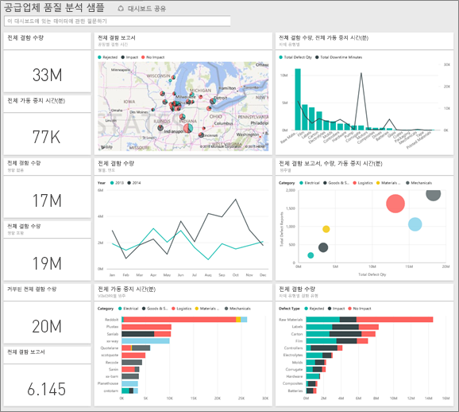

이 샘플은 비즈니스 중심 데이터, 보고서 및 대시보드가 포함된 Power BI를 사용하는 방법을 보여 주는 시리즈의 일부입니다.
이 샘플은 익명화된 obviEnce([www.obvience.com](http://www.obvience.com/))의 실제 데이터입니다.

## 필수 조건

 이 샘플을 사용하려면 먼저 샘플을 콘텐츠 팩, .pbix 파일 또는 Excel 통합 문서로 다운로드해야 합니다.

### 이 샘플의 콘텐츠 팩 가져오기

1. Power BI 서비스(app.powerbi.com)를 열고 로그인합니다.
2. 왼쪽 아래 모서리에서 **데이터 가져오기**를 선택합니다.
   
    
3. 데이터 가져오기 페이지가 표시되면 **샘플** 아이콘을 선택합니다.
   
   
4. **공급업체 품질 분석 샘플**을 선택한 다음 **연결**을 선택합니다.  
  
   
   
5. Power BI에서 콘텐츠 팩을 가져와 새 대시보드, 보고서 및 데이터 집합을 현재 작업 영역에 추가합니다. 새 콘텐츠에는 노란색 별표가 표시됩니다. 
   
   
  
### 이 샘플의 .pbix 파일 가져오기

또는 Power BI Desktop에 사용하도록 설계된 .pbix 파일로 샘플을 다운로드할 수 있습니다. 

 * [공급업체 품질 분석 샘플](http://download.microsoft.com/download/8/C/6/8C661638-C102-4C04-992E-9EA56A5D319B/Supplier-Quality-Analysis-Sample-PBIX.pbix)

### 이 샘플의 Excel 통합 문서 다운로드
[이 샘플에 대한 데이터 집합(Excel 통합 문서)만 다운로드](http://go.microsoft.com/fwlink/?LinkId=529779)할 수도 있습니다. 통합 문서에는 보고 수정할 수 있는 파워 뷰 시트가 포함됩니다. 원시 데이터를 보려면 **파워 피벗 > 관리**를 선택합니다.

## 결함이 있는 자재로 인한 가동 중지 시간
결함이 있는 자재로 인해 발생한 가동 중지 시간을 분석하고 책임 공급업체가 어느 곳인지 확인하겠습니다.  

1. 대시보드에서 **총 결함 수** 숫자 타일 또는 **총 가동 시간(분)** 숫자 타일을 선택합니다.  

   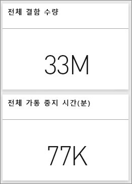  

   "공급업체 품질 분석 샘플" 보고서가 "가동 중지 시간 분석" 페이지로 열립니다. 결함이 있는 부분이 총 3천 3백만 개이고 이와 같이 결함이 있는 부품으로 인해 발생한 총 가동 중지 시간은 7,700분입니다. 일부 자재는 결함이 있는 부품 수가 적지만 그로 인해 지연이 발생하고 가동 중지 시간이 더 길어질 수 있습니다. 보고서 페이지에서 살펴보겠습니다.  
2. **자재 유형별 결함 및 가동 중지 시간(분)** 콤보 차트에서 **총 가동 중지 시간(분)** 을 보면 골판 자재로 인해 가장 많은 가동 중지 시간이 발생한 것을 확인할 수 있습니다.  
3. 동일한 콤보 차트에서 **골판** 열을 선택하여 어느 공장이 이 결함으로 인해 가장 많은 영향을 받았고 책임 공급업체는 어디인지 확인합니다.  

     
4. 맵에서 개별 공장을 선택하여 해당 공장에서 가동 중지 시간의 원인이 된 공급업체 또는 자재를 확인합니다.

### 최악의 공급업체는 어디입니까?
 최악의 공급업체 8곳을 찾고 이러한 공급업체로 인해 발생한 가동 중지 시간이 총 가동 중지 시간의 몇 퍼센트를 차지하는지 알아보겠습니다. **공급업체별 가동 중지 시간(분)** 영역 차트를 트리맵으로 변경하겠습니다.  

1. 보고서의 3페이지, "가동 중지 시간 분석"의 왼쪽 위 상단에서 **보고서 편집** 을 선택합니다.  
2. **공급업체별 가동 중지 시간(분)** 영역 차트를 선택하고 시각화 창에서 트리맵을 선택합니다.  

   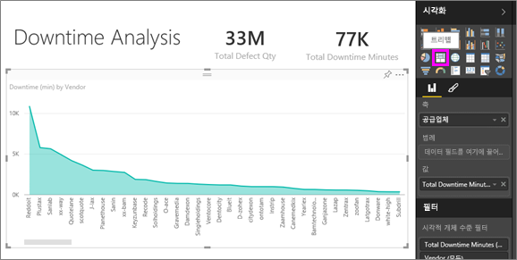  

    트리맵이 **공급업체** 필드를 **그룹**으로 전환합니다.  

    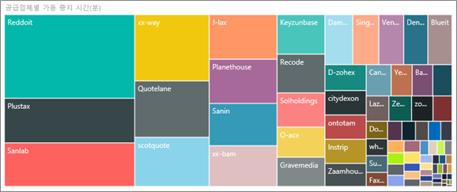  

   이 트리맵에서 상위 8개 공급업체는 트리맵의 왼쪽에 있는 8개 블록인 것을 볼 수 있습니다. 또한 이러한 공급업체가 전체 가동 시간(분)에서 약 50%를 차지하는 것도 볼 수 있습니다.  
3. 맨 위 탐색 모음에서 **공급 업체 품질 분석 샘플**을 선택하여 대시보드로 돌아갑니다.

### 공장 비교
이제 어느 공장이 결함이 있는 자재를 더 효과적으로 관리하여 가동 중지 시간을 줄이고 있는지 알아보겠습니다.  

1. **공장별, 결함 유형별 총 결함 보고서** 맵 타일을 선택합니다.  

    보고서가 "공급업체 품질" 페이지로 열립니다.  

   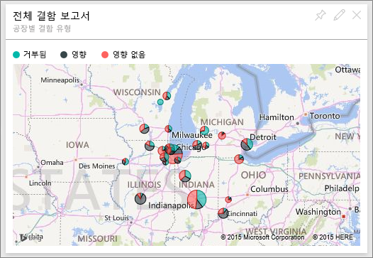  
2. 맵 범례에서 **영향** 원을 선택합니다.  

    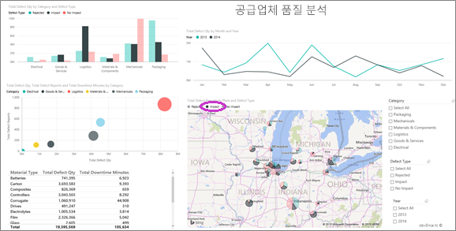  

    거품형 차트에서 **물류** 가 총 결함 수량, 총 결함 보고서, 총 가동 중지 시간(분)에서 가장 높아 문제가 가장 많은 범주입니다. 이 범주를 자세히 알아보겠습니다.  
3. 거품형 차트에서 물류 거품을 선택하고 일리노이스 주 스프링필드와 일리노이스 주 네이퍼빌에 있는 공장을 관찰합니다. 영향 횟수가 많은 스프링필드에 비해, 네이퍼빌은 거부 횟수가 많고 영향 수가 적어 결함이 있는 소모품을 효과적으로 관리하는 것으로 나타납니다.  

   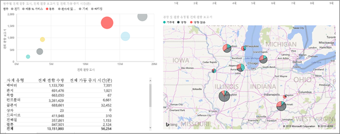  
4. 맨 위 탐색 모음에서 **공급 업체 품질 분석 샘플**을 선택하여 활성 상태인 작업 영역으로 돌아갑니다.

## 어떤 자재 유형을 가장 잘 관리하고 있습니까?
가장 효과적으로 관리되는 자재 유형은 결함 수량과 상관없이 가동 중지 시간이 가장 적거나 영향이 없는 자재입니다.

* 대시보드에서 **자재 유형별, 결함 유형별 총 결함 수량** 타일을 보십시오.

  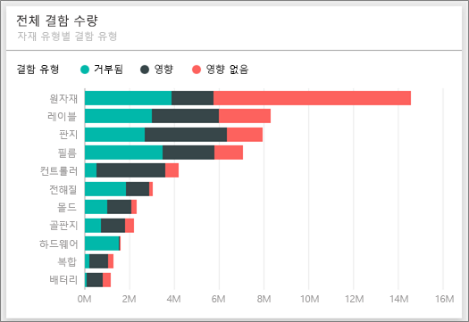

**원자재** 의 총 결함 수가 많지만 대부분의 결함은 거부되거나 영향이 없습니다.

원자재의 결함 수량이 많은데도 많은 가동 중지 시간의 원인이 아님을 증명해 보겠습니다.

* 대시보드에서 **자재 유형별 총 결함 수량, 총 다운타임 시간(분)** 타일을 보십시오.

  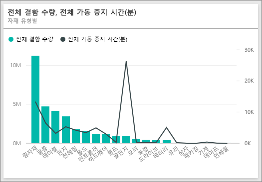

원자재는 분명히 효과적으로 관리되고 있습니다. 결함 수는 많지만 총 가동 중지 시간(분)은 적습니다.

### 결함과 연도별 가동 중지 시간 비교
1. **공장별, 결함 유형별 총 결함 보고서** 맵 타일을 선택하여 첫 번째 보고서 페이지인 공급업체 품질로 보고서를 엽니다.
2. 2014년의 **결함 수량** 이 2013년보다 많다는 점을 주목하십시오.  

    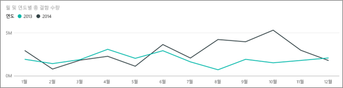  
3. 결함이 많을수록 가동 중지 시간이 늘어났습니까? 질문과 대답 상자에서 질문하고 알아보겠습니다.  
4. 맨 위 탐색 모음에서 **공급 업체 품질 분석 샘플**을 선택하여 대시보드로 돌아갑니다.  
5. 원자재의 결함 수가 가장 많다는 것을 알기 때문에 질문 상자에 "자재 유형, 연도, 총 결함 수량 표시"를 입력합니다.  

    2013년보다 2014년에 원자재 결함이 더 많았습니다.  

    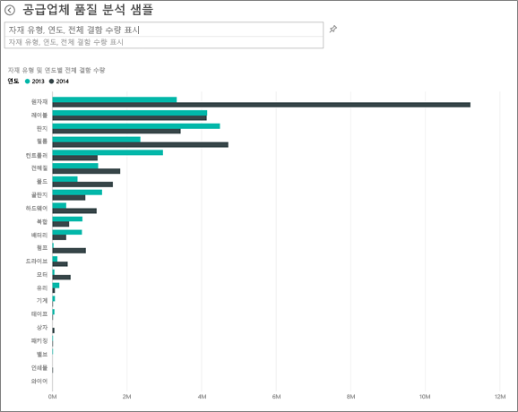  
6. 이제 질문을 "자재 유형, 연도, 총 가동 중지 시간(분)"으로 바꿉니다.  

   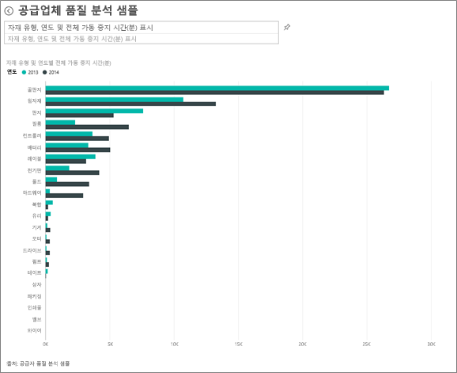

2014년 원자재 결함이 훨씬 많았는데도 원자재 가동 중지 시간은 2013년과 2014년이 동일합니다.

2014년의 원자재 결함으로 인해 2014년에 훨씬 많은 원자재 가동 중지 시간이 발생하지 않은 것으로 나타납니다.

### 결함과 월간 가동 중지 시간 비교
총 결함 수량과 관련된 다른 대시보드 타일을 살펴보겠습니다.  

1. 질문 상자 위에 있는 왼쪽 위 모서리에 있는 뒤로 화살표 를 선택하여 대시보드로 돌아옵니다.  

    **월별, 연도별 총 결함 수량** 타일을 자세히 보면 2014년도 상반기의 결함 수가 2013년과 유사하지만 2014년도 후반기에는 결함 수가 크게 증가한 것을 확인할 수 있습니다.  

    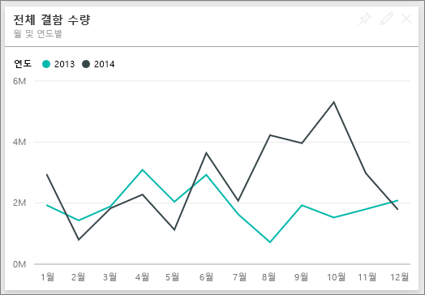  

    이러한 결함 수량이 증가하면서 가동 중지 시간(분)도 동일하게 증가되었는지 알아보겠습니다.  
2. 질문 상자에서 "월별, 연도별 총 가동 중지 시간(분) 꺽은선형 차트"를 입력합니다.  

   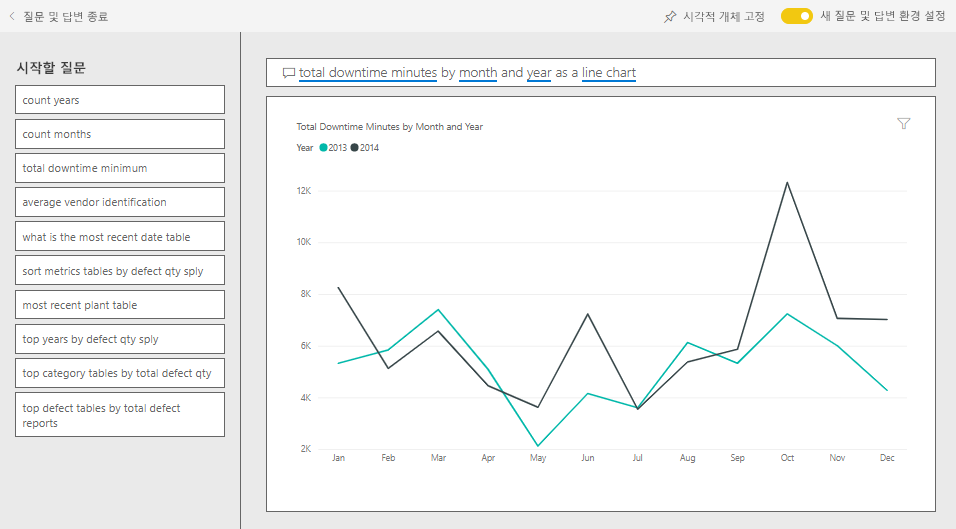

   6월과 10월에 가동 중지 시간이 크게 증가한 반면 결함 수가 급증하면서 가동 중지 시간이 크게 증가한 것은 아닙니다. 이 추세는 결함을 효과적으로 관리하고 있음을 보여줍니다.  
3. 이 차트를 대시보드에 고정하려면 질문 상자 오른쪽에 있는 고정 아이콘 을 선택합니다.  
4. 이상 월에 대해 알아보기 위해 "공장별 10월 총 가동 중지 시간(분)" 등의 질문을 입력하여 10월 중 자재 유형, 고장 위치, 범주 등을 기준으로 가동 중지 시간(분)을 확인합니다.    
5. 질문 상자 위에 있는 왼쪽 위 모서리에 있는 뒤로 화살표 를 선택하여 대시보드로 돌아옵니다.

이제 재생하는 데 안전한 환경입니다. 언제든지 변경 내용을 저장하지 않도록 선택할 수 있습니다. 그러나 변경 내용을 저장하면 언제든지 이 샘플의 새 복사본에 대해 **데이터 가져오기** 로 이동할 수 있습니다.

## 다음 단계: 데이터에 연결
이 둘러보기가 Power BI 대시보드, 질문 및 답변, 보고서를 통해 공급업체 수량 데이터를 파악하는 방법을 확인하는 데 도움이 되었기를 바랍니다. 이제 사용자 데이터에 연결할 차례입니다. Power BI를 사용하여 다양한 데이터 소스에 연결할 수 있습니다. [Power BI 시작하기](service-get-started.md)에 대해 자세히 알아보세요.
