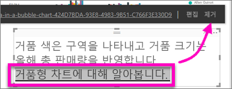

# 보고서에서 텍스트 상자에 하이퍼링크 추가
보고서에 텍스트 상자를 추가하고, 보고서에서 대시보드에 고정하고, 대시보드에 직접 추가할 수 있습니다. 텍스트 상자가 있는 곳이라면 언제든지 하이퍼링크를 추가할 수 있습니다.  

> **참고**: Power BI 테이블 및 매트릭스의 하이퍼링크에 대한 자세한 내용은 [테이블의 하이퍼링크](power-bi-hyperlinks-in-tables.md)를 참조하세요. **대시보드**에 텍스트 상자 추가에 대한 자세한 내용은 [대시보드에서 바로 타일 추가](service-dashboard-add-widget.md)를 참조하세요. 
> 
> 

<iframe width="560" height="315" src="https://www.youtube.com/embed/_3q6VEBhGew#t=0m55s" frameborder="0" allowfullscreen></iframe>

## 보고서에서 텍스트 상자에 하이퍼링크 추가
1. [텍스트 상자를 만들고 텍스트를 추가합니다](power-bi-reports-add-text-and-shapes.md). 
2. 기존 텍스트를 선택하거나 하이퍼링크로 사용할 새 텍스트를 추가합니다.
   
   
3. 하이퍼링크 아이콘 선택 을 선택합니다.
4. 하이퍼링크 필드에서 URL을 입력하거나 붙여넣고 **완료**를 선택합니다.
   
   
5. 링크를 테스트합니다.  
   
   
   
   * 강조 표시된 텍스트의 아무 곳에나 커서를 놓아 URL을 표시합니다.  
     
      
   * 페이지를 새 브라우저 창에서 열 URL을 선택합니다.

## 하이퍼링크를 제거하고 텍스트는 남겨두려는 경우
1. 텍스트 상자에서 강조 표시할 하이퍼링크를 선택합니다.
   
     
2. **제거**를 선택합니다. 

## 다음 단계
[Power BI 보고서의 텍스트 상자](power-bi-reports-add-text-and-shapes.md)

궁금한 점이 더 있나요? [Power BI 커뮤니티를 이용하세요.](http://community.powerbi.com/)

