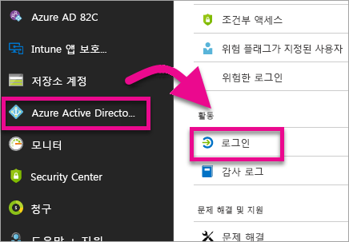
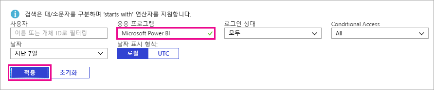

# 로그인한 Power BI 사용자 찾기

현재 테넌트 관리자이며 Power BI에 로그인했던 사람이 누구인지 알고자 하는 경우 [Azure Active Directory 액세스 및 사용 보고서](/azure/active-directory/reports-monitoring/concept-sign-ins)를 사용하여 정보를 파악할 수 있습니다.

> [!NOTE]
> **로그인** 보고서는 유용한 정보를 제공하지만, 각 사용자가 보유한 라이선스 유형을 식별하지는 않습니다. 라이선스를 보려면 Microsoft 365 관리 센터를 사용합니다.

## 요구 사항

모든 사용자(비관리자 포함)는 자신의 로그인에 대한 보고서를 볼 수 있지만, 모든 사용자에 대한 보고서를 보려면 다음 요구 사항을 충족해야 합니다.

* 테넌트는 Azure Active Directory Premium 라이선스와 연결되어 있어야 합니다.

* 다음 역할 중 하나여야 합니다. 전역 관리자, 보안 관리자 또는 보안 읽기 권한자.

## Azure Portal을 사용하여 로그인 보기

로그인 활동을 보려면 다음 단계를 수행합니다.

1. **Azure Portal**에서 **Azure Active Directory**를 선택합니다.

1. **모니터링**에서 **로그인**을 선택합니다.
   
    

1. **Microsoft Power BI** 또는 **Power BI Gateway** 중 하나로 애플리케이션을 필터링하고 **적용**을 선택합니다.

    **Microsoft Power BI**는 서비스에 관련된 로그인 활동을 필터링하지만, **Power BI Gateway**는 온-프레미스 데이터 게이트웨이에 관련된 로그인 활동을 필터링합니다.
   
    

## 데이터 내보내기

CSV 파일 또는 JSON 파일의 두 가지 형식 중 하나로 [로그인 보고서를 다운로드](/azure/active-directory/reports-monitoring/quickstart-download-sign-in-report)할 수 있습니다.

**로그인** 보고서의 맨 위에서 **다운로드**를 선택한 후, 다음 옵션 중 하나를 선택합니다.

* **CSV** - 현재 필터링된 데이터의 CSV 파일을 다운로드합니다.

* **JSON** - 현재 필터링된 데이터의 JSON 파일을 다운로드합니다.

## 데이터 보존

로그인 관련 데이터는 최대 30일 동안 사용할 수 있습니다. 자세한 내용은 [Azure Active Directory 보고서 보존 정책](/azure/active-directory/reports-monitoring/reference-reports-data-retention)을 참조하세요.

## 다음 단계

[조직 내에서 감사 사용](service-admin-auditing.md)

궁금한 점이 더 있나요? [Power BI 커뮤니티에 질문합니다.](https://community.powerbi.com/)