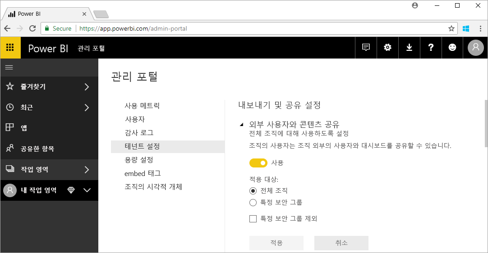

# Power BI 관리란?

Power BI 관리는 거버넌스 정책, 사용 모니터링뿐 아니라 라이선스, 용량 및 조직 리소스의 프로비저닝에 대한 구성을 포함한 Power BI 테넌트에 대한 관리입니다. 이 문서에서는 관리 역할, 작업 및 도구에 대한 개요와 추가 정보로 이동하는 문서 링크를 제공합니다.

Power BI는 셀프 서비스 비즈니스 인텔리전스를 위해 설계되었으며 관리자는 Power BI 테넌트의 데이터, 프로세스 및 정책에 대한 보호자입니다. Power BI 관리자는 BI 개발자, 분석가 및 기타 역할을 포함하는 팀의 핵심 구성원입니다. 관리자는 조직을 지원하여 중요한 목표가 충족되었는지 확인할 수 있습니다.

- 사용자에게 ‘실제로’ 필요한 KPI 및 메트릭 이해
- IT 주도 회사 보고를 위한 전달 시간 단축
- Power BI 배포의 채택 및 투자 수익률 증가

수행할 작업은 비즈니스 사용자의 생산성을 높이고 보안과 법률 및 규정 준수를 보장하는 것입니다. 책임에는 도움말 및 지원이 포함되고 대부분의 경우 비즈니스 사용자가 적절한 작업을 수행하도록 지원할 책임이 포함될 수 있습니다.

## Power BI와 관련된 관리자 역할

다음 표에서는 Power BI 관리와 관련된 몇 가지 역할을 다룹니다.

| **관리자 유형** | **관리 범위** | **Power BI 범위** |
| --- | --- | --- |
| Office 365 전역 관리자 | Office 365 | Power BI 테넌트 및 기타 서비스의 모든 측면을 관리할 수 있습니다. |
| Office 365 대금 청구 관리자 | Office 365 | Office 365 구독을 통해 Power BI 라이선스를 취득할 수 있습니다. |
| Power BI 서비스 관리자 | Power BI 테넌트 | Power BI 테넌트 및 해당 관리 기능(라이선스 부여 제외)을 전반적으로 제어합니다. |
| Power BI Premium 용량 관리자 | 단일 프리미엄 용량 | 프리미엄 용량 및 해당 관리 기능을 전반적으로 제어합니다. |
| Power BI Embedded 용량 관리자 | 단일 포함 용량 | 포함 용량 및 해당 관리 기능을 전반적으로 제어합니다. |

Office 365 또는 Azure Active Directory의 전역 관리자는 Power BI에서 관리자 권한을 가집니다. Office 365 전역 관리자는 Power BI 기능에 대한 관리 권한만 부여하는 Power BI 서비스 관리자 역할에 다른 사용자를 할당할 수 있습니다.

Power BI 서비스 관리자는 기능, 보안 및 모니터링에 대한 다양한 테넌트 수준 설정을 포함하는 Power BI 관리 포털에 액세스할 수 있습니다. 서비스 관리자는 Power BI 테넌트의 모든 리소스에 대한 전체 액세스 권한을 가집니다. 대부분의 경우 서비스 관리자는 문제를 식별한 다음, 리소스 소유자에게 수정 작업을 수행하도록 요청합니다.

Power BI 서비스 관리자 역할은 사용자에게 라이선스를 할당하거나 Office 365에서 감사 로그를 보는 기능을 제공하지 않습니다. 따라서 Power BI 서비스 관리자 역할만 수행하는 사용자는 Power BI 관리 작업을 수행할 수 없습니다.

## 관리 작업

관리자는 다음 표에서 다루는 조직에 대한 Power BI 테넌트를 지원하는 많은 작업을 수행합니다.

| **작업 영역** | **일반 작업** |
| --- | --- |
| Power BI 테넌트 관리 |<ul><li>주요 Power BI 기능 사용 및 사용 안 함 <li>사용량 및 성능 보고 <li>이벤트 감사 검토 및 관리</ul>|
| Power BI 라이선스 취득 및 할당 |<ul><li>사용자 등록 관리 <li>Pro 라이선스 구매 및 할당 <li>사용자가 Power BI에 액세스하지 못하도록 차단</ul>|
| 프리미엄 용량 관리 |<ul><li>프리미엄 용량 취득 및 사용 <li>서비스 품질 보장|
| 포함 용량 관리 |<ul><li>ISV 및 개발자가 Power BI 기능을 사용하는 방식을 간소화하도록 포함 용량 취득</ul>|
| 내부 정책, 법률 및 규정 준수 확인 | <ul><li>비즈니스 데이터 분류 관리 <li>콘텐츠 게시 및 공유 정책 적용 지원</ul>|
| Power BI 리소스 관리 |<ul><li>작업 영역 관리 <li>사용자 지정 시각적 개체 게시 <li>다른 애플리케이션에 Power BI를 포함하는 데 사용되는 코드 확인|
| 테넌트 사용자에게 도움말 및 지원 제공 |<ul><li>데이터 액세스 및 기타 문제 해결</ul>|
| 기타 작업 |<ul><li>System Center Configuration Manager 등을 사용하여 Power BI Desktop 배포 <li>Intune에서 Power BI 모바일 앱 배포 관리 <li>원본 데이터 보안과 같은 데이터 개인 정보 및 보안 관리</ul>|

## 관리 도구

다음 표에서는 Power BI 관리와 관련된 몇 가지 도구를 다룹니다. 관리자는 일반적으로 Power BI 관리 포털에서 대부분의 시간을 소비하고 필요에 따라 다른 도구를 사용합니다.

| **도구** | **일반 작업** |
| --- | --- |
| Power BI 관리 포털 |<ul><li>프리미엄 용량 취득 및 사용</li><li>서비스 품질 보장</li><li>비즈니스 데이터 분류 관리</li><li>콘텐츠 게시 및 공유 정책 적용 지원</li><li>작업 영역 관리 <li>사용자 지정 시각적 개체 게시</li><li>다른 애플리케이션에 Power BI를 포함하는 데 사용되는 코드 확인</li><li>데이터 액세스 및 기타 문제 해결</li></ul>|
| Office 365 관리 센터 |<ul><li>사용자 등록 관리</li><li>Pro 라이선스 구매 및 할당</li><li>사용자가 Power BI에 액세스하지 못하도록 차단</li></ul>|
| Office 365 보안 및 준수 센터 |<ul><li>이벤트 감사 검토 및 관리</li></ul>|
| Azure Portal의 AAD(Azure Active Directory) |<ul><li>AAD를 통해 Power BI 리소스에 대한 조건부 액세스 구성</li><li>Power BI Embedded 용량 프로비전</li></ul>|
| PowerShell cmdlet |<ul><li>스크립트를 통해 Power BI의 작업 영역 및 기타 측면 관리</li></ul>|
| 관리 API 및 SDK |<ul><li>Power BI 관리 작업을 지원하기 위해 사용자 지정 관리 도구를 빌드합니다. 예를 들어 Power BI Desktop에서는 이러한 API를 사용하여 관리와 관련된 데이터 기반 보고서를 빌드할 수 있습니다.</li></ul>|

## 다음 단계

이 문서를 통해 Power BI 관리자 작업 및 관련된 특정 역할, 작업 및 도구에 대한 인사이트를 빠르게 파악하기를 바랍니다. 이해도를 높이기 위해 다음 문서 주제를 참조하는 것이 좋습니다.

[Power BI 관리 포털 사용](service-admin-portal.md)

[PowerShell cmdlet 사용](/powershell/power-bi/overview)

[Power BI 관리 FAQ](service-admin-faq.md)

궁금한 점이 더 있나요? [Power BI 커뮤니티에 질문합니다.](http://community.powerbi.com/)