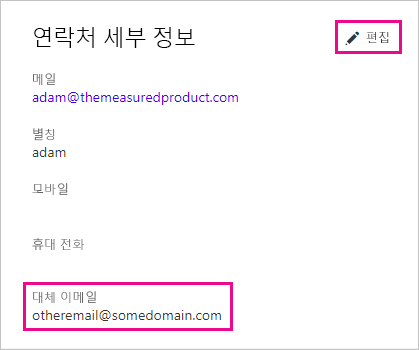

# <a name="use-an-alternate-email-address"></a>대체 전자 메일 주소를 사용 합니다.

Power BI에 가입할 때 메일 주소를 제공합니다. 기본적으로 Power BI는 이 주소를 사용하여 서비스의 활동에 대한 업데이트를 보냅니다. 예를 들어 누군가 공유 초대를 보내면 이 주소로 전달됩니다.

필요한 경우 가입할 때 사용한 메일이 아닌 대체 메일 주소로 이러한 메일을 전달할 수 있습니다. 이 문서에서는 Office 365 및 PowerShell에서 대체 주소를 지정하는 방법을 설명합니다. 또한 문서는 Azure Active Directory (Azure AD) 전자 메일 주소를 확인 하는 방법을 설명 합니다.

> [!NOTE]
> 대체 주소를 지정해도 Power BI에서 서비스 업데이트, 뉴스레터 및 기타 프로모션 정보에 사용하는 전자 메일 주소에는 영향이 없습니다. 이러한 통신은 항상 Power BI에 등록할 때 사용한 전자 메일 주소로 전송됩니다.

## <a name="use-office-365"></a>Office 365 사용

Office 365에서 대체 주소를 지정하려면 다음 단계를 수행합니다.

1. [Office 365 개인 정보 페이지](https://portal.office.com/account/#personalinfo)를 엽니다. 앱이 메시지를 표시하면 Power BI에 사용할 전자 메일 주소와 암호를 사용하여 로그인합니다.

1. 왼쪽 메뉴에서 **개인 정보**를 선택합니다.

1. **연락처 세부 정보** 섹션에서 **편집**을 선택합니다.

    세부 정보를 편집할 수 없다면, 이는 Office 365 관리자가 사용자의 전자 메일 주소를 관리한다는 것을 의미합니다. 전자 메일 주소를 업데이트하려면 관리자에게 문의합니다.

    

1. **대체 전자 메일** 필드에서, Office 365가 Power BI 업데이트에 사용할 원하는 전자 메일 주소를 입력합니다.

## <a name="use-powershell"></a>PowerShell 사용

PowerShell에서 대체 주소를 지정하려면 [Set-AzureADUser](/powershell/module/azuread/set-azureaduser/) 명령을 사용합니다.

```powershell
Set-AzureADUser -ObjectId john@contoso.com -OtherMails "otheremail@somedomain.com"
```

## <a name="email-address-resolution-in-azure-ad"></a>Azure AD의 메일 주소 확인

Power BI에 대한 Azure AD 포함 토큰을 캡처하기 위해, 세 가지 유형의 전자 메일 주소 중 하나를 사용할 수 있습니다.

* 사용자의 Azure AD 계정에 연결된 기본 전자 메일 주소

* UPN(UserPrincipalName) 메일 주소

* ‘기타 메일 주소’ 배열 특성

Power BI는 다음 순서에 따라 사용할 메일을 선택합니다.

1. Azure AD 사용자 개체에 메일 특성이 있는 경우, Power BI는 메일 주소에 해당 메일 특성을 사용합니다.

1. UPN 이메일이 **\*.onmicrosoft.com** 도메인 이메일 주소("\@" 기호 다음의 정보)가 *아닌* 경우, Power BI는 이메일 주소에 해당 메일 특성을 사용합니다.

1. Azure AD 사용자 개체의 *기타 전자 메일 주소* 배열 특성이 있는 경우, Power BI는 해당 목록의 첫 번째 전자 메일을 사용합니다(이 특성에 전자 메일 목록이 있을 수 있으므로).

1. 위의 조건이 하나도 없으면 Power BI는 UPN 주소가 사용 됩니다.

궁금한 점이 더 있나요? [Power BI 커뮤니티를 이용하세요.](http://community.powerbi.com/)