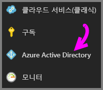
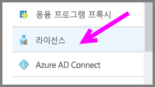
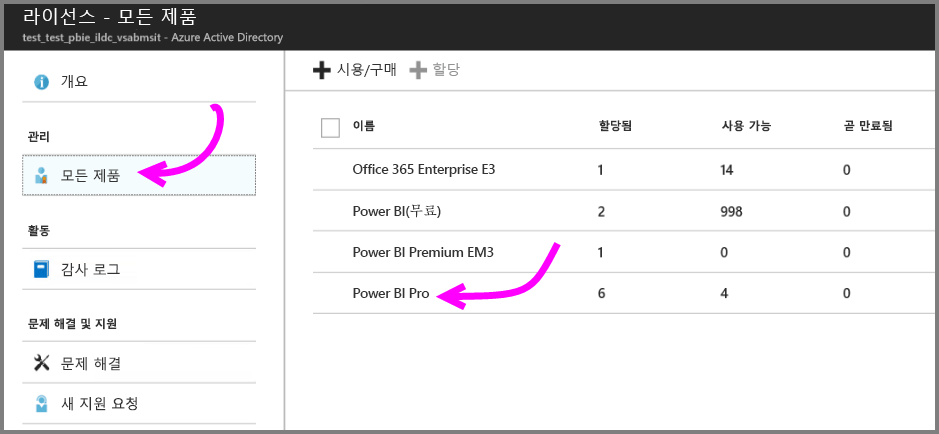
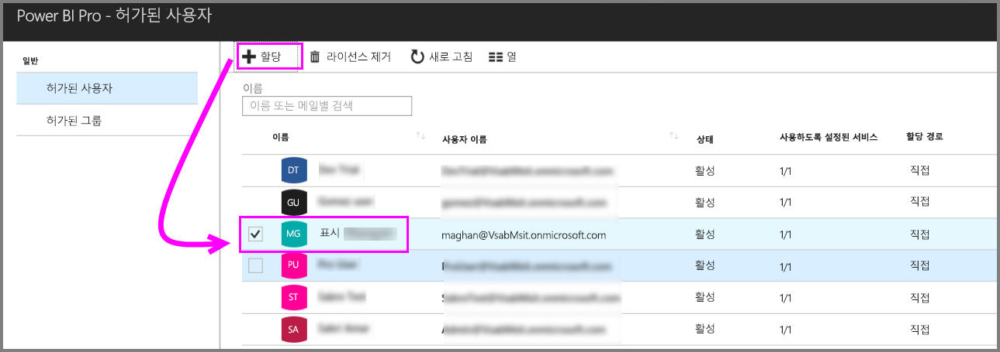

# 빠른 시작: Azure에서 Power BI Pro 라이선스 할당

Power BI Pro는 콘텐츠를 공유하고 다른 Pro 사용자와 공동으로 작업하는 기능을 포함하여 Power BI 서비스의 모든 콘텐츠 및 기능에 액세스할 수 있는 개별 라이선스입니다. Pro 사용자만 앱 작업 영역에서 콘텐츠를 게시 및 사용하고, 대시보드를 공유하고, 대시보드 및 보고서를 구독할 수 있습니다. 이 문서에서는 Azure에서 Power BI Pro 라이선스를 할당하는 방법을 설명합니다. [Office 365에서 라이선스를 할당](service-admin-assigning-power-bi-pro-licenses.md)할 수도 있습니다.

## 필수 조건

Power BI에서 Active Directory 조회에 사용하는 Azure 구독의 소유자여야 합니다.

시작하기 전에 [하나 이상의 라이선스를 구매](service-admin-purchasing-power-bi-pro.md)해야 합니다.

## 개별 사용자 계정에 라이선스 할당

다음 단계를 수행하여 개별 사용자 계정에 Power BI Pro 라이선스를 할당합니다.

1. [Azure Portal](https://ms.portal.azure.com/#@microsoft.onmicrosoft.com/dashboard/private/39bc3cf7-31a4-43f6-954c-f2d69ca2f0)을 엽니다. 

2. 왼쪽 탐색 모음에서 **Azure Active Directory**를 선택합니다.

    

3. **Azure Active Directory** 아래에서 **라이선스**를 선택합니다.

    

4. **라이선스** 아래에서 **모든 제품**을 선택한 다음, **Power BI Pro**를 선택하여 사용이 허가된 사용자 목록을 표시합니다.

    

5. **할당**을 선택하여 Power BI Pro 라이선스를 추가 사용자 계정에 추가합니다.

    

## 다음 단계

이제 라이선스를 할당했으므로 Power BI Pro에 대해 자세히 알아봅니다.

[조직의 Power BI Pro](service-admin-power-bi-pro-in-your-organization.md)

[로그인한 Power BI 사용자 찾기](service-admin-access-usage.md)

궁금한 점이 더 있나요? [Power BI 커뮤니티에 질문합니다.](https://community.powerbi.com/)