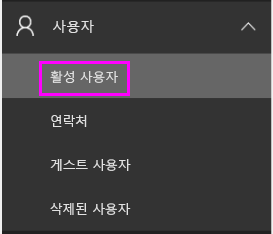
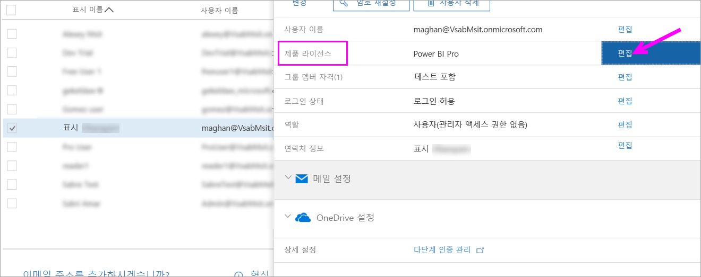
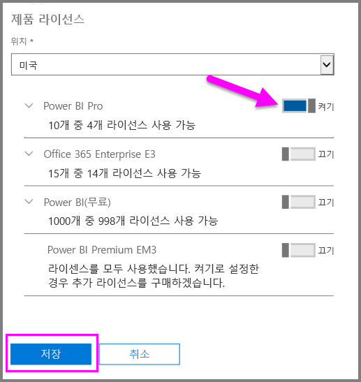
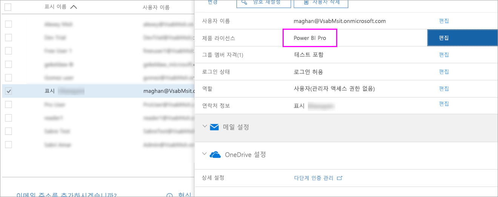

# 빠른 시작: Office 365에서 Power BI Pro 라이선스 할당

Power BI Pro는 콘텐츠를 공유하고 다른 Pro 사용자와 공동으로 작업하는 기능을 포함하여 Power BI 서비스의 모든 콘텐츠 및 기능에 액세스할 수 있는 개별 라이선스입니다. Pro 사용자만 앱 작업 영역에서 콘텐츠를 게시 및 사용하고, 대시보드를 공유하고, 대시보드 및 보고서를 구독할 수 있습니다. 이 문서에서는 Office 365에서 Power BI Pro 라이선스를 할당하는 방법을 설명합니다. [Azure에서 라이선스를 할당](service-admin-assigning-power-bi-pro-licenses-azure.md)할 수도 있습니다.

## 필수 조건

Office 365의 [**전역 관리자** 또는 **사용자 계정 관리자**](https://support.office.com/article/about-office-365-admin-roles-da585eea-f576-4f55-a1e0-87090b6aaa9d?ui=en-US&rs=en-US&ad=US) 역할의 구성원이어야 합니다.

시작하기 전에 [하나 이상의 라이선스를 구매](service-admin-purchasing-power-bi-pro.md)해야 합니다.

## 개별 사용자 계정에 라이선스 할당

다음 단계를 수행하여 개별 사용자 계정에 Power BI Pro 라이선스를 할당합니다.

1. [Office 365 관리 센터](https://portal.office.com/adminportal/home#/homepage)를 엽니다.

2. 왼쪽 탐색 창에서 **사용자**를 확장하고 **활성 사용자**를 선택합니다.

    

3. 사용자를 선택한 다음, **제품 라이선스** 아래에서 **편집**을 선택합니다.

    

4. **Power BI Pro**에서 설정을 **켜기**로 전환한 다음, **저장**을 선택합니다.

    

5. 선택한 계정의 **상태**에서 Power BI Pro 라이선스가 성공적으로 할당되었는지 확인합니다.

    

## 다음 단계

이제 라이선스를 할당했으므로 Power BI Pro에 대해 자세히 알아봅니다.

[조직의 Power BI Pro](service-admin-power-bi-pro-in-your-organization.md)

[로그인한 Power BI 사용자 찾기](service-admin-access-usage.md)

궁금한 점이 더 있나요? [Power BI 커뮤니티에 질문합니다.](https://community.powerbi.com/)