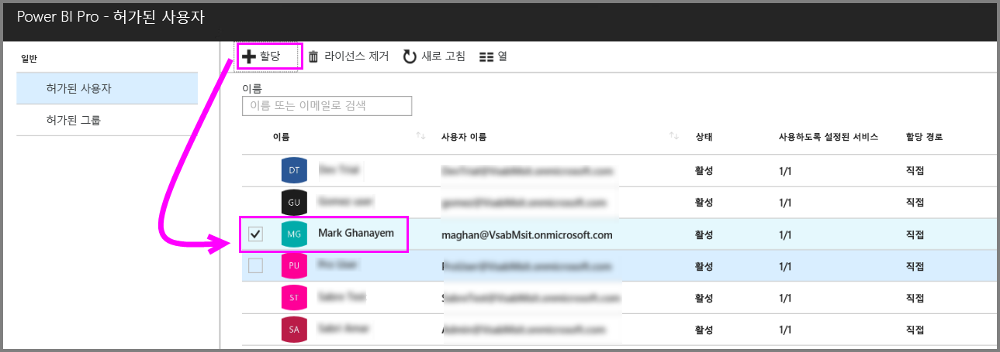
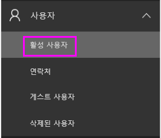
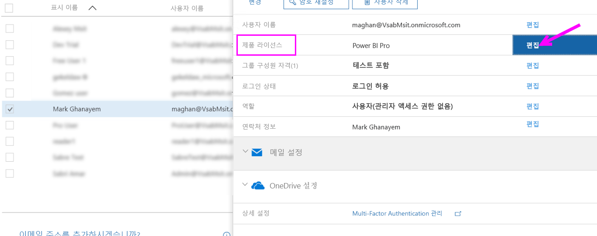
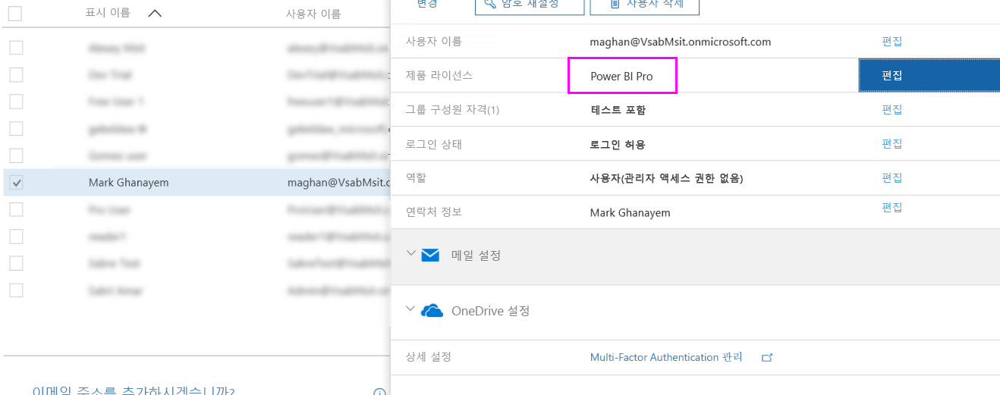

# Power BI Pro 라이선스 할당

관리자는 다양한 관리 포털 및 PowerShell cmdlet을 선택하여 사용자에게 Power BI Pro 라이선스를 할당할 수 있습니다. Power BI 라이선스 관리는 Azure AD(Azure Active Directory)에서 지원됩니다.

* Azure 구독 소유자는 [Azure Portal](https://ms.portal.azure.com/#@microsoft.onmicrosoft.com/dashboard/private/39bc3cf7-31a4-43f6-954c-f2d69ca2f0)에서 Azure Active Directory 블레이드를 사용할 수 있습니다. 

* 전역 관리자 및 사용자 계정 관리자는 [Office 365 관리 센터](https://portal.office.com/AdminPortal/Home#/homepage)를 사용할 수 있습니다.

## Azure Portal에서 Power BI Pro 라이선스 관리

Power BI는 기본 서비스로 Azure AD를 사용합니다. Azure AD는 구입한 제품에 대한 정보 등의 기타 설정을 저장하는 동안 사용자 계정 및 그룹을 저장합니다.

### 개별 사용자 계정에 라이선스 할당

Azure 구독 소유자인 경우 다음과 같은 단계를 수행하여 개별 사용자 계정에 Pro 라이선스를 할당합니다.

1. [Azure Portal](https://ms.portal.azure.com/#@microsoft.onmicrosoft.com/dashboard/private/39bc3cf7-31a4-43f6-954c-f2d69ca2f0)로 이동하세요. 

2. 왼쪽 탐색 모음에서 Azure Active Directory를 클릭합니다.

    

3. Azure Active Directory 블레이드에서 라이선스를 클릭합니다.

    

4. 라이선스 블레이드에서 모든 제품을 클릭한 다음, Power BI Pro를 클릭하여 라이선스가 있는 사용자 목록을 표시합니다.

    

5. 할당을 클릭하여 Power BI Pro 라이선스를 추가 사용자 계정에 추가합니다.

    

> [!NOTE]
> 대부분의 라이선스 측면을 관리할 수 있지만 Azure Portal에서 Power BI Pro 라이선스를 구입할 수 없습니다. Office 365 관리 센터를 사용하여 Power BI Pro 구독을 구입합니다. 자세한 내용은 [Power BI Pro 구매](https://docs.microsoft.com/en-us/power-bi/service-admin-purchasing-power-bi-pro)를 참조하세요.
>

## Office 365 관리 센터에서 Power BI Pro 라이선스 관리

전역 관리자인 경우 Office 365 관리 센터에서 Power BI Pro 구독을 구입하고 조직에 연결된 라이선스를 관리합니다.

Office 365 관리자인 경우 다음과 같은 단계를 수행하여 개별 사용자 계정에 Pro 라이선스를 할당합니다.

1. Office 365 관리 센터로 이동합니다.

2. 왼쪽 탐색 창에서 사용자를 확장하고 활성 사용자를 클릭합니다.

    

3. 하나 또는 여러 사용자를 선택한 다음, 제품 라이선스 편집을 클릭합니다.

    

4. Power BI Pro에서 설정을 켜기로 전환한 다음, 저장을 클릭합니다.

    

5. 상태에서 Power BI Pro 라이선스가 성공적으로 할당된 선택한 계정을 확인합니다.

    

> [!NOTE]
> 구독에 라이선스가 부족한 경우 왼쪽 탐색 창에서 청구를 확장한 다음, 구독을 클릭하여 더 추가합니다. 구독 페이지에서 Power BI Pro 구독을 선택한 다음, 라이선스를 추가/제거를 클릭합니다.
>

## 다음 단계
[조직의 Power BI Pro](service-admin-power-bi-pro-in-your-organization.md)
 
[Extended Pro 평가판 활성화](service-extended-pro-trial.md)
 
[개별 사용자에 대한 Power BI 서비스 규약](https://powerbi.microsoft.com/terms-of-service/)
 
[Power BI 프리미엄 알림](https://aka.ms/pbipremium-announcement)
 
[로그인한 Power BI 사용자 찾기](service-admin-access-usage.md)

궁금한 점이 더 있나요? [Power BI 커뮤니티에 질문합니다.](https://community.powerbi.com/)