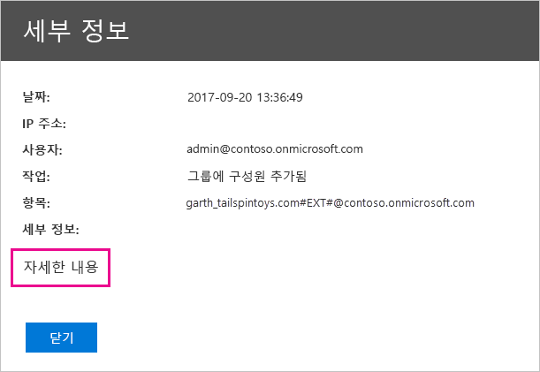

# <a name="use-auditing-within-your-organization"></a>조직 내에서 감사 사용

Power BI 테넌트의 어떤 항목에 누가 무슨 활동을 수행하는지를 아는 것은 조직에서 규정 준수 및 레코드 관리와 같은 요구 사항을 수행하도록 돕는 데 매우 중요합니다. Power BI 감사를 사용하여 “보고서 보기” 및 “대시보드 보기”와 같이 사용자가 수행한 작업을 감사할 수 있습니다. 감사를 사용하여 사용 권한을 감사할 수는 없습니다.

Office 365 보안 및 준수 센터에서 감사하거나 PowerShell을 사용합니다. 감사는 Exchange Online 기능에 의해 수행됩니다. 이 기능은 Power BI를 지원하도록 자동으로 프로비전됩니다.

감사 데이터는 날짜 범위, 사용자, 대시보드, 보고서, 데이터 세트 및 작업 유형에 따라 필터링할 수 있습니다. 활동을 CSV(쉼표로 구분된 값) 파일로 다운로드하여 오프라인에서 분석하도록 할 수도 있습니다.

## <a name="requirements"></a>요구 사항

감사 로그에 액세스하려면 이러한 요구 사항을 충족해야 합니다.

* 감사 로그에 액세스하려면 전역 관리자이거나 Exchange Online에서 감사 로그 또는 보기 전용 감사 로그 역할을 할당받아야 합니다. 기본적으로 준수 관리 및 조직 관리 역할 그룹은 Exchange 관리 센터의 **사용 권한** 페이지에 대해 이러한 역할이 할당됩니다.

    관리자가 아닌 계정에 감사 로그 액세스 권한을 부여하려면 해당 사용자를 이러한 역할 그룹의 구성원으로 추가해야 합니다. 다른 방법으로는 Exchange 관리 센터에서 사용자 지정 역할 그룹을 만들고 이 그룹에 감사 로그 또는 보기 전용 감사 로그 역할을 할당한 다음 액세스 권한이 필요한 계정을 새로 만든 역할 그룹에 추가할 수도 있습니다. 자세한 내용은 [Exchange Online에서 역할 그룹 관리](/Exchange/permissions-exo/role-groups)를 참조하세요.

    Microsoft 365 관리 센터에서 Exchange 관리 센터에 액세스할 수 없는 경우, https://outlook.office365.com/ecp로 이동하고 자격 증명을 사용하여 로그인하세요.

* 감사 로그에 대한 액세스 권한이 있지만 전역 관리자 또는 Power BI 서비스 관리자가 아닌 경우 Power BI 관리 포털에 대한 액세스 권한이 없습니다. 이 경우에는 [Office 365 보안 및 준수 센터](https://sip.protection.office.com/#/unifiedauditlog)로 직접 연결되는 링크를 사용해야 합니다.

## <a name="access-your-audit-logs"></a>감사 로그에 액세스

로그에 액세스하려면 먼저 Power BI에서 로깅을 사용하도록 설정해야 합니다. 자세한 내용은 관리 포털 설명서에서 [감사 로그](service-admin-portal.md#audit-logs)를 참조하세요. 감사를 사용하도록 설정한 시간과 감사 데이터를 볼 수 있는 시간 사이에 최대 48시간까지 지연될 수 있습니다. 데이터가 즉시 표시되지 않으면 나중에 감사 로그를 확인합니다. 감사 로그를 볼 수 있는 권한을 부여받고 나서 로그에 액세스할 때까지 유사하게 지연될 수 있습니다.

Power BI 감사 로그는 [Office 365 보안 및 준수 센터](https://sip.protection.office.com/#/unifiedauditlog)를 통해 직접 사용할 수 있습니다. Power BI 관리 포털의 링크도 있습니다.

1. Power BI에서 오른쪽 위 모서리의 **기어 아이콘**을 선택한 후 **관리 포털**을 선택합니다.

   

1. **감사 로그**를 선택합니다.

1. **O365 관리 센터로 이동**을 선택합니다.

   

## <a name="search-only-power-bi-activities"></a>Power BI 활동만 검색

다음 단계를 수행하여 결과를 Power BI 활동으로만 제한합니다. 활동 목록은 이 문서의 뒷부분에 나오는 [Power BI에서 감사하는 활동](#activities-audited-by-power-bi) 목록을 참조하세요.

1. **감사 로그 검색** 페이지의 **검색** 아래에서 **활동**에 해당하는 드롭다운을 선택합니다.

2. **Power BI 활동**을 선택합니다.

   

3. 선택 상자 밖의 아무 곳이나 선택하여 상자를 닫습니다.

검색은 Power BI 작업만 반환합니다.

## <a name="search-the-audit-logs-by-date"></a>날짜별 감사 로그 검색

**시작 날짜**와 **종료 날짜** 필드를 사용하면 날짜 범위로 로그를 검색할 수 있습니다. 기본 선택은 과거 7일입니다. 날짜 및 시간은 UTC(협정 세계시) 형식으로 표시됩니다. 지정할 수 있는 최대 날짜 범위는 90일입니다. 

선택한 날짜 범위가 90일을 초과하면 오류가 표시됩니다. 최대 날짜 범위인 90일을 사용하는 경우 **시작 날짜**에 현재 시간을 선택합니다. 그렇지 않으면 시작 날짜가 종료 날짜보다 빠르다는 오류가 표시됩니다. 90일이 지나기 전에 감사를 사용하도록 설정하는 경우, 날짜 범위가 감사를 켠 날짜 이전에 시작되도록 설정할 수 없습니다.


## <a name="search-the-audit-logs-by-users"></a>사용자별 감사 로그 검색

특정 사용자가 수행한 활동에 대한 감사 로그 항목을 검색할 수 있습니다. **사용자** 필드에 사용자 이름을 하나 이상 입력합니다. 사용자 이름은 이메일 주소와 비슷합니다. 사용자가 Power BI에 로그인하는 계정입니다. 조직의 모든 사용자(및 서비스 계정)에 대한 항목을 반환하려면 이 상자를 비워둡니다.


## <a name="view-search-results"></a>검색 결과 보기

**검색**을 선택하면 검색 결과가 로드됩니다. 잠시 후 **결과** 아래에 표시됩니다. 검색이 완료되면 찾은 결과 수가 표시됩니다. **감사 로그 검색**은 최대 1,000개 이벤트까지 표시합니다. 1,000개 이상의 이벤트가 검색 조건을 충족하는 경우 앱은 최신 이벤트 1,000개를 표시합니다.

### <a name="view-the-main-results"></a>기본 결과 보기

**결과** 영역에는 검색을 통해 반환된 각 이벤트에 대한 다음과 같은 정보가 포함됩니다. 결과를 정렬하려면 **결과**에서 열 머리글을 선택합니다.

| **열** | **정의** |
| --- | --- |
| 날짜 |이벤트가 발생한 날짜와 시간(UTC 형식)입니다. |
| IP 주소 |기록된 활동에 사용되는 디바이스의 IP 주소입니다. 앱은 IP 주소를 IPv4 또는 IPv6 주소 형식으로 표시합니다. |
| 사용자 |이벤트를 트리거한 작업을 수행한 사용자(또는 서비스 계정)입니다. |
| 활동 |사용자가 수행한 활동입니다. 이 값은 **활동** 드롭다운 목록에서 선택한 활동과 일치합니다. Exchange 관리자 감사 로그의 이벤트는 이 열의 값이 Exchange cmdlet입니다. |
| 항목 |해당 활동 때문에 생성되거나 수정된 개체입니다. 예를 들어 보거나 수정한 파일 또는 업데이트한 사용자 계정입니다. 일부 활동은 이 열에 값이 없습니다. |
| 세부 정보 |활동에 대한 추가 세부 정보입니다. 마찬가지로, 일부 활동은 이 값이 없습니다. |

### <a name="view-the-details-for-an-event"></a>이벤트에 대한 세부 정보 보기

이벤트에 대한 세부 정보를 보려면 검색 결과 목록에서 이벤트 레코드를 선택합니다. 이벤트 레코드의 상세한 속성이 표함된 **세부 정보** 페이지가 표시됩니다. **세부 정보** 페이지는 이벤트가 발생하는 Office 365 서비스에 따라 속성을 표시합니다.

이러한 세부 정보를 표시하려면 **추가 정보**를 선택합니다. 모든 Power BI 항목에는 RecordType 속성에 대해 20이라는 값이 있습니다. 기타 속성에 대한 자세한 내용은 [감사 로그의 자세한 속성](/office365/securitycompliance/detailed-properties-in-the-office-365-audit-log/)을 참조하세요.

   

## <a name="export-search-results"></a>검색 결과 내보내기

Power BI 감사 로그를 CSV 파일로 내보내려면 다음 단계를 수행합니다.

1. **결과 내보내기**를 선택합니다.

1. **로드된 결과 저장** 또는 **모든 결과 다운로드**를 선택합니다.

    

## <a name="use-powershell-to-search-audit-logs"></a>PowerShell을 사용하여 감사 로그 검색

사용자 로그인에 따른 감사 로그에 액세스하기 위해 PowerShell을 사용할 수도 있습니다. 다음 예제에서는 Exchange Online PowerShell에 접속한 다음 [Search-UnifiedAuditLog](/powershell/module/exchange/policy-and-compliance-audit/search-unifiedauditlog?view=exchange-ps/) 명령을 사용하여 Power BI 감사 로그 항목을 끌어오는 방법을 보여줍니다. 이 스크립트를 실행하려면 [요구 사항](#requirements) 섹션에서 설명하는 것처럼 관리자로부터 적절한 사용 권한을 할당받아야 합니다.

```powershell
Set-ExecutionPolicy RemoteSigned

$UserCredential = Get-Credential

$Session = New-PSSession -ConfigurationName Microsoft.Exchange -ConnectionUri https://outlook.office365.com/powershell-liveid/ -Credential $UserCredential -Authentication Basic -AllowRedirection

Import-PSSession $Session
Search-UnifiedAuditLog -StartDate 9/11/2018 -EndDate 9/15/2018 -RecordType PowerBI -ResultSize 1000 | Format-Table | More
```

## <a name="use-powershell-to-export-audit-logs"></a>PowerShell을 사용하여 감사 로그 내보내기

PowerShell을 사용하여 감사 로그 검색의 결과를 내보낼 수도 있습니다. 다음 예제에서는 [Search-UnifiedAuditLog](/powershell/module/exchange/policy-and-compliance-audit/search-unifiedauditlog?view=exchange-ps/) 명령에서 보내고 [Export-Csv](/powershell/module/microsoft.powershell.utility/export-csv) cmdlet을 사용하여 결과를 내보내는 방법을 보여 줍니다. 이 스크립트를 실행하려면 [요구 사항](#requirements) 섹션에서 설명하는 것처럼 관리자로부터 적절한 사용 권한을 할당받아야 합니다.

```powershell
$UserCredential = Get-Credential

$Session = New-PSSession -ConfigurationName Microsoft.Exchange -ConnectionUri https://outlook.office365.com/powershell-liveid/ -Credential $UserCredential -Authentication Basic -AllowRedirection

Import-PSSession $Session
Search-UnifiedAuditLog -StartDate 9/11/2019 -EndDate 9/15/2019 -RecordType PowerBI -ResultSize 5000 |
Export-Csv -Path "c:\temp\PowerBIAuditLog.csv" -NoTypeInformation

Remove-PSSession $Session
```

Exchange Online에 연결하는 방법에 대한 자세한 내용은 [Exchange Online PowerShell에 연결](/powershell/exchange/exchange-online/connect-to-exchange-online-powershell/connect-to-exchange-online-powershell/)을 참조하세요. 감사 로그와 함께 PowerShell을 사용하는 또 다른 예는 [Using Power BI audit log and PowerShell to assign Power BI Pro licenses](https://powerbi.microsoft.com/blog/using-power-bi-audit-log-and-powershell-to-assign-power-bi-pro-licenses/)(Power BI 감사 로그 및 PowerShell을 사용하여 Power BI Pro 라이선스 할당)를 참조하세요.

## <a name="activities-audited-by-power-bi"></a>Power BI에서 감사하는 활동

Power BI에서 감사하는 활동은 다음과 같습니다.

| 식별 이름                                     | 작업 이름                              | 참고                                  |
|---------------------------------------------------|---------------------------------------------|------------------------------------------|
| Power BI 게이트웨이에 데이터 원본 추가됨             | AddDatasourceToGateway                      |                                          |
| Power BI 폴더 액세스 권한 추가됨                      | AddFolderAccess                             | 현재 사용되지 않음                       |
| Power BI 그룹 구성원 추가됨                      | AddGroupMembers                             |                                          |
| 관리자가 테넌트에 데이터 흐름 스토리지 계정 연결됨 | AdminAttachedDataflowStorageAccountToTenant | 현재 사용되지 않음                       |
| Power BI 데이터 세트 분석됨                         | AnalyzedByExternalApplication               |                                          |
| Power BI 보고서 분석                          | AnalyzeInExcel                              |                                          |
| 데이터 흐름 스토리지 계정 연결됨                 | AttachedDataflowStorageAccount              |                                          |
| 게이트웨이에 바인딩된 Power BI 데이터 세트                | BindToGateway                               |                                          |
| 데이터 흐름 새로 고침 취소됨                        | CancelDataflowRefresh                       |                                          |
| 용량 상태 변경됨                            | ChangeCapacityState                         |                                          |
| 용량 사용자 할당 변경됨                  | UpdateCapacityUsersAssignment               |                                          |
| Power BI 데이터 세트 연결 변경됨              | SetAllConnections                           |                                          |
| Power BI Gateway 관리자 변경됨                   | ChangeGatewayAdministrators                 |                                          |
| Power BI Gateway 데이터 원본 사용자 변경됨        | ChangeGatewayDatasourceUsers                |                                          |
| 조직의 Power BI 콘텐츠 팩 만듦      | CreateOrgApp                                |                                          |
| Power BI 앱 만듦                              | CreateApp                                   |                                          |
| Power BI 대시보드 만듦                        | CreateDashboard                             |                                          |
| Power BI 데이터 흐름 만듦                         | CreateDataflow                              |                                          |
| Power BI 데이터 세트 만듦                          | CreateDataset                               |                                          |
| Power BI 이메일 구독 만듦               | CreateEmailSubscription                     |                                          |
| Power BI 폴더 만듦                           | CreateFolder                                |                                          |
| Power BI Gateway 만들어짐                          | CreateGateway                               |                                          |
| Power BI 그룹 만듦                            | CreateGroup                                 |                                          |
| Power BI 보고서 만듦                           | CreateReport                                |                                          |
| 외부 스토리지 계정으로 데이터 흐름 마이그레이션     | DataflowMigratedToExternalStorageAccount    | 현재 사용되지 않음                       |
| 데이터 흐름 사용 권한 추가됨                        | DataflowPermissionsAdded                    | 현재 사용되지 않음                       |
| 데이터 흐름 사용 권한 제거됨                      | DataflowPermissionsRemoved                  | 현재 사용되지 않음                       |
| 조직의 Power BI 콘텐츠 팩 삭제됨      | DeleteOrgApp                                |                                          |
| Power BI 주석 삭제됨                          | DeleteComment                               |                                          |
| Power BI 대시보드 삭제됨                        | DeleteDashboard                             | 현재 사용되지 않음                       |
| Power BI 데이터 흐름 삭제됨                         | DeleteDataflow                              | 현재 사용되지 않음                       |
| Power BI 데이터 세트 삭제됨                          | DeleteDataset                               |                                          |
| Power BI 이메일 구독 삭제됨               | DeleteEmailSubscription                     |                                          |
| Power BI 폴더 삭제됨                           | DeleteFolder                                |                                          |
| Power BI 폴더 액세스 권한 삭제됨                    | DeleteFolderAccess                          | 현재 사용되지 않음                       |
| Power BI Gateway 삭제됨                          | DeleteGateway                               |                                          |
| Power BI 그룹 삭제됨                            | DeleteGroup                                 |                                          |
| Power BI 보고서 삭제됨                           | DeleteReport                                |                                          |
| 검색된 Power BI 데이터 세트의 데이터 원본          | GetDatasources                              |                                          |
| 다운로드한 Power BI 보고서                        | DownloadReport                              |                                          |
| 데이터 흐름 속성 편집됨                        | EditDataflowProperties                      |                                          |
| Power BI 인증 권한 편집됨          | EditCertificationPermission                 | 현재 사용되지 않음                       |
| Power BI 대시보드 편집됨                         | EditDashboard                               | 현재 사용되지 않음                       |
| Power BI 데이터 세트 편집됨                           | EditDataset                                 |                                          |
| Power BI 데이터 세트 속성 편집됨                | EditDatasetProperties                       | 현재 사용되지 않음                       |
| 새 Power BI 보고서 편집됨                            | EditReport                                  |                                          |
| Power BI 데이터 흐름 내보냄                        | ExportDataflow                              |                                          |
| Power BI 보고서 시각적 데이터 내보냄              | ExportReport                                |                                          |
| Power BI 데이터 타일 데이터 내보냄                       | ExportTile                                  |                                          |
| 데이터 흐름 사용 권한을 추가하지 못함                | FailedToAddDataflowPermissions              | 현재 사용되지 않음                       |
| 데이터 흐름 사용 권한을 제거하지 못함             | FailedToRemoveDataflowPermissions           | 현재 사용되지 않음                       |
| Power BI 데이터 흐름 SAS 토큰 생성됨             | GenerateDataflowSasToken                    |                                          |
| Power BI Embed 토큰 생성됨                    | GenerateEmbedToken                          |                                          |
| Power BI로 파일 가져옴                         | 가져오기                                      |                                          |
| Power BI 앱 설치됨                            | InstallApp                                  |                                          |
| 용량에 작업 영역 마이그레이션됨                  | MigrateWorkspaceIntoCapacity                |                                          |
| Power BI 주석 게시됨                           | PostComment                                 |                                          |
| Power BI 대시보드 인쇄됨                        | PrintDashboard                              |                                          |
| Power BI 보고서 페이지 인쇄됨                      | PrintReport                                 |                                          |
| 웹에 Power BI 보고서 게시됨                  | PublishToWebReport                          |                                          |
| Key Vault에서 Power BI 데이터 흐름 비밀 수신됨  | ReceiveDataflowSecretFromKeyVault           |                                          |
| Power BI Gateway에서 데이터 원본 제거됨         | RemoveDatasourceFromGateway                 |                                          |
| Power BI 그룹 구성원 제거됨                    | DeleteGroupMembers                          |                                          |
| 용량에서 작업 영역 제거됨                 | RemoveWorkspacesFromCapacity                |                                          |
| Power BI 대시보드 이름 바꿈                        | RenameDashboard                             |                                          |
| 요청된 Power BI 데이터 흐름 새로 고침               | RequestDataflowRefresh                      | 현재 사용되지 않음                       |
| 요청된 Power BI 데이터 세트 새로 고침                | RefreshDataset                              |                                          |
| 검색된 Power BI 작업 영역                     | GetWorkspaces                               |                                          |
| 작업 영역의 데이터 흐름 스토리지 위치 설정됨     | SetDataflowStorageLocationForWorkspace      |                                          |
| Power BI 데이터 흐름에서 예약된 새로 고침 설정        | SetScheduledRefreshOnDataflow               |                                          |
| Power BI 데이터 세트에서 예약된 새로 고침 설정         | SetScheduledRefresh                         |                                          |
| Power BI 대시보드 공유                         | ShareDashboard                              |                                          |
| Power BI 보고서 공유                            | ShareReport                                 |                                          |
| Power BI 평가판 확장 시작됨                   | OptInForExtendedProTrial                    | 현재 사용되지 않음                       |
| Power BI 평가판 시작됨                            | OptInForProTrial                            |                                          |
| Power BI 데이터 원본 인계됨                   | TakeOverDatasource                          |                                          |
| Power BI 데이터 세트 인계됨                        | TakeOverDataset                             |                                          |
| Power BI 데이터 흐름 인수됨                     | TookOverDataflow                             |                                          |
| Power BI 앱 게시 취소됨                          | UnpublishApp                                |                                          |
| 용량 리소스 거버넌스 설정 업데이트      | UpdateCapacityResourceGovernanceSettings    | 현재 Microsoft 365 관리 센터에 없음 |
| 용량 관리자 업데이트됨                            | UpdateCapacityAdmins                        |                                          |
| 용량 표시 이름 업데이트됨                     | UpdateCapacityDisplayName                   |                                          |
| 데이터 흐름 스토리지 할당 권한 업데이트됨   | UpdatedDataflowStorageAssignmentPermissions |                                          |
| 조직의 Power BI 설정 업데이트됨          | UpdatedAdminFeatureSwitch                   |                                          |
| Power BI 앱 업데이트됨                              | UpdateApp                                   |                                          |
| Power BI 데이터 흐름 업데이트됨                         | UpdateDataflow                              |                                          |
| Power BI 데이터 세트의 데이터 원본 업데이트됨             | UpdateDatasources                           |                                          |
| Power BI 데이터 세트 매개 변수 업데이트됨               | UpdateDatasetParameters                     |                                          |
| Power BI 이메일 구독 업데이트됨               | UpdateEmailSubscription                     |                                          |
| Power BI 폴더 업데이트됨                           | UpdateFolder                                |                                          |
| Power BI 폴더 액세스 권한 업데이트됨                    | UpdateFolderAccess                          |                                          |
| Power BI 게이트웨이 데이터 원본 자격 증명 업데이트됨  | UpdateDatasourceCredentials                 |                                          |
| Power BI 대시보드 표시됨                         | ViewDashboard                               |                                          |
| Power BI 데이터 흐름 표시됨                          | ViewDataflow                                |                                          |
| Power BI 보고서 표시됨                            | ViewReport                                  |                                          |
| Power BI 타일 표시됨                              | ViewTile                                    |                                          |
| Power BI 사용 메트릭 표시됨                     | ViewUsageMetrics                            |                                          |
|                                                   |                                             |                                          |

## <a name="next-steps"></a>다음 단계

[Power BI 관리란?](service-admin-administering-power-bi-in-your-organization.md)  

[Power BI 관리 포털](service-admin-portal.md)  

궁금한 점이 더 있나요? [Power BI 커뮤니티에 질문합니다.](http://community.powerbi.com/)
