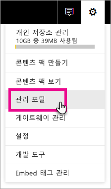
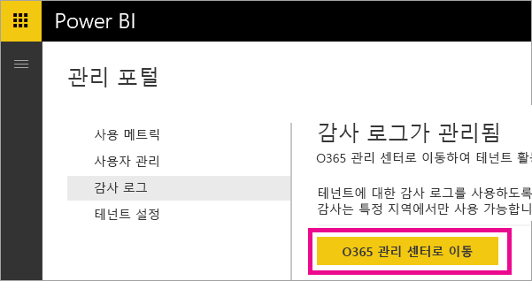
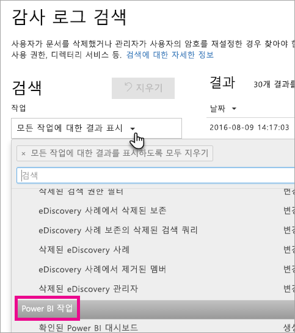
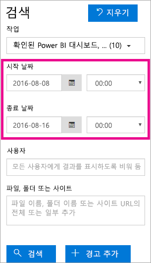
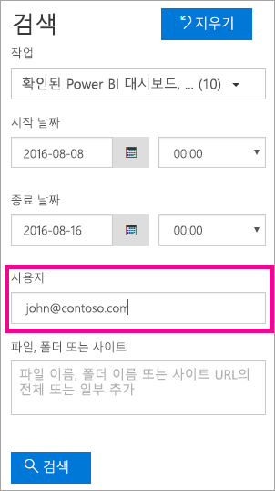

# <a name="using-auditing-within-your-organization"></a>조직 내에서 감사 사용

Power BI를 통한 감사 기능을 사용하여 수행된 작업을 모니터링하고 조사하는 방법에 대해 알아보세요. 보안 및 규정 준수 센터를 사용하거나 PowerShell을 사용할 수 있습니다.

Power BI 테넌트의 어떤 항목에 누가 무슨 활동을 수행하는지를 아는 것은 조직에서 규정 준수 및 레코드 관리와 같은 요구 사항을 수행하도록 돕는 데 매우 중요합니다.

감사 데이터는 날짜 범위, 사용자, 대시보드, 보고서, 데이터 집합 및 작업 유형에 따라 필터링할 수 있습니다. 활동을 CSV(쉼표로 구분된 값) 파일로 다운로드하여 오프라인에서 분석하도록 할 수도 있습니다.

## <a name="requirements"></a>요구 사항
감사 로그에 액세스하려면 이러한 요구 사항을 충족해야 합니다.

- Office 365 Security & Compliance Center의 감사 섹션에 액세스하려면 (Office 365 Enterprise E3 및 E5 구독에 포함된) Exchange Online 라이선스가 있어야 합니다.
- 전역 관리자이거나 감사 로그에 대한 액세스를 제공하는 Exchange 관리자 역할을 맡고 있어야 합니다. 

  Exchange 관리자 역할은 Exchange 관리 센터를 통해 제어됩니다. 자세한 내용은 [Exchange Online에서의 사용 권한](https://technet.microsoft.com/library/jj200692(v=exchg.150).aspx)을 참조하세요.

- 감사 로그에 대한 액세스 권한이 있지만 전역 관리자 또는 Power BI 서비스 관리자가 아닌 경우 Power BI 관리 포털에 대한 액세스 권한이 없습니다. 이 경우 Office 365 Security & Compliance Center에 대한 직접 링크를 사용해야 합니다.

> [!NOTE]
> 테넌트 내에서 Power BI에 대한 감사 로그를 보려면 테넌트 내에 하나 이상의 Exchange 사서함 라이선스가 필요합니다.

## <a name="accessing-your-audit-logs"></a>감사 로그에 액세스

Power BI 로그를 감사하려면 O365 보안 및 규정 준수 센터를 방문해야 합니다.

1. 오른쪽 위에 있는 **기어 아이콘**을 선택합니다.

2. **관리 포털**을 선택합니다.
   
   

3. **감사 로그**를 선택합니다.
 
4. **O365 관리 센터로 이동**을 선택합니다.
   
   

또는 [Office 365 | 보안 및 규정 준수](https://protection.office.com/#/unifiedauditlog)로 이동합니다.

> [!NOTE]
> 관리자가 아닌 계정에 감사 로그에 대한 액세스를 제공하려면 Exchange Online 관리 센터 내에서 사용 권한을 할당해야 합니다. 예를 들어, 조직 관리와 같은 기존 역할 그룹에 사용자를 할당하거나 감사 로그 역할을 가진 새 역할 그룹을 만들 수 있습니다. 자세한 내용은 [Exchange Online에서의 사용 권한](https://technet.microsoft.com/library/jj200692\(v=exchg.150\).aspx)을 참조하세요.

## <a name="search-only-power-bi-activities"></a>Power BI 활동만 검색

다음을 수행하면 결과를 Power BI 활동으로만 제한할 수 있습니다.

1. **Audit log search**(감사 로그 검색) 페이지의 **검색** 아래에서 **활동**에 해당하는 드롭다운을 선택합니다.

2. **PowerBI activities(PowerBI 활동)** 선택합니다.
   
   

3. 선택 상자 밖의 아무 곳이나 선택하여 상자를 닫습니다.

이제 검색이 Power BI 활동으로만 필터링됩니다.

## <a name="search-the-audit-logs-by-date"></a>날짜별 감사 로그 검색

“시작 날짜”와 “종료 날짜” 필드를 사용하면 날짜 범위로 로그를 검색할 수 있습니다. 기본적으로 최근 7일이 선택됩니다. 날짜와 시간은 UTC(협정 세계시) 형식으로 표시됩니다. 지정할 수 있는 최대 날짜 범위는 90일입니다. 선택한 날짜 범위가 90일을 초과하면 오류가 표시됩니다.

> [!NOTE]
> 최대 날짜 범위인 90일을 사용하는 경우 시작 날짜에 현재 시간을 선택합니다. 그렇지 않으면 시작 날짜가 종료 날짜보다 빠르다는 오류가 표시됩니다. 90일이 지나기 전에 감사를 사용하도록 설정하는 경우, 최대 날짜 범위가 감사를 켠 날짜 이전에 시작되도록 설정할 수 없습니다.



## <a name="search-the-audit-logs-by-users"></a>사용자별 감사 로그 검색

특정 사용자가 수행한 활동에 대한 감사 로그 항목을 검색할 수 있습니다. 이를 수행하려면 “사용자” 필드에 사용자 이름을 하나 이상 입력합니다.  이것은 Power BI에 로그인할 때 사용한 사용자 이름을 말합니다. 전자 메일 주소와 유사합니다.
조직의 모든 사용자(및 서비스 계정)에 대한 항목을 반환하려면 이 상자를 비워둡니다.



## <a name="viewing-search-results"></a>검색 결과 보기

검색 단추를 누르면 검색 결과가 로드되고 잠시 후에 결과 아래에 검색 결과가 표시됩니다. 검색이 완료되면 검색된 결과의 개수가 표시됩니다. 

> [!NOTE]
> 최대 1000개의 이벤트가 표시됩니다. 검색 조건을 충족하는 이벤트가 1000개를 넘으면, 최신 이벤트 1000개가 표시됩니다.

결과에는 검색을 통해 반환된 각 이벤트에 대한 다음과 같은 정보가 포함됩니다.

| **열** | **정의** |
| --- | --- |
| 날짜 |이벤트가 발생한 날짜와 시간(UTC 형식)입니다. |
| IP 주소 |활동이 기록될 때 사용된 장치의 IP 주소입니다. IP 주소는 IPv4 또는 IPv6 주소 형식으로 표시됩니다. |
| 사용자 |이벤트를 트리거한 작업을 수행한 사용자(또는 서비스 계정)입니다. |
| 활동 |사용자가 수행한 활동입니다. 이 값은 활동 드롭다운 목록에서 선택한 활동과 일치합니다. Exchange 관리자 감사 로그의 이벤트는 이 열의 값이 Exchange cmdlet입니다. |
| 항목 |해당하는 활동의 결과로 생성되거나 수정된 개체입니다. 예를 들면 보거나 수정한 파일 또는 업데이트된 사용자 계정입니다. 일부 활동은 이 열에 값이 없습니다. |
| 세부 정보 |활동에 대한 추가 세부 정보입니다. 마찬가지로, 일부 활동은 이 값이 없습니다. |

> [!NOTE]
> 결과를 정렬하려면 결과에서 열 머리글을 선택합니다. 결과는 오름차순이나 내림차순으로 정렬할 수 있습니다. 날짜를 오름차순이나 내림차순으로 정렬하려면 날짜 머리글을 클릭합니다.

## <a name="view-the-details-for-an-event"></a>이벤트에 대한 세부 정보 보기

검색 결과 목록에서 이벤트 레코드를 선택하면 이벤트에 대한 세부 정보를 볼 수 있습니다. 이벤트 레코드의 세부 속성을 포함하는 세부 정보 페이지가 표시됩니다. 표시되는 속성은 이벤트가 발생하는 Office 365 서비스에 따라 다릅니다. 추가 세부 정보를 표시하려면 **추가 정보**를 선택합니다.

다음 표는 표시될 수 있는 항목에 대한 자세한 내용을 제공합니다.

| **매개 변수 또는 이벤트** | **설명** | **추가 세부 정보** |
| --- | --- | --- |
| 다운로드한 Power BI 보고서 |이 활동은 보고서가 다운로드될 때마다 기록됩니다. |보고서 이름, 데이터 집합 이름 |
| 보고서 만들기 |이 활동은 새 보고서를 만들 때마다 기록됩니다. |보고서 이름, 데이터 집합 이름 |
| 보고서 편집 |이 활동은 보고서를 편집할 때마다 기록됩니다. |보고서 이름, 데이터 집합 이름 |
| 데이터 집합 만들기 |이 활동은 데이터 집합을 만들 때마다 기록됩니다. |데이터 집합 이름, DataConnectivityMode |
| 데이터 집합 삭제 |이 활동은 데이터 집합을 삭제할 때마다 기록됩니다. |데이터 집합 이름, DataConnectivityMode |
| Power BI 앱 만들기 |이 활동은 Power BI 앱을 만들 때마다 기록됩니다. |앱 이름, 권한, 작업 영역 이름 |
| Power BI 앱 설치 |이 활동은 Power BI 앱을 설치할 때마다 기록됩니다. |앱 이름 |
| Power BI 앱 업데이트 |이 활동은 Power BI 앱을 업데이트할 때마다 기록됩니다. |앱 이름, 권한, 작업 영역 이름 |
| Power BI 평가판 확장 시작됨 |이 활동은 사용자가 2018년 5월 31일까지 실행되는 Pro 확장 평가판을 수락할 때마다 기록됩니다. | |
| Power BI 데이터 집합 분석됨 |이 활동은 Power BI 데이터 집합이 Excel에서 분석될 때마다 기록됩니다. | |
| Power BI Gateway 만들어짐 |이 활동은 새 게이트웨이를 만들 때마다 기록됩니다. |게이트웨이 이름, 게이트웨이 유형 |
| Power BI Gateway 삭제됨 |이 활동은 게이트웨이를 삭제할 때마다 기록됩니다. |게이트웨이 이름, 게이트웨이 유형 |
| Power BI Gateway에 데이터 원본 추가됨 |이 활동은 데이터 원본이 게이트웨이에 추가될 때마다 기록됩니다. |게이트웨이 이름, 게이트웨이 유형, 데이터 원본 이름, 데이터 원본 유형 |
| Power BI Gateway에서 데이터 원본 제거됨 |이 활동은 게이트웨이에서 데이터 원본이 제거될 때마다 기록됩니다. |게이트웨이 이름, 게이트웨이 유형, 데이터 원본 이름, 데이터 원본 유형 |
| Power BI Gateway 관리자 변경됨 |이 활동은 게이트웨이 관리자가 변경(추가/제거)될 때마다 기록됩니다. |게이트웨이 이름, 사용자 추가됨, 사용자 제거됨 |
| Power BI Gateway 데이터 원본 사용자 변경됨 |이 활동은 게이트웨이 사용자가 변경(추가/제거)될 때마다 기록됩니다. |게이트웨이 이름, 사용자 추가됨, 사용자 제거됨 |
| SetScheduledRefresh |이 활동은 데이터 집합에 새 새로 고침이 예약될 때마다 기록됩니다. |데이터 집합 이름, 새로 고침 빈도(분) |

## <a name="using-powershell-to-search"></a>PowerShell을 사용하여 검색

사용자 로그인에 따른 감사 로그에 액세스하기 위해 PowerShell을 사용할 수 있습니다. 이 작업은 Exchange Online에 액세스하여 수행됩니다. 여기에 Power BI 감사 로그 항목을 가져오는 명령의 예가 나와 있습니다.

> [!NOTE]
> New-PSSession 명령을 사용하기 위해 계정에는 할당된 Exchange Online 라이선스가 있어야 하며 테넌트에 대한 감사 로그에 액세스할 수 있어야 합니다.

```
Set-ExecutionPolicy RemoteSigned

$UserCredential = Get-Credential

$Session = New-PSSession -ConfigurationName Microsoft.Exchange -ConnectionUri https://outlook.office365.com/powershell-liveid/ -Credential $UserCredential -Authentication Basic -AllowRedirection

Import-PSSession $Session
Search-UnifiedAuditLog -StartDate 9/11/2016 -EndDate 9/15/2016 -RecordType PowerBI -ResultSize 1000 | Format-Table | More
```

Exchange Online에 연결하는 방법에 대한 자세한 내용은 [Exchange Online PowerShell에 연결](https://technet.microsoft.com/library/jj984289\(v=exchg.160\).aspx)을 참조하세요.

Search-UnifiedAuditLog 명령의 매개 변수 및 사용에 대한 자세한 내용은 [Search-UnifiedAuditLog](https://technet.microsoft.com/library/mt238501\(v=exchg.160\).aspx)를 참조하세요.

PowerShell을 사용하여 감사 로그를 검색하고 항목을 기반으로 Power BI Pro 라이선스를 할당하는 예제를 보려면 [Power BI 감사 로그 및 PowerShell을 사용하여 Power BI Pro 라이선스 할당](https://powerbi.microsoft.com/blog/using-power-bi-audit-log-and-powershell-to-assign-power-bi-pro-licenses/)을 참조하세요.

## <a name="export-the-power-bi-audit-log"></a>Power BI 감사 로그 내보내기

Power BI 감사 로그를 csv 파일로 내보낼 수 있습니다.Power BI 감사 로그를 csv 파일로 내보낼 수 있습니다.

1. **결과 내보내기**를 선택합니다.

2. **Save loaded results**(로드된 결과 저장) 또는 **Download all results**(모든 결과 다운로드)를 선택합니다.
   
   

## <a name="record-and-user-types"></a>레코드 및 사용자 레코드

감사 로그 항목에는 항목에 대한 세부 정보의 일부로 RecordType과 UserType이 생깁니다. 모든 Power BI 항목에는 20개의 RecordType이 생깁니다.

전체 목록은 [Office 365 감사 로그의 세부 속성](https://support.office.com/article/Detailed-properties-in-the-Office-365-audit-log-ce004100-9e7f-443e-942b-9b04098fcfc3)을 참조하세요.

## <a name="list-of-activities-audited-by-power-bi"></a>Power BI에서 감사되는 활동 목록

| 활동 | 설명 | 추가 세부 정보 |
| --- | --- | --- |
| CreateDashboard |이 활동은 새 대시보드가 만들어질 때마다 기록됩니다. |- 대시보드 이름입니다. |
| EditDashboard |이 활동은 대시보드 이름이 변경될 때마다 기록됩니다. |- 대시보드 이름입니다. |
| DeleteDashboard |이 활동은 대시보드가 삭제될 때마다 기록됩니다. |- 대시보드 이름입니다. |
| PrintDashboard |이 이벤트는 대시보드를 인쇄할 때마다 기록됩니다. |- 대시보드 이름입니다.<br/>- 데이터 집합 이름입니다. |
| ShareDashboard |이 활동은 대시보드가 공유될 때마다 기록됩니다. |- 대시보드 이름입니다.<br/>- 받는 사람 전자 메일입니다.<br/>- 데이터 집합 이름입니다.<br>- 사용 권한을 다시 공유합니다. |
| ViewDashboard |이 활동은 대시보드가 표시될 때마다 기록됩니다. |- 대시보드 이름입니다. |
| ExportTile |이 이벤트는 대시보드 타일에서 데이터를 내보낼 때마다 기록됩니다. |- 타일 이름입니다.<br/>- 데이터 집합 이름입니다. |
| DeleteReport |이 활동은 보고서가 삭제될 때마다 기록됩니다. |- 보고서 이름입니다. |
| ExportReport |이 이벤트는 보고서 타일에서 데이터를 내보낼 때마다 기록됩니다. |- 보고서 이름입니다.<br/>- 데이터 집합 이름입니다. |
| PrintReport |이 이벤트는 보고서를 인쇄할 때마다 기록됩니다. |- 보고서 이름입니다.<br/>- 데이터 집합 이름입니다. |
| PublishToWebReport |이 이벤트는 보고서를 웹에 게시할 때마다 기록됩니다. |- 보고서 이름입니다.<br/>- 데이터 집합 이름입니다. |
| ViewReport |이 활동은 보고서가 표시될 때마다 기록됩니다. |- 보고서 이름입니다. |
| ExploreDataset |이 이벤트는 데이터 집합을 선택하여 탐색할 때마다 기록됩니다. |- 데이터 집합 이름입니다. |
| DeleteDataset |이 이벤트는 데이터 집합을 삭제할 때마다 기록됩니다. |- 데이터 집합 이름입니다. |
| CreateOrgApp |이 활동은 조직 콘텐츠 팩이 만들어질 때마다 기록됩니다. |- 조직 콘텐츠 팩 이름입니다.<br/>- 대시보드 이름입니다.<br/>- 보고서 이름입니다.<br/>- 데이터 집합 이름입니다. |
| CreateGroup |이 활동은 그룹을 만들 때마다 실행됩니다. |- 그룹 이름입니다. |
| AddGroupMembers |이 활동은 Power BI 그룹 작업 영역에 멤버가 추가될 때마다 기록됩니다. |- 그룹 이름입니다.<br/>- 전자 메일 주소입니다. |
| UpdatedAdminFeatureSwitch |이 이벤트는 관리자 기능 스위치가 변경될 때마다 기록됩니다. |- 스위치 이름입니다.<br/>- 새 스위치 상태입니다. |
| OptInForProTrial |이 이벤트는 사용자가 서비스 내에서 Power BI Pro를 선택할 때 기록됩니다. |- 메일 주소 |

## <a name="next-steps"></a>다음 단계

[Power BI 관리 포털](service-admin-portal.md)  
[Power BI 프리미엄이란?](service-premium.md)  
[Power BI Pro 구매](service-admin-purchasing-power-bi-pro.md)  
[Exchange Online에서의 권한](https://technet.microsoft.com/library/jj200692\(v=exchg.150\).aspx)  
[Exchange Online PowerShell에 연결](https://technet.microsoft.com/library/jj984289\(v=exchg.160\).aspx)  
[Search-UnifiedAuditLog](https://technet.microsoft.com/library/mt238501\(v=exchg.160\).aspx)  
[Office 365 감사 로그의 세부 속성](https://support.office.com/article/Detailed-properties-in-the-Office-365-audit-log-ce004100-9e7f-443e-942b-9b04098fcfc3)  

궁금한 점이 더 있나요? [Power BI 커뮤니티에 질문합니다.](http://community.powerbi.com/)