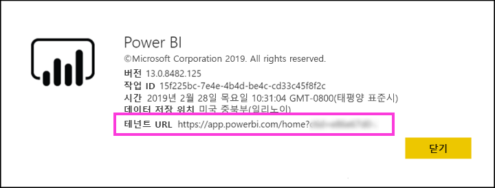

# Azure AD B2B에서 외부 게스트 사용자에게 Power BI 콘텐츠 배포

Power BI는 Azure AD B2B(Azure Active Directory Business-to-business)를 통합하므로 조직 외부의 게스트 사용자에게 Power BI 콘텐츠를 안전하게 배포하고 내부 데이터에 대한 제어를 유지 관리할 수 있습니다.  

또한 조직의 외부 게스트 사용자가 조직의 콘텐츠를 편집하고 관리할 수 있도록 허용할 수 있습니다.

## 액세스 사용

게스트 사용자를 초대하기 전에 Power BI 관리 포털에서 [외부 사용자와 콘텐츠 공유](service-admin-portal.md#export-and-sharing-settings) 기능이 사용하도록 설정되어 있는지 확인합니다.

또한 [외부 게스트 사용자가 조직의 콘텐츠를 편집 및 관리하도록 허용](service-admin-portal.md#export-and-sharing-settings) 기능을 사용하면 조직의 Power BI 탐색을 포함하여 작업 영역에 있는 컨텐츠를 보고 생성할 수 있는 게스트 사용자를 선택할 수 있습니다.

## 누구를 초대할 수 있나요?

gmail.com, outlook.com 및 hotmail.com과 같은 개인 계정을 포함한 메일 주소를 사용하여 게스트 사용자를 초대할 수 있습니다. Azure AD B2B에서 이러한 주소를 ‘소셜 ID’라고 합니다.

## 게스트 사용자 초대 

초대는 외부 게스트 사용자를 조직에 최초로 초대할 때만 필요합니다. 계획 초대 및 임시 초대의 두 가지 방법으로 게스트 사용자를 초대할 수 있습니다.

### 계획 초대

초대할 사용자를 알고 있는 경우 계획 초대를 사용합니다. Azure Portal 또는 PowerShell을 사용하여 초대를 보낼 수 있습니다. 사람을 초대하려면 테넌트 관리자여야 합니다.

Azure Portal에서 초대를 보내려면 다음 단계를 수행합니다.

1. [Azure Portal](https://portal.azure.com)에서 **Azure Active Directory**를 선택합니다.

1. **관리**에서 **사용자** > **모든 사용자** > **새 게스트 사용자**로 이동합니다.

    

1. **메일 주소** 및 **개인 메시지**를 입력합니다.

    

1. **초대**를 선택합니다.

여러 명의 게스트 사용자를 초대하려면 PowerShell을 사용합니다. 자세한 내용은 [Azure AD B2B 협업 코드 및 PowerShell 샘플](/azure/active-directory/b2b/code-samples/)을 참조하세요.

게스트 사용자는 받은 이메일 초대에서 **시작**을 선택해야 합니다. 그러면 게스트 사용자가 테넌트에 추가됩니다.

### 임시 초대

언제든지 초대를 수행하려면 외부 사용자를 대시보드에 추가하거나 공유 UI를 통해 보고하거나 액세스 페이지를 통해 앱을 보고합니다. 다음은 앱을 사용할 외부 사용자를 초대할 때 수행할 작업의 예입니다.

게스트 사용자는 앱이 자신과 공유됨을 알리는 메일을 받게 됩니다.

게스트 사용자가 해당 조직 이메일 주소로 로그인해야 합니다. 로그인 후 초대를 수락하라는 메시지가 표시됩니다. 로그인 후 게스트 사용자가 앱 콘텐츠로 리디렉션됩니다. 앱으로 돌아가려면 링크를 책갈피로 표시하거나, 메일을 저장합니다.

## 라이선싱

게스트 사용자가 공유된 콘텐츠를 보려면 적합한 라이선싱이 있어야 합니다. 적합한 라이선싱을 위한 세 가지 옵션에는 Power BI Premium 사용, Power BI Pro 라이선스 할당 또는 게스트의 Power BI Pro 라이선스 사용이 있습니다.

[외부 게스트 사용자가 조직의 콘텐츠를 편집 및 관리하도록 허용](service-admin-portal.md#export-and-sharing-settings) 기능을 사용하는 경우, 작업 영역에 컨텐츠를 제공하거나 다른 사람들과 컨텐츠를 공유하는 게스트 사용자는 Power BI Pro 라이선스가 필요합니다.

### Power BI Premium 사용

[Power BI Premium 용량](service-premium.md)에 앱 작업 영역을 할당하면 게스트 사용자가 Power BI Pro 라이선스 없이 앱을 사용할 수 있습니다. Power BI Premium에서는 앱이 새로 고침 비율 증대, 전용 용량, 대규모 모델 크기 등과 같은 다른 기능도 활용할 수 있습니다.

### 게스트 사용자에게 Power BI Pro 라이선스 할당

테넌트 안에서 게스트 사용자에게 Power BI Pro 라이선스를 할당하면 게스트 사용자가 테넌트의 콘텐츠를 볼 수 있습니다.

### 게스트 사용자가 자신의 Power BI Pro 라이선스 사용

게스트 사용자에게 이미 테넌트 안에 할당된 Power BI Pro 라이선스가 있습니다.

## 콘텐츠를 편집하고 관리할 수 있는 게스트 사용자 

[외부 게스트 사용자가 조직의 콘텐츠를 편집 및 관리하도록 허용](service-admin-portal.md#export-and-sharing-settings)을 사용하는 경우, 지정된 게스트 사용자는 조직의 Power BI에 액세스하고 권한이 있는 모든 컨텐츠를 볼 수 있습니다. 이들은 홈에 액세스하고, 작업 영역을 검색하고, 액세스 목록에 있는 앱을 설치하고, 작업 영역에 컨텐츠를 제공할 수 있습니다. 또 새로운 작업 영역 환경을 사용하는 작업 영역의 관리자를 만들거나 관리자가 될 수 있습니다. 일부 제한 사항이 적용되며 고려 사항 및 제한 사항 섹션에 나열되어 있습니다.

이러한 사용자가 Power BI에 로그인할 수 있도록 Tenant URL을 제공합니다. 테넌트 URL을 찾으려면 이 단계를 수행합니다.

1. Power BI 서비스의 맨 위 메뉴에서 도움말(**?**)을 선택한 후 **Power BI 정보**를 선택합니다.

2. **테넌트 URL** 옆에 있는 값을 찾습니다. 이는 게스트 사용자와 공유할 수 있는 테넌트 URL입니다.

## 고려 사항 및 제한 사항

* 기본적으로 외부 B2B 게스트는 콘텐츠 소비로만 제한됩니다. 외부 B2B 게스트는 앱, 대시보드, 보고서를 보고, 데이터를 내보내며 대시보드 및 보고서에 대한 전자 메일 구독을 만들 수 있습니다. 작업 영역에 액세스하거나 자신의 콘텐츠를 게시할 수는 없습니다. 그러나 이러한 제한 사항은 [외부 게스트 사용자가 조직의 콘텐츠를 편집 및 관리하도록 허용](service-admin-portal.md#export-and-sharing-settings) 테넌트 설정을 통해 허용된 게스트 사용자에게는 적용되지 않습니다.

* [외부 게스트 사용자가 조직의 콘텐츠를 편집 및 관리하도록 허용](service-admin-portal.md#export-and-sharing-settings) 테넌트 설정을 통해 허용된 게스트 사용자의 경우 일부 환경을 사용할 수 없습니다. 보고서를 업데이트하거나 게시하려면 데이터 가져오기 등의 Power BI 서비스 웹 UI를 사용하여 Power BI Desktop 파일을 업로드해야 합니다.  다음 환경은 지원되지 않습니다.
    * Power BI Desktop에서 Power BI 서비스에 직접 게시
    * 게스트 사용자는 Power BI Desktop를 사용하여 Power BI 서비스의 서비스 데이터 세트에 연결할 수 없습니다.
    * Office 365 그룹에 연결된 클래식 작업 영역: 게스트 사용자는 이들 작업 영역의 관리자를 만들거나 관리자가 될 수 없습니다. 이들은 구성원이 될 수 있습니다.
    * 작업 영역 액세스 목록 임시 초대 전송이 지원되지 않습니다
    * 게스트 사용자에게는 Power BI Publisher for Excel이 지원되지 않습니다
    * 게스트 사용자는 Power BI Gateway를 설치하여 조직에 연결할 수 없습니다
    * 게스트 사용자는 전체 조직에 게시된 앱을 설치할 수 없습니다
    * 게스트 사용자는 조직 컨텐츠 팩을 사용, 생성, 업데이트 또는 설치할 수 없습니다
    * 게스트 사용자는 Excel의 분석을 사용할 수 없습니다
    * 게스트 사용자는 주석에 @mentioned가 될 수 없습니다
    * 게스트 사용자는 구독을 사용할 수 없습니다
    * 이 기능을 사용하는 게스트 사용자는 회사 또는 학교 계정이 있어야 합니다. 개인 계정을 사용하는 게스트 사용자는 로그인 제한으로 인해 더 많은 제한을 받습니다.

* 이 기능은 현재 Power BI SharePoint Online 보고서 웹 파트에 제공되지 않습니다.

* 외부 게스트 사용자가 전체 조직 내에서 수행할 수 있는 작업을 제한하고 Power BI 환경에도 적용되는 Active Directory 설정이 있습니다. 다음 설명서에는 설정에 대해 설명되어 있습니다.
    * [외부 공동 작업 설정 관리](https://docs.microsoft.com/azure/active-directory/b2b/delegate-invitations#control-who-can-invite)
    * [특정 조직의 B2B 사용자 초대 허용 또는 차단](https://docs.microsoft.com/azure/active-directory/b2b/allow-deny-list)  

## 다음 단계

행 수준 보안 작동 방식 등을 포함한 자세한 내용은 다음 백서를 참조하세요. [Azure AD B2B를 사용하여 외부 게스트 사용자에게 Power BI 콘텐츠 배포](https://aka.ms/powerbi-b2b-whitepaper).

Azure AD B2B에 대한 자세한 내용은 [Azure AD B2B 협업이란?](/azure/active-directory/active-directory-b2b-what-is-azure-ad-b2b/)을 참조하세요.
