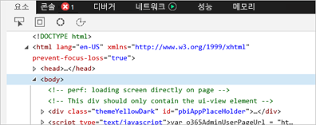
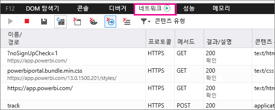
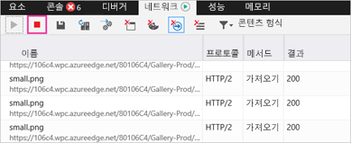
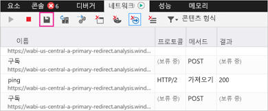

# Power BI에 대한 추가 진단 정보 캡처

이 문서에서는 Power BI 웹 클라이언트에서 추가적인 진단 정보를 수동으로 수집하기 위한 지침을 제공합니다.

1. Microsoft Edge 또는 Internet Explorer를 사용하여 [Power BI](https://app.powerbi.com)로 이동합니다.

1. **F12** 키를 눌러 Microsoft Edge 개발자 도구를 엽니다.

   

1. **네트워크** 탭을 선택합니다. 이미 캡처한 트래픽을 나열합니다.

   

    다음을 할 수 있습니다.

    * 창 내에서 찾아보고 발생할 수 있는 모든 문제를 재현할 수 있습니다.

    * F12 키를 눌러 세션 중 언제든지 개발자 도구 창을 숨기고 표시할 수 있습니다.

1. 세션 프로파일링을 중지하려면 개발자 도구 영역의 **네트워크** 탭에서 빨간색 사각형을 선택할 수 있습니다.

   

1. 디스켓 아이콘을 선택하여 데이터를 HTTP Archive(HAR) 파일로 내보냅니다.

   

1. 파일 이름을 제공하고 HAR 파일을 저장합니다.

    HAR 파일에는 다음을 포함하여 브라우저 창과 Power BI 사이의 네트워크 요청에 대한 모든 정보가 담겨 있습니다.

    * 각 요청의 작업 ID.

    * 각 요청의 정확한 타임스탬프.

    * 클라이언트에 반환되는 오류 정보.

    이 추적에는 화면에 표시되는 시각 효과를 입력하기 위해 사용된 데이터도 포함됩니다.

1. HAR 파일을 제공하여 검토를 지원할 수 있습니다.

궁금한 점이 더 있나요? [Power BI 커뮤니티에 질문합니다.](http://community.powerbi.com/)
