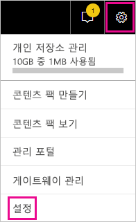
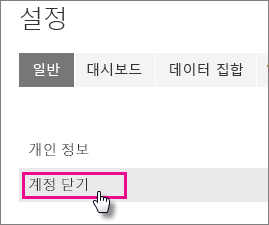
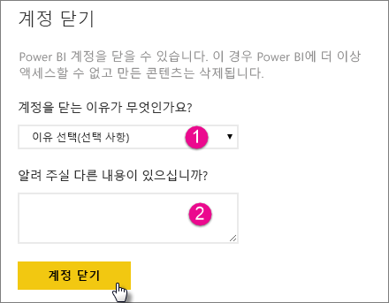
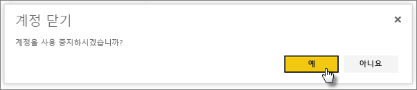
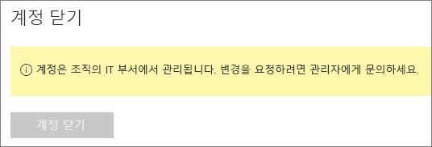

# Power BI 계정 닫기

Power BI를 더 이상 사용하지 않으려면 Power BI 계정을 닫을 수 있습니다.  계정을 닫은 후에는 더 이상 Power BI에 로그인할 수 없습니다. Power BI에서 업로드하거나 만든 모든 고객 데이터는 Power BI 서비스 약관의 데이터 보존 정책에 따라 삭제됩니다.

## 개별 Power BI 사용자

개별적으로 Power BI에 가입하는 경우 **설정** 화면에서 계정을 닫을 수 있습니다.

1. Power BI에서 오른쪽 위의 기어를 선택한 후 **설정**을 선택합니다.

    

1. **일반** 탭에서 **계정 닫기**를 선택합니다.

    

1. 계정을 닫을 이유를 선택합니다(1). 추가 정보를 제공할 수도 있습니다(2). 그런 다음 **계정 닫기**를 선택합니다.

    

1. 계정을 종료할 것인지 확인합니다.

    

    계정이 닫혔다는 확인이 표시됩니다. 필요한 경우 여기에서 계정을 다시 열 수 있습니다.

    

## 관리된 테넌트 사용자

조직이 Power BI에 가입한 경우 테넌트 관리자에게 문의하세요. 계정에서 라이선스를 할당 해제하도록 요청합니다.

궁금한 점이 더 있나요? [Power BI 커뮤니티에 질문합니다.](http://community.powerbi.com/)