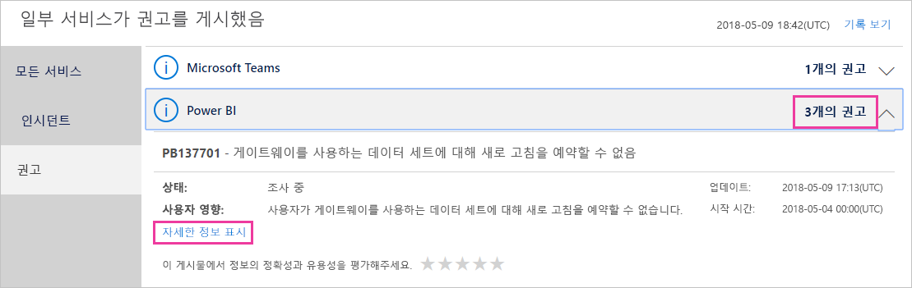
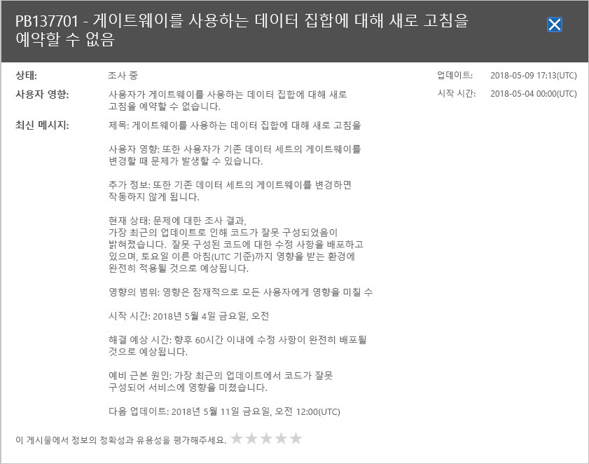

# Office 365에서 Power BI 서비스 상태 추적

Microsoft 365 관리 센터는 서비스 상태에 대한 현재 및 기록 정보를 비롯하여 Power BI 관리자를 위한 중요한 도구를 제공합니다. 이 정보에 액세스하려면 다음 역할 중 하나여야 합니다. Power BI 서비스 관리자 또는 Office 365 전역 관리자. 역할에 대한 자세한 내용은 [Power BI와 관련된 관리자 역할](service-admin-administering-power-bi-in-your-organization.md#administrator-roles-related-to-power-bi)을 참조하세요.

1. [Microsoft 365 관리 센터](https://portal.office.com/adminportal)에 로그인합니다.

1. **서비스 상태** 타일을 선택합니다.

    

1. 현재 목록에서 **N 공지** 또는 **N 인시던트**를 선택하고 결과를 검토합니다. 아래 그래픽에는 세 개의 활성 공지 중 하나가 표시됩니다.

    

1. 자세한 정보를 보려면 항목에 대한 **세부 정보 표시**를 선택합니다. 아래 그래픽에는 최근 상태 업데이트를 포함한 추가 세부 정보가 표시됩니다.

    

    아래로 스크롤하여 추가 정보를 확인한 다음, 완료되면 창을 닫습니다.

1. 모든 서비스에 대한 기록 정보를 보려면 기본 목록의 오른쪽 위에서 **기록 보기**를 선택합니다. 그런 다음, **지난 7일** 또는 **지난 30일**을 선택합니다. 현재 서비스 상태로 돌아가려면 **현재 상태 보기**를 선택합니다.