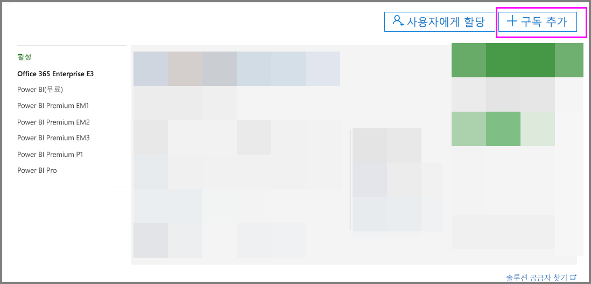
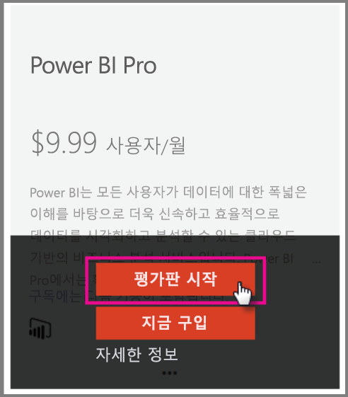
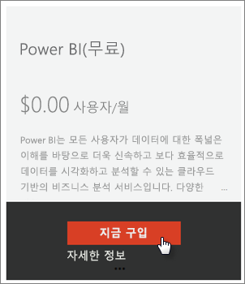
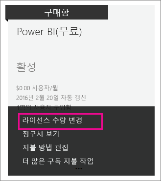
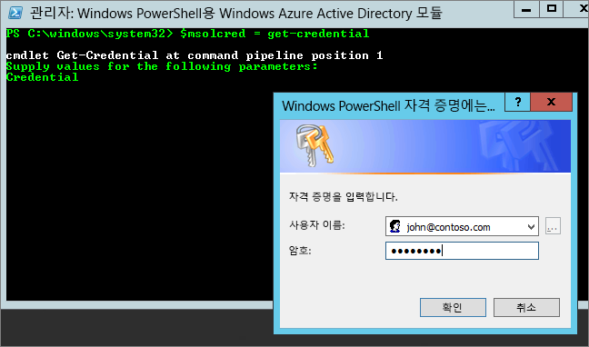

# <a name="power-bi-licensing-in-your-organization"></a>조직의 Power BI 라이선스 부여

[!INCLUDE [license-capabilities](includes/license-capabilities.md)]

이 문서에서는 관리자 관점에서 사용자별 라이선싱에 대해 집중적으로 살펴봅니다.

## <a name="manage-power-bi-pro-licenses"></a>Power BI Pro 라이선스 관리

관리자는 Power BI Pro 라이선스를 구입 및 할당할 수 있으며 조직의 Power BI Pro 평가판에 등록할 수 있습니다. 개인 역시 Power BI Pro 평가판에 등록할 수 있습니다.

### <a name="purchasing-power-bi-pro"></a>Power BI Pro 구매

Power BI Pro 라이선스는 Microsoft Office 365 또는 인증된 Microsoft 파트너를 통해 구매합니다. 라이선스를 구입한 후에는 개별 사용자에게 할당합니다. 자세한 내용은 [Power BI Pro 라이선스 구매 및 할당](service-admin-purchasing-power-bi-pro.md)을 참조하세요.

### <a name="power-bi-pro-trial-for-individuals"></a>개인용 Power BI Pro 평가판

조직 내 개인은 Power BI Pro 평가판에 등록할 수 있습니다. 자세한 내용은 [Power BI에 개인으로 가입](service-self-service-signup-for-power-bi.md)을 참조하세요.

이 제품 내 Power BI Pro 평가판을 사용하는 사용자는 Office 365 관리 포털에서 Power BI Pro 평가판 사용자로 표시되지 않고 Power BI 무료 사용자로 표시됩니다. 그러나 Power BI의 저장소 관리 페이지에는 Power BI Pro 평가판 사용자로 표시됩니다.

### <a name="power-bi-pro-trial-for-organizations"></a>조직용 Power BI Pro 평가판

사용자가 평가판 사용 조건에 개별적으로 동의하지 않고도 Power BI 평가판 라이선스를 획득하여 조직의 여러 사용자에게 배포하려는 경우 조직을 대신해 Power BI Pro 평가판에 등록할 수 있습니다.

등록하기 위한 단계를 수행하기 전에 다음 사항을 유의하세요.

* 등록하려면 Office 365의 [**전역 관리자** 또는 **대금 청구 관리자**](https://support.office.com/article/about-office-365-admin-roles-da585eea-f576-4f55-a1e0-87090b6aaa9d?ui=en-US&rs=en-US&ad=US) 역할의 구성원이어야 합니다.

* 조직 평가판은 테넌트당 1개로 제한됩니다. 이는 이미 다른 사용자가 Power BI Pro 평가판을 테넌트에 적용한 경우에 이 평가판을 다시 구할 수 없다는 것을 의미합니다. 이와 관련하여 도움이 필요한 경우 [Office 365 청구 지원](https://support.office.microsoft.com/article/contact-support-for-business-products-admin-help-32a17ca7-6fa0-4870-8a8d-e25ba4ccfd4b?CorrelationId=552bbf37-214f-4202-80cb-b94240dcd671&ui=en-US&rs=en-US&ad=US)에 문의하세요.

1. [Office 365 관리 센터](https://portal.office.com/adminportal/home#/homepage)로 이동합니다.

1. 왼쪽 탐색 창에서 **청구**, **구독**을 차례로 선택합니다.

   

1. 오른쪽에서 **구독 추가**를 선택합니다.

   

1. **다른 계획**에서 Power BI Pro에 대한 줄임표(**. . .**)를 마우스로 가리키고 **무료 평가판 시작**을 선택합니다.

    

1. 확인 화면에서 **지금 사용해 보기**를 선택합니다.

1. 주문 접수에서 **계속**을 선택합니다.

이제 [Office 365에서 라이선스를 할당](https://support.office.com/article/assign-licenses-to-users-in-office-365-for-business-997596b5-4173-4627-b915-36abac6786dc)할 수 있습니다.

## <a name="manage-power-bi-free-licenses"></a>Power BI 무료 라이선스 관리

조직 내의 사용자는 두 가지 방법으로 Power BI 무료 라이선스에 액세스할 수 있습니다.

* Office 365 관리 포털 내에서 Power BI 라이선스를 할당할 수 있습니다.

* 사용자가 [Power BI Pro 평가판에 등록](service-self-service-signup-for-power-bi.md)하고 평가판이 만료되면 무료 라이선스가 할당됩니다.

### <a name="requesting-and-assigning-free-licenses"></a>무료 라이선스 요청 및 할당

중앙에서 라이선스 요청 및 할당을 관리하려는 경우에는 먼저 무제한 Power BI(무료) 라이선스 차단이 있는지 확인하세요.

라이선스의 이러한 차단은 처음으로 누군가 개별로 Power BI에 가입한 후에 사용할 수 있습니다. 그 과정에서 이 라이선스 차단은 조직과 연결되고 라이선스는 등록하는 사용자에게 할당됩니다.

1. Office 365 관리 센터의 **청구** > **라이선스**에서 **무제한**을 확인합니다.

    

1. 차단을 사용할 수 있는 경우 이제 [Office 365에서 라이선스를 할당](https://support.office.com/article/assign-licenses-to-users-in-office-365-for-business-997596b5-4173-4627-b915-36abac6786dc)할 수 있습니다. 차단을 사용할 수 없는 경우 다음과 같은 두 가지 선택 항목이 있습니다.

    * 조직의 구성원이 개별적으로 등록하도록 합니다. 그러면 무제한 차단이 생성됩니다.

    * 고정된 수의 라이선스를 등록할 수 있는 다음 절차로 진행합니다.

무제한 Power BI(무료) 라이선스 차단을 사용할 수 없고 개별 등록을 하지 않으려면 다음 절차를 수행하세요.

1. [Office 365 관리 센터](https://portal.office.com/admin/default.aspx)로 이동합니다.

1. 왼쪽 탐색 창에서 **청구** > **구독**을 선택

1. 오른쪽에서 **구독 추가 +** 를 선택합니다.

1. **다른 계획**에서 Power BI(무료)에 대한 줄임표(**. . .**)를 마우스로 가리키고 **지금 구매**를 선택합니다.

    

1. 추가하려는 라이선스의 수를 입력하고 **지금 확인** 또는 **카트에 추가**를 선택합니다.

1. 체크 아웃 흐름에서 필요한 정보를 입력합니다.

    이 방법을 사용하면 결제를 위해 신용 카드 정보를 입력하거나 송장 발급을 선택해야 하지만 제품을 구입하지는 않습니다.

1. 이제 [Office 365에서 라이선스를 할당](https://support.office.com/article/assign-licenses-to-users-in-office-365-for-business-997596b5-4173-4627-b915-36abac6786dc)할 수도 있습니다.

1. 나중에 다른 라이선스를 추가하려면 **구독 추가**로 돌아가서 Power BI(무료)에 대해 **라이선스 수량 변경**을 선택할 수 있습니다.

    

### <a name="enable-or-disable-individual-user-sign-up-in-azure-active-directory"></a>Azure Active Directory에서 개인 사용자 등록 사용 또는 사용 안 함

관리자는 AAD(Azure Active Directory)를 통해 개인 사용자 등록을 사용하거나 사용하지 않도록 선택할 수 있습니다. 본 문서의 이 섹션에서는 PowerShell 명령으로 등록을 관리하는 방법을 보여 줍니다. Azure PowerShell에 대한 자세한 내용은 [Azure PowerShell 개요](/powershell/azure/overview)를 참조하세요.

등록을 제어하는 AAD 설정은 **AllowAdHocSubscriptions**입니다. 대부분의 테넌트에서 이는 *true*로 설정되며 이는 사용 가능함을 의미합니다. 파트너를 통해 Power BI를 획득한 경우 *false*로 설정되어 있을 수 있는데, 이는 사용 안 함을 의미합니다. 설정을 *true*에서 *false*로 변경하면 조직의 새 사용자 개별 등록이 차단됩니다. 설정 변경 이전에 Power BI를 등록한 사용자 경우 등록한 라이선스가 유지됩니다.

1. Office 365 자격 증명을 사용하여 Azure Active Directory에 로그인합니다. 다음 PowerShell 스크립트의 첫 번째 행은 사용자 자격 증명을 입력하라는 메시지를 표시합니다. 두 번째 행은 Azure Active Directory에 연결합니다.

    ```powershell
     $msolcred = get-credential
     connect-msolservice -credential $msolcred
    ```

   

1. 로그인하면 다음 명령을 실행하여 테넌트가 현재 구성되어 있는 방법을 확인합니다.

    ```powershell
     Get-MsolCompanyInformation | fl AllowAdHocSubscriptions
    ```
1. 다음 명령을 실행해 **AllowAdHocSubscriptions**를 사용하거나($true) 사용하지 않도록($false) 지정합니다.

    ```powershell
     Set-MsolCompanySettings -AllowAdHocSubscriptions $true
    ```

> [!NOTE]
> AllowAdHocSubscriptions 플래그는 사용자가 Azure 권한 관리 서비스에 등록하는 기능을 비롯하여 조직의 여러 사용자 기능을 제어하기 위해 사용됩니다. 이 플래그를 변경하면 이러한 모든 기능에 영향을 줍니다.

## <a name="next-steps"></a>다음 단계

[Power BI에 대한 셀프 서비스 등록](service-self-service-signup-for-power-bi.md)  

[Power BI Pro 라이선스 구매 및 할당](service-admin-purchasing-power-bi-pro.md)

궁금한 점이 더 있나요? [Power BI 커뮤니티에 질문합니다.](http://community.powerbi.com/)