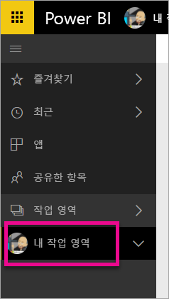
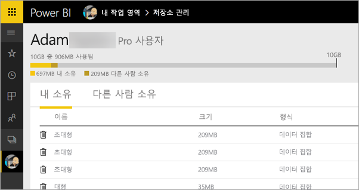
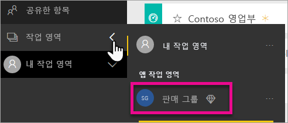
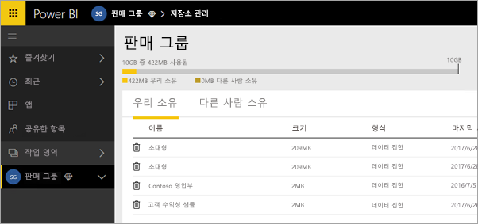
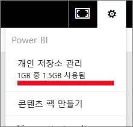
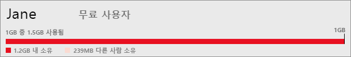

# 데이터 저장소 관리
보고서 및 데이터 집합을 계속 게시할 수 있도록 개인 또는 앱 작업 영역, 데이터 저장소를 관리하는 방법에 대해 알아봅니다.

사용자 및 앱 작업 영역에는 자체 데이터 용량이 있습니다.

* 무료 및 Pro 사용자의 최대 데이터 저장소는 10GB입니다.
* Pro 사용자는 최대 10GB 데이터 저장소로 앱 작업 영역을 만들 수 있습니다.

테넌트 수준에서 테넌트의 모든 Pro 사용자 및 앱 작업 영역에 대해 Pro 사용자 1인당 총 사용량은 10GB를 초과할 수 없습니다.

[Power BI 가격 책정 모델](https://powerbi.microsoft.com/pricing)의 다른 기능에 대해 살펴봅니다.

데이터 저장소에는 자체 데이터 집합 및 Excel 보고서와, 다른 사용자가 공유하는 데이터 집합 및 보고서가 포함되어 있습니다. 데이터 집합은 사용 중인 Excel 통합 문서 및 Power BI Desktop 파일을 포함하여 사용자가 업로드하거나 연결한 데이터 소스 중 하나입니다. 다음 사항도 데이터 용량에 포함됩니다.

* 대시보드에 고정된 Excel 범위
* Power BI 대시보드에 고정된 Reporting Services 온-프레미스 시각화
* 업로드된 이미지

공유하는 대시보드의 크기는 대시보드에 무엇이 고정되어 있느냐에 따라 달라집니다. 예를 들어, 두 가지 다른 데이터 집합의 일부인 두 개의 보고서에 속하는 항목을 고정하면, 크기에 두 개의 데이터 집합이 포함됩니다.

<a name="manage"/>

## 사용자가 소유한 항목 관리
Power BI 계정에서 사용 중인 데이터 저장소의 규모를 확인하고 계정을 관리합니다.

1. 자체 저장소를 관리하려면 왼쪽 탐색 창의 **내 작업 영역**으로 이동합니다.
   
    
2. 오른쪽 상단 모퉁이에서 기어 아이콘  \> **개인 저장소 관리**를 선택합니다.
   
    위쪽 막대는 사용한 저장소 한도의 크기를 보여줍니다.
   
    
   
    데이터 집합 및 보고서는 다음과 같이 두 탭으로 구분됩니다.
   
    **본인이 소유:** Salesforce 및 Dynamics CRM 등과 같은 서비스 데이터 집합을 포함하여 Power BI 계정에 업로드한 보고서와 데이터 집합입니다.  
    **다른 사람 소유:** 다른 사람이 사용자와 공유한 보고서 및 데이터 집합입니다.
3. 데이터 집합 또는 보고서를 삭제하려면 휴지통 아이콘 을 선택합니다.

본인 또는 다른 사용자가 데이터 집합 기반의 보고서 및 대시보드를 보유할 수 있음을 염두에 둡니다. 그런 데이터 집합을 삭제하면 해당 보고서와 대시보드가 더 이상 작동하지 않습니다.

## 앱 작업 영역 관리
1. **작업 영역** \> 옆의 화살표를 선택하고 앱 작업 영업 이름을 선택합니다.
   
    
2. 오른쪽 상단 모퉁이에서 기어 아이콘  \> **그룹 저장소 관리**를 선택합니다.
   
    위쪽 막대는 사용한 그룹 저장소 한도의 크기를 보여줍니다.
   
    
   
    데이터 집합 및 보고서는 다음과 같이 두 탭으로 구분됩니다.
   
    **본인이 소유:** Salesforce 및 Dynamics CRM 등과 같은 서비스 데이터 집합을 포함하여 사용자 또는 누군가가 그룹의 Power BI 계정에 업로드한 보고서와 데이터 집합입니다.
    **다른 사람 소유:** 다른 사람이 그룹과 공유한 보고서 및 데이터 집합입니다.
3. 데이터 집합 또는 보고서를 삭제하려면 휴지통 아이콘 을 선택합니다.
   
   > [!NOTE]
   > 앱 작업 공간의 편집 권한이 있는 모든 멤버에게는 앱 작업 영역에서 데이터 집합과 보고서를 삭제하는 권한이 있습니다.
   > 
   > 

본인 또는 그룹의 누군가가 데이터 집합 기반의 보고서 및 대시보드를 보유할 수 있음을 염두에 둡니다. 그런 데이터 집합을 삭제하면 해당 보고서와 대시보드가 더 이상 작동하지 않습니다.

## 데이터 집합 제한
Power BI로 가져오는 데이터 집합당 1GB 제한이 있습니다. Excel 경험을 유지하기로 선택한 경우 데이터를 가져오는 대신에 데이터 집합에 대해 250MB로 제한됩니다.

## 제한에 도달할 때 발생하는 현상
수행할 수 있는 작업의 데이터 용량 제한에 도달하면 서비스 내에 메시지가 표시됩니다. 

기어 아이콘 을 선택하면 데이터 용량 제한을 초과했다는 것을 나타내는 빨간색 막대가 표시됩니다.

이 내용은 **개인 저장소 관리**안에도 표시됩니다.

 

 제한 중 하나에 도달하게 될 작업을 수행하려는 경우 제한을 초과했다는 것을 나타내는 메시지가 표시됩니다. 저장소 용량을 줄이고 한도를 초과하도록 저장소를 [관리](#manage)할 수 있습니다.

 

 궁금한 점이 더 있나요? [Power BI 커뮤니티에 질문합니다.](http://community.powerbi.com/)

