# Microsoft Intune으로 모바일 앱 구성

Microsoft Intune을 사용하여 조직에서는 디바이스 및 애플리케이션을 관리할 수 있습니다. iOS 및 Android용 Power BI 모바일 애플리케이션은 Intune과 통합됩니다. 이 통합을 통해 디바이스에서 애플리케이션을 관리하고 보안을 제어할 수 있습니다. 구성 정책을 통해 액세스 핀 요구, 애플리케이션에서 데이터가 처리되는 방식, 앱이 사용되고 있지 않을 때 애플리케이션 데이터를 암호화하는 것과 같은 항목을 제어할 수 있습니다.

## 일반 모바일 디바이스 관리 구성

이 문서에서는 Intune이 제대로 구성되어 있고 디바이스가 intune에 등록되었다고 가정합니다. 이 문서는 Microsoft Intune에 대한 전체 구성 가이드로 제공되지는 않았습니다. Intune에 대한 자세한 내용은 [Intune이란?](/intune/introduction-intune/)을 참조하세요.

Microsoft Intune은 Office 365 내에서 MDM(모바일 디바이스 관리)과 공존할 수 있습니다. MDM을 사용하는 경우 디바이스는 MDM 내에 등록된 것으로 표시되지만 Intune 내에서 관리할 수 있습니다.

> [!NOTE]
> Intune을 구성한 후에는 iOS 또는 Android 디바이스에서 Power BI 모바일 앱의 백그라운드 데이터 새로 고침이 꺼집니다. 앱을 시작하면 Power BI에서 웹의 Power BI 서비스로부터 데이터를 새로 고칩니다.

## 1단계: 애플리케이션 URL 가져오기

Intune 내에서 애플리케이션을 만들기 전에 앱의 URL을 가져와야 합니다. iOS의 경우에는 iTunes에서 가져옵니다. Android의 경우 Power BI 모바일 페이지에서 가져올 수 있습니다.

애플리케이션을 만들 때 필요하므로 URL을 저장해 둡니다.

### iOS URL 가져오기

iOS용 앱 URL을 가져오려면 iTunes에서 가져와야 합니다.

1. iTunes를 엽니다.

1. Power BI를 검색합니다. 

1. **iPhone 앱** 및 **iPad 앱** 아래에 **Microsoft Power BI**가 표시되어야 합니다. 어떤 방법을 사용해도 동일한 URL을 얻게 됩니다.

1. **가져오기** 드롭다운을 선택하고 **링크 복사**를 선택합니다.

    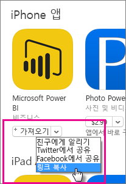

다음과 유사하게 나타납니다. *https://itunes.apple.com/us/app/microsoft-power-bi/id929738808?mt=8*

### Android URL 가져오기

[Power BI 모바일 페이지](https://powerbi.microsoft.com/mobile/)에서 Google Play의 URL을 가져올 수 있습니다. **Google Play에서 다운로드**를 선택하여 앱 페이지로 이동합니다. 브라우저 주소 표시줄에서 URL을 복사할 수 있습니다. 다음과 유사하게 나타납니다. *https://play.google.com/store/apps/details?id=com.microsoft.powerbim*

## 2단계: 모바일 애플리케이션 관리 정책 만들기

모바일 애플리케이션 관리 정책을 사용하면 액세스 핀과 같은 항목을 적용할 수 있습니다. Intune 포털 내에서 정책을 하나 만들 수 있습니다.

애플리케이션을 만들거나 정책을 먼저 만들 수 있습니다. 추가되는 순서는 중요하지 않습니다. 배포 단계를 위해 둘 다 필요합니다.

1. Intune 포털에서 **정책** > **구성 정책**을 선택합니다.

    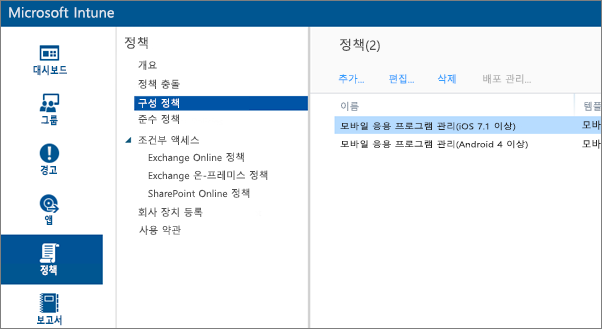

1. **추가...** 를 선택합니다.

1. **소프트웨어**에서 Android 또는 iOS에 대한 모바일 애플리케이션 관리를 선택할 수 있습니다. 빠르게 시작하려면 **권장 설정으로 정책 만들기**를 선택하거나 사용자 지정 정책을 만들 수 있습니다.

1. 정책을 편집하여 애플리케이션에서 원하는 제한 사항을 구성합니다.

## 3단계: 애플리케이션 만들기

애플리케이션은 배포를 위해 Intune에 저장되는 참조 또는 패키지입니다. 애플리케이션을 만들고 Google Play 또는 iTunes에서 가져온 앱 URL을 참조해야 합니다.

애플리케이션을 만들거나 정책을 먼저 만들 수 있습니다. 추가되는 순서는 중요하지 않습니다. 배포 단계를 위해 둘 다 필요합니다.

1. Intune 포털로 이동한 후 왼쪽 메뉴에서 **앱**을 선택합니다.

1. **앱 추가**를 선택합니다. 이렇게 하면 **소프트웨어 추가** 애플리케이션이 시작됩니다.

### iOS용으로 만들기

1. 드롭다운에서 **앱 스토어에서 관리되는 iOS 앱**을 선택합니다.

1. [1단계](#step-1-get-the-url-for-the-application)에서 가져온 앱 URL을 입력하고 **다음**을 선택합니다.

    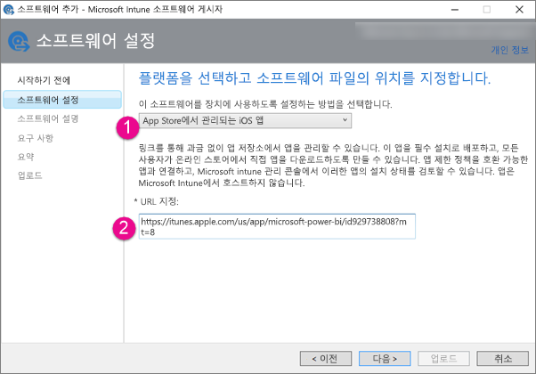

1. **게시자**, **이름** 및 **설명**을 제공합니다. 선택적으로 **아이콘**을 제공할 수도 있습니다. **범주**는 회사 포털 앱에 대한 항목입니다. 완료되면 **다음**을 선택합니다.

1. **모두**(기본값), **iPad** 또는 **iPhone**중에서 어떤 방식으로 게시할지 결정할 수 있습니다. 기본적으로 **모두**가 표시되며 두 디바이스 유형에 모두 작동합니다. Power BI 앱은 iPhone 및 iPad에 둘 다 동일한 URL입니다. **다음**을 선택합니다.

1. **업로드**를 선택합니다.

1. 목록에 앱이 표시되지 않으면 페이지를 새로 고칩니다. **개요**로 이동한 후 **앱**으로 돌아갑니다.

    

### Android용으로 만들기

1. 드롭다운에서 **외부 링크**를 선택합니다.

1. [1단계](#step-1-get-the-url-for-the-application)에서 가져온 앱 URL을 입력하고 **다음**을 선택합니다.

    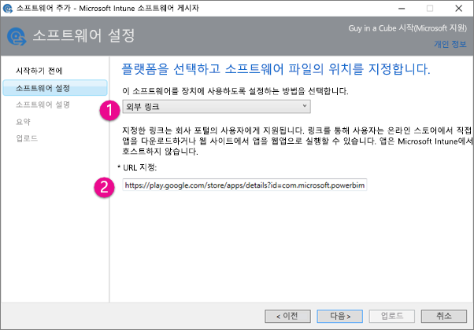

1. **게시자**, **이름** 및 **설명**을 제공합니다. 선택적으로 **아이콘**을 제공할 수도 있습니다. **범주**는 회사 포털 앱에 대한 항목입니다. 완료되면 **다음**을 선택합니다.

1. **업로드**를 선택합니다.

1. 목록에 앱이 표시되지 않으면 페이지를 새로 고칩니다. **개요**로 이동한 후 **앱**으로 돌아갑니다.

    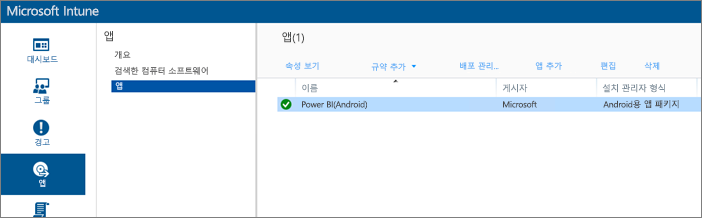

## 4단계: 애플리케이션 배포

애플리케이션을 추가한 후에 최종 사용자가 사용할 수 있도록 배포해야 합니다. 이 단계는 만든 정책을 앱에 바인딩하는 단계입니다.

### iOS용으로 배포

1. 앱 화면에서 만든 앱을 선택합니다. 그런 후 **배포 관리...** 링크를 선택합니다.

    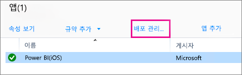

1. **그룹 선택** 화면에서 이 앱을 배포하려는 그룹을 선택할 수 있습니다. **다음**을 선택합니다.

1. **배포 작업** 화면에서 이 앱을 배포하려는 방법을 선택할 수 있습니다. **사용 가능한 설치** 또는 **필수 설치**를 선택하면 사용자가 필요할 때 회사 포털에서 해당 앱을 사용하여 설치할 수 있습니다. 선택이 끝나면 **다음**을 선택합니다.

    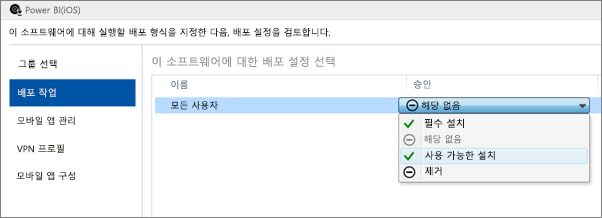

1. **모바일 앱 관리** 화면에서는 [2단계](#step-2-create-a-mobile-application-management-policy)에서 만든 모바일 앱 관리 정책을 선택할 수 있습니다. 만든 정책이 사용 가능한 유일한 iOS 정책인 경우 기본적으로 해당 정책이 선택됩니다. **다음**을 선택합니다.

    

1. **VPN 프로필** 화면에서 조직에 대해 존재하는 정책을 선택할 수 있습니다. 기본값은 **없음**입니다. **다음**을 선택합니다.

1. **모바일 앱 구성** 화면에서 만든 **앱 구성 정책** 이 있는 경우 선택합니다. 기본값은 **없음**입니다. 이 항목은 필수 항목이 아닙니다. **마침**을 선택합니다.

앱이 배포되면 앱 페이지에서 배포에 대해 **예**가 표시됩니다.

### Android용으로 배포

1. 앱 화면에서 만든 앱을 선택합니다. 그런 후 **배포 관리...** 링크를 선택합니다.

    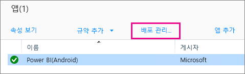
1. **그룹 선택** 화면에서 이 앱을 배포하려는 그룹을 선택할 수 있습니다. **다음**을 선택합니다.

1. **배포 작업** 화면에서 이 앱을 배포하려는 방법을 선택할 수 있습니다. **사용 가능한 설치**또는 **필수 설치**를 선택하면 사용자가 필요할 때 회사 포털에서 해당 앱을 사용하여 설치할 수 있습니다. 선택이 끝나면 **다음**을 선택합니다.

    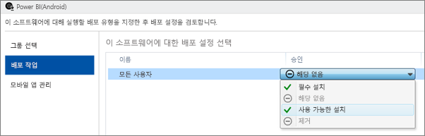

1. **모바일 앱 관리** 화면에서는 [2단계](#step-2-create-a-mobile-application-management-policy)에서 만든 모바일 앱 관리 정책을 선택할 수 있습니다. 만든 정책이 사용 가능한 유일한 Android 정책인 경우 기본적으로 해당 정책이 선택됩니다. **마침**을 선택합니다.

    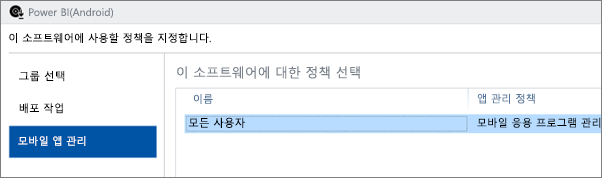

앱이 배포되면 앱 페이지에서 배포에 대해 **예** 가 표시됩니다.

## 5단계: 디바이스에 애플리케이션 설치

‘회사 포털’ 앱을 통해 애플리케이션을 설치합니다.  회사 포털을 설치하지 않은 경우 iOS 또는 Android 플랫폼의 앱 스토어를 통해 가져올 수 있습니다. 조직의 로그인으로 회사 포털에 로그인합니다.

1. 회사 포털 앱을 엽니다.

1. Power BI 앱이 추천 앱으로 표시되지 않으면 **회사 앱**을 선택합니다.

    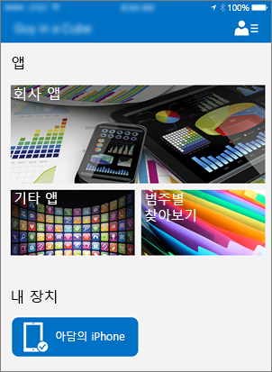

1. 배포한 Power BI 앱을 선택합니다.

    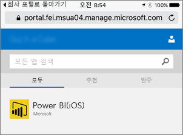

1. **설치**를 선택합니다.

    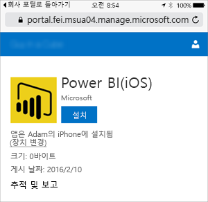

1. iOS에 있는 경우 사용자에게 앱이 푸시됩니다. 푸시 대화 상자에서 **설치**를 선택합니다.

    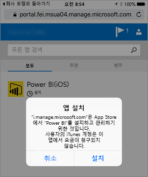

1. 앱이 설치된 후에는 **회사에서 관리함**으로 표시됩니다. 핀을 사용한 액세스를 사용하도록 설정하면 정책에 다음이 표시됩니다.

    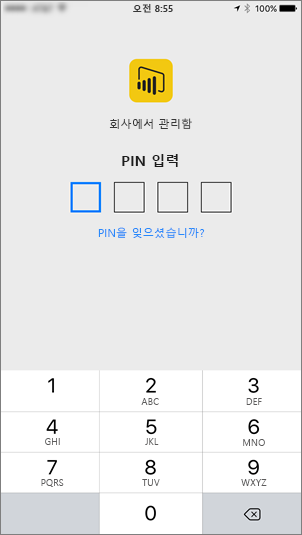

## 다음 단계

[Microsoft Intune 콘솔에서 모바일 애플리케이션 관리 정책 구성 및 배포](/intune/app-protection-policies/)  

[모바일 디바이스용 Power BI 앱](consumer/mobile/mobile-apps-for-mobile-devices.md)  

궁금한 점이 더 있나요? [Power BI 커뮤니티에 질문합니다.](https://community.powerbi.com/)  
