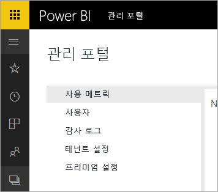

# Office 365용 Power BI는 사용되지 않음
Office 365용 Power BI, 이전 버전의 Power BI는 현재 버전의 [Power BI](https://powerbi.microsoft.com)로 전환되었습니다. **Office 365용 Power BI**를 한 번 사용한 사용자는 Power BI의 현재 버전을 사용할 수 있습니다. [Power BI에 대해 자세히 알아볼 수 있습니다](service-get-started.md).

## 관리 포털
**Office 365용 Power BI** 관리 포털에 대한 액세스를 더 이상 사용할 수 없습니다. 관리자는 새 [관리 포털](https://app.powerbi.com/admin-portal)을 사용하여 조직의 Power BI 구독을 관리할 수 있습니다.

자세한 내용은 [Power BI 관리 포털](service-admin-portal.md)을 참조하세요.

## 다음 단계
[Power BI 시작](service-get-started.md)

[Power BI Desktop 시작](desktop-getting-started.md)

[조직에서 Power BI 관리](service-admin-administering-power-bi-in-your-organization.md)
