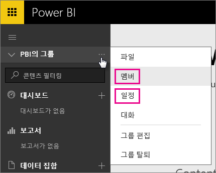
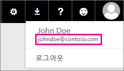

# Office 365 전용 고객 - 알려진 문제
이제 Power BI에서 Office 365 전용 고객을 지원합니다.  O365 전용 고객인 경우 테넌트의 계정으로 로그인하여 Power BI를 사용할 수 있습니다. 현재 두 가지 알려진 문제가 있습니다.

## 그룹
그룹 상황별 메뉴에서 **멤버** 또는 **달력** 을 선택할 경우 대신 메일 앱으로 리디렉션됩니다.  **파일** 및 **대화** 는 예상대로 작동합니다.

## iPhone 앱 - 의미 없는 도메인으로 로그인하면 오류 발생
iPhone 앱에서 로그인할 때 의미 없는 도메인으로 로그인하면 오류가 발생할 수 있습니다.

*로그인 오류*  
*예기치 않은 내부 오류가 발생했습니다. 다시 시도하세요.*

이 문제를 해결하려면 의미 없는 도메인 대신 Power BI 서비스 안에서 사용자 아이콘을 클릭할 때 나열되는 메일 주소를 사용하여 로그인합니다.

궁금한 점이 더 있나요? [Power BI 커뮤니티를 이용하세요.](https://community.powerbi.com/)

