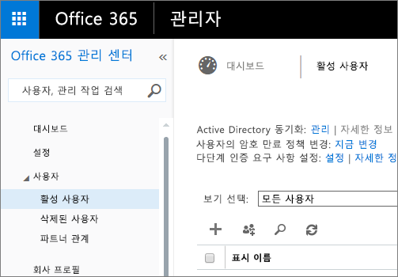

# Power BI 관리 포털

관리 포털을 통해 조직에서 Power BI의 테넌트 관리를 사용할 수 있습니다. 사용 메트릭, Office 365 관리 센터 액세스 및 설정 등과 같은 항목을 포함하고 있습니다.

회사에 대한 Power BI의 테넌트 관리는 Power BI 관리 포털을 통해 수행됩니다. 관리 포털은 Office 365의 전역 관리자이거나 Power BI 서비스 관리자 역할에 할당된 모든 사용자가 액세스할 수 있습니다. Power BI 서비스 관리자 역할에 대한 자세한 내용은 [Power BI 관리자 역할 이해](service-admin-role.md)를 참조하세요.

모든 사용자는 톱니 바퀴형 아이콘에서 **관리자 포털**을 볼 수 있습니다. 관리자가 아닌 경우 **프리미엄 설정** 섹션만 보이고, 관리 권한이 있는 용량만 확인할 수 있습니다.

## 관리 포털에 도달하는 방법

Power BI 관리 포털에 대한 액세스 권한을 얻으려면 계정이 Office 365 또는 Azure Active Directory 내에서 **전역 관리자**로 표시되거나 Power BI 서비스 관리자 역할이 할당되어야 합니다. Power BI 서비스 관리자 역할에 대한 자세한 내용은 [Power BI 관리자 역할 이해](service-admin-role.md)를 참조하세요. Power BI 관리 포털에 도달하려면 다음을 수행합니다.

1. Power BI 서비스의 오른쪽 위에서 설정 기어를 선택합니다.
2. **관리 포털**을 선택합니다.

포털 내에 5개의 탭이 있습니다. 이들을 아래에서 설명합니다.

* [사용 메트릭](#usage-metrics)
* [사용자](#users)
* [감사 로그](#audit-logs)
* [테넌트 설정](#tenant-settings)
* [프리미엄 설정](#premium-settings)
* [embed 태그](#embed-codes)

## 사용 메트릭
관리 포털에서 첫 번째 탭은 **사용 메트릭**입니다. 사용 메트릭 보고서는 조직을 위한 Power BI 내에서 사용을 모니터링하는 기능을 제공합니다. 또한 조직을 위한 Power BI 내에서 가장 활발한 사용자 및 그룹이 누구인지 확인하는 기능을 제공합니다.

> [!NOTE]
> 대시보드에 처음 액세스할 때 또는 대시보드를 오랫동안 보지 않았다가 다시 방문한 후 대시보드를 로드하는 동안 로드 중 화면이 표시될 수 있습니다.

대시보드가 로드된 후 타일 섹션 두 개가 표시됩니다. 첫 번째 섹션은 개별 사용자에 대한 사용량 데이터를 포함하고 있으며 두 번째 섹션은 조직의 그룹에 대해 유사한 정보를 포함하고 있습니다.

다음은 각 타일에 표시되는 내용에 대한 요약입니다.

* 사용자 작업 영역의 모든 대시보드, 보고서 및 데이터 집합에 대한 고유한 개수입니다.
  
    

* 액세스할 수 있는 사용자 수별로 가장 많이 사용한 대시보드입니다. 예를 들어 사용자 3명과 공유하는 대시보드가 있는데 서로 다른 두 사용자가 연결한 콘텐츠 팩에 이를 추가하면 개수는 6 (1 + 3 + 2)가 됩니다
  
    

* 사용자가 연결한 가장 인기 있는 콘텐츠입니다. 사용자가 데이터 가져오기 프로세스를 통해 도달할 수 있는 모든 것, 다시 말해서 SaaS 콘텐츠 팩, 조직 콘텐츠 팩, 파일 또는 데이터베이스가 이에 해당합니다.
  
    

* 직접 만든 대시보드 및 공유하는 대시보드를 모두 포함하여 가지고 있는 대시보드 수를 기반으로 하는 최상위 사용자의 뷰입니다.
  
    

* 가지고 있는 보고서 수를 기반으로 하는 최상위 사용자의 뷰입니다.
  
    

두 번째 섹션은 동일한 유형의 정보를 보여 주지만 그룹을 기반으로 합니다. 이 뷰를 통해 조직에서 가장 활발한 그룹 및 해당 그룹이 사용 중인 정보의 종류를 확인할 수 있습니다.

이 정보를 사용하여 조직의 사용자가 Power BI를 사용하는 방법을 실제로 파악할 수 있으며 조직에서 매우 활발한 사용자 및 그룹을 인식할 수 있습니다.

## 사용자

관리 포털의 두 번째 탭은 **사용자 관리**입니다. Power BI의 경우 사용자 관리는 Office 365 관리 센터에서 수행되므로 이 섹션을 통해 Office 365 내에서 사용자, 관리자 및 그룹을 관리하는 영역에 빨리 도달할 수 있습니다.

**O365 관리 센터로 이동**을 클릭하면 테넌트의 사용자를 관리하는 Office 365 관리 센터 방문 페이지로 직접 이동합니다.

## 감사 로그

관리 포털의 세 번째 탭은 **감사 로그**입니다. 로그는 Office 365 보안 및 규정 준수 센터 내에 위치합니다. 이 섹션에서는 Office 365 내에서 해당 영역에 빠르게 액세스할 수 있습니다. 

감사 로그에 대한 자세한 내용은 [조직에서 Power BI 감사](service-admin-auditing.md)를 참조하세요.

## 테넌트 설정

관리 포털의 세 번째 탭은 **테넌트 설정**입니다. 테넌트 설정을 통해 조직에 사용할 수 있도록 만들어진 기능을 더 잘 제어할 수 있습니다. 중요한 데이터에 대한 우려가 있는 경우 일부 기능은 사용자의 조직에 적합하지 않을 수 있거나 특정 그룹에만 지정된 기능을 사용 가능하도록 할 수 있습니다. 이러한 경우 테넌트를 끌 수 있습니다.

> [!NOTE]
> 설정이 테넌트의 모든 사용자에게 적용되려면 최대 10분까지 걸릴 수 있습니다.

설정은 사용자가 제공한 설정을 기반으로 하는 세 가지 상태가 있을 수 있습니다.

### 전체 조직에 대해 사용하지 않도록 설정

기능을 사용하지 않도록 설정할 수 있으며 그렇게 하면 사용자가 사용할 수 없게 됩니다.

### 전체 조직에 대해 사용하도록 설정

전체 조직에 대해 기능을 사용하도록 설정할 수 있으며 모든 사용자가 해당 기능에 액세스할 수 있습니다.

### 조직의 하위 집합에 대해 사용하도록 설정

또한 조직의 일부에 대해 기능을 사용하도록 설정할 수도 있습니다. 이는 몇 가지 방법으로 발생할 수 있습니다. 특정 사용자 그룹을 제외하고 전체 조직에 대해 사용하도록 설정할 수 있습니다.

또한 특정 사용자 그룹에만 기능을 사용하도록 설정하고 사용자 그룹에 대해 사용하지 않도록 설정할 수도 있습니다. 이 경우 특정 사용자가 허용되는 그룹에 있더라도 해당 기능에 액세스할 수 없게 됩니다.

## 내보내기 및 공유 설정

### 외부 사용자에게 콘텐츠 공유

조직의 사용자는 조직 외부의 사용자와 대시보드를 공유할 수 있습니다.

### 웹에 게시

조직의 사용자는 웹에 보고서를 게시할 수 있습니다. [자세히 알아보기](service-publish-to-web.md)

사용자의 웹 게시 설정에 따라 UI에 여러 옵션이 표시됩니다.

|특정 |전체 조직에 대해 사용 |전체 조직에 대해 사용 안 함 |특정 보안 그룹   |
|---------|---------|---------|---------|
|보고서의 **파일** 메뉴 아래에 있는 **웹 게시**.|모든 사용자에 대해 사용|모든 사용자에게 표시 안 함|권한 있는 사용자 또는 그룹에만 표시.|
|**설정** 아래의 **embed 태그 관리**|모든 사용자에 대해 사용|모든 사용자에 대해 사용|모든 사용자에 대해 사용  권한 있는 사용자 또는 그룹에만 * **삭제** 옵션 제공. 모든 사용자에 대해 * **코드 가져오기** 사용.|
|관리자 포털 내의 **embed 태그**|상태는 다음 중 하나를 반영합니다. * 활성 * 지원되지 않음 * 차단됨|상태가 **사용 안 함**으로 표시됨|상태는 다음 중 하나를 반영합니다. * 활성 * 지원되지 않음 * 차단됨  테넌트 설정에 따라 사용자에게 권한이 없으면 상태가 **침해됨**으로 표시됩니다.|
|게시된 기존 보고서|모두 사용|모두 사용 안 함|보고서가 모든 사용자에 대해 계속 렌더링합니다.|

### 데이터 내보내기

조직의 사용자는 타일 또는 시각화에서 데이터를 내보낼 수 있습니다. [자세히 알아보기](power-bi-visualization-export-data.md)

> [!NOTE]
> **데이터 내보내기**를 사용하지 않도록 설정하면 사용자는 Power BI 서비스 라이브 연결과 함께 **Excel에서 분석** 기능을 사용할 수 없습니다.

### 보고서를 PowerPoint 프레젠테이션으로 내보내기

조직의 사용자는 PowerPoint 파일로 Power BI 보고서를 내보낼 수 있습니다. [자세히 알아보기](service-publish-to-powerpoint.md)

### 대시보드 및 보고서 인쇄

조직의 사용자는 대시보드 및 보고서를 인쇄할 수 있습니다. [자세히 알아보기](service-print.md)

## 콘텐츠 팩 설정

### 조직 전체에 콘텐츠 팩 게시

조직의 사용자는 전체 조직에 콘텐츠 팩을 게시할 수 있습니다.

### 템플릿 조직 콘텐츠 팩 만들기

조직의 사용자는 Power BI Desktop에서 하나의 데이터 원본을 기반으로 하는 데이터 집합을 사용하는 템플릿 콘텐츠 팩을 만들 수 있습니다.

## 통합 설정

### Cortana를 사용하여 데이터에 대한 질문
조직의 사용자는 Cortana를 사용하여 데이터에 대한 질문을 할 수 있습니다.

> [!NOTE]
> 이 설정은 전체 조직에 적용되고 특정 그룹에 제한될 수 없습니다.

### 온-프레미스 데이터 집합을 통해 Excel에서 분석 사용
조직의 사용자는 Excel을 사용하여 온-프레미스 Power BI 데이터 집합을 보고 상호 작용할 수 있습니다. [자세히 알아보기](service-analyze-in-excel.md)

> [!NOTE]
> **데이터 내보내기**를 사용하지 않도록 설정하면 사용자는 **Excel에서 분석** 기능을 사용할 수 없습니다.

### Power BI용 ArcGIS Maps(미리 보기) 사용

조직의 사용자는 Esri에서 제공하는 Power BI용 ArcGIS Maps(미리 보기) 시각화를 사용할 수 있습니다. [자세히 알아보기](power-bi-visualization-arcgis.md)

## R 시각적 개체 설정

### R 시각적 개체와 상호 작용 및 공유

조직의 사용자는 R 스크립트를 사용하여 만든 시각적 개체와 상호 작용하고 공유할 수 있습니다. [자세히 알아보기](service-r-visuals.md)

> [!NOTE]
> 이 설정은 전체 조직에 적용되고 특정 그룹에 제한될 수 없습니다.

## 감사 설정

### 내부 활동 감사 및 규정 준수를 위해 감사 로그 만들기

조직의 사용자는 감사를 사용하여 조직의 다른 사용자가 Power BI에서 수행한 작업을 모니터링할 수 있습니다. [자세히 알아보기](service-admin-auditing.md)

이 설정은 감사 로그 항목이 기록될 수 있도록 활성화되어야 합니다.

> [!NOTE]
> 이 설정은 전체 조직에 적용되고 특정 그룹에 제한될 수 없습니다.

## 대시보드 설정

### 대시보드에 대한 데이터 분류

조직의 사용자는 대시보드 보안 수준을 나타내는 분류로 대시보드를 태그할 수 있습니다. [자세히 알아보기](service-data-classification.md)

> [!NOTE]
> 이 설정은 전체 조직에 적용되고 특정 그룹에 제한될 수 없습니다.

## 개발자 설정

### 앱에 콘텐츠 포함

조직 내 사용자는 Power BI 대시보드 및 보고서를 SaaS(Software as a Service) 응용 프로그램에 포함할 수 있습니다. 이 설정을 사용하지 않도록 설정하면 사용자는 REST API를 사용하여 Power BI 콘텐츠를 해당 응용 프로그램에 포함할 수 없게 됩니다.

## 프리미엄 설정

프리미엄 설정 탭을 사용하면 조직용으로 구매한 모든 Power BI 프리미엄 용량을 관리할 수 있습니다. 조직 내 모든 사용자가 프리미엄 설정 탭을 볼 수 있으나, **용량 관리** 또는 할당 권한이 있는 사용자로 할당된 경우에만 탭 내 콘텐츠를 볼 수 있습니다. 사용자 권한이 없으면 다음과 같은 메시지가 나타납니다.

프리미엄 설정 관리에 관한 자세한 내용은 [Power BI 프리미엄 관리](service-admin-premium-manage.md)를 참조하세요.

## embed 태그

관리자는 테넌트에 대해 생성된 embed 태그를 볼 수 있습니다. 보고서를 살펴보고 embed 태그를 삭제하여 보고서를 해지하는 작업을 수행해야 합니다.

## 다음 단계

[Power BI 관리자 역할 이해](service-admin-role.md)  
[조직에서 Power BI 감사](service-admin-auditing.md)  
[Power BI 프리미엄 관리](service-admin-premium-manage.md)  
[조직에서 Power BI 관리](service-admin-administering-power-bi-in-your-organization.md)  

궁금한 점이 더 있나요? [Power BI 커뮤니티에 질문합니다.](http://community.powerbi.com/)