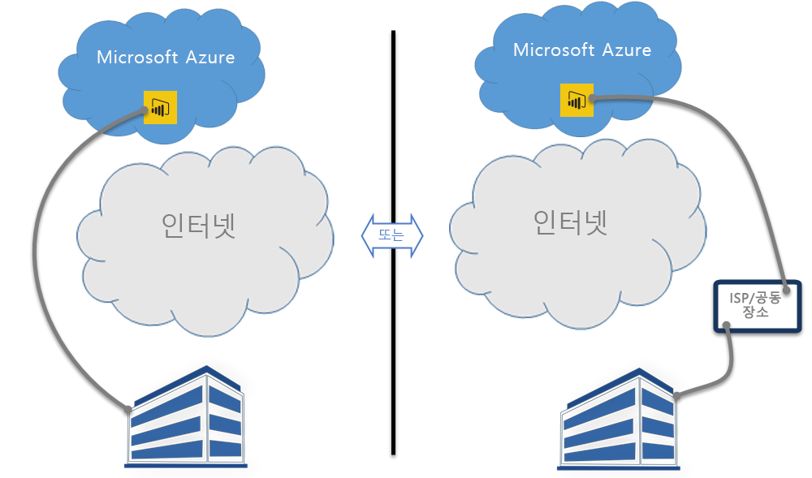

# Power BI 및 ExpressRoute
**Power BI** 및 **ExpressRoute**를 사용하여 조직에서 Power BI에 (또는 ISP의 공동 배치 기능을 사용하여) 네트워크 연결을 만들 수 있으며 이는 인터넷을 우회하여 중요한 Power BI 데이터 및 연결의 보안을 강화합니다.

**ExpressRoute**는 Azure 데이터 센터(Power BI가 위치함)와 온-프레미스 인프라 간의 개인 연결을 만들거나 Azure 데이터 센터와 공동 배치 환경 간에 개인 연결을 만들 수 있게 해주는 Azure 서비스입니다.

[ExpressRoute에 대한 자세한 내용](https://azure.microsoft.com/services/expressroute/)을 가져오거나 [등록하는 방법](https://azure.microsoft.com/pricing/details/expressroute/)을 알아볼 수 있습니다.

> [!NOTE]
> Power BI는 [이 FAQ](https://docs.microsoft.com/azure/expressroute/expressroute-faqs)에 설명된 대로 공용 피어링 모드에서 지원됩니다.
> 
> 

## Power BI ExpressRoute 예외
Power BI는 Power BI가 공용 인터넷을 통해 데이터를 가져오거나 전송하는 몇 가지 예외가 있는 ExpressRoute와 호환됩니다. 이러한 특정 예외에는 대개 **CDN(Content Delivery Network)** 노드와 가장 가까운 위치에서 다운로드된 브라우저 구성 파일과 같은 정적 데이터가 포함됩니다. 모든 Power BI에 적용할 수 있는 몇 가지 광범위한 예외가 있으며 일부의 서비스 또는 기능 관련 예외가 있습니다. 각각은 다음 섹션에서 설명합니다.

### Power BI 및 ExpressRoute에 대한 전체 예외
**Power BI** 및 **ExpressRoute**에 대한 예외는 Power BI 간에 전송되는 데이터가 개인 ExpressRoute 연결을 통해 전송되지 않고 공용 인터넷을 통해 이동한다는 것을 의미합니다.

ExpressRoute를 사용하는 Power BI에 대한 두 가지 전체 예외는 다음과 같습니다.

* **CDN(Content Delivery Network)** 및 웹 사이트에서 다운로드한 정적 파일
* 공용 인터넷을 통해 전송되는 **원격 분석** 데이터

Power BI는 여러 **CDN(Content Delivery Networks)** 또는 웹 사이트를 사용하여 공용 인터넷을 통해 지리적 로케일에 따라 필요한 고정 콘텐츠와 파일을 효율적으로 배포합니다. 이러한 정적 파일은 제품 다운로드(예: 다양한 독립 서비스 공급자로부터의 **Power BI Desktop**, **온-프레미스 데이터 게이트웨이** 또는 **Power BI 콘텐츠 팩**), Power BI를 사용한 후속 연결을 시작하고 설정하는 데 사용되는 브라우저 구성 파일뿐만 아니라 초기 보안 Power BI 로그인 페이지를 포함합니다. 실제 자격 증명은 ExpressRoute를 통해 전송됩니다.   

또한 특정 **원격 분석 데이터**는 공용 인터넷 및 ExpressRoute를 통해 전송됩니다. 원격 분석 데이터에는 사용 통계 및 비슷한 데이터가 포함되며 이는 사용량 및 작업을 모니터링하는 데 사용되는 서비스에 전송됩니다.

### Power BI SaaS 응용 프로그램 및 ExpressRoute
사용자가 Power BI 서비스에 대한 연결을 시작하는 경우(powerbi.com 또는 Cortana를 통해) 브라우저를 Power BI와 연결하고 상호 작용하도록 준비된 Power BI 시작 페이지, 로그인 페이지 및 정적 파일은 CDN 또는 웹 사이트에서 검색되며 이는 공용 인터넷을 통해 연결됩니다.

로그인을 설정하면 공용 인터넷 데이터에 따른 특정 기능과 서비스를 제외한 후속 Power BI 데이터 상호 작용이 ExpressRoute를 통해 발생합니다.

* **시각적 개체 매핑**에는 각각 공용 인터넷을 통해 설정되는 Bing Virtual Earth 서비스 또는 Bing 지오코딩 서비스에 대해 연결 및 데이터 전송이 필요합니다.
* **Cortana**와의 Power BI 통합은 공용 인터넷을 통해 Bing에 액세스해야 합니다.
* 위젯 또는 비디오와 같은 **사용자 지정 링크**를 사용자가 추가한 경우 Power BI는 사용자가 제공한 링크에 따라 데이터를 요청하며 이는 ExpressRoute를 사용할 수도 있습니다.
* 사용자는 사용자 음성 피드백 메커니즘을 통해 텍스트에서 **Power BI에 피드백**(및 필요에 따라 이미지)을 전송할 수 있으며 전송하기 위해 공용 인터넷을 사용합니다.
* **Bing 뉴스 콘텐츠 공급자**는 공용 인터넷을 사용하여 Bing에서 콘텐츠를 다운로드합니다.
* **앱**(예: 콘텐츠 팩)에 연결할 경우 사용자는 종종 SaaS 공급자가 제공하는 페이지를 사용하여 자격 증명 및 설정을 입력해야 합니다. 이러한 페이지는 ExpressRoute를 사용할 수도 있습니다.

| 사용자 작업 | 대상 |
| --- | --- |
| 방문 페이지(로그인 이전) |`maxcdn.bootstrapcdn.com ; ajax.aspnetcdn.com ; netdna.bootstrapcdn.com ; cdn.optimizely.com; google-analytics.com ` |
| 로그인 |`*.mktoresp.com ; *.aadcdn.microsoftonline-p.com ; *.msecnd.com ; *.localytics.com ; ajax.aspnetcdn.com` |
| 대시보드, 보고서, 데이터 집합 관리(지도 및 지오코딩 포함) |`*.localytics.com ; *.virtualearth.net ; platform.bing.com; powerbi.microsoft.com; c.microsoft.com; app.powerbi.com; *.powerbi.com; dc.services.visualstudio.com ` |
| 지원 |`support.powerbi.com ; powerbi.uservoice.com ; go.microsoft.com ` |

### Power BI Desktop 및 ExpressRoute
또한 Power BI Desktop은 다음 목록에서 설명하는 몇 가지 예외로 ExpressRoute와 호환될 수 있습니다.

* 사용자가 Power BI Desktop의 최신 버전을 갖고 있는지 여부를 검색하는 데 사용되는 **업데이트 알림**은 공용 인터넷을 통해 이동합니다.
* 특정 **원격 분석**은 공용 인터넷을 통해 이동합니다.
* **시각적 개체 매핑**에는 각각 공용 인터넷을 통해 설정되는 **Bing Virtual Earth** 서비스 또는 **Bing 지오코딩** 서비스에 대해 연결 및 데이터 전송이 필요합니다.
* 여러 데이터 원본에서 **웹** 또는 타사 SaaS 공급자와 같은 **데이터 가져오기**는 공용 인터넷을 통해 이동합니다.

### Power BI PaaS 및 ExpressRoute
Power BI는 개발자가 사용자 지정된 Power BI 솔루션 및 앱을 만들 수 있는 API 및 다른 플랫폼 기반 기능을 제공합니다. 이 항목의 앞에서 설명한 원격 분석 및 CDN 데이터 외에도 다음 서비스는 공용 인터넷을 통해 Power BI PaaS 데이터를 전송할 때 사용됩니다.

| PaaS 작업 | 사용된 추가 대상 |
| --- | --- |
| 포함된 공용(원격 분석) |`c1.microsoft.com` |
| 사용자 지정 시각적 개체(CDN) |`*.azureedge.net` |

**사용자 지정 시각적 개체**의 일부는 제3자가 만들고 일부는 Microsoft에서 만듭니다. ExpressRoute를 사용할 수도 있습니다.

### Power BI 모바일 및 ExpressRoute
이 문서는 Power BI 모바일 앱의 사용을 다루지 않습니다.  

### 온-프레미스 데이터 게이트웨이 및 ExpressRoute
**온-프레미스 데이터 게이트웨이**가 Power BI와 함께 사용되는 경우 전송은 이 항목의 앞부분에 나오는 **Power BI SaaS 응용 프로그램 및 ExpressRoute** 섹션에서 문서화된 사용자 작업을 제외하고 ExpressRoute와 호환될 수 있습니다.  

