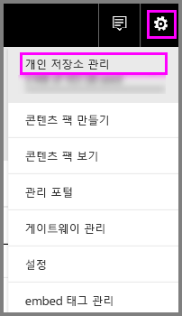
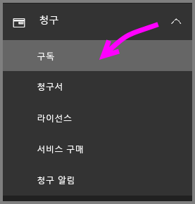
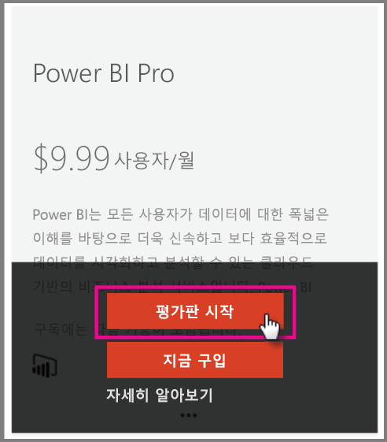

# 조직의 Power BI Pro

Power BI Pro는 더 많은 기능이 있는 유료 라이선스입니다. Power BI Pro 라이선스는 데이터 기반 결정을 하기 위해 다른 사용자와 공유하고 공동 작업하는 팀의 경우 유용합니다.  콘텐츠가 Power BI Premium을 사용하여 전용 용량과 연결되지 않은 경우 각 팀 멤버가 공유 Power BI 콘텐츠를 만들거나 보려면 Pro 라이선스가 필요합니다.

다음과 같은 기능에는 Power BI Pro 라이선스가 필요합니다.

* **Excel 또는 Power BI Desktop에서 데이터 분석** - Excel 또는 Power BI Desktop를 사용하여 Power BI에서 게시된 데이터 집합을 보고 상호 작용합니다. 자세한 내용은 [Excel에서 분석](service-analyze-in-excel.md)을 참조하세요.

* **대시보드 공유 및 작업 영역에서 공동 작업** - Power BI 작업 영역은 대시보드, 보고서 및 데이터 집합에서 동료와 공동 작업을 지원합니다. 자세한 내용은 [Power BI 앱 작업 영역에서 공동 작업](service-collaborate-power-bi-workspace.md)을 참조하세요.

* **공유 콘텐츠 보기** - Pro 사용자는 공유된 대시보드를 보고, 공유된 대시보드 및 보고서와 상호 작용하고, 공유된 대시보드 및 보고서를 다시 공유할 수 있습니다. 그러나 Pro 사용자는 이러한 대시보드 또는 보고서를 편집할 수 없습니다. 자세한 내용은 [동료 및 다른 사용자와 Power BI 대시보드 및 보고서 공유](service-share-dashboards.md)를 참조하세요.

* **Microsoft 팀과 콘텐츠 통합** - MS(Microsoft) 팀 채널에서 Power BI 탭을 추가할 수 있습니다. MS 팀은 작업 영역에서 모든 보고서를 자동으로 검색합니다. 자세한 내용은 [Microsoft 팀과 Power BI 팀 협력](https://powerbi.microsoft.com/en-us/blog/power-bi-teams-up-with-microsoft-teams/)을 참조하세요. 

## Power BI Pro 60일 평가판(개인용)

무료 계정에 등록한 후 필요에 따라 Pro를 무료로 60일 동안 사용해 볼 수 있습니다. 평가판 기간 동안 모든 Pro 기능에 대한 액세스 권한이 있습니다. Power BI Pro는 Power BI 무료 버전의 모든 기능과 추가 공유 및 공동 작업 기능을 제공합니다. 자세한 내용은 [Power BI 가격 책정](https://powerbi.microsoft.com/en-us/pricing/)을 참조하세요. Power BI Pro의 60일 평가판을 사용해 보려면 Power BI에 로그인하고 다음 Power BI Pro 기능 중 하나를 사용해 보세요.

* [작업 영역 만들기](service-create-distribute-apps.md)
* [대시보드 공유](service-share-dashboards.md)

이러한 기능을 사용하고 나면 무료 평가판을 시작하라는 메시지가 표시됩니다. 또한 기어 아이콘을 선택하고 개인 저장소 관리를 선택하여 사용하도록 선택할 수 있습니다. 그런 다음, 오른쪽에서 무료로 Pro 사용해 보기를 선택합니다.

   
    
   

시작 평가판을 선택할 수 있습니다.

   

> [!NOTE]
> 이 제품 내 Power BI Pro 평가판을 사용하는 사용자는 Office 365 관리 포털에서 Power BI Pro 평가판 사용자로 표시되지 않고 Power BI 무료 사용자로 표시됩니다. 그러나 Power BI의 저장소 관리 페이지에는 Power BI Pro 평가판 사용자로 표시됩니다.
>

> [!NOTE]
> 개별 사용자가 평가판 사용 조건에 개별적으로 동의하지 않고도 Power BI 평가판 라이선스를 획득하여 조직의 여러 사용자에게 배포하려는 IT 관리자의 경우 Power BI Pro 구독 평가판에 등록할 수 있습니다. 관리자 평가판에 등록하려면 Office 365 전역 또는 대금 청구 관리자이거나 새 테넌트를 만들어야 합니다. 자세한 내용은 [Power BI Pro 구매](service-admin-purchasing-power-bi-pro.md)를 참조하세요.
>

서비스를 사용하는 경우 기어 아이콘으로 이동하고 개인 저장소 관리를 선택하여 Pro 평가판 계정이 있는지 확인할 수 있습니다.

   

## Office 365에서 구독 평가판

조직에서도 Power BI Pro를 평가판으로 사용할 수 있습니다. 구독하게 되면 사용자에게 Power BI Pro 라이선스를 할당할 수 있습니다. 라이선스를 할당하는 방법에 대한 자세한 내용은 [Office 365에서 사용자에게 라이선스 할당](https://support.office.com/en-us/article/assign-licenses-to-users-in-office-365-for-business-997596b5-4173-4627-b915-36abac6786dc?ui=en-US&rs=en-US&ad=US)을 참조하세요.

> [!NOTE]
> 조직 평가판은 테넌트당 1개로 제한됩니다. 이는 이미 다른 사용자가 Power BI Pro 평가판을 테넌트에 적용한 경우에 이 평가판을 다시 구할 수 없다는 것을 의미합니다. 이와 관련하여 도움이 필요한 경우 [Office 365 청구 지원](https://support.office.microsoft.com/en-us/article/contact-support-for-business-products-admin-help-32a17ca7-6fa0-4870-8a8d-e25ba4ccfd4b?CorrelationId=552bbf37-214f-4202-80cb-b94240dcd671&ui=en-US&rs=en-US&ad=US)에 문의할 수 있습니다.
>

Offiec 365에서 평가판 구독을 가져오려면 다음과 같은 단계를 수행합니다.

1. [Office 365 관리 센터](https://portal.office.com/adminportal/home#/homepage)로 이동합니다.
2. 왼쪽 탐색 창에서 청구를 선택한 다음, 구독을 클릭합니다.

   

3. 오른쪽에서 구독 추가를 선택합니다.

   

4. 다른 계획에서 Power BI Pro에 대한 줄임표(...)를 마우스로 가리키고 무료 평가판 시작을 선택합니다.

    

5. 순서 화면 확인 시 지금 시도를 선택합니다.
6. 주문 접수에서 계속을 선택합니다.

## Power BI Pro 구매

Microsoft Office 365 또는 인증된 Microsoft 파트너를 통해 Power BI Pro를 구매할 수 있습니다. Power BI Pro를 구매하는 방법에 대한 자세한 내용은 [Power BI Pro 구매](service-admin-purchasing-power-bi-pro.md)를 참조하세요.

## 다음 단계
[Power BI에 대한 셀프 서비스 등록](service-admin-signing-up-for-power-bi-with-a-new-office-365-trial.md)
 
[조직의 Power BI(무료)](service-admin-service-free-in-your-organization.md)
 
[Power BI Pro 구매](service-admin-purchasing-power-bi-pro.md)
 
[Extended Pro 평가판 활성화](service-extended-pro-trial.md)
 
[Power BI Pro 라이선스 할당](service-admin-assigning-power-bi-pro-licenses.md)
 
[Power BI 프리미엄이란?](service-admin-premium-manage.md)
 
[Power BI 프리미엄 구매 방법](service-admin-premium-purchase.md)
 
[Power BI 프리미엄 백서](https://aka.ms/pbipremiumwhitepaper)

궁금한 점이 더 있나요? [Power BI 커뮤니티에 질문합니다.](https://community.powerbi.com/)