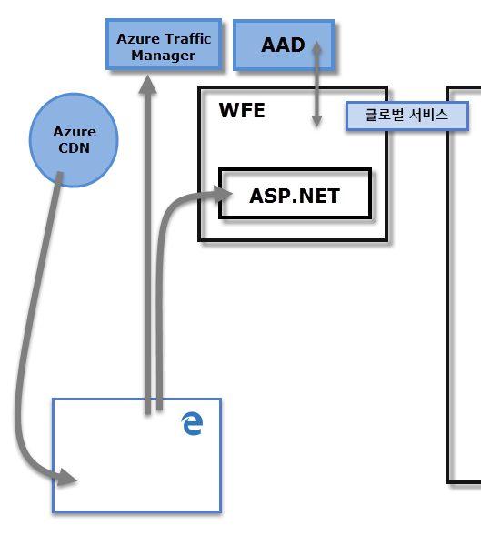
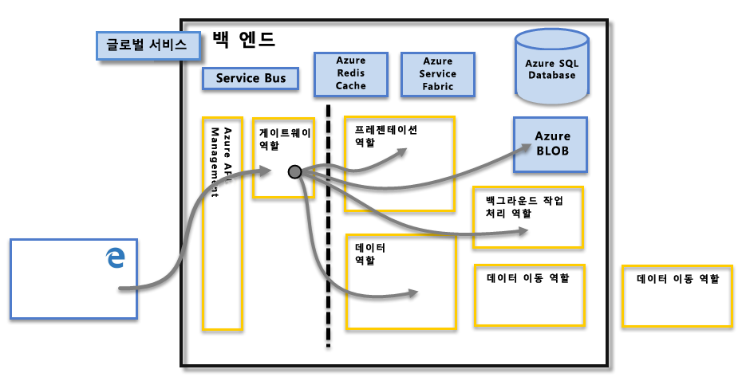

# Power BI 보안

Power BI 보안에 대한 자세한 설명은 [Power BI 보안 백서를 참조](whitepaper-powerbi-security.md)하세요.

Power BI 서비스는 Microsoft 클라우드 컴퓨팅 인프라 및 플랫폼인 **Azure**를 기반으로 합니다. Power BI 서비스 아키텍처는 **WFE(웹 프런트 엔드)** 클러스터 및 **백엔드** 클러스터 등, 두 클러스터를 기반으로 합니다. WFE 클러스터는 Power BI 서비스에 대한 최초 연결과 인증을 관리하며, 인증 후에는 백엔드가 이후의 모든 사용자 상호 작용을 처리합니다. Power BI는 AAD(Azure Active Directory)를 사용하여 사용자 ID를 스토리지 및 관리하며 각각 Azure BLOB와 Azure SQL Database를 사용하여 데이터 및 메타 데이터 스토리지을 관리합니다.

## Power BI 아키텍처

각각의 Power BI 배포는 **WFE(웹 프런트 엔드)** 클러스터와 **백엔드** 클러스터 등, 두 클러스터로 구성됩니다.

**WFE** 클러스터는 Power BI에 대한 최초 연결과 인증 프로세스를 관리하며, AAD를 사용하여 클라이언트를 인증하고 이후 Power BI 서비스에 대한 클라이언트 연결을 위해 토큰을 제공합니다. 또한 Power BI는 인증 프로세스와 고정 콘텐츠와 파일 다운로드를 위해 **ATM(Azure Traffic Manager)** 을 사용하여, 연결을 시도하는 클라이언트의 DNS 기록에 따라 결정한 가장 가까운 데이터 센터로 사용자 트래픽을 전달합니다. Power BI는 **Azure CDN(Content Delivery Network)** 을 사용하여 지리적 로케일에 따라 필요한 고정 콘텐츠와 파일을 효율적으로 배포합니다.

**백엔드** 클러스터는 인증된 클라이언트가 Power BI 서비스와 상호 작용하는 방식입니다. **백엔드** 클러스터는 시각화, 사용자 대시보드, 데이터 세트, 보고서, 데이터 스토리지, 데이터 연결, 데이터 새로 고침 및 기타 Power BI 서비스의 상호 작용 측면을 관리합니다. **게이트웨이 역할** 은 사용자 요청과 Power BI 서비스 간의 게이트웨이로 작동합니다. 사용자는 **게이트웨이 역할**이외의 역활과 직접적인 상호 작용이 없습니다. 결과적으로 **Azure API Management**는 **게이트웨이 역할**을 처리합니다.

> [!IMPORTANT]
> **APIM(Azure API Management)** 및 **GW(게이트웨이)** 역할만 공용 인터넷을 통해 액세스할 수 있습니다. 이 역할은 인증, 권한 부여, DDoS 방지, 조정, 부하 분산, 라우팅 및 기타 기능을 제공합니다.

## 데이터 스토리지 보안

Power BI는 데이터 저장 및 보관에 두 가지 주 스토리지를 사용합니다. 사용자가 업로드하는 데이터는 보통 **Azure BLOB** 스토리지로 보내지며 시스템 자체의 아티팩트와 모든 메타데이터는 **Azure SQL Database**에 저장됩니다.

위의 **백엔드** 클러스터 이미지에서 점선은 사용자가 액세스 가능한 두 구성 요소와(점선 왼쪽), 시스템이 액세스 가능한 역할 간의 경계를 명확히 보여줍니다. 인증된 사용자가 Power BI 서비스에 연결할 때, 연결과 클라이언트의 모든 요청은 **게이트웨이 역할**에서 허용 및 관리하며(결과적으로 **Azure API Management**에서 처리), 이후 사용자를 대신하여 나머지 Power BI 서비스와 상호 작용합니다. 예를 들어, 클라이언트가 대시보드 보기를 시도할 때 **게이트웨이 역할** 이 해당 요청을 수락한 다음 개별적으로 **프레젠테이션 역할** 에 요청을 보내 대시보드 렌더링을 위해 브라우저에서 필요한 데이터를 검색합니다.

## 사용자 인증

Power BI는 [AAD](https://azure.microsoft.com/services/active-directory/)(Azure Active Directory)를 사용하여 Power BI 서비스에 로그인한 사용자를 인증하고, 사용자가 인증이 필요한 리소스에 액세스를 시도할 때마다 Power BI 로그인 자격 증명을 사용합니다. 사용자는 Power BI 계정을 지정할 때 사용한 이메일 주소를 사용하여 Power BI 서비스에 로그인하고, Power BI는 이 로그인 이메일을 *유효 사용자 이름*으로 사용하여 사용자가 데이터에 연결을 시도할 때마다 리소스로 전달합니다. 그러면 적용되는 인증에 대해 *유효 사용자 이름*이 *사용자 계정 이름*([UPN](https://msdn.microsoft.com/library/windows/desktop/aa380525\(v=vs.85\).aspx))에 매핑되며 연결된 Windows 도메인 계정에 확인됩니다.

Power BI 로그인을 위해 직장 이메일을 사용하는 조직의 경우(예: <em>david@contoso.com</em>) *유효 사용자 이름*과 UPN의 매핑이 간단합니다. Power BI 로그인에 직장 이메일을 사용하지 않는 조직의 경우(예: <em>david@contoso.onmicrosoft.com</em>) AAD 및 온-프레미스 자격 증명 간의 매핑이 제대로 작동하려면 [디렉터리 동기화](https://technet.microsoft.com/library/jj573653.aspx)가 필요합니다.

Power BI의 플랫폼 보안에는 다중 테넌트 환경 보안, 네트워킹 보안, 타 AAD 기반 보안 측정치를 추가하는 기능 등도 포함됩니다.

## 데이터 및 서비스 보안

자세한 내용은 [Microsoft 보안 센터](https://www.microsoft.com/trustcenter)를 방문하세요.

이 문서의 앞부분에서 설명한 것처럼 사용자의 온-프레미스 Active Directory 서버에서 Power BI 로그인을 사용하여 자격 증명에 대한 UPN에 매핑합니다. 그러나 **중요한** 점은 자신이 공유하는 데이터는 사용자 본인의 책임이라는 사실입니다. 사용자가 자신의 자격 증명을 사용하여 데이터 원본에 연결한 다음, 해당 데이터에 따른 보고서(또는 대시보드나 데이터 세트)를 공유한다면 대시보드가 공유된 사용자는 원래의 데이터 원본에 대해 인증되지 않으며 보고서에 대한 액세스를 부여받게 됩니다.

여기서 **온-프레미스 데이터 게이트웨이**를 사용한 **SQL Server Analysis Services** 연결은 예외입니다. 즉 대시보드가 Power BI에 캐시로 저장되지만 기본 보고서나 데이터 세트에 대한 액세스에서 보고서(또는 데이터 세트) 액세스를 시도하는 사용자에 대한 인증이 시작되며, 사용자에게 데이터 액세스를 위한 충분한 자격 증명이 있는 경우에만 액세스가 부여됩니다. 자세한 내용은 [온-프레미스 데이터 게이트웨이 심층 분석](service-gateway-onprem-indepth.md)을 참조하세요.

## TLS 버전 사용 적용

네트워크 및 IT 관리자는 네트워크에서 보안 통신을 위해 현재 TLS(전송 계층 보안)를 사용하도록 요구 사항을 적용할 수 있습니다. Windows에서는 [TLS Schannel SSP 문서에 설명](https://docs.microsoft.com/windows/desktop/SecAuthN/protocols-in-tls-ssl--schannel-ssp-)된 대로 Microsoft Schannel 공급자에 대한 TLS 버전 지원을 제공합니다.

이 적용은 관리상 설정 레지스트리 키를 통해 수행할 수 있습니다. 적용 방법은 [AD FS 문서의 SSL 프로토콜 관리](https://docs.microsoft.com/windows-server/identity/ad-fs/operations/manage-ssl-protocols-in-ad-fs)에서 설명합니다. 

**Power BI Desktop**은 그러한 문서에 설명된 레지스트리 키 설정과 해당 레지스트리 설정에 따라 허용되는 TLS 버전을 사용하여 만든 연결만을 따릅니다.

이러한 레지스트리 키 설정에 대한 자세한 내용은 [TLS 레지스트리 설정](https://docs.microsoft.com/windows-server/security/tls/tls-registry-settings) 문서를 참조하세요.
