# Power BI Premium 및 Power BI Embedded 내에서 용량 관리

콘텐츠에 대한 전용 리소스를 제공하는 Power BI Premium 및 Power BI Embedded 용량을 관리하는 방법을 알아봅니다.

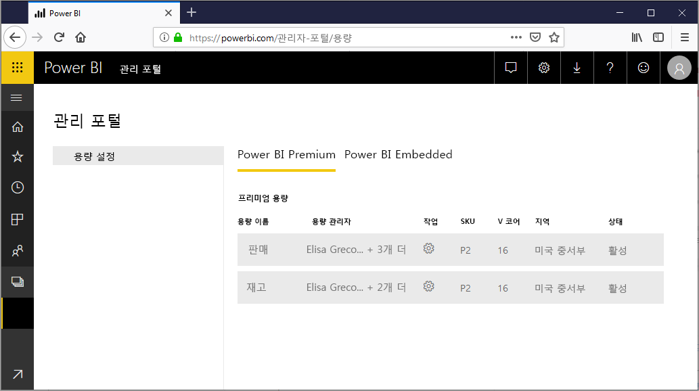

## 용량이란?

*용량*은 Power BI Premium 및 Power BI Embedded 제품의 핵심입니다. 용량은 조직이 독점적으로 사용하도록 예약된 리소스의 집합입니다. 전용 용량을 보유하면 사용자별 라이선스를 구입할 필요 없이 조직 전체에서 사용자에게 대시보드, 보고서 및 데이터 세트를 게시할 수 있습니다. 또한 용량에서 호스팅되는 콘텐츠에 대해 신뢰할 수 있는 일관된 성능을 제공합니다. 자세한 내용은 [Power BI 프리미엄이란?](service-premium.md)을 참조하세요.

### 용량 관리자

용량에 *용량 관리자*로 할당된 경우 용량 및 해당 관리 기능에 대한 모든 컨트롤을 갖습니다. Power BI 관리 포털에서 더 많은 용량 관리자를 추가하거나 사용자에게 용량 할당 권한을 제공할 수 있습니다. 용량에 작업 영역을 대량으로 할당하고 용량에 대한 사용 메트릭을 볼 수 있습니다.

> [!NOTE]
> Power BI Embedded의 경우 용량 관리자는 Microsoft Azure Portal에서 정의됩니다.

각 용량에는 자체 관리자가 있습니다. 하나의 용량에 용량 관리자를 할당한다고 해서 해당 조직 내 모든 용량에 대한 액세스가 부여되는 것은 아닙니다. 용량 관리자는 기본적으로 사용 메트릭, 감사 로그 또는 테넌트 설정과 같은 모든 Power BI 관리자 영역에 대한 액세스가 없습니다. 용량 관리자는 새 용량을 설정하거나 기존 용량의 SKU를 변경할 수 있는 권한도 없습니다. Office 365 글로벌 관리자 또는 Power BI 서비스 관리자만 해당 항목에 액세스할 수 있습니다.

모든 Office 365 글로벌 관리자 및 Power BI 서비스 관리자는 자동으로 Power BI Premium 용량과 Power BI Embedded 용량의 용량 관리자입니다.

## 용량 구입

전용 용량을 활용하려면 Office 365 관리 센터 내에서 Power BI Premium을 구입하거나 Microsoft Azure Portal 내에서 Power BI Embedded 리소스를 만들어야 합니다. 자세한 내용은 다음 아티클을 참조하세요.

* **Power BI Premium:** [Power BI 프리미엄 구매 방법](service-admin-premium-purchase.md)

* **Power BI Embedded:** [Azure Portal에서 Power BI Embedded 용량 만들기](https://docs.microsoft.com/azure/power-bi-embedded/create-capacity)

Power BI Premium 또는 Embedded SKU를 구입할 때 테넌트는 실행 중인 용량에서 사용하기 위한 V 코어의 해당 번호를 받습니다. 예를 들어 Power BI Premium P3 SKU를 구매하면 32 V 코어의 테넌트를 제공합니다. SKU에 대한 자세한 내용은 [프리미엄 용량 노드](service-premium.md#premium-capacity-nodes)를 참조하세요.

## 사용자에 대해 표시되는 프리미엄 모양

대부분의 경우 사용자는 프리미엄 용량에 있다는 것을 알지 않아도 됩니다. 대시보드 및 보고서가 작동합니다. 시각적 힌트로 프리미엄 용량에 있는 작업 영역 옆에 다이아몬드 아이콘이 표시됩니다.

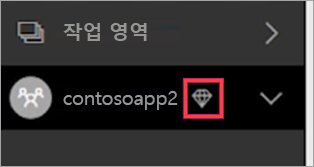

## 워크로드 구성

기본적으로 Power BI Premium 및 Power BI Embedded 용량은 클라우드에서 실행 중인 Power BI 쿼리와 연결된 워크로드만 지원합니다. 이제 다음 두 가지 추가 워크로드의 미리 보기를 지원합니다. **페이지를 매긴 보고서** 및 **데이터 흐름**. 자세한 내용은 [Workloads in Premium capacity](service-premium.md#workloads-in-premium-capacity)(프리미엄 용량의 워크로드)를 참조하세요.

Power BI 관리 포털에서 워크로드를 사용하도록 설정하려면 다음 단계를 수행하세요.

1. **용량 설정**에서 용량을 선택합니다.

1. **추가 옵션**에서 **워크로드**를 확장합니다.

1. 하나 이상의 워크로드를 사용하도록 설정하고 **최대 메모리** 값을 설정합니다.

    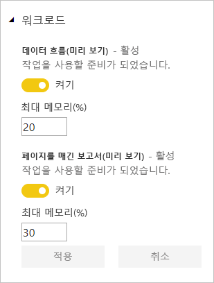

1. **적용**을 선택합니다.

## 용량 사용량 모니터링

Power BI는 용량 사용량을 모니터링하기 위한 앱을 제공합니다. 자세한 내용은 [조직에서 Power BI Premium 용량 모니터링](service-admin-premium-monitor-capacity.md)을 참조하세요.

## 용량 관리

Office 365에서 용량 노드를 구입한 후 Power BI 관리 포털에서 용량을 설정합니다. 포털의 **용량 설정** 섹션에서 Power BI Premium 용량을 관리합니다.

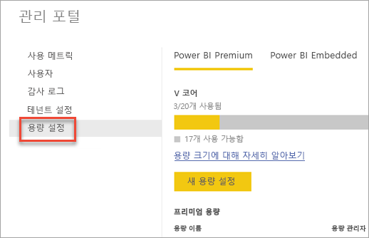

용량의 이름을 선택하여 용량을 관리합니다. 용량 관리 화면으로 이동됩니다.

용량에 작업 영역이 할당되지 않은 경우 [용량에 작업 영역을 할당](#assign-a-workspace-to-a-capacity)하는 방법에 대한 메시지가 표시됩니다.

### 새 용량 설정(Power BI Premium)

관리 포털에서는 이미 사용했거나 아직 사용 가능한 *가상 코어*(V 코어)의 개수가 표시됩니다. V 코어의 총 수는 구입한 Premium SKU를 기반으로 합니다. 예를 들어 P3 및 P2를 구매하면 48개의 코어를 사용 가능합니다(P3에서 32개, P2에서 16개).

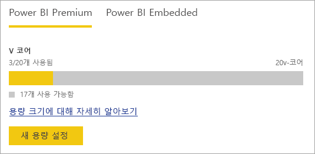

사용 가능한 V 코어가 있는 경우 다음과 같은 단계를 수행하여 새 용량을 설정합니다.

1. **새 용량 설정**을 선택합니다.

1. 용량에 이름을 지정합니다.

1. 이 용량에 대한 관리자를 정의합니다.

1. 용량 크기를 선택합니다. 사용 가능한 옵션은 사용 가능한 V 코어 개수에 따라 다릅니다. 사용 가능한 수보다 큰 옵션을 선택할 수 없습니다.

    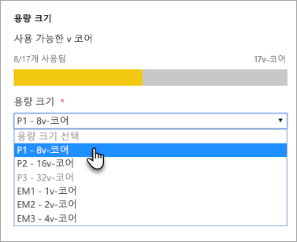

1. **설정**을 선택합니다.

    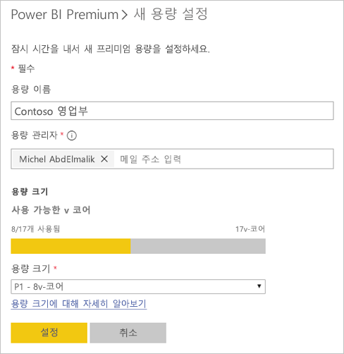

Power BI 관리자 및 Office 365 글로벌 관리자와 마찬가지로 용량 관리자는 관리 포털 내에 나열된 용량을 확인합니다.

### 용량 설정

1. 프리미엄 용량 관리 화면의 **작업** 아래에서 **기어 아이콘**을 선택하여 설정을 검토하고 업데이트하세요. 

    

1. 서비스 관리자, SKU/용량의 크기 및 용량이 위치한 지역을 볼 수 있습니다.

    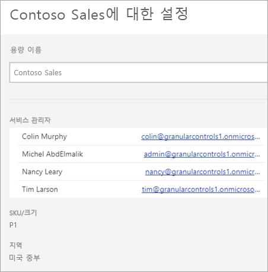

1. 또한 용량 이름 바꾸기 또는 삭제를 수행할 수 있습니다.

    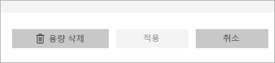

> [!NOTE]
> Power BI Embedded 용량 설정은 Microsoft Azure Portal에서 관리됩니다.

### 용량 크기 변경

Power BI 관리자 및 Office 365 글로벌 관리자는 Power BI Premium 용량을 변경할 수 있습니다. Power BI 관리자 또는 Office 365 글로벌 관리자가 아닌 용량 관리자에게는 이 옵션이 제공되지 않습니다.

1. **용량 크기 변경**을 선택합니다.

    

1. **용량 크기 변경** 화면에서 용량을 적절히 업그레이드하거나 다운그레이드합니다.

    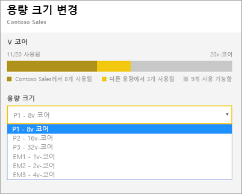

    관리자는 필요한 수의 V 코어가 있는 한 노드를 자유롭게 만들고, 크기를 조정하고, 삭제할 수 있습니다.

    P SKU는 EM SKU로 다운그레이드될 수 없습니다. 설명을 보려면 비활성화된 옵션 위로 마우스를 가져가면 됩니다.

### 사용자 권한 관리

추가 용량 관리자를 할당하고 *용량 할당* 권한을 갖는 사용자를 할당할 수 있습니다. 할당 권한이 있는 사용자는 해당 작업 영역의 관리자인 경우 용량에 앱 작업 영역을 할당할 수 있습니다. 또한 용량에 자신의 개인 *내 작업 영역*을 할당할 수 있습니다. 할당 권한이 있는 사용자는 관리 포털에 대한 액세스를 갖지 않습니다.

> [!NOTE]
> Power BI Embedded의 경우 용량 관리자는 Microsoft Azure Portal에서 정의됩니다.

**사용자 권한** 아래에서 **할당 권한이 있는 사용자**를 확장한 다음, 사용자 또는 그룹을 적절히 추가합니다.

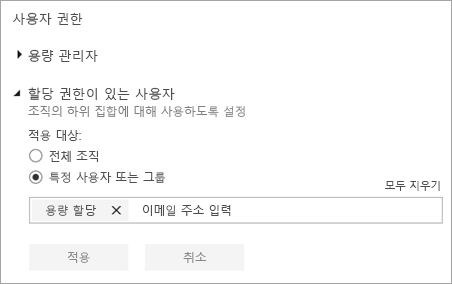

## 용량에 작업 영역 할당

용량에 작업 영역을 할당하는 방법으로는 관리 포털에서 할당하는 방법과 앱 작업 영역에서 할당하는 방법, 즉 두 가지 방법 있습니다.

### 관리 포털에서 할당

Power BI 관리자 및 Office 365 글로벌 관리자와 함께 용량 관리자는 관리 포털의 프리미엄 용량 관리 섹션에서 작업 영역을 대량으로 할당할 수 있습니다. 용량을 관리하는 경우 작업 영역을 할당할 수 있는 **작업 영역** 섹션이 표시됩니다.

1. **작업 영역 할당**을 선택합니다. 이 옵션은 여러 위치에서 사용할 수 있습니다.

1. **적용 대상**에 옵션을 선택합니다.

    

   | 선택 영역 | 설명 |
   | --- | --- |
   | **사용자별 작업 영역** | 사용자 또는 그룹별 작업 영역을 할당하면 해당 사용자가 소유한 모든 작업 영역은 사용자의 개인 작업 영역을 포함하여 프리미엄 용량에 할당됩니다. 언급된 사용자는 자동으로 작업 영역 할당 권한을 얻습니다. 다른 용량에 이미 할당된 작업 영역을 포함합니다. |
   | **특정 작업 영역** | 선택한 용량에 할당할 특정 작업 영역의 이름을 입력합니다. |
   | **전체 조직의 작업 영역** | 프리미엄 용량에 전체 조직의 작업 영역을 할당하면 조직의 모든 앱 작업 영역 및 내 작업 영역이 이 프리미엄 용량에 할당됩니다. 또한 모든 현재 및 미래의 사용자는 이 용량에 개별 작업 영역을 다시 할당할 수 있는 권한을 갖습니다. |
   | | |

1. **적용**을 선택합니다.

### 앱 작업 영역 설정에서 할당

해당 작업 영역 설정에서 프리미엄 용량에 앱 작업 영역을 할당할 수도 있습니다. 작업 영역을 용량으로 이동하려면 해당 작업 영역에 대한 관리자 권한 및 해당 용량에 대한 용량 할당 권한이 있어야 합니다. 작업 영역 관리자는 항상 프리미엄 용량에서 작업 영역을 제거할 수 있습니다.

1. 줄임표 **(...)** 를 선택하고 **작업 영역 편집**을 선택하여 앱 작업 영역을 편집합니다.

    

1. **작업 영역 편집** 아래에서 **고급**을 확장합니다.

1. 이 앱 작업 영역을 할당하려는 용량을 선택합니다.

    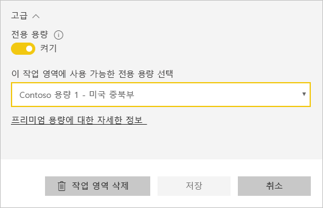

1. **저장**을 선택합니다.

저장한 후 작업 영역 및 모든 해당 콘텐츠는 최종 사용자에 대한 환경 중단 없이 프리미엄 용량으로 이동됩니다.

## Power BI Report Server 제품 키

Power BI 관리 포털의 **용량 설정** 탭에서 Power BI Report Server 제품 키에 대한 액세스를 갖습니다. 전역 관리자 또는 Power BI 서비스 관리자 역할에 할당된 사용자이며 Power BI Premium SKU를 구입한 경우 사용 가능합니다.

**Power BI Report Server 키**를 선택하면 제품 키를 포함하는 대화 상자가 표시됩니다. 복사하고 설치와 함께 사용할 수 있습니다.

자세한 내용은 [Power BI Report Server 설치](report-server/install-report-server.md)를 참조하세요.

## 다음 단계

사용자와 게시된 앱을 공유합니다. 자세한 내용은 [Power BI에서 앱 만들기 및 배포](service-create-distribute-apps.md)를 참조하십시오.

궁금한 점이 더 있나요? [Power BI 커뮤니티에 질문합니다.](http://community.powerbi.com/)
