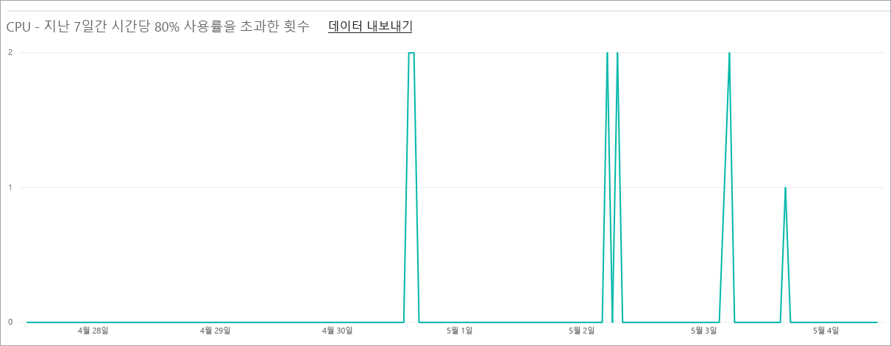
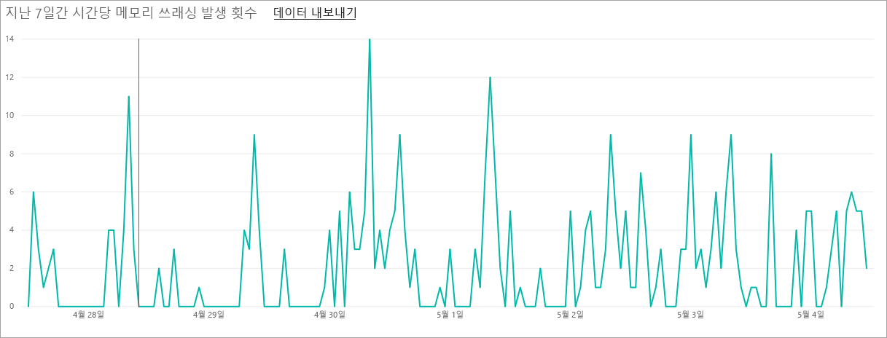
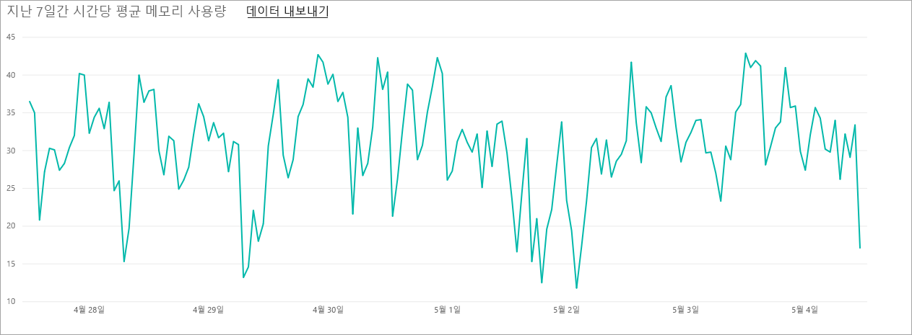
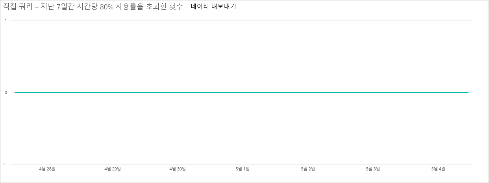

# Power BI Premium 및 Power BI Embedded 내에서 용량 관리
콘텐츠에 대한 전용 리소스를 제공하는 Power BI Premium 및 Power BI Embedded 용량을 관리하는 방법을 알아봅니다.

용량은 Power BI Premium 및 Power BI Embedded 제품에서 전해집니다.

## 용량이란?
용량은 사용자에 의한 독점적 사용을 위해 예약된 리소스의 집합입니다. 용량을 보유하면 라이선스를 구입할 필요 없이 조직 전체에서 사용자에게 대시보드, 보고서 및 데이터 집합을 게시할 수 있습니다. 또한 용량에서 호스팅되는 콘텐츠에 대해 신뢰할 수 있는 일관된 성능을 보장합니다.

용량은 최종 사용자가 인식할 수 있습니다. 평상시처럼 Power BI 또는 응용 프로그램을 계속해서 사용합니다. 전용 용량에서 일부(또는 모든) 콘텐츠가 호스팅된다는 것을 의식할 필요가 없습니다. 사용자를 위해 모든 작업은 이전과 마찬가지로 정확하게 작동합니다.

[!INCLUDE [powerbi-premium-illustration](./includes/powerbi-premium-illustration.md)]

자세한 내용은 [Power BI 프리미엄이란?](service-premium.md)을 참조하세요.

## 용량 구입
전용 용량을 활용하려면 Office 365 관리 센터 내에서 Power BI Premium에 대한 구독을 구입하거나 Microsoft Azure Portal 내에서 Power BI Embedded 리소스를 만들어야 합니다. 자세한 내용은 다음을 참조하세요.

* **Power BI Premium:** [Power BI 프리미엄 구매 방법](service-admin-premium-purchase.md)
* **Power BI Embedded:** [Azure Portal에서 Power BI Embedded 용량 만들기](https://docs.microsoft.com/en-us/azure/power-bi-embedded/create-capacity)

Power BI Premium SKU를 구입할 때 테넌트는 실행 중인 용량에서 사용하기 위한 V 코어의 해당 번호를 받습니다. 예를 들어 Power BI Premium P3 SKU를 구매하면 32 V 코어의 테넌트를 제공합니다.

> [!NOTE]
> 구독이 끝난 후 30일 동안 전체 액세스 권한을 갖지만 그 후에는 콘텐츠가 공유 용량으로 되돌아갑니다. 1GB를 초과하는 모델은 일반 공유 라이선스에서 지원되지 않습니다.
>

## 용량 관리자
> [!NOTE]
> Power BI Embedded 용량의 경우 용량 관리자는 Microsoft Azure Portal 내에서 정의됩니다.
>
>

용량에 용량 관리자로 할당된 경우 용량 및 해당 관리 기능에 대한 모든 컨트롤을 갖습니다. Power BI 관리 포털에서 더 많은 용량 관리자(Power BI Premium에만 해당)를 추가하거나 사용자에게 용량 할당 권한을 제공할 수 있습니다. 용량에 작업 영역을 대량으로 할당하고 용량에 대한 사용 메트릭을 볼 수 있습니다.

각 용량에는 자체 관리자가 있습니다. 하나의 용량에 용량 관리자를 정의하는 것은 해당 조직 내에서 모든 용량에 대한 액세스를 부여하지 않습니다. 용량 관리자는 기본적으로 사용 메트릭, 감사 로그 또는 테넌트 설정과 같은 모든 Power BI 관리자 영역에 대한 액세스가 없습니다. 용량 관리자는 새 용량을 설정하거나 기존 용량의 SKU를 변경할 수 있는 권한도 없습니다. 전역 관리자 또는 Power BI 서비스 관리자만 해당 항목에 액세스할 수 있습니다.

모든 Office 365 전역 관리자 및 Power BI 관리자는 자동으로 Power BI Premium 용량과 Power BI Embedded 용량의 용량 관리자입니다.

## 용량 관리
Office 365 내에서 노드 용량을 구입한 후 새 용량을 설정해야 합니다. 이 작업은 [Power BI 관리 포털](service-admin-portal.md)을 통해 수행합니다. 관리 포털 내에서 **용량 설정**이라는 섹션이 나타납니다. 여기에서 조직에 대한 Power BI 프리미엄 용량을 관리합니다.

**용량 설정**을 선택하면 Power BI Premium에 대한 기본값으로 용량 관리 화면으로 이동합니다.

### 새 용량 설정(Power BI Premium)
V 코어의 수는 사용되는 양과 용량을 만드는 데 사용 가능한 양을 반영합니다. 귀하의 조직에 사용할 수 있는 V 코어의 양은 구매한 Premium SKU를 기반으로 합니다. 예를 들어 P3 및 P2를 구매하면 48개의 코어를 사용 가능합니다(P3에서 32개, P2에서 16개).

사용 가능한 V 코어가 있는 경우 다음을 수행하여 새 용량을 설정합니다.

1. **새 용량 설정**을 선택합니다.
2. 용량에 **이름**을 지정합니다.
3. 이 용량에 대한 용량 관리자를 정의합니다.

    용량 관리자는 Power BI 관리자 또는 Office 365 전역 관리자일 필요가 없습니다. 자세한 내용은 [Power BI 프리미엄 용량 관리자](#capacity-admins)를 참조하세요.
4. 용량 크기를 선택합니다. 사용 가능한 옵션은 사용 가능한 V 코어 개수에 따라 다릅니다. 사용 가능한 수보다 큰 옵션을 선택할 수 없습니다.

    
5. **설정**을 선택합니다.

    

Power BI 관리자 및 Office 365 전역 관리자와 마찬가지로 용량 관리자는 관리 포털 내에 용량이 나열됩니다.

### 용량 설정
프리미엄 용량 관리 화면 내에서 작업 아래의 **기어 아이콘(설정)** 을 선택할 수 있습니다. 이렇게 하면 이름을 바꾸거나 용량을 삭제할 수 있습니다. 또한 서비스 관리자가 누구인지, SKU/용량의 크기 및 용량이 위치한 지역을 나타냅니다.

> [!NOTE]
> Power BI Embedded 용량 설정은 Microsoft Azure Portal 내에서 관리됩니다.
>
>

### 용량 크기 변경(Power BI Premium)
Power BI 관리자와 Office 365 전역 관리자는 **용량 크기 변경**을 선택하여 Power BI Premium 용량 크기를 변경합니다. Power BI 관리자 또는 Office 365 전역 관리자가 아닌 용량 관리자에게는 이 옵션이 제공되지 않습니다.

**용량 크기 변경** 화면에서는 사용할 수 있는 리소스가 있는 경우 용량 크기를 업그레이드하거나 다운그레이드할 수 있습니다. 관리자는 필요한 수의 V 코어가 있는 한 노드를 자유롭게 만들고, 크기를 조정하고, 삭제할 수 있습니다.

P SKU는 EM SKU로 다운그레이드될 수 없습니다. 설명을 제공하는 비활성 옵션 위로 마우스를 가져갈 수 있습니다.

### 용량 할당
용량의 이름을 선택하여 용량을 관리할 수 있습니다. 용량 관리 화면으로 이동됩니다.

용량에 작업 영역이 할당되지 않은 경우 **작업 영역을 할당**할 수 있도록 메시지가 표시 됩니다.

#### 사용자 권한
Power BI Premium 용량에 추가 **용량 관리자**를 할당할 수 있습니다. **용량 할당 권한**을 갖는 사용자를 할당할 수도 있습니다. 할당 권한이 있는 사용자는 해당 작업 영역의 관리자인 경우 용량에 앱 작업 영역을 할당할 수 있습니다. 또한 용량에 자신의 개인 *내 작업 영역*을 할당할 수 있습니다. 할당 권한이 있는 사용자는 관리 포털에 대한 액세스를 갖지 않습니다.

> [!NOTE]
> Power BI Embedded 용량의 경우 용량 관리자는 Microsoft Azure Portal 내에서 할당됩니다.
>
>

## 사용량 측정(Power BI Premium)
각 용량에 대해 CPU, 메모리 사용량, 메모리 쓰래싱 및 직접 쿼리에 대한 사용량 측정을 볼 수 있습니다. 사용자가 용량에 대해 나은 성능을 확인할 수 있도록 탭에서 이러한 메트릭을 유지하는 것이 좋습니다.

> [!NOTE]
> Power BI Embedded 용량 사용량은 Azure Portal 내에서 모니터링됩니다.

| 메트릭 | 설명 |
| --- | --- |
| CPU |CPU 사용률이 80%를 초과한 횟수입니다. |
| 메모리 쓰래싱 |백 엔드 코어에 대한 메모리 압력을 나타냅니다. 특히 이는 여러 데이터 집합의 사용으로 인한 메모리 압력에 따라 데이터 집합이 메모리에서 제거된 횟수를 나타내는 메트릭입니다. |
| 메모리 사용량 |GB(기가바이트)로 표시되는 평균 메모리 사용량입니다. |
| DQ/s | 직접 쿼리 및 라이브 연결이 제한의 80%를 초과한 횟수입니다.     * DirectQuery의 총 수를 제한하고 라이브 연결은 초당 쿼리합니다.  * 제한은 P1에 대해 30/s, P2에 대해 60/s 및 P3에 대해 120/s입니다.   * 직접 쿼리 및 라이브 연결 쿼리 수가 위의 제한에 추가됩니다. 예를 들어 초당 15개의 DirectQueries 및 15개의 라이브 연결이 있는 경우 스로틀에 도달합니다.  * 이는 온-프레미스 및 클라우드 연결에 동일하게 적용됩니다. |

메트릭은 지난 주 동안의 사용률을 반영합니다.  메트릭에 대한 자세한 보기를 보려면 요약 타일 중 하나를 클릭하면 됩니다.  그러면 프리미엄 용량의 각 메트릭에 대한 자세한 차트로 이동합니다.  이러한 차트는 지난 주에 대한 시간별로 요약되며, 프리미엄 용량에서 특정 성능 관련 이벤트가 발생한 경우를 격리하는 데 도움이 될 수 있습니다.  

또한 메트릭 중 하나에 대한 기본 데이터를 csv 파일로 내보낼 수도 있습니다.  이 내보내기는 지난 주 매일 3분 간격으로 측정된 자세한 정보를 제공합니다.

## 용량에 작업 영역 할당
용량에 작업 영역을 할당할 수 있는 몇 가지 방법이 있습니다.

### 관리 포털에서 용량 관리
Power BI 관리자 및 Office 365 전역 관리자와 함께 용량 관리자는 관리 포털의 프리미엄 용량 관리 섹션 내에서 작업 영역을 대량으로 할당할 수 있습니다. 용량을 관리하는 경우 작업 영역을 할당할 수 있는 **작업 영역** 섹션이 표시됩니다.

1. **작업 영역 할당**을 선택합니다. 이는 여러 위치에 나열되고 모두 동일한 작업을 수행합니다.
2. **전체 조직의 작업 영역** 또는 **사용자별 특정 작업 영역**을 선택합니다.

   | 선택 영역 | 설명 |
   | --- | --- |
   | **전체 조직의 작업 영역** |프리미엄 용량에 전체 조직의 작업 영역을 할당하면 조직의 모든 앱 작업 영역 및 내 작업 영역을 이 프리미엄 용량에 할당합니다. 또한 모든 현재 및 미래의 사용자는 이 용량에 개별 작업 영역을 다시 할당할 수 있는 권한을 갖습니다. |
   | **사용자별 특정 작업 영역** |사용자 또는 그룹별 작업 영역을 할당하면 해당 사용자가 소유한 모든 작업 영역은 사용자의 개인 작업 영역을 포함하여 프리미엄 용량에 할당됩니다. 언급된 사용자는 자동으로 작업 영역 할당 권한을 얻습니다. 다른 용량에 이미 할당된 작업 영역을 포함합니다. |
3. **적용**을 선택합니다.

이 옵션은 용량에 특정 작업 영역 할당을 허용하지 않습니다.

### 앱 작업 영역 설정
해당 작업 영역 설정에서 프리미엄 용량에 앱 작업 영역을 할당할 수도 있습니다. 앱 작업 영역을 프리미엄 용량에 할당하려면 다음을 수행합니다.

작업 영역을 용량으로 이동하려면 해당 작업 영역에 대한 관리자 권한 및 해당 용량에 대한 용량 할당 권한이 있어야 합니다. 작업 영역 관리자는 항상 프리미엄 용량에서 작업 영역을 제거할 수 있습니다.

1. **줄임표(...)** 를 선택하고 **작업 영역 편집**을 선택하여 앱 작업 영역을 편집합니다.

    
2. **작업 영역 편집** 내에서 **고급**을 확장합니다.
3. 모든 용량에 대한 용량 할당 권한을 부여 받은 경우 이 작업 영역에 대한 **프리미엄**을 설정하는 옵션을 갖습니다.
4. 이 앱 작업 영역을 할당하려는 용량을 선택합니다.

    
5. **저장**을 선택합니다.

저장한 후 작업 영역 및 모든 해당 콘텐츠는 최종 사용자에 대한 환경 중단 없이 프리미엄 용량으로 이동됩니다.

## 사용자에 대해 표시되는 프리미엄 모양
대부분의 경우 사용자는 프리미엄 용량에 있다는 것을 알지 않아도 됩니다. 대시보드 및 보고서가 작동합니다. 시각적 힌트로 프리미엄 용량에 있는 작업 영역 옆에 다이아몬드 아이콘이 표시됩니다.

## Power BI Report Server 제품 키
Power BI 관리자 포털의 **용량 설정** 탭 내에서 Power BI Report Server 제품 키에 대한 액세스를 갖습니다. 전역 관리자 또는 Power BI 서비스 관리자 역할에 할당된 사용자이며 Power BI Premium SKU를 구입한 경우 사용 가능합니다.

**Power BI Report Server 키**를 선택하면 제품 키를 포함하는 대화 상자가 표시됩니다. 복사하고 설치와 함께 사용할 수 있습니다.

자세한 내용은 [Power BI Report Server 설치](report-server/install-report-server.md)를 참조하세요.

## 다음 단계
프리미엄 용량에 작업 영역을 할당할 때 게시된 앱을 무료 사용자와 공유합니다. 자세한 내용은 [Power BI에서 앱 만들기 및 배포](service-create-distribute-apps.md)를 참조하십시오.

궁금한 점이 더 있나요? [Power BI 커뮤니티에 질문합니다.](http://community.powerbi.com/)
