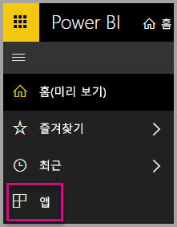
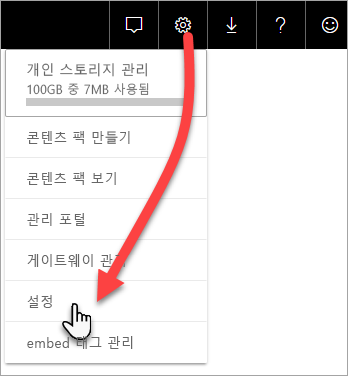
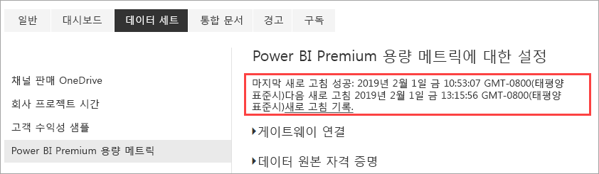
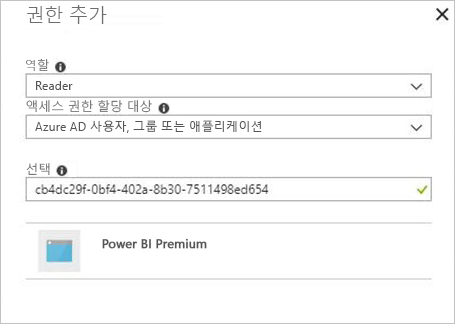

# 앱을 사용하여 프리미엄 용량 모니터링

용량 모니터링은 프리미엄 용량 리소스를 최대한 활용하는 방법에 대한 합리적인 결정을 하는 데 필수적입니다. 관리 포털 또는 **Power BI Premium 용량 메트릭** 앱으로 용량을 모니터링할 수 있습니다. 이 문서에서는 프리미엄 용량 메트릭 앱 사용을 설명합니다. 앱은 용량이 수행되는 방법에 대해 가장 심층적인 정보를 제공합니다. 지난 7일 동안의 평균 사용 메트릭의 상위 수준 개요의 경우 관리 포털을 사용할 수 있습니다. 포털에서 모니터링하는 방법에 대한 자세한 내용은 [관리 포털에서 프리미엄 용량 모니터링](service-admin-premium-monitor-portal.md)을 참조하세요.

앱은 새로운 기능과 역량을 사용하여 정기적으로 업데이트됩니다. 최신 버전을 실행하고 있는지 확인합니다. 이전 버전의 앱이 이미 설치되어 있는 경우 앱에서 삭제한 다음, CTRL+F5를 눌러 새로 고치는 것이 가장 좋습니다.

## 앱 설치

[프리미엄 용량 메트릭 앱](https://app.powerbi.com/groups/me/getapps/services/capacitymetrics)으로 바로 이동하거나 Power BI에서 다른 앱을 설치하는 것처럼 설치할 수 있습니다.

1. Power BI에서 **앱**을 클릭합니다.

    

2. 오른쪽에서 **앱 가져오기**를 클릭합니다.
3. **앱** 범주에서 **Power BI Premium 용량 메트릭 앱**을 검색합니다.
4. 구독하여 앱을 설치합니다.

조금만 기다려주세요. 메트릭를 설치하고 새로 고치는 데 몇 분 정도 걸립니다. 앱에 빈 메트릭이 표시되면 F5를 눌러 브라우저를 새로 고칩니다.

## 앱 새로 고침 기록 가져오기

프리미엄 용량 메트릭 앱을 마지막으로 새로 고친 시간을 확인하려면 **설정** > **데이터 세트** > **Power BI Premium 용량 메트릭** > **새로 고침 기록**을 클릭합니다. 

마지막 새로 고침이 표시되거나 **새로 고침 기록**을 클릭하여 예약 및 요청 시 새로 고침을 확인합니다.

## 앱을 사용하여 용량 모니터링

이제 앱을 설치했으므로 조직의 용량에 대한 메트릭을 볼 수 있습니다. 이 앱에서는 메트릭 요약이 포함된 대시보드와 자세한 메트릭 보고서를 제공합니다.

### 대시보드

관리자인 용량의 주요 메트릭을 요약하는 대시보드를 보려면 **대시보드**에서 **Power BI Premium 용량 매트릭**을 클릭합니다. 대시보드가 표시됩니다.

대시보드에 포함되는 메트릭은 다음과 같습니다.

#### 위쪽

| 메트릭 | 설명 |
| --- | --- |
| 버전 | 앱 버전입니다. | 
| 용량 | 관리하는 용량의 수입니다. | 
| 작업 영역 | 메트릭을 보고하는 용량의 작업 영역 수입니다.|
|||

#### 시스템 요약

| 메트릭 | 설명 |
| --- | --- |
| CPU 사용률이 가능 높은 용량 | CPU가 지난 7일 동안 임계값의 80%를 초과한 횟수가 최대인 용량입니다. |
| CPU 사용률이 가장 높은 수 | CPU 명명된 용량이 지난 7일 동안 임계값의 80%를 초과한 횟수입니다. | 
| 메모리 사용률이 최대인 용량 | 지난 7일 동안 메모리 최대 제한에 도달하고 3분 버킷으로 분할된 횟수가 최대인 용량입니다.  |
| 메모리 사용률이 최대인 횟수| 명령된 용량이 지난 7일 동안 메모리 최대 제한에 도달하고 3분 버킷으로 분할된 횟수입니다. |
|||

#### 데이터 세트 요약

| 메트릭 | 설명 |
| --- | --- |
| 데이터 세트 | 용량에 있는 모든 작업 영역의 총 데이터 세트 수입니다.|
| 데이터 세트 평균 크기(MB) | 용량에 있는 모든 작업 영역의 데이터 세트의 평균 크기입니다.|  
| 데이터 세트 평균 로드 수 | 데이터 세트가 메모리로 로드된 평균 수입니다. |  
| 데이터 세트 - 평균 활성 데이터 세트(%)| 지난 7일간의 평균 활성 데이터 세트입니다. 사용자가 지난 3분에 시각적 개체와 상호 작용한 경우 데이터 세트를 활성으로 정의합니다. |
| CPU - 데이터 세트 최대(%)| 지난 7일 동안 데이터 세트 워크로드의 최대 CPU 사용입니다. |
| CPU - 데이터 세트 평균(%)| 지난 7일 동안 데이터 세트 워크로드의 평균 CPU 사용입니다. |
| 메모리 - 데이터 세트 평균(GB) | 지난 7일 동안 데이터 세트 워크로드의 평균 메모리 사용입니다. |
| 메모리 - 데이터 세트 최대(GB) | 지난 7일 동안 데이터 세트 워크로드의 최대 메모리 사용입니다.|
| 데이터 세트 제거 | 메모리 부족으로 인해 제거된 총 데이터 세트 수입니다. |
| DirectQuery/라이브 높은 사용률 수| DirectQuery/라이브 연결이 지난 7일 동안 임계값의 80%를 초과하여 3분 버킷으로 분할된 횟수입니다. |
| DirectQuery/라이브 최대 사용률 수| DirectQuery/라이브 연결이 지난 7일 동안 80%를 초과하여 1시간 버킷으로 분할된 최대 횟수입니다. |
| DirectQuery/라이브 최고 사용률 | DirectQuery/라이브 연결이 지난 7일 동안 임계 값의 80%를 초과하여 3분 버킷으로 분할된 최대 횟수입니다.|
| DirectQuery/라이브 최대 발생 시간 | DirectQuery/라이브 연결이 1시간 동안 가장 많이 임계값의 80%를 초과한 시간(UTC)입니다. |
| 총 새로 고침 수 | 지난 7일간 총 새로 고침 수입니다. |
| 새로 고침 안정성(%) | 지난 7일간 성공한 새로 고침 수를 총 새로 고침 수로 나눈 값입니다. |
| 새로 고침 평균 기간(분) | 새로 고침 완료에 걸리는 평균 시간입니다. |
| 새로 고침 평균 대기 시간(분)| 새로 고침 시작 전에 대기하는 평균 시간입니다. |
| 총 쿼리 수 |  지난 7일간 실행된 총 쿼리 수입니다. |
| 쿼리 총 대기 수 | 실행 전에 대기해야 한 쿼리의 총 수입니다. |
| 쿼리 평균 기간(밀리초) | 쿼리를 완료하는 데 걸린 평균 시간입니다. |
| 쿼리 평균 대기 시간(밀리초) | 쿼리가 실행 전에 시스템 리소스에서 대기한 평균 시간입니다. |
|||

#### 데이터 흐름 요약

| 메트릭 | 설명 |
| --- | --- |
| 데이터 흐름 |  용량에 있는 모든 작업 영역의 총 데이터 흐름 수입니다.|
| 총 새로 고침 수 | 지난 7일간 총 새로 고침 수입니다.|  
| 새로 고침 평균 기간(분) | 새로 고침을 완료하는 데 걸린 시간입니다. |
| 새로 고침 평균 대기 시간(분) | 새로 고침의 예약된 시간과 실제 시작 간의 지연입니다.|
| CPU - 데이터 흐름 최대(%) | 지난 7 일 동안 데이터 흐름 워크로드의 최대 CPU 사용입니다. |
| CPU - 데이터 흐름 평균(%) | 지난 7 일 동안 데이터 흐름 워크로드의 평균 CPU 사용입니다. |
| 메모리 - 데이터 흐름 최대(GB) | 지난 7 일 동안 데이터 흐름 워크로드의 최대 메모리 사용입니다. |
| 메모리 - 데이터 흐름 평균(GB) | 지난 7 일 동안 데이터 흐름 워크로드의 평균 메모리 사용입니다. |
|||

#### 페이지를 매긴 보고서 요약

| 메트릭 | 설명 |
| --- | --- |
| 페이지가 매겨진 보고서 |  용량에 있는 모든 작업 영역의 총 페이지를 매긴 보고서 수입니다. |
| 총 조회수 | 사용자가 모든 보고서를 본 총횟수입니다. | 
| 총 행 수 | 모든 보고서의 총 데이터 행 수입니다.|
| 총 시간 | 모든 보고서의 모든 단계(데이터 검색, 처리 및 렌더링)에 걸리는 총 시간(밀리초)입니다. |
| CPU - 페이지를 매긴 보고서 최대(%) | 지난 7 일 동안 페이지를 매긴 보고서 워크로드의 최대 CPU 사용입니다. |
| CPU - 페이지를 매긴 보고서 평균(%) | 지난 7 일 동안 페이지를 매긴 보고서 워크로드의 평균 CPU 사용입니다. |
| 메모리 - 페이지를 매긴 보고서 최대(GB) | 지난 7 일 동안 페이지를 매긴 보고서 워크로드의 최대 메모리 사용입니다. |
| 메모리 - 페이지를 매긴 보고서 평균(GB) | 지난 7일 동안 페이지를 매긴 보고서 워크로드의 평균 메모리 사용입니다. |
|||

#### AI 요약

| 메트릭 | 설명 |
| --- | --- |
| AI 함수 실행 | 지난 7일간 총 실행 수입니다. |
| AI 함수 실행 안정성(%) | 지난 7일간 성공한 실행 수를 총 실행 수로 나눈 값입니다. |
| CPU 최대(%)| 지난 7일 동안 AI 워크로드의 최대 CPU 사용입니다. |
| 메모리 최대(GB) | 지난 7일 동안 AI 워크로드의 최대 메모리 사용입니다.|
| AI 함수 실행 최대 대기 시간(MS) | 실행 시작 전에 대기하는 최대 시간입니다. |
| AI 함수 실행 평균 대기 시간(MS)| 실행 시작 전에 대기하는 평균 시간입니다. |
| AI 함수 실행 최대 기간(MS) | 실행 완료에 걸리는 최대 시간입니다. |
| AI 함수 실행 평균 기간(MS)| 실행 완료에 걸리는 평균 시간입니다. |
| | |

### 보고서

보고서에서는 더 자세한 메트릭을 제공합니다. 사용자가 관리자인 용량의 보고서를 보려면 **보고서**에서 **Power BI Premium 용량 매트릭**을 클릭합니다. 또는 대시보드에서 메트릭 셀을 클릭하여 기본 보고서로 이동합니다. 

보고서의 하단에는 다음과 같은 다섯 개의 *탭*이 있습니다.

[**데이터 세트**](#datasets) - 용량에 있는 Power BI 데이터 세트의 상태에 관한 자세한 메트릭을 제공합니다.
[**페이지를 매긴 보고서**](#paginated-reports) - 용량에 있는 페이지를 매긴 보고서의 상태에 관한 자세한 메트릭을 제공합니다.
[**데이터 흐름**](#dataflows) - 용량에 있는 데이터 흐름에 관한 자세한 새로 고침 메트릭을 제공합니다.
[**AI**](#ai) - 용량에 사용되는 AI 함수의 상태에 대한 자세한 메트릭을 제공합니다.
[**리소스 사용량**](#resource-consumption) - 높은 메모리 및 CPU 사용률을 포함하여 자세한 리소스 메트릭을 제공합니다.
[**ID 및 정보**](#ids-and-info) - 용량, 작업 영역, 워크로드에 대한 이름, ID 및 소유자입니다.

각 탭을 클릭하면 메트릭을 용량 및 날짜 범위별로 필터링할 수 있는 페이지가 열립니다. 필터를 선택하지 않으면 보고서는 메트릭을 보고하는 모든 용량에 대해 지난 주 메트릭을 표시하도록 기본적으로 설정됩니다. 

### 데이터 세트

데이터 세트 페이지에는 **새로 고침**, **쿼리 기간**, **쿼리 대기** 및 **데이터 세트**를 비롯한 여러 *영역*이 있습니다. 이 페이지 위쪽에 있는 단추를 사용하여 다른 영역으로 이동할 수 있습니다.

#### 새로 고침 영역

| 보고서 섹션 | 메트릭 |
| --- | --- |
| 새로 고침 |  총 개수: 각 데이터 세트의 총 새로 고침 횟수입니다.   안정성: 각 데이터 세트에 대해 완료된 새로 고침의 백분율입니다.   평균 대기 시간: 데이터 세트 새로 고침의 예약 시간과 시작 시간 사이의 평균 지연 시간(분)입니다.   최대 대기 시간: 데이터 세트에 대한 최대 대기 시간(분)입니다.   평균 기간: 데이터 세트의 평균 새로 고침 기간(분)입니다.   최대 기간: 데이터 세트에 대해 가장 오래 실행된 새로 고침 기간(분)입니다. |
| 평균 기간(분) 기준 상위 5개 데이터 세트 |  평균 새로 고침 기간(분)이 가장 긴 5개 데이터 세트입니다. |
| 평균 대기 시간(분) 기준 상위 5개 데이터 세트 |  평균 새로 고침 대기 시간(분)이 가장 긴 5개 데이터 세트입니다. |
| 시간별 새로 고침 수 및 메모리 사용량(GB) |  UTC 시간으로 보고되고 한 시간 버킷으로 분할된 성공, 실패 및 메모리 사용량입니다. |
| 시간별 평균 새로 고침 대기 시간(분) |  UTC 시간으로 보고되고 한 시간 버킷으로 분할된 평균 새로 고침 대기 시간입니다. 새로 고침 대기 시간이 여러 번 급증한다면 용량이 많이 실행된다는 것을 나타냅니다. |
|  |  |

#### 쿼리 기간 영역

| 보고서 섹션 | 메트릭 |
| --- | --- |
| 쿼리 기간 |  이 섹션의 데이터는 지난 7일간 데이터 세트, 작업 영역 및 시간별 버킷을 기준으로 분할됩니다.   전체: 데이터 세트에 대해 실행된 총 쿼리 수입니다.   평균: 데이터 세트에 대한 평균 쿼리 기간(밀리초)   최대: 데이터 세트에서 가장 오래 실행된 쿼리 기간(밀리초)입니다.|
| 쿼리 기간 분포 |  쿼리 기간 히스토그램은 쿼리 기간(밀리초)을 기준으로 <= 30ms, 30-100ms, 100-300ms, 300ms-1초, 1초-3초, 3초-10초, 10초-30초 및 > 30초 간격 범주로 버킷이 구성됩니다. 쿼리 기간이 길고 대기 시간이 길면 조회 지속 기간 및 장기 대기 시간은 용량이 과도하게 실행되고 있음을 나타냅니다. 또한 단일 데이터 세트에 문제가 있으며 추가 조사가 필요하다는 것을 의미할 수도 있습니다. |
| 평균 기간 기준 상위 5개 데이터 세트 |  평균 쿼리 기간(밀리초)이 가장 긴 5개 데이터 세트입니다. |
| 시간별 쿼리 기간 분포 |  UTC 시간으로 보고되고 한 시간 버킷으로 분할된 쿼리 수 및 평균 기간(밀리초)과 메모리 사용량(GB) 비교입니다. |
| DirectQuery/라이브 연결(사용률 80% 초과) |  DirectQuery 또는 라이브 연결이 UTC 시간으로 보고되고 한 시간 버킷으로 분할된 CPU 사용률의 80%를 초과한 횟수입니다. |
|  |  |

#### 쿼리 대기 영역

| 보고서 섹션 | 메트릭 |
| --- | --- |
| 쿼리 대기 시간 |  이 섹션의 데이터는 지난 7일간 데이터 세트, 작업 영역 및 시간별 버킷을 기준으로 분할됩니다.   전체: 데이터 세트에 대해 실행된 총 쿼리 수입니다.   대기 수: 실행을 시작하기 전에 시스템 리소스에서 대기한 데이터 세트의 쿼리 수입니다.   평균: 데이터 세트의 평균 쿼리 대기 시간(밀리초)입니다.   최대: 데이터 세트에서 가장 오래 대기한 쿼리 기간(밀리초)입니다.|
| 평균 대기 시간 기준 상위 5개 데이터 세트 |  쿼리 실행을 시작하기까지의 평균 대기 시간(밀리초)이 가장 긴 5개 데이터 세트입니다. |
| 대기 시간 분포 |  쿼리 기간 히스토그램은 쿼리 기간(밀리초)을 기준으로 <= 50ms, 50-100ms, 100-200ms, 200-400ms, 400ms-1초, 1초-5초 및 > 5초 간격 범주로 버킷이 구성됩니다. |
| 시간별 쿼리 대기 시간 분포 |  UTC 시간으로 보고되고 한 시간 버킷으로 분할된 쿼리 대기 수 및 평균 대기 시간(밀리초)과 메모리 사용량(GB) 비교입니다. |
|  |  |

#### 데이터 세트 영역

| **보고서 섹션** | **메트릭** |
| --- | --- |
| 데이터 세트 크기  |  최대 크기: 표시된 기간 동안의 최대 데이터 세트 크기(MB)입니다. |
| 데이터 세트 제거 수 |  전체: 각 용량에 대한 총 데이터 세트 *제거* 수입니다. 용량에서 메모리 부족 문제가 발생하면 노드가 메모리에서 하나 이상의 데이터 세트를 제거합니다. 현재 실행 중인 쿼리/새로 고침 작업이 없는 비활성 상태의 데이터 세트가 먼저 제거됩니다. 그런 다음, '최근에 사용되지 않은 것'(LRU)을 기준으로 제거됩니다.|
| 시간별 로드된 데이터 세트 수 |  UTC 시간으로 보고되고 한 시간 버킷으로 분할된 메모리에 로드된 데이터 세트 수와 메모리 사용량(GB) 비교입니다. |
| 시간별 데이터 세트 제거 및 메모리 사용량 |  UTC 시간으로 보고되고 한 시간 버킷으로 분할된 데이터 세트 제거와 메모리 사용량(GB) 비교입니다. |
| 사용된 메모리 백분율 |  총 메모리의 백분율로 메모리의 총 활성 데이터 세트입니다. 활성 및 모두 사이의 델타는 제거될 수 있는 데이터 세트를 정의합니다. 지난 7일 동안 시간별로 표시됩니다. |
|  |  |

### 페이지가 매겨진 보고서

| **보고서 섹션** | **메트릭** |
| --- | --- |
| 전체 사용량 |  총 조회 수: 사용자가 보고서를 본 횟수입니다.   행 개수: 보고서의 데이터 행 수입니다.   검색(평균): 보고서의 데이터를 검색하는 데 걸리는 평균 시간(밀리초). 이 기간이 길면 쿼리 속도가 느리거나 다른 데이터 원본 문제가 있음을 나타낼 수 있습니다.    처리(평균): 보고서의 데이터를 처리하는 데 걸리는 평균 시간(밀리초)입니다.  렌더링(평균): 브라우저에서 보고서를 렌더링하는 데 걸리는 평균 시간(밀리초)입니다.   총 시간: 보고서의 모든 단계에 걸리는 시간(밀리초)입니다. |
| 평균 데이터 검색 시간 기준 상위 5개 보고서 |  평균 데이터 검색 시간(밀리초)이 가장 긴 5개 보고서입니다. |
| 평균 보고서 처리 시간 기준 상위 5개 보고서 |  평균 보고서 처리 시간(밀리초)이 가장 긴 5개 보고서입니다. |
| 시간별 결과 |  UTC 시간으로 보고되고 한 시간 버킷으로 분할된 성공, 실패 및 메모리 사용량입니다. |
| 시간별 기간 |  UTC 시간으로 보고되고 한 시간 버킷으로 분할된 데이터 검색과 처리 및 렌더링 시간 비교입니다. |
|  |  |

### 데이터 흐름

| **보고서 섹션** | **메트릭** |
| --- | --- |
| 새로 고침 |  전체: 각 데이터 흐름에 대한 총 새로 고침 수입니다.   안정성: 각 데이터 흐름에 대해 완료된 새로 고침의 백분율입니다.   평균 대기 시간: 데이터 흐름 새로 고침의 예약 시간과 시작 시간 사이의 평균 지연 시간(분)입니다.   최대 대기 시간: 데이터 흐름에 대한 최대 대기 시간(분)입니다.   평균 기간: 데이터 흐름에 대한 평균 새로 고침 기간(분)입니다.   최대 기간: 데이터 흐름에 대해 가장 오래 실행된 새로 고침 기간(분)입니다. |
| 평균 새로 고침 기간 기준 상위 5개 데이터 흐름 |  평균 새로 고침 기간(분)이 가장 긴 5개 데이터 흐름입니다. |
| 평균 대기 시간 기준 상위 5개 데이터 흐름 |  평균 새로 고침 대기 시간(분)이 가장 긴 5개 데이터 흐름입니다. |
| 시간별 평균 새로 고침 대기 시간 |  UTC 시간으로 보고되고 한 시간 버킷으로 분할된 평균 새로 고침 대기 시간입니다. 새로 고침 대기 시간이 여러 번 급증한다면 용량이 많이 실행된다는 것을 나타냅니다. |
| 시간별 새로 고침 수 및 메모리 사용량 |  UTC 시간으로 보고되고 한 시간 버킷으로 분할된 성공, 실패 및 메모리 사용량입니다. |
|  |  |

### AI

| **보고서 섹션** | **메트릭** |
| --- | --- |
| AI 메모리 사용량 | 한 시간 버킷으로 분할된 메모리 사용량(GB)은 UTC 시간으로 보고됩니다. |
| 시간별 AI 함수 실행 및 평균 대기 시간 | AI 실행 및 평균 대기 시간(밀리초)은 UTC 시간으로 보고되고 한 시간 버킷으로 분할됩니다. |
| 전체 사용량 | 총 개수: 작업 영역 또는 데이터 흐름의 AI 함수 개수입니다.   시스템 안정성: 완료된 실행의 백분율입니다.  평균 대기 시간: 예약 시간과 실행 시작 시간 사이의 평균 지연 시간(밀리초)입니다.  최대 대기 시간: 최대 대기 시간(밀리초)입니다.  평균 기간: 실행의 평균 기간(밀리초)입니다.  최대 기간: 가장 오래 실행된 실행 기간(밀리초)입니다.  평균 총 크기: AI 함수에 대한 입력 및 출력 데이터의 평균 크기(바이트)입니다. |
| | |

### 리소스 사용량

| **보고서 섹션** | **메트릭** |
| --- | --- |
| CPU 사용량 |  1시간 동안의 워크로드별 최대 CPU 사용량을 총 CPU 용량의 백분율로 나타낸 것입니다. 지난 7일 동안 시간별로 표시됩니다. |
| 메모리 사용량 |  시간 동안 작업 제한(점선)과 중첩된 작업(실선)에 의한 GB의 최대 메모리 소비량입니다. 지난 7일 동안 시간별로 표시됩니다. |
|  |  |

### ID 및 정보

**ID 및 정보** 탭에는 **용량**, **작업 영역**, **데이터 세트**, **페이지를 매긴 보고서** 및 **데이터 흐름** 영역이 있습니다.

#### 용량 영역

| 보고서 섹션 | 메트릭 |
| --- | --- |
| SKU 및 워크로드 정보 | 용량과 관련된 SKU 및 워크로드 설정입니다. |
| 관리자 | 용량의 관리자 이름입니다. |
|||

#### 작업 영역 영역

| 보고서 섹션 | 메트릭 |
| --- | --- |
| 작업 영역 | 모든 작업 영역의 이름 및 ID입니다. |
|||

#### 데이터 세트 영역

| 보고서 섹션 | 메트릭 |
| --- | --- |
| 데이터 세트 | 모든 데이터 세트의 작업 영역 이름 및 ID입니다. |
|||

#### 페이지를 매긴 보고서 영역

| 보고서 섹션 | 메트릭 |
| --- | --- |
| 페이지가 매겨진 보고서 | 모든 페이지를 매긴 보고서의 이름, 작업 영역 이름 및 ID입니다. |
|||

#### 데이터 흐름 영역

| 보고서 섹션 | 메트릭 |
| --- | --- |
| 데이터 흐름 | 모든 데이터 흐름의 이름, 작업 영역 이름 및 ID입니다. |
|||

## Power BI Embedded 용량 모니터링

Power BI Premium 용량 메트릭 앱을 사용하여 Power BI Embedded의 *A SKU* 용량을 모니터링할 수 있습니다. 용량의 관리자이면 해당 용량이 보고서에 표시됩니다. 그러나 A SKU에서 Power BI에 대한 특정 권한을 부여하지 않으면 보고서를 새로 고치지 못합니다.

1. Azure Portal에서 용량을 엽니다.

1. **액세스 제어(IAM)** 를 클릭하고 판독기 역할에 **Power BI Premium** 앱을 추가합니다. 이름으로 앱을 찾을 수 없는 경우 클라이언트 식별자(`cb4dc29f-0bf4-402a-8b30-7511498ed654`)로 해당 앱을 추가할 수도 있습니다.

    

> [!NOTE]
> 앱 또는 Azure Portal에서 Power BI Embedded 용량 사용량을 모니터링할 수 있지만 Power BI 관리 포털에서는 모니터링할 수 없습니다.

## 다음 단계

> [!div class="nextstepaction"]
> [Power BI Premium 용량 최적화](service-premium-capacity-optimize.md)
