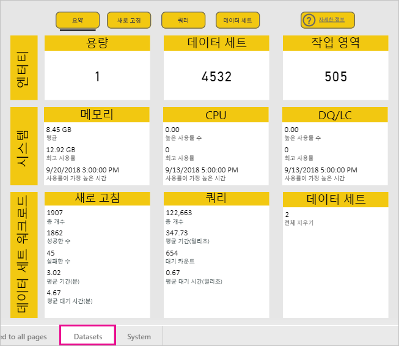
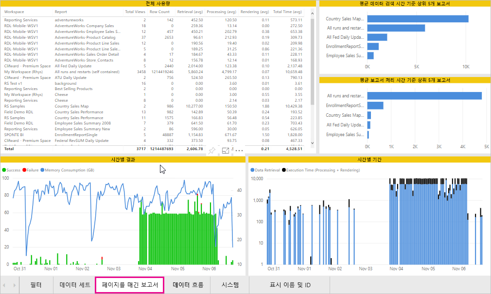
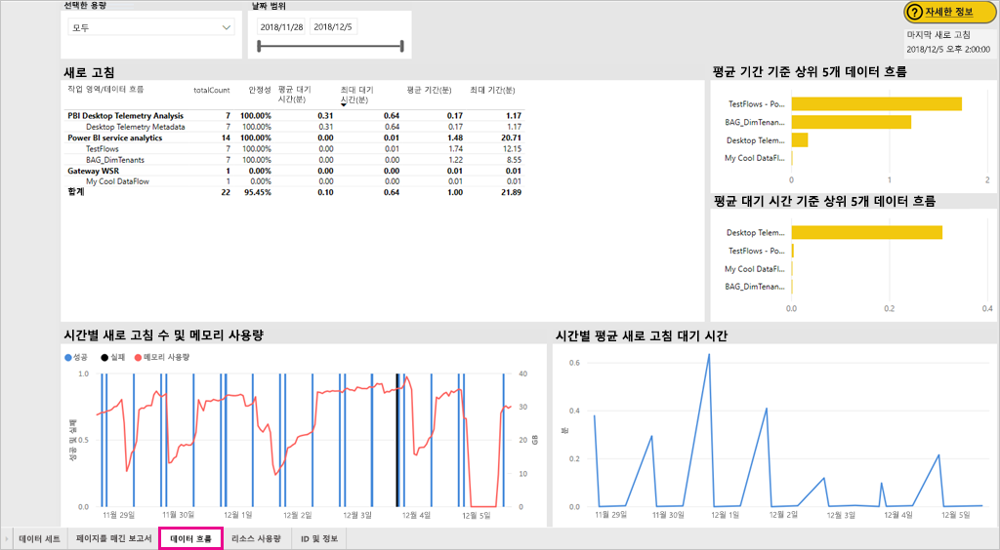
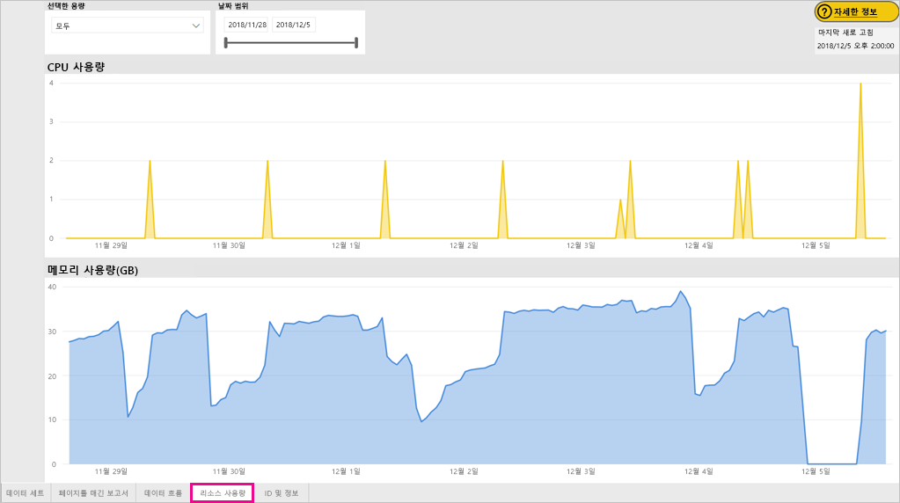
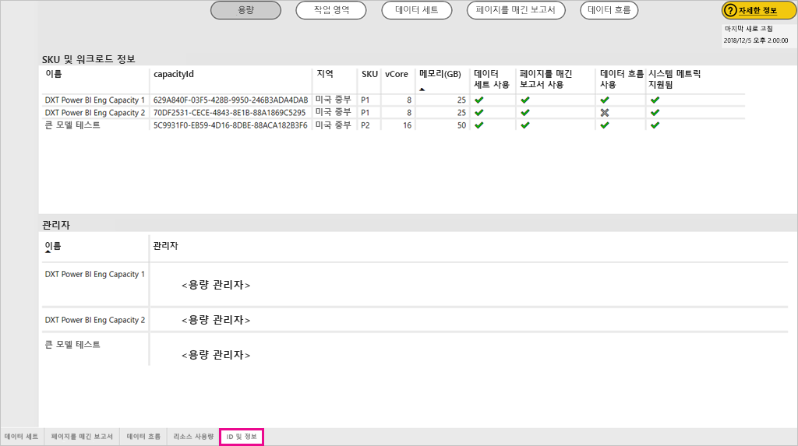
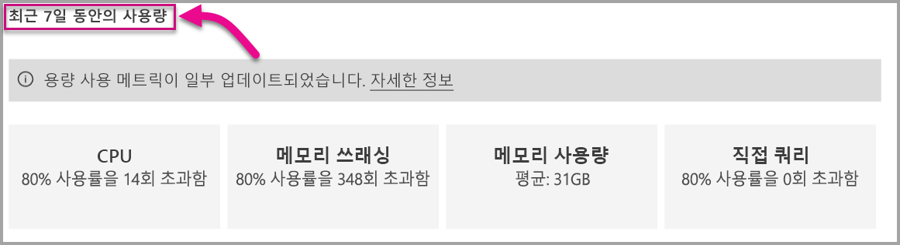

# Power BI Premium 및 Power BI Embedded 용량 모니터링

이 문서에서는 Power BI Premium 용량의 메트릭 모니터링에 대한 개요를 제공합니다. 용량 사용량 모니터링을 사용하면 정보를 기반으로 하여 용량을 관리할 수 있습니다.

Power BI Premium 용량 메트릭 앱 또는 관리 포털에서 용량을 모니터링할 수 있습니다. 앱이 더 자세한 내용을 제공하므로, 앱을 사용하는 것이 좋지만 이 문서에서는 두 가지 옵션을 모두 다룹니다.

**앱의 현재 버전은 1.10입니다(2018년 12월 13일 릴리스됨).**

.

<iframe width="560" height="315" src="https://www.youtube.com/embed/UgsjMbhi_Bk?rel=0&amp;showinfo=0" frameborder="0" allowfullscreen></iframe>

## 프리미엄 용량 메트릭 앱 설치

[프리미엄 용량 메트릭 앱](https://app.powerbi.com/groups/me/getapps/services/capacitymetrics)으로 바로 이동하거나 Power BI에서 다른 앱을 설치하는 것처럼 설치할 수 있습니다.

1. Power BI에서 **앱**을 클릭합니다.

    

1. 오른쪽에서 **앱 가져오기**를 클릭합니다.

1. **앱** 범주에서 **Power BI Premium 용량 메트릭 앱**을 검색합니다.

1. 구독하여 앱을 설치합니다.

이제 앱을 설치했으므로 조직의 용량에 대한 메트릭을 볼 수 있습니다. 사용 가능한 몇 가지 주요 메트릭을 살펴보겠습니다.

## 메트릭 앱 사용

### 메트릭 대시보드

앱을 열면 먼저 관리자 권한이 있는 모든 용량의 요약이 포함된 대시보드가 표시됩니다.

대시보드에 포함되는 메트릭은 다음과 같습니다.

| **보고서 섹션** | **메트릭** |
| --- | --- |
| **시스템 요약** | * 애플리케이션 버전  * 관리하는 용량 수  * 메트릭을 보고하는 용량의 작업 영역 수  * 지난 7일 동안의 평균 메모리 사용량(GB)  * 지난 7일 동안의 최대 메모리 사용량(GB)  * 최대 메모리 사용량이 발생한 현지 시간  * CPU가 지난 7일 동안 임계값의 80%를 초과하여 3분 버킷으로 분할된 횟수  * CPU가 지난 7일 동안 80%를 초과하여 1시간 버킷으로 분할된 대부분의 시간  * CPU가 한 시간 동안 가장 많이 80%를 초과한 현지 시간 |
| **데이터 세트 요약** | * 용량에 있는 모든 작업 영역의 총 데이터 세트 수  * 직접 쿼리/라이브 연결이 지난 7일 동안 임계값의 80%를 초과하여 3분 버킷으로 분할된 횟수  * 직접 쿼리/라이브 연결이 지난 7일 동안 80%를 초과하여 1시간 버킷으로 분할된 대부분의 시간  * 직접 쿼리/라이브 연결이 한 시간 동안 가장 많이 80%를 초과한 현지 시간  * 지난 7일간 총 새로 고침 수  * 평균 새로 고침 대기 시간 - 예약 시간과 새로 고침 시작 사이의 평균 지연 시간(분)  * 평균 새로 고침 기간 - 새로 고침을 완료하는 데 걸린 시간(분)  * 지난 7일간 실행된 총 쿼리 수  * 평균 쿼리 대기 시간 - 실행을 시작하기 전에 쿼리가 시스템 리소스에서 대기한 시간(밀리초)  * 평균 쿼리 기간 -쿼리를 완료하는 데 걸린 시간(밀리초)  * 메모리 부족으로 인해 제거된 총 모델 수  * 데이터 세트의 평균 크기   * 메모리에 로드된 데이터 세트의 평균 수 |
| **데이터 흐름 요약** | * 용량에 있는 모든 작업 영역의 총 데이터 흐름 수  * 지난 7일간 총 새로 고침 수  * 평균 새로 고침 대기 시간 - 예약 시간과 새로 고침 시작 사이의 평균 지연 시간(분)  * 평균 새로 고침 기간 - 새로 고침을 완료하는 데 걸린 시간(분) |
| **페이지를 매긴 보고서 요약** | * 용량에 있는 모든 작업 영역의 총 페이지를 매긴 보고서 수  * 사용자가 모든 보고서를 본 총 횟수  * 모든 보고서의 총 데이터 행 수  * 모든 보고서의 모든 단계(데이터 검색, 처리 및 렌더링)에 걸리는 총 시간(밀리초) |
|  |  |

### 메트릭 보고서

기본 보고서로 이동하려면 대시보드를 클릭합니다. 이 보고서에는 5개의 탭이 있으며, 자세한 내용은 다음 섹션에서 설명합니다.

* **데이터 세트**: 용량에 있는 Power BI 데이터 세트의 상태에 대한 자세한 메트릭입니다.

* **페이지를 매긴 보고서**: 용량에 있는 페이지를 매긴 보고서의 상태에 대한 자세한 메트릭입니다.

* **데이터 흐름**: 용량에 있는 데이터 흐름에 대한 자세한 새로 고침 메트릭입니다.

* **리소스 사용량**: 높은 메모리 및 CPU 사용률을 포함한 전반적인 용량 메트릭입니다.

* **ID 및 정보**: 용량, 작업 영역, 워크로드에 대한 이름, ID 및 소유자입니다.

각 탭에서 메트릭은 용량 및 날짜 범위별로 필터링할 수 있습니다. 필터를 선택하지 않으면 보고서는 메트릭을 보고하는 모든 용량에 대해 지난 주 메트릭을 표시하도록 기본적으로 설정됩니다.

#### 데이터 세트 탭

**데이터 세트** 탭의 위쪽에 있는 단추를 사용하여 **요약**, **새로 고침**, **쿼리 기간**, **쿼리 대기** 및 **데이터 세트**로 이동할 수 있습니다.

##### 새로 고침 영역

**새로 고침** 영역에는 다음 메트릭이 있습니다.

| **보고서 섹션** | **메트릭** |
| --- | --- |
| **새로 고침 안정성** | * 총 개수: 각 데이터 세트의 총 새로 고침 횟수  * 안정성: 각 데이터 세트에 대해 완료된 새로 고침의 백분율  * 평균 대기 시간: 데이터 세트 새로 고침의 예약 시간과 시작 시간 사이의 평균 지연 시간(분)  * 최대 대기 시간: 데이터 세트에 대한 최대 대기 시간(분)   * 평균 기간: 데이터 세트에 대한 평균 새로 고침 기간(분)  * 최대 기간: 데이터 세트에 대해 가장 오래 실행된 새로 고침 기간(분) |
| **평균 새로 고침 기간 기준 상위 5개 데이터 세트** | * 평균 새로 고침 기간(분)이 가장 긴 5개 데이터 세트 |
| **평균 대기 시간 기준 상위 5개 데이터 세트** | * 평균 새로 고침 대기 시간이 가장 긴 5개 데이터 세트 |
| **시간별 평균 새로 고침 대기 시간** | * 현지 시간으로 보고되고 한 시간 버킷으로 분할된 평균 새로 고침 대기 시간. 새로 고침 대기 시간이 여러 번 급증한다면 용량이 많이 실행된다는 것을 나타냅니다. |
| **시간별 새로 고침 수 및 메모리 사용량** | * 현지 시간으로 보고되고 한 시간 버킷으로 분할된 성공, 실패 및 메모리 사용량 |
|  |  |

##### 쿼리 기간 영역

**쿼리 기간** 영역에는 다음 메트릭이 있습니다.

| **보고서 섹션** | **메트릭** |
| --- | --- |
| **쿼리 기간** | * 이 섹션의 데이터는 지난 7일간 데이터 세트, 작업 영역 및 시간별 버킷을 기준으로 분할됨  * 합계: 데이터 세트에 대해 실행된 총 쿼리 수  * 평균: 데이터 세트에 대한 평균 쿼리 기간(밀리초)  * 최대: 데이터 세트에서 가장 오래 실행된 쿼리 기간(밀리초)|
| **쿼리 기간 분포** | * 쿼리 기간 히스토그램은 쿼리 기간(밀리초)을 기준으로 <= 30ms, 30-100ms, 100-300ms, 300ms-1초, 1초-3초, 3초-10초, 10초-30초 및 > 30초 간격 범주로 버킷 구성됩니다. 쿼리 기간이 길고 대기 시간이 길면 조회 지속 기간 및 장기 대기 시간은 용량이 과도하게 실행되고 있음을 나타냅니다. 또한 단일 데이터 세트에 문제가 있으며 추가 조사가 필요하다는 것을 의미할 수도 있습니다. |
| **평균 기간 기준 상위 5개 데이터 세트** | * 평균 쿼리 기간(밀리초)이 가장 긴 5개 데이터 세트 |
| **직접 쿼리/라이브 연결(사용률 80% 초과)** | * 직접 쿼리 또는 라이브 연결이 현지 시간으로 보고되고 한 시간 버킷으로 분할된 CPU 사용률의 80%를 초과한 횟수 |
| **시간별 쿼리 기간 분포** | * 현지 시간으로 보고되고 한 시간 버킷으로 분할된 쿼리 수 및 평균 기간(밀리초)과 메모리 사용량(GB) 비교 |
|  |  |

##### 쿼리 대기 영역

**쿼리 대기** 영역에는 다음 메트릭이 있습니다.

| **보고서 섹션** | **메트릭** |
| --- | --- |
| **쿼리 대기 시간** | * 이 섹션의 데이터는 지난 7일간 데이터 세트, 작업 영역 및 시간별 버킷을 기준으로 분할됨  * 합계: 데이터 세트에 대해 실행된 총 쿼리 수  * 대기 수: 실행을 시작하기 전에 시스템 리소스에서 대기한 데이터 세트의 쿼리 수   * 평균: 데이터 세트에 대한 평균 쿼리 대기 시간(밀리초)  * 최대: 데이터 세트에서 가장 오래 대기한 쿼리 기간(밀리초)|
| **대기 시간 분포** | * 쿼리 기간 히스토그램은 쿼리 기간(밀리초)을 기준으로 <= 50ms, 50-100ms, 100-200ms, 200-400ms, 400ms-1초, 1초-5초 및 > 5초 간격 범주로 버킷 구성됩니다. |
| **평균 대기 시간 기준 상위 5개 데이터 세트** | * 쿼리 실행을 시작하기까지의 평균 대기 시간(밀리초)이 가장 긴 5개 데이터 세트 |
| **시간별 쿼리 대기 수 및 시간** | * 현지 시간으로 보고되고 한 시간 버킷으로 분할된 쿼리 대기 수 및 평균 대기 시간(밀리초)과 메모리 사용량(GB) 비교 |
|  |  |

##### 데이터 세트 영역

**데이터 세트** 영역에는 다음 메트릭이 있습니다.

| **보고서 섹션** | **메트릭** |
| --- | --- |
| **데이터 세트 제거 수** | * 합계: 각 용량에 대한 총 데이터 세트 *제거* 수입니다. 용량에서 메모리 부족 문제가 발생하면 노드가 메모리에서 하나 이상의 데이터 세트를 제거합니다. 현재 실행 중인 쿼리/새로 고침 작업이 없는 비활성 상태의 데이터 세트가 먼저 제거됩니다. 그런 다음, '최근에 사용되지 않은 것'(LRU)을 기준으로 제거됩니다.|
| **시간별 데이터 세트 제거 및 메모리 사용량** | * 현지 시간으로 보고되고 한 시간 버킷으로 분할된 데이터 세트 제거와 메모리 사용량(GB) 비교 |
| **시간별 로드된 데이터 세트 수** | * 현지 시간으로 보고되고 한 시간 버킷으로 분할된 메모리에 로드된 데이터 세트 수와 메모리 사용량(GB) 비교 |
| **데이터 크기**  | * 최대 크기: 표시된 기간 동안의 최대 데이터 세트 크기(MB) |
|  |  |

#### 페이지를 매긴 보고서 탭

**페이지를 매긴 보고서** 탭은 용량에 있는 페이지를 매긴 보고서의 상태에 대한 자세한 메트릭을 보여 줍니다.

**페이지를 매긴 보고서** 탭에는 다음 메트릭이 있습니다.

| **보고서 섹션** | **메트릭** |
| --- | --- |
| **전체 사용량** | * 총 보기: 사용자가 보고서를 본 횟수  * 행 개수: 보고서의 데이터 행 수  * 검색(평균): 보고서의 데이터를 검색하는 데 걸리는 평균 시간(밀리초). 이 기간이 길면 쿼리 속도가 느리거나 다른 데이터 원본 문제가 있음을 나타낼 수 있습니다.   * 처리(평균): 보고서의 데이터를 처리하는 데 걸리는 평균 시간(밀리초) * 렌더링(평균): 브라우저에서 보고서를 렌더링하는 데 걸리는 평균 시간(밀리초)  * 총 시간: 보고서의 모든 단계에 걸리는 시간(밀리초)|
| **평균 데이터 검색 시간 기준 상위 5개 보고서** | * 평균 데이터 검색 시간(밀리초)이 가장 긴 5개 보고서 |
| **평균 보고서 처리 시간 기준 상위 5개 보고서** | * 평균 보고서 처리 시간(밀리초)이 가장 긴 5개 보고서 |
| **시간별 기간** | * 현지 시간으로 보고되고 한 시간 버킷으로 분할된 데이터 검색과 처리 및 렌더링 시간 비교 |
| **시간별 결과** | * 현지 시간으로 보고되고 한 시간 버킷으로 분할된 성공, 실패 및 메모리 사용량 |
|  |  |

#### 데이터 흐름 탭

**데이터 흐름** 탭은 용량에 있는 데이터 흐름에 대한 자세한 새로 고침 메트릭을 보여 줍니다.

**데이터 흐름** 탭에는 다음 메트릭이 있습니다.

| **보고서 섹션** | **메트릭** |
| --- | --- |
| **새로 고침** | * 합계: 각 데이터 흐름에 대한 총 새로 고침 수  * 안정성: 각 데이터 흐름에 대해 완료된 새로 고침의 백분율  * 평균 대기 시간: 데이터 흐름 새로 고침의 예약 시간과 시작 시간 사이의 평균 지연 시간(분)  * 최대 대기 시간: 데이터 흐름에 대한 최대 대기 시간(분)   * 평균 기간: 데이터 흐름에 대한 평균 새로 고침 기간(분)  * 최대 기간: 데이터 흐름에 대해 가장 오래 실행된 새로 고침 기간(분) |
| **평균 새로 고침 기간 기준 상위 5개 데이터 흐름** | * 평균 새로 고침 기간(분)이 가장 긴 5개 데이터 흐름 |
| **평균 대기 시간 기준 상위 5개 데이터 흐름** | * 평균 새로 고침 대기 시간(분)이 가장 긴 5개 데이터 흐름 |
| **시간별 평균 새로 고침 대기 시간** | * 현지 시간으로 보고되고 한 시간 버킷으로 분할된 평균 새로 고침 대기 시간. 새로 고침 대기 시간이 여러 번 급증한다면 용량이 많이 실행된다는 것을 나타냅니다. |
| **시간별 새로 고침 수 및 메모리 사용량** | * 현지 시간으로 보고되고 한 시간 버킷으로 분할된 성공, 실패 및 메모리 사용량 |
|  |  |

#### 리소스 사용량 탭

**리소스 사용량** 탭은 모든 용량 및 워크로드에 걸친 CPU 및 메모리 사용량을 보여 줍니다.

**리소스 사용량** 탭에 포함되는 메트릭은 다음과 같습니다.

| **보고서 섹션** | **메트릭** |
| --- | --- |
| **CPU 사용량** | * 지난 7일간 CPU가 임계값의 80%를 초과한 횟수(3분 버킷으로 분할됨) |
| **메모리 사용량** | * 3분 버킷으로 분할된 지난 7일간 메모리 사용량 |
|  |  |

#### ID 및 정보 탭

**ID 및 정보** 탭에는 용량, 작업 영역, 워크로드에 대한 이름, ID 및 소유자가 포함되어 있습니다.

## Power BI Embedded 용량 모니터링

Power BI Premium 용량 메트릭 앱을 사용하여 Power BI Embedded의 *A SKU* 용량을 모니터링할 수도 있습니다. 용량의 관리자이면 해당 용량이 보고서에 표시됩니다. 그러나 A SKU에서 Power BI에 대한 특정 권한을 부여하지 않으면 보고서를 새로 고치지 못합니다.

1. Azure Portal에서 용량을 엽니다.

1. **액세스 제어(IAM)** 를 클릭하고 판독기 역할에 “Power BI Premium” 앱을 추가합니다. 이름으로 앱을 찾을 수 없는 경우 클라이언트 ID: cb4dc29f-0bf4-402a-8b30-7511498ed654로 해당 앱을 추가할 수도 있습니다.

    

> [!NOTE]
> 앱 또는 Azure Portal에서 Power BI Embedded 용량 사용량을 모니터링할 수 있지만 Power BI 관리 포털에서는 모니터링할 수 없습니다.

## 관리 포털의 기본 모니터링

관리 포털의 **용량 설정** 영역은 지난 7일간 용량에 의해 배치된 로드 및 활용된 리소스를 나타내는 네 가지 계기를 제공합니다. 이러한 네 개의 타일은 지난 7일간 해당 메트릭이 80%를 초과하는 시간 수를 나타내는 시간별 기간에서 작동합니다. 이 메트릭은 최종 사용자 환경에 대한 잠재적인 성능 저하를 나타냅니다.

| **메트릭** | **설명** |
| --- | --- |
| CPU |CPU 사용률이 80%를 초과한 횟수입니다. |
| 메모리 쓰래싱 |백 엔드 코어에 대한 메모리 압력을 나타냅니다. 특히 이는 여러 데이터 세트의 사용으로 인한 메모리 압력에 따라 데이터 세트가 메모리에서 제거된 횟수를 나타내는 메트릭입니다. |
| 메모리 사용량 |GB(기가바이트)로 표시되는 평균 메모리 사용량입니다. |
| DQ/s | 직접 쿼리 및 라이브 연결이 제한의 80%를 초과한 횟수입니다.   * DirectQuery의 총수를 제한하고 라이브 연결은 초당 쿼리합니다. * 제한은 P1에 대해 30/s, P2에 대해 60/s 및 P3에 대해 120/s입니다. * 직접 쿼리 및 라이브 연결 쿼리 수가 위의 제한에 추가됩니다. 예를 들어 초당 15개의 DirectQueries 및 15개의 라이브 연결이 있는 경우 제한에 도달합니다. * 이는 온-프레미스 및 클라우드 연결에 동일하게 적용됩니다. |
|  |  |

메트릭은 지난 주 동안의 사용률을 반영합니다.  메트릭에 대한 자세한 보기를 보려면 요약 타일 중 하나를 클릭하면 됩니다.  그러면 프리미엄 용량의 각 메트릭에 대한 자세한 차트로 이동합니다. 다음 차트에는 CPU 메트릭에 대한 세부 정보가 표시됩니다.

이러한 차트는 지난 주에 대한 시간별로 요약되며, 프리미엄 용량에서 특정 성능 관련 이벤트가 발생한 경우를 격리하는 데 도움이 될 수 있습니다.

또한 메트릭 중 하나에 대한 기본 데이터를 csv 파일로 내보낼 수도 있습니다.  이 내보내기는 지난 주 매일 3분 간격으로 측정된 자세한 정보를 제공합니다.

## 다음 단계

이제 Power BI Premium 용량을 모니터링하는 방법을 이해했으므로 용량 최적화에 대해 자세히 알아보세요.

> [!div class="nextstepaction"]
> [Power BI Premium 용량 리소스 관리 및 최적화](service-premium-understand-how-it-works.md)
