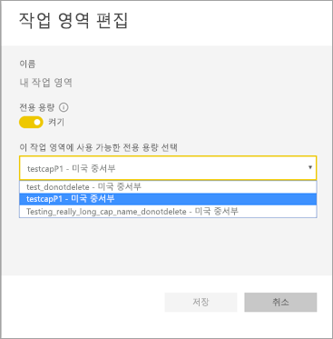
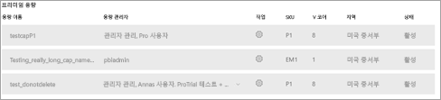

# Power BI Premium에 대한 Multi-Geo 지원(미리 보기)

Multi-Geo는 다국적 고객이 지역별, 산업별 또는 조직별 데이터 보존 요구 사항을 해결하는 데 도움이 되는 Power BI Premium 기능입니다. Power BI Premium 고객은 Power BI 테넌트의 홈 지역이 아닌 다른 지역에 있는 데이터 센터에 콘텐츠를 배포할 수 있습니다. 지역(지리)은 둘 이상의 지역을 포함할 수 있습니다. 예를 들어 미국은 지역이고 미국 중서부 및 미국 중남부는 미국에 있는 지역입니다. 다음 지역에 콘텐츠를 배포할 수 있습니다.

- 미국
- 캐나다
- 영국
- 브라질
- 유럽
- 일본
- 인도
- 아시아 태평양
- 오스트레일리아

Power BI Germany, Power BI China(21Vianet에서 운영) 또는 Power BI(미국 정부용)에는 Multi-Geo를 사용할 수 없습니다.

이제 Power BI Embedded에서도 Multi-Geo를 사용할 수 있습니다. [Power BI Embedded(미리 보기)의 Multi-Geo 지원](developer/embedded-multi-geo.md)에서 자세한 내용을 확인해 보세요.

## Multi-Geo 사용

새 용량의 경우 드롭다운에서 기본 지역이 아닌 다른 지역을 선택하여 Multi-Geo를 사용하도록 설정합니다.  각 사용 가능한 용량은 현재 위치한 지역을 표시합니다(예: **미국 중서부**).

용량을 만든 후 용량은 해당 지역에 남아 있고 생성된 작업 영역에는 해당 지역에 저장된 콘텐츠가 포함됩니다. 작업 영역 설정 화면의 드롭다운을 통해 한 지역에서 다른 지역으로 작업 영역을 마이그레이션할 수 있습니다.

변경 내용을 확인하기 위해 이 메시지가 표시됩니다.

지금은 마이그레이션하는 동안 게이트웨이 자격 증명을 다시 설정할 필요가 없습니다.  프리미엄 용량 지역에 저장된 후에는 마이그레이션 시 이를 다시 설정해야 합니다.

마이그레이션 중에 새 데이터 세트 게시 또는 예약된 데이터 새로 고침과 같은 특정 작업이 실패할 수 있습니다.  

Multi-Geo를 사용할 수 있는 경우 다음 항목은 프리미엄 지역에 저장됩니다.

- 가져오기 및 Direct Query 데이터 세트에 대한 모델(.ABF 파일)
- 쿼리 캐시
- R 이미지

다음 항목은 테넌트의 홈 지역에 남아 있습니다.

- 푸시 데이터 세트
- Excel 통합 문서
- 대시보드/보고서 메타데이터: 타일 이름, 타일 쿼리 등
- 게이트웨이 쿼리 또는 예약된 새로 고침 작업에 대한 서비스 버스
- 권한
- 데이터 세트 자격 증명

## 용량 지역 보기

관리 포털에서 Power BI 테넌트의 모든 용량 및 현재 위치한 지역을 볼 수 있습니다.

 

## 기존 콘텐츠의 지역 변경

기존 콘텐츠의 지역을 변경해야 하는 경우에는 두 가지 옵션이 있습니다.

- 두 번째 용량을 만들고 작업 영역을 이동합니다. 테넌트에 예비 V 코어가 있으면 무료 사용자에게 가동 중단 시간이 발생하지 않습니다.
- 두 번째 용량도 만들어야 하는 경우에는 콘텐츠를 프리미엄에서 다시 공유 용량으로 임시로 이동할 수 있습니다. 추가 V 코어가 필요하지 않지만 무료 사용자에게 가동 중지 시간이 발생합니다.

## Multi-Geo에서 콘텐츠 이동  

다음 두 가지 방법 중 하나로 Multi-Geo 용량에서 작업 영역을 제거할 수 있습니다.

- 작업 영역이 위치한 현재 용량을 삭제합니다.  이렇게 하면 작업 영역이 다시 홈 지역의 공유 용량으로 이동합니다.
- 개별 작업 영역을 다시 홈 테넌트에 있는 프리미엄 용량으로 마이그레이션합니다.

## 제한 사항 및 고려 사항

- 지역 간에 시작한 모든 이동이 데이터 전송 전에 모든 회사 및 정부 준수 요구 사항을 따르는지 확인합니다.
- 원격 지역에 저장된 캐시된 쿼리는 해당 지역에 남아 있습니다. 그러나 전송 중인 다른 데이터는 여러 지역 간에 이동할 수 있습니다.
- Multi-Geo 환경에서 데이터를 한 지역에서 다른 지역으로 이동하면 원본 데이터는 최대 30일 동안 데이터 이동이 시작된 지역에 남아 있을 수 있습니다. 해당 기간에 최종 사용자는 데이터에 액세스할 수 없습니다. 데이터가 이 지역에서 제거되고 30일 기간 동안 삭제됩니다.
- 일반적으로 Multi-Geo를 사용해도 성능이 향상되지 않습니다. 보고서 및 대시보드 로드에는 메타데이터의 홈 지역에 대한 요청이 포함됩니다.
- 지금 [데이터 흐름](service-dataflows-overview.md) 기능(미리 보기)이 Multi-Geo에서 지원되지 않습니다.

## 다음 단계

- [Power BI Premium: 정의](service-premium.md)
- [Power BI Embedded 용량에 대한 Multi-Geo](developer/embedded-multi-geo.md)

궁금한 점이 더 있나요? [Power BI 커뮤니티에 질문합니다.](http://community.powerbi.com/)
