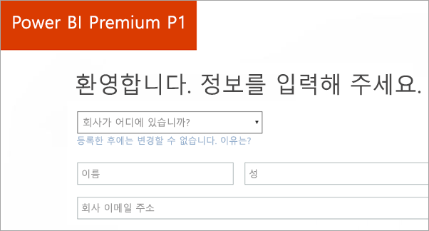
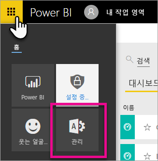
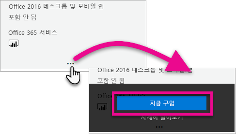
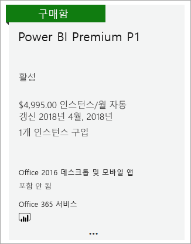
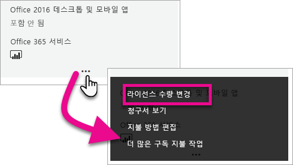
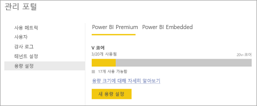
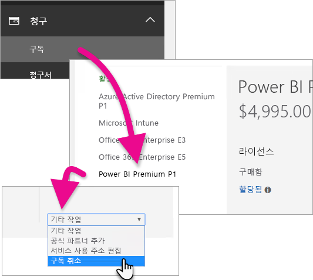
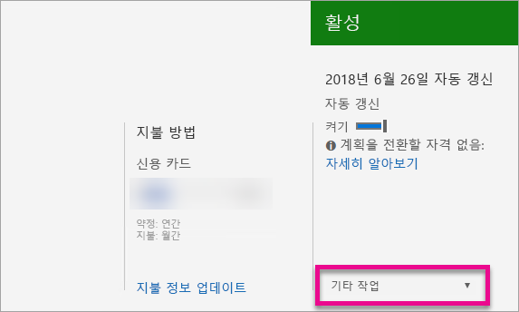

# Power BI 프리미엄 구매 방법
조직에 대한 Power BI 프리미엄 용량을 구입하는 방법을 알아봅니다.

<iframe width="640" height="360" src="https://www.youtube.com/embed/NkvYs5Qp4iA?rel=0&amp;showinfo=0" frameborder="0" allowfullscreen></iframe>

Office 365 관리 센터를 통해 Power BI 프리미엄 용량 노드를 구입할 수 있습니다. 또한 조직 내에서 프리미엄 용량 SKU(P1~P3)의 임의 조합도 포함할 수 있습니다. 이러한 조합은 다양한 리소스 기능을 제공합니다.

Power BI 프리미엄에 대한 자세한 내용은 [Power BI 프리미엄이란?](service-premium.md)을 참조하세요. Power BI에 대한 현재 가격 책정을 보려면 [Power BI 가격 책정 페이지](https://powerbi.microsoft.com/pricing/)를 참조하세요. [Power BI Premium 계산기](https://powerbi.microsoft.com/calculator/)를 사용하여 Power BI 프리미엄에 대한 비용도 계획할 수 있습니다.

> [!IMPORTANT]
> Power BI 프리미엄을 구입했더라도 콘텐츠 작성자는 여전히 Power BI Pro 라이선스가 필요합니다.
> 
> 

## Power BI 프리미엄 P1로 새 테넌트 만들기
기존 테넌트가 없어 새로 하나를 만들려면 Power BI 프리미엄도 동시에 구입할 수 있습니다. 다음 링크를 통해 Office 365를 사용하여 새 테넌트를 만드는 과정을 안내받고 Power BI 프리미엄을 구입할 수 있습니다. 테넌트가 만들어지면 사용자용 Power BI Pro 라이선스를 구입해야 합니다. 테넌트를 만들면 자동으로 해당 테넌트에 대한 전역 관리자가 됩니다.

이 라이선스를 구입하려면 [Power BI 프리미엄 P1 제품](https://signup.microsoft.com/Signup?OfferId=b3ec5615-cc11-48de-967d-8d79f7cb0af1)을 참조하세요.

## 기존 조직에 대한 Power BI 프리미엄 용량 구입
기존 조직이 있는 경우 구독 및 라이선스를 구입하려면, 전역 관리자 또는 대금 청구 관리자여야 합니다. 자세한 내용은 [Office 365 관리자 역할 정보](https://support.office.com/article/About-Office-365-admin-roles-da585eea-f576-4f55-a1e0-87090b6aaa9d)를 참조하세요.

프리미엄 용량을 구입하려면 다음을 수행해야 합니다.

1. Power BI 서비스 내에서 **Office 365 앱 선택** > **관리자**를 선택합니다. 또는 Office 365 관리 센터를 찾아볼 수 있습니다. https://portal.office.com으로 이동하고 **관리**를 선택하여 도달할 수 있습니다.
   
    
2. **청구** > **서비스 구입**을 선택합니다.
3. **기타 계획** 아래에서 Power BI 프리미엄 제품을 찾습니다. P1~P3, EM3 및 P1(매월)로 나열됩니다.
4. **줄임표(...)**를 마우스로 가리키고 **지금 구입**을 선택합니다.
   
    
5. 단계에 따라 구입을 완료합니다.

또한 이러한 항목의 구입 페이지로 바로 이동하는 다음 링크를 선택할 수도 있습니다. 이러한 SKU에 대한 자세한 내용은 [Power BI 프리미엄이란?](service-premium.md#premiumskus)을 참조하세요.

Power BI Premium SKU를 구입하려면 테넌트 내에서 ***전역 또는 대금 청구 관리자***여야 합니다. 관리자가 아닌 경우 아래 링크를 선택하면 오류가 발생합니다.

| 바로 구입 링크 |
| --- |
| [EM3(매월) SKU](https://portal.office.com/commerce/completeorder.aspx?OfferId=4004702D-749C-4F74-BF47-3048F1833780&adminportal=1) |
| [P1 SKU](https://portal.office.com/commerce/completeorder.aspx?OfferId=b3ec5615-cc11-48de-967d-8d79f7cb0af1&adminportal=1) |
| [P1(매월) SKU](https://portal.office.com/commerce/completeorder.aspx?OfferId=E4C8EDD3-74A1-4D42-A738-C647972FBE81&adminportal=1) |
| [P2 SKU](https://portal.office.com/commerce/completeorder.aspx?OfferId=062F2AA7-B4BC-4B0E-980F-2072102D8605&adminportal=1) |
| [P3 SKU](https://portal.office.com/commerce/completeorder.aspx?OfferId=40c7d673-375c-42a1-84ca-f993a524fed0&adminportal=1) |

구입을 완료하면 서비스 구입 화면에 항목을 구입했고 활성 상태인 것으로 표시됩니다.

이제 Power BI 관리 센터 내에서 이 용량을 관리할 수 있습니다. 자세한 내용은 [Power BI 프리미엄 관리](service-admin-premium-manage.md)를 참조하세요.

## 추가 용량 구입
Power BI 관리 포털의 **프리미엄 설정**에 있고 관리자인 경우 **추가 구입** 단추가 표시됩니다. 이 단추를 통해 Office 365 포털으로 이동합니다. Office 365 관리 센터에 있는 경우 다음을 수행할 수 있습니다.

1. **청구** > **서비스 구입**을 선택합니다.
2. **기타 계획** 아래에서 추가로 구입할 Power BI 프리미엄 항목을 찾습니다.
3. **줄임표(...)**를 마우스로 가리키고 **라이선스 수량 변경**을 선택합니다.
   
    
4. 이 항목에 대해 포함할 인스턴스 수를 변경합니다. 그런 다음 완료했으면 **제출**을 선택합니다.
   
   > [!IMPORTANT]
   > **제출**을 선택하면 파일의 신용 카드에 요금이 발생합니다.
   > 
   > 

**서비스 구입** 페이지에 보유하고 있는 인스턴스 수가 표시됩니다. Power BI 관리 포털 내의 **용량 설정** 아래에서 사용 가능한 V 코어는 구입한 새 용량을 반영합니다.

이제 Power BI 관리 센터 내에서 이 용량을 관리할 수 있습니다. 자세한 내용은 [Power BI 프리미엄 관리](service-admin-premium-manage.md)를 참조하세요.

## 구독 취소
Office 365 관리 센터 내에서 구독을 취소할 수 있습니다. 프리미엄 구독을 취소하려면 다음을 수행합니다.

1. Office 365 관리 센터로 이동합니다.
2. **청구** > **구독**을 선택합니다.
3. 목록에서 Power BI 프리미엄 구독을 선택합니다.
4. **추가 작업** 드롭다운에서 **구독 취소**를 선택합니다.
   
    
5. **구독 취소** 페이지는 [조기 종료 요금](https://support.office.com/article/early-termination-fees-6487d4de-401a-466f-8bc3-c0beb5cc40d3)에 대한 책임 여부를 나타냅니다. 이 페이지는 구독에 대한 데이터가 삭제될 때도 이를 알려줍니다.
6. 정보를 자세히 읽고 계속하려면 **구독 취소**를 선택합니다.

## 다음 단계
[Power BI 가격 책정 페이지](https://powerbi.microsoft.com/pricing/)  
[Power BI 프리미엄 계산기](https://powerbi.microsoft.com/calculator/)  
[Power BI 프리미엄이란?](service-premium.md)  
[Power BI 프리미엄 관리](service-admin-premium-manage.md)  
[Power BI 프리미엄 FAQ](service-premium-faq.md)  
[Power BI 프리미엄 릴리스 정보](service-premium-release-notes.md)  
[Microsoft Power BI 프리미엄 백서](https://aka.ms/pbipremiumwhitepaper)  
[Power BI Enterprise 배포 계획 백서](https://aka.ms/pbienterprisedeploy)  
[Power BI 관리 포털](service-admin-portal.md)  
[조직에서 Power BI 관리](service-admin-administering-power-bi-in-your-organization.md)  

궁금한 점이 더 있나요? [Power BI 커뮤니티에 질문합니다.](http://community.powerbi.com/)

