# Power BI Pro 라이선스 구매 및 할당

Power BI Pro는 콘텐츠를 공유하고 다른 Pro 사용자와 공동으로 작업하는 기능을 포함하여 Power BI 서비스의 모든 콘텐츠 및 기능에 액세스할 수 있는 개별 라이선스입니다. Pro 사용자만 앱 작업 영역에서 콘텐츠를 게시 및 사용하고, 대시보드를 공유하고, 대시보드 및 보고서를 구독할 수 있습니다. 자세한 내용은 [라이선스 유형별 Power BI 기능](service-features-license-type.md)을 참조하세요.

이 문서에서는 먼저 Office 365에서 Power BI Pro 라이선스를 구매하는 방법을 설명합니다. 그런 다음, 개별 사용자에게 라이선스를 할당하는 두 가지 옵션인 Office 365 및 Azure를 설명합니다. 둘 중 한 가지 옵션을 선택합니다.

## 필수 조건

Office 365의 [**전역 관리자** 또는 **대금 청구 관리자**](https://support.office.com/article/about-office-365-admin-roles-da585eea-f576-4f55-a1e0-87090b6aaa9d?ui=en-US&rs=en-US&ad=US) 역할의 구성원이어야 합니다.

Azure에서 라이선스를 할당하려면 Power BI에서 Active Directory 조회에 사용하는 Azure 구독의 소유자여야 합니다.

## Office 365의 구매 라이선스

Power BI Pro 라이선스를 구매하려면 다음 단계를 수행합니다.

1. [Office 365 관리 센터](https://portal.office.com/adminportal/home#/homepage)를 엽니다.

2. 왼쪽 탐색 창에서 **청구** > **구독**을 선택

    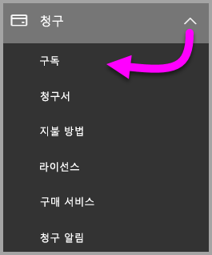

3. **구독** 페이지의 오른쪽 위 모서리에서 **구독 추가**를 선택합니다.

    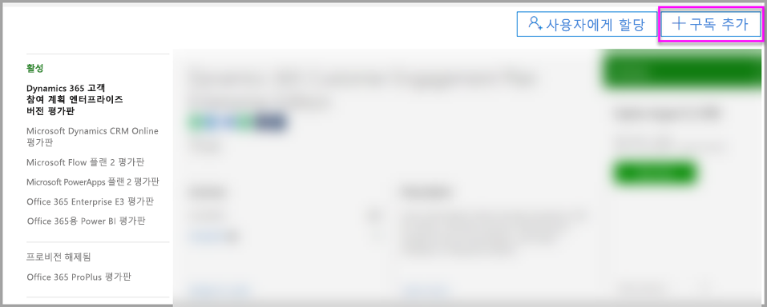

4. 원하는 구독 제안을 찾습니다.

    **엔터프라이즈용 제품군**에서 **Office 365 Enterprise E5**를 선택합니다.

    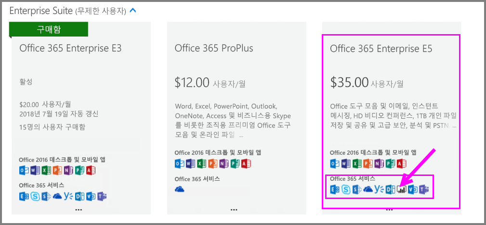

    **다른 계획**에서 **Power BI Pro**를 선택합니다.

    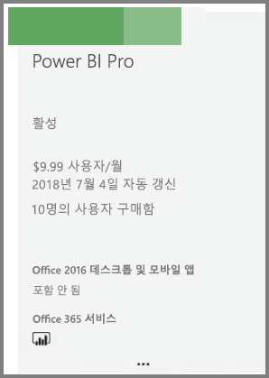

5. 원하는 구독에서 줄임표(**. . .**)를 마우스로 가리키고 **지금 구입**을 선택합니다.

    

6. 청구에서 원하는 대로 **월정액** 또는 **1년 결재**를 선택합니다.

7. **원하는 사용자 수**에서 원하는 라이선스 수를 입력한 다음, **지금 확인**을 선택하여 트랜잭션을 완료합니다.

8. 이제 구매한 구독이 **구독** 페이지에 나열되는지 확인합니다.

   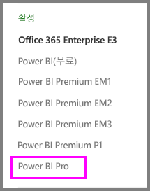

9. 최초 구매 후에 더 많은 라이선스를 추가하려면 **구독** 페이지에서 **Power BI Pro**를 선택한 다음, **라이선스 추가/제거**를 선택합니다.

## Office 365에서 라이선스 할당

다음 단계를 수행하여 개별 사용자 계정에 Power BI Pro 라이선스를 할당합니다.

1. [Office 365 관리 센터](https://portal.office.com/adminportal/home#/homepage)를 엽니다.

2. 왼쪽 탐색 창에서 **사용자**를 확장하고 **활성 사용자**를 선택합니다.

    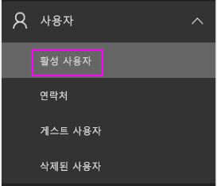

3. 사용자를 선택한 다음, **제품 라이선스** 아래에서 **편집**을 선택합니다.

    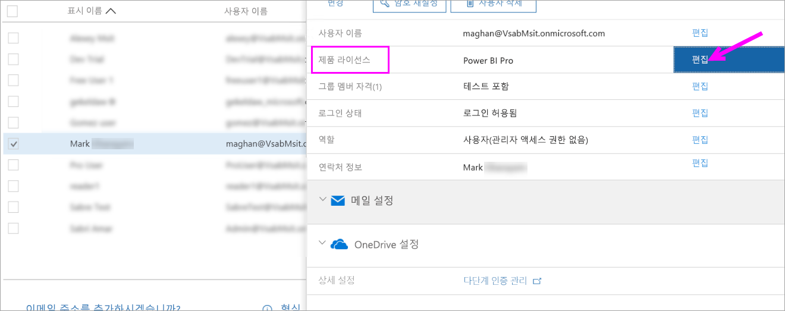

4. **Power BI Pro**에서 설정을 **켜기**로 전환한 다음, **저장**을 선택합니다.

    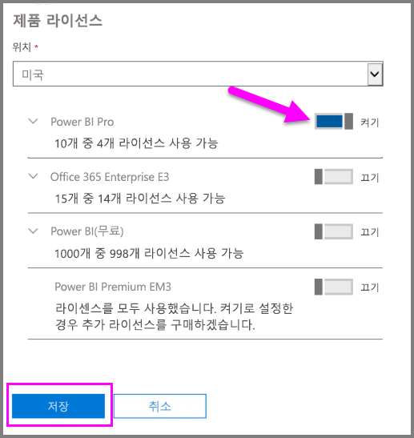

5. 선택한 계정의 **상태**에서 Power BI Pro 라이선스가 성공적으로 할당되었는지 확인합니다.

    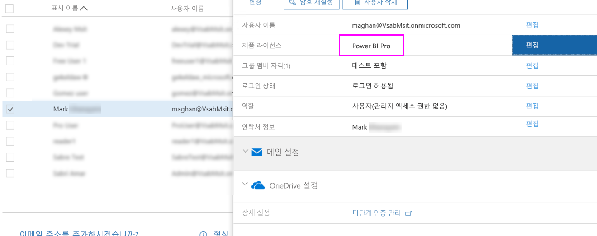

## Azure에서 라이선스 할당

다음 단계를 수행하여 개별 사용자 계정에 Power BI Pro 라이선스를 할당합니다.

1. [Azure Portal](https://ms.portal.azure.com/#@microsoft.onmicrosoft.com/dashboard/private/39bc3cf7-31a4-43f6-954c-f2d69ca2f0)을 엽니다.

2. 왼쪽 탐색 모음에서 **Azure Active Directory**를 선택합니다.

    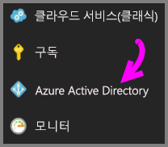

3. **Azure Active Directory** 아래에서 **라이선스**를 선택합니다.

    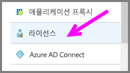

4. **라이선스** 아래에서 **모든 제품**을 선택한 다음, **Power BI Pro**를 선택하여 사용이 허가된 사용자 목록을 표시합니다.

    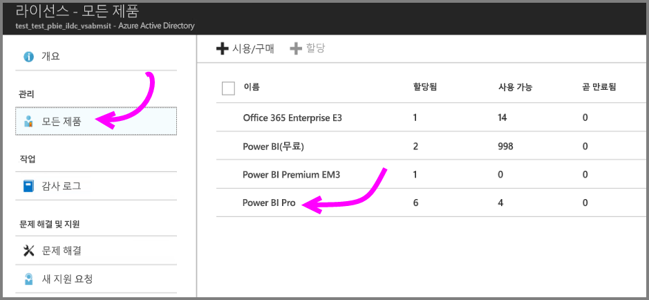

5. **할당**을 선택하여 Power BI Pro 라이선스를 추가 사용자 계정에 추가합니다.

    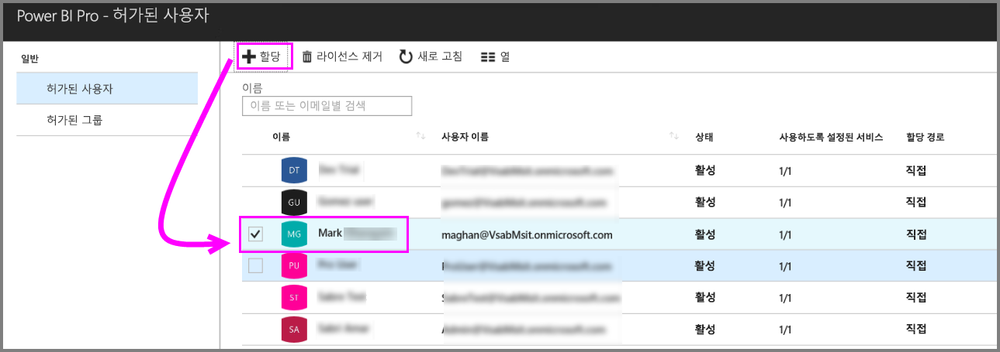

## 다음 단계

이제 라이선스를 할당했으므로 Power BI Pro에 대해 자세히 알아봅니다.

[조직의 Power BI 라이선스 부여](service-admin-licensing-organization.md)

[로그인한 Power BI 사용자 찾기](service-admin-access-usage.md)

궁금한 점이 더 있나요? [Power BI 커뮤니티에 질문합니다.](https://community.powerbi.com/)
