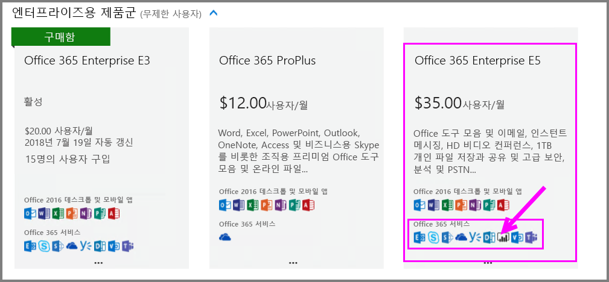
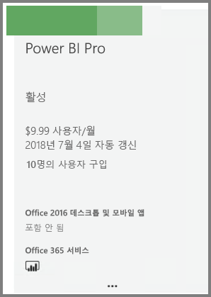

# Power BI Pro 구매

Power BI Pro를 사용하여 보고서를 게시하고, 대시보드를 공유하고, 작업 영역에서 동료와 공동 작업을 수행하며, 기타 관련된 작업을 수행할 수 있습니다. 조직에서 Power BI Pro를 활용하는 방법에 대한 자세한 내용은 [조직의 Power BI Pro](service-admin-power-bi-pro-in-your-organization.md)를 참조하세요.

## Office 365 관리 센터를 통해 Power BI Pro 구매

Office IT 관리자는 Office 365 Enterprise E5 구독 또는 별도 Power BI Pro 구독의 일부로 Power BI Pro를 구매할 수 있습니다. 그런 다음, 적합한 사용자에게 Power BI Pro 라이선스를 할당할 수 있습니다. 라이선스를 할당하는 방법에 대한 자세한 내용은 [Office 365에서 사용자에게 라이선스 할당](https://support.office.com/en-us/article/assign-licenses-to-users-in-office-365-for-business-997596b5-4173-4627-b915-36abac6786dc?ui=en-US&rs=en-US&ad=US)을 참조하세요.

Office IT 관리자인 경우 Power BI Pro를 구매하려면 다음과 같은 단계를 수행합니다.

1. [Office 365 관리 센터](https://portal.office.com/adminportal/home#/homepage)로 이동합니다.
2. 왼쪽 탐색 창에서 청구를 선택한 다음, 구독을 클릭합니다.

    

3. 구독 페이지의 오른쪽 위 모서리에서 구독 추가를 클릭합니다.

    

4. 원하는 구독 제품을 찾습니다.

    Enterprise용 제품군에서 Office 365 Enterprise E5를 선택합니다.

    

    다른 계획에서 Power BI Pro를 선택합니다.

    

5. 원하는 구독에서 줄임표(...)를 마우스로 가리키고 지금 구매를 선택합니다.

    

6. 청구에서 원하는 대로 월정액 또는 1년 결재를 선택합니다.
7. 원하는 사용자 수에서 원하는 라이선스 수를 입력한 다음, 지금 확인 또는 카트에 추가를 클릭하고 트랜잭션을 완료합니다.
8. 이제 구매한 구독이 구독 페이지에 나열되는지 확인합니다.

   

> [!NOTE]
> 초기 구입 후에 라이선스를 추가할 수 있습니다. 구독 페이지에서 Power BI Pro 구독을 선택한 다음, 라이선스를 추가/제거를 클릭합니다.
>

## 가격

최신 가격 책정 정보는 [Power BI 가격 책정](https://powerbi.microsoft.com/en-us/pricing/)을 참조하세요.

> [!NOTE]
> Pro 라이선스가 할당된 사용자는 구독이 종료된 후 30일 동안 모든 권한을 보유합니다. 이 문제가 발생하면 관리 포털에서 구독이 “만료됨”으로 표시됩니다.
>

## 다음 단계
[Power BI에 대한 셀프 서비스 등록](service-admin-signing-up-for-power-bi-with-a-new-office-365-trial.md)
 
[조직의 Power BI(무료)](service-admin-service-free-in-your-organization.md)
 
[조직의 Power BI Pro](service-admin-power-bi-pro-in-your-organization.md)
 
[Extended Pro 평가판 활성화](service-extended-pro-trial.md)
 
[Power BI Pro 라이선스 할당](service-admin-assigning-power-bi-pro-licenses.md)
 
[Power BI 프리미엄이란?](service-admin-premium-manage.md)
 
[Power BI 프리미엄 구매 방법](service-admin-premium-purchase.md)
 
[Power BI 프리미엄 백서](https://aka.ms/pbipremiumwhitepaper)

궁금한 점이 더 있나요? [Power BI 커뮤니티에 질문합니다.](https://community.powerbi.com/)
