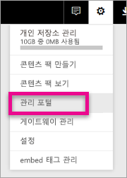

# <a name="understanding-the-power-bi-admin-role"></a>Power BI 관리자 역할 이해
조직 내에서 Power BI 관리자 역할을 사용하는 방법을 알아봅니다.

<iframe width="640" height="360" src="https://www.youtube.com/embed/PQRbdJgEm3k?showinfo=0" frameborder="0" allowfullscreen></iframe>

Power BI 서비스 관리자 역할은 다른 Office 365 관리 액세스 권한을 부여하지 않고 Power BI 관리 포털에 액세스할 수 있습니다. 예를 들어, 전역 관리자 역할입니다. 조직을 위해 Power BI를 관리하는 담당자에게 주어집니다.

Office 365 사용자 관리자는 사용자를 Office 365 관리 센터 내에서나 PowerShell 스크립트를 통해 Power BI 관리자로 할당할 수 있습니다. 사용자가 할당되면 [Power BI 관리자 포털](service-admin-portal.md)에 액세스할 수 있습니다. 여기서 테넌트 전체 사용 현황 메트릭에 액세스하고 Power BI 기능의 테넌트 전체 사용 현황을 제어할 수 있습니다.



## <a name="using-the-office-365-admin-center-to-assign-a-role"></a>Office 365 관리 센터를 사용하여 역할 할당
Office 365 관리 센터 내에서 Power BI 관리자 역할에 사용자를 할당하려면 다음을 수행할 수 있습니다.

1. Office 365 관리 센터를 찾아 **사용자** > **활성 사용자**를 선택합니다.
   
    
2. 역할을 할당하려는 사용자를 선택합니다.
3. 역할에서 **편집**을 선택합니다.
   
    
4. **사용자 지정된 관리자** > **Power BI 서비스 관리자**를 선택합니다.
   
    
5. **저장**을 선택합니다.

해당 사용자의 역할에 대해 나열된 **Power BI 서비스 관리자**가 표시되어야 합니다. 해당 사용자는 이제 [Power BI 관리 포털](service-admin-portal.md)에 액세스할 수 있습니다.


## <a name="using-powershell-to-assign-a-role"></a>PowerShell을 사용하여 역할 할당
PowerShell 명령을 실행하려면 Azure Active Directory PowerShell 모듈이 설치되어 있어야 합니다.

### <a name="download-azure-ad-powershell-module"></a>Azure AD PowerShell 모듈 다운로드
[Azure Active Directory PowerShell 버전 2 다운로드](https://github.com/Azure/azure-docs-powershell-azuread/blob/master/Azure%20AD%20Cmdlets/AzureAD/index.md)

[Azure Active Directory PowerShell 버전 1.1.166.0 GA 다운로드](http://connect.microsoft.com/site1164/Downloads/DownloadDetails.aspx?DownloadID=59185)

### <a name="command-to-add-role-to-member"></a>구성원에게 역할을 추가하는 명령
**Azure AD PowerShell v2 명령**

**Power BI 서비스 관리자** 역할에 **ObjectId**를 가져올 필요는 없습니다. [Get AzureADDirectoryRole](https://docs.microsoft.com/powershell/azuread/v2/get-azureaddirectoryrole)을 실행하여 **ObjectId**를 가져올 수 있습니다.

```
PS C:\Windows\system32> Get-AzureADDirectoryRole

ObjectId                             DisplayName                        Description
--------                             -----------                        -----------
00f79122-c45d-436d-8d4a-2c0c6ca246bf Power BI Service Administrator     Full access in the Power BI Service.
250d1222-4bc0-4b4b-8466-5d5765d14af9 Helpdesk Administrator             Helpdesk Administrator has access to perform..
3ddec257-efdc-423d-9d24-b7cf29e0c86b Directory Synchronization Accounts Directory Synchronization Accounts
50daa576-896c-4bf3-a84e-1d9d1875c7a7 Company Administrator              Company Administrator role has full access t..
6a452384-6eb9-4793-8782-f4e7313b4dfd Device Administrators              Device Administrators
9900b7db-35d9-4e56-a8e3-c5026cac3a11 AdHoc License Administrator        Allows access manage AdHoc license.
a3631cce-16ce-47a3-bbe1-79b9774a0570 Directory Readers                  Allows access to various read only tasks in ..
f727e2f3-0829-41a7-8c5c-5af83c37f57b Email Verified User Creator        Allows creation of new email verified users.
```

이 경우에 역할 objectid는 00f79122-c45d-436d-8d4a-2c0c6ca246bf입니다.

사용자 **ObjectID**를 알고 있어야 합니다. [Get AzureADUser](https://docs.microsoft.com/powershell/azuread/v2/get-azureaduser)를 실행하여 찾을 수 있습니다.

```
PS C:\Windows\system32> Get-AzureADUser -SearchString 'tim@contoso.com'

ObjectId                             DisplayName UserPrincipalName      UserType
--------                             ----------- -----------------      --------
6a2bfca2-98ba-413a-be61-6e4bbb8b8a4c Tim         tim@contoso.com        Member
```

역할에 멤버를 추가하려면 [Add-AzureADDirectoryRoleMember](https://docs.microsoft.com/powershell/azuread/v2/add-azureaddirectoryrolemember)를 실행합니다.

| 매개 변수 | 설명 |
| --- | --- |
| ObjectId |역할 ObjectId |
| RefObjectId |구성원 ObjectId |

```
Add-AzureADDirectoryRoleMember -ObjectId 00f79122-c45d-436d-8d4a-2c0c6ca246bf -RefObjectId 6a2bfca2-98ba-413a-be61-6e4bbb8b8a4c
```

**Azure AD PowerShell v1 명령**

Azure AD v1 cmdlet을 사용하여 역할에 구성원을 추가하려면 [Add-MsolRoleMember](https://docs.microsoft.com/powershell/msonline/v1/add-msolrolemember) 명령을 실행하려고 합니다.

```
Add-MsolRoleMember -RoleMemberEmailAddress "tim@contoso.com" -RoleName "Power BI Service Administrator"
```

## <a name="limitations-and-considerations"></a>제한 사항 및 고려 사항
Power BI 서비스 관리자 역할은 다음에 대한 액세스 권한을 제공하지 않습니다.

* Office 365 관리 센터 내에서 사용자와 라이선스를 수정하는 기능
* 감사 로그 액세스. 자세한 내용은 [조직 내에서 감사 사용](service-admin-auditing.md)을 참조하세요.

## <a name="next-steps"></a>다음 단계
[Power BI 관리 포털](service-admin-portal.md)  
[Add-AzureADDirectoryRoleMember](https://docs.microsoft.com/powershell/azuread/v2/add-azureaddirectoryrolemember)  
[Add-MsolRoleMember](https://docs.microsoft.com/powershell/msonline/v1/add-msolrolemember)  
[조직에서 Power BI 감사](service-admin-auditing.md)  
[조직에서 Power BI 관리](service-admin-administering-power-bi-in-your-organization.md)  

궁금한 점이 더 있나요? [Power BI 커뮤니티에 질문합니다.](http://community.powerbi.com/)

