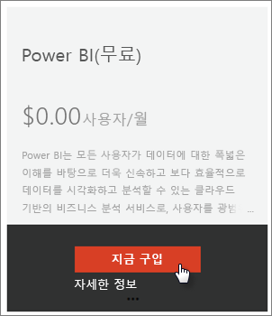
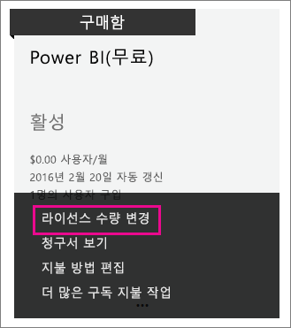

# 조직의 Power BI(무료)
조직 내에서 Power BI(무료) 제품을 사용할 수 있는 방법을 살펴봅니다. 조직이란 테넌트가 있으며 해당 테넌트 내에서 사용자 및 서비스를 관리할 수 있음을 의미합니다. 관리자는 라이선스 할당을 제어할 수 있거나 사용자가 개별로 등록하도록 허용할 수 있습니다. Power BI(무료) 라이선스 및 개별 로그인을 제어하는 방법을 살펴보겠습니다.

## 개인 등록 및 라이선스 할당
조직 내의 사용자는 두 가지 방법으로 Power BI에 액세스할 수 있습니다. Power BI에 개별적으로 등록할 수 있거나 Office 365 관리자 포털 내에서 Power BI 라이선스를 할당받을 수 있습니다.

조직 관리자가 Power BI에 관심이 있는 사용자가 무료로 등록하도록 허용하여 개인 등록을 허용해야 하는 부담을 줄입니다.

제어를 위해 개별 로그인을 차단할 수 있으며 Office 365 관리 센터 내에서 직접 Power BI 라이선스를 할당할 수 있습니다. 이 옵션을 사용하면 조직 내에서 누가 어떤 서비스에 액세스할 수 있는지 특정할 수 있습니다. 감사를 처리하고 누가 어떤 것을 사용할 수 있는지 정확하게 알아야 하는 경우 유용한 옵션입니다.

## 무제한 라이선스 블록을 가져오는 방법
Office 365 관리 센터 내의 **청구** > **라이선스**에서 무제한 라이선스로 Power BI (무료)가 표시되거나 표시되지 않을 수 있습니다.

라이선스의 이 차단은 처음으로 누군가 개별로 Power BI에 가입한 후에 표시됩니다. 그 과정에서 이 라이선스 차단은 조직과 연결되고 라이선스는 등록하는 사용자에게 할당됩니다.

개인 사용자 등록을 차단하고 아무도 등록하지 않는 경우 이 라이선스 차단은 표시되지 않습니다. 다음 이야기는 추가 Office 365 구독 흐름을 통해 무료 라이선스를 가져올 수 또는 개인 사용자 로그인과에 한 명의 사용자를 등록 하거나 허용할 수 있습니다.

Power BI(무료) 라이선스 차단을 사용할 수 있게 되면 사용자에게 해당 라이선스를 할당할 수 있습니다. 라이선스를 할당하는 방법에 대한 자세한 내용은 [Office 365에서 사용자에게 라이선스 할당](https://support.office.com/article/Assign-or-unassign-licenses-for-Office-365-for-business-997596b5-4173-4627-b915-36abac6786dc)을 참조하세요.

## Office 365 내에서 구독 추가를 통해 무료 라이선스 가져오기
1. [Office 365 관리 센터](https://portal.office.com/admin/default.aspx)로 이동합니다.
2. 왼쪽 탐색 창에서 **청구** > **구독**을 선택
3. 오른쪽에서 **구독 추가 +** 를 선택합니다.
4. 다른 계획에서 Power BI(무료)에 대한 **줄임표(...)** 를 마우스로 가리키고 **지금 구매**를 선택합니다.
   
    
5. 추가하려는 라이선스의 수를 입력하고 **지금 확인** 또는 **카트에 추가**를 선택합니다.
   
   > [!NOTE]
   > 필요한 경우 나중에 더 추가할 수 있습니다.
   > 
   > 
6. 체크 아웃 흐름에서 필요한 정보를 입력합니다.

이 방법을 사용하면 결제를 위해 신용 카드 정보를 입력하거나 송장 발급을 선택해야 하지만 제품을 구입하지는 않습니다.

나중에 다른 라이선스를 추가하려면 **구독 추가**로 돌아가서 Power BI(무료)에 대해 **라이선스 수량 변경**을 선택할 수 있습니다.

이제 사용자에게 라이선스를 할당할 수 있습니다. 라이선스를 할당하는 방법에 대한 자세한 내용은 [Office 365에서 사용자에게 라이선스 할당](https://support.office.com/article/Assign-or-unassign-licenses-for-Office-365-for-business-997596b5-4173-4627-b915-36abac6786dc)을 참조하세요.

## Azure Active Directory에서 개인 사용자 등록 사용 또는 사용 안 함
관리자로서 개인 사용자 등록을 AAD(Azure Active Directory)의 일부로 사용하거나 사용하지 않을 수 있습니다. AAD PowerShell 명령을 활용하는 방법을 아는 경우 임시 구독을 사용하거나 사용하지 않을 수 있습니다. [자세히 알아보기](https://technet.microsoft.com/library/jj151815.aspx)

이를 제어하는 AAD 설정은 **AllowAdHocSubscriptions**입니다. 대부분의 테넌트에서는 이 설정을 true로 설정되어 사용합니다. 파트너를 통해 Power BI를 구입한 경우 기본적으로 false로 설정되어 사용하지 않습니다.

1. 먼저 Office 365 자격 증명을 사용하여 Azure Active Directory에 로그인해야 합니다. 첫 번째 행에서 자격 증명을 확인합니다. 두 번째 행은 Azure Active Directory에 연결합니다.
   
     $msolcred = get-credential   connect-msolservice -credential $msolcred
   
   
2. 로그인하면 테넌트가 현재 구성된 항목을 참조하도록 다음 명령을 시작할 수 있습니다.
   
     Get-MsolCompanyInformation | fl AllowAdHocSubscriptions
3. AllowAdHocSubscriptions을 사용하거나($true) 사용하지 않도록($false) 이 명령을 사용할 수 있습니다.
   
     Set-MsolCompanySettings -AllowAdHocSubscriptions $true

> [!NOTE]
> 이 차단은 조직의 새 사용자가 Power BI에 등록하지 못하게 합니다. 조직에 대해 새 등록을 사용하지 않도록 설정하기 전에 Power BI에 등록하는 사용자는 라이선스를 여전히 유지합니다.
> 
> 

## 다음 단계
[Power BI에 대한 셀프 서비스 등록](service-self-service-signup-for-power-bi.md)  
[Power BI Pro 구매](service-admin-purchasing-power-bi-pro.md)  
[사용자 지정 Azure Active Directory 테넌트로 Power BI(무료)에 등록](developer/create-an-azure-active-directory-tenant.md)  
[Power BI 프리미엄이란?](service-premium.md)  
[Power BI 프리미엄 백서](https://aka.ms/pbipremiumwhitepaper)  

궁금한 점이 더 있나요? [Power BI 커뮤니티에 질문합니다.](http://community.powerbi.com/)

