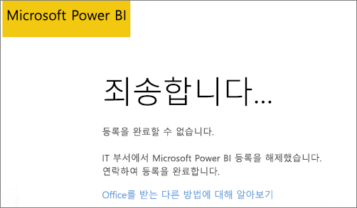
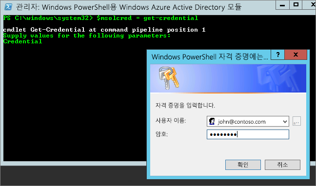

# Office 365 파트너 구독에 Power BI를 추가할 수 없음
Office 365는 회사에서 Office 365를 자사의 솔루션에 통합하여 재판매함으로써 최종 고객에게 구매, 청구 및 지원을 위한 단일 접점을 제공할 수 있도록 합니다.

Office 365 구독과 함께 Power BI를 구매하려면 파트너에게 문의하는 것이 좋습니다. 파트너가 Power BI를 제공하지 않을 경우 고려할 수 있는 다른 옵션이 제공됩니다.

1. Microsoft로부터 직접 또는 다른 파트너를 통해 다른 채널의 서비스를 구매할 수 있습니다. 이 옵션은 파트너와의 관계에 따라 모든 고객이 사용할 수 있는 것은 아닙니다. 파트너와의 관계를 확인하려면 **Office 365 관리 포털** > **청구** > **구독**으로 이동하면 됩니다. **구독**이 표시되면 Microsoft로부터 서비스를 직접 구매하거나 Power BI를 판매하는 파트너에게 문의할 수 있습니다.
   
    
2. **구독** 이 **청구**아래에 표시되지 않으면 Microsoft로부터 직접 또는 다른 파트너를 통해 구매할 수 없습니다. 
   
   

Power BI를 직접 구매할 수 없는 경우 관심 있는 Power BI 구독 유형에 따라 몇 가지 옵션이 제공됩니다.

[Power BI(무료)](#power-bi-free)

[Power BI Pro 및 프리미엄](#power-bi-pro)

## Power BI (무료)
Power BI 무료 제공에 만족하는 경우 무료 서비스에 서명하면 됩니다. 기본적으로 애드혹 구독이라고도 하는 개별 등록이 사용하지 않도록 설정되어 있습니다. Power BI에 등록하려고 하면 IT 부서에서 Microsoft Power BI에 대한 등록을 해제했다는 것을 나타내는 메시지가 표시됩니다.

    Your IT department has turned off signup for Microsoft Power BI.

애드혹 구독을 사용하도록 설정하려면 파트너에게 연락하여 애드혹 구독을 설정해 달라고 요청할 수 있습니다. 테넌트 관리자이고 Azure Active Directory PowerShell 명령을 활용하는 방법을 알고 있는 경우 직접 애드혹 구독을 사용하도록 설정할 수 있습니다. [자세히 알아보기](https://technet.microsoft.com/library/jj151815.aspx)

1. 먼저 Office 365 자격 증명을 사용하여 Azure Active Directory에 로그인해야 합니다. 첫 번째 행에서 자격 증명을 확인합니다. 두 번째 행은 Azure Active Directory에 연결합니다.
   
        $msolcred = get-credential
        connect-msolservice -credential $msolcred
   
    
2. 로그인되어 있으면 다음 명령을 실행하여 무료 등록을 사용하도록 설정할 수 있습니다.
   
        Set-MsolCompanySettings -AllowAdHocSubscriptions $true

## Power BI Pro 및 프리미엄
Power BI Pro 또는 Power BI 프리미엄에 대한 구독을 구매하려면 파트너와 협업하여 어떤 옵션이 있는지 고려해야 합니다.

* 파트너가 Power BI를 포트폴리오에 추가하는 데 동의하여 고객이 파트너에게서 구매할 수 있도록 합니다.
* 파트너는 Microsoft로부터 직접 또는 Power BI를 제공하는 다른 파트너로부터 Power BI를 구매할 수 있는 모델로 전환할 수 있습니다.

다음 비디오는 Office 365 신디케이션 및 Power BI 구입에 대해 살펴봅니다.

<iframe width="560" height="315" src="https://www.youtube.com/embed/C357phT94A8" frameborder="0" allowfullscreen></iframe>

## 다음 단계
[Windows PowerShell을 사용하여 Azure AD 관리](https://technet.microsoft.com/library/jj151815.aspx)  
[Power BI 프리미엄이란?](service-premium.md)

궁금한 점이 더 있나요? [Power BI 커뮤니티에 질문합니다.](http://community.powerbi.com/)

