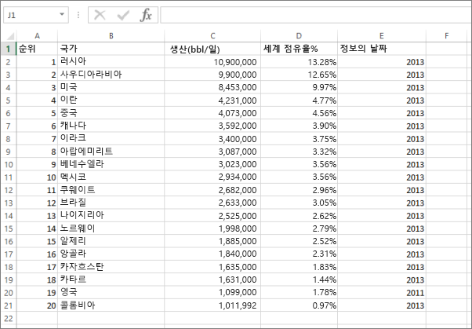
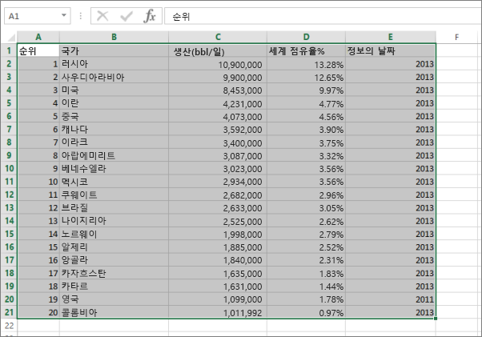
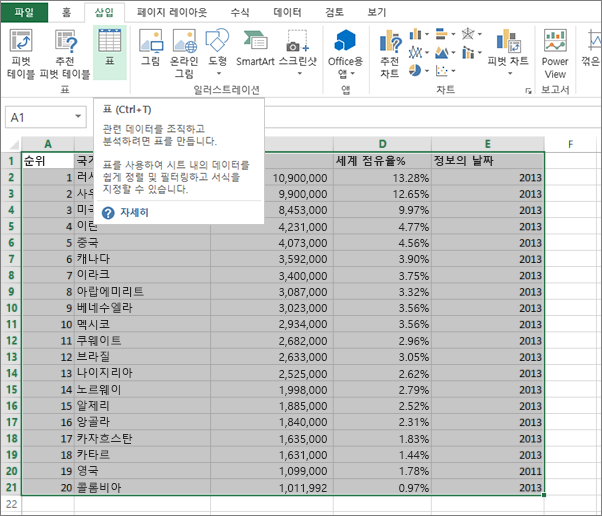
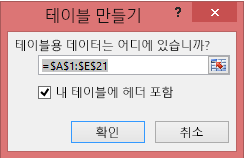
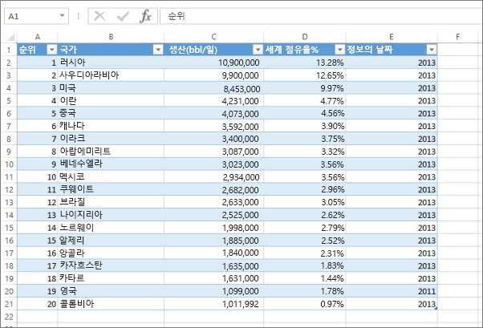
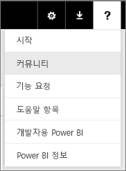

# 오류: Excel 통합 문서에서 데이터를 찾을 수 없습니다.

>[!NOTE]
>이 아티클은 Excel 2007 이상에 적용됩니다.

Power BI로 Excel 통합 문서를 가져오면 다음과 같은 오류가 표시될 수 있습니다.

*오류: Excel 통합 문서에서 데이터를 찾을 수 없습니다. 데이터 서식이 제대로 지정되지 않았을 수 있습니다. Excel에서 통합 문서를 편집한 다음 다시 가져와야 합니다.*

## 빠른 해결 방법
1. Excel에서 통합 문서를 편집합니다.
2. 데이터가 포함된 셀 범위를 선택합니다. 첫 번째 행에는 열 머리글(열 이름)이 포함되어 있어야 합니다.
3. **Ctrl+T** 를 눌러 표를 만듭니다.
4. 통합 문서를 저장합니다.
5. Power BI로 반환하고 통합 문서를 다시 가져오거나 Excel 2016에서 작업하고 비즈니스용 OneDrive에 통합 문서를 저장한 경우 Excel에서 파일 > 게시를 클릭합니다.

## 세부 정보
### 원인
Excel에서 셀 범위를 벗어난 **표** 를 만들어 데이터를 더 쉽게 정렬하고, 필터링하며, 서식을 지정할 수 있습니다.

Excel 통합 문서를 가져오면 Power BI에서 이러한 표를 찾아 데이터 세트로 가져옵니다. 표를 찾지 못하는 경우 이 오류 메시지가 표시됩니다.

### 해결 방법
1. Excel에서 통합 문서를 엽니다. 
    >[!NOTE]
    >여기서 사용된 그림은 Excel 2013용입니다. 다른 버전을 사용하는 경우 약간 다르게 표시될 수 있지만 단계는 동일합니다.
    
    
2. 데이터가 포함된 셀 범위를 선택합니다. 첫 번째 행에는 열 머리글(열 이름)이 포함되어 있어야 합니다.
   
    
3. 리본의 **삽입** 탭에서 **표**를 클릭합니다. 또는 바로 가기로 **Ctrl+T**를 누릅니다.
   
    
4. 다음과 같은 대화 상자가 표시됩니다. **머리글 포함** 이 선택되어 있는지 확인하고 **확인**을 선택합니다.
   
    
5. 이제 데이터의 서식이 표로 지정됩니다.
   
    
6. 통합 문서를 저장합니다.
7. Power BI로 돌아갑니다. 왼쪽 탐색 창의 맨 아래에 있는 데이터 가져오기를 선택합니다.
   
    
8. **파일** 상자에서 **가져오기**를 선택합니다.
   
    
9. Excel 통합 문서를 다시 가져옵니다. 이번에는 가져오기에서 표를 찾아 성공합니다.
   
    가져오기가 계속 실패하는 경우 도움말 메뉴에서 **커뮤니티**를 클릭하여 알립니다.
   
    
