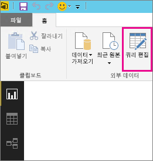
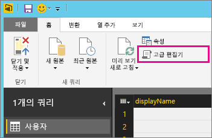

# 새로 고침을 지원하지 않는 데이터 소스 문제 해결
예약 새로 고침에 대해 데이터 집합을 구성할 때 오류가 발생할 수 있습니다.

        You cannot schedule refresh for this dataset because it gets data from sources that currently don’t support refresh.

이러한 오류는 Power BI Desktop에서 사용한 데이터 원본이 새로 고침을 지원하지 않을 때 발생합니다.  사용 중인 데이터 원본을 찾아 [Power BI에서 데이터 새로 고침](refresh-data.md)의 지원되는 데이터 원본 목록과 비교해야 합니다. 

## 데이터 원본 찾기
어떤 데이터 원본을 사용했는지 잘 모를 경우 Power BI Desktop에서 다음 단계를  통해 찾을 수 있습니다.  

1. Power BI Desktop에서 **보고서** 창에 있는지 확인합니다.  
   
2. 리본 메뉴에서 **쿼리 편집** 을 선택합니다.  
   
3. **고급 편집기**를 선택합니다.  
   
4. 원본에 대해 나열된 공급자를 메모해 둡니다.  이 예제에서는 공급자가 ActiveDirectory입니다.  
   
5. [Power BI에서 데이터 새로 고침](refresh-data.md)에 있는 지원되는 데이터 원본 복록과 해당 공급자를 비교합니다.  Active Directory가 새로 고침이 지원되는 데이터 원본이 아님을 알 수 있습니다.  

## 다음 단계
[데이터 새로 고침](refresh-data.md)  
[Power BI 게이트웨이 - 개인](personal-gateway.md)  
[온-프레미스 데이터 게이트웨이](service-gateway-onprem.md)  
[온-프레미스 데이터 게이트웨이 문제 해결](service-gateway-onprem-tshoot.md)  
[Power BI 게이트웨이 - 개인 문제 해결](service-admin-troubleshooting-power-bi-personal-gateway.md)  

궁금한 점이 더 있나요? [Power BI 커뮤니티에 질문합니다.](http://community.powerbi.com/)

