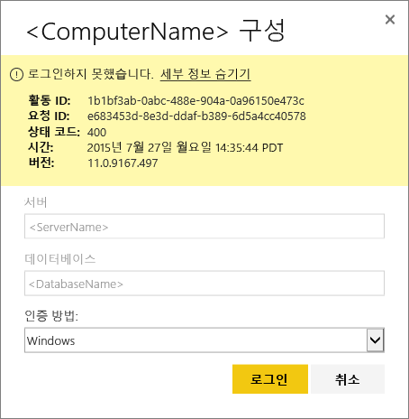
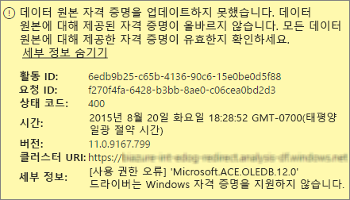
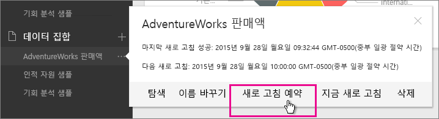
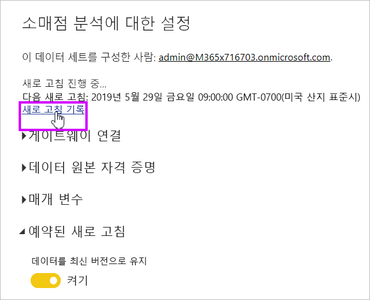
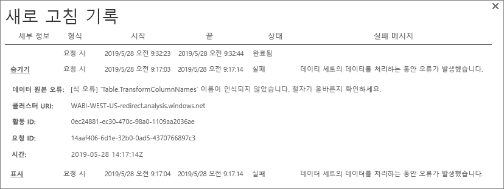
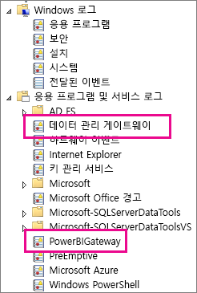
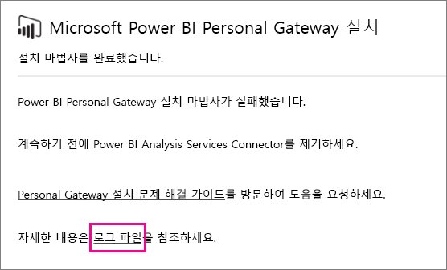

# Power BI Gateway - Personal 문제 해결
다음은 Power BI Gateway - Personal을 사용할 때 발생할 수 있는 몇 가지 일반적인 문제를 설명합니다.

> [!NOTE]
> 개인용 게이트웨이의 현재 버전은 **온-프레미스 데이터 게이트웨이(개인용)** 입니다. 이 버전을 사용하도록 설치를 업데이트하세요.
> 
> 

## 최신 버전으로 업데이트
게이트웨이 버전이 만료되면 많은 문제가 발생할 수 있습니다.  최신 버전을 사용하고 있는지 확인하는 것이 좋습니다.  한 달 이상 게이트웨이를 업데이트하지 않은 경우에는 최신 버전 게이트웨이를 설치하고 문제를 재현할 수 있는지 확인할 수 있습니다.

## 설치
**개인 게이트웨이는 64비트입니다.** - 컴퓨터가 32비트이면 개인 게이트웨이를 설치할 수 없습니다. 운영 체제가 64비트여야 합니다. Windows 64비트 버전을 설치하거나 64비트 컴퓨터에 개인 게이트웨이를 설치해야 합니다.

**컴퓨터의 로컬 관리자인데도 개인 게이트웨이가 서비스로 설치되지 않음** - 사용자가 컴퓨터의 로컬 관리자 그룹에 있지만 그룹 정책이 해당 사용자 이름을 서비스로 로그온하도록 허용하지 않으면 설치가 실패할 수 있습니다.  현재는 그룹 정책이 사용자가 서비스로 로그온할 수 있도록 허용합니다. 이 문제에 대한 수정 중입니다. [자세히 알아보기](https://technet.microsoft.com/library/cc739424.aspx)

**작업 시간이 초과됨** - 일반적으로 개인 게이트웨이를 설치하는 컴퓨터(물리적 컴퓨터 또는 VM)에 단일 코어 프로세서가 있는 경우에 흔히 발생합니다. 애플리케이션을 닫고 필수가 아닌 모든 프로세스를 해제하고 다시 설치해 보세요.

**데이터 관리 게이트웨이 또는 Analysis Services Connector를 개인 게이트웨이와 동일한 컴퓨터에 설치할 수 없음** - Analysis Services Connector 또는 데이터 관리 게이트웨이를 이미 설치한 경우 커넥터 또는 게이트웨이를 먼저 제거한 다음 개인 게이트웨이 설치해 보세요.

> [!NOTE]
> 설치하는 동안 오류가 발생하는 경우 설치 로그에서 문제를 해결하는 데 유용한 정보를 제공할 수 있습니다. 자세한 내용은 [설치 로그](#SetupLogs)를 참조하세요.
> 
> 

 **프록시 구성** 환경에서 프록시를 사용해야 하는 경우 개인 게이트웨이를 구성하는 데 문제가 발생할 수 있습니다. 프록시 정보를 구성하는 방법에 대해 자세히 알아보려면 [Power BI 게이트웨이에 프록시 설정 구성](service-gateway-proxy.md)을 참조하세요.

## 새로 고침 예약
**오류: 클라우드에 저장된 자격 증명이 누락되었습니다.**

새로 고침을 예약한 다음 개인 게이트웨이를 제거하고 다시 설치한 경우 \<dataset\>에 대한 설정에 이 오류가 나타날 수 있습니다. 개인 게이트웨이를 제거하는 경우 새로 고침에 대해 데이터 세트의 데이터 원본 자격 증명이 Power BI 서비스에서 제거됩니다.

**솔루션:** Power BI에서 데이터 집합에 대한 새로 고침 설정으로 이동합니다. 데이터 소스 관리에서 오류가 있는 모든 데이터 소스에 대해 자격 증명 편집을 클릭하고 데이터 소스에 다시 로그인합니다.

**오류: 데이터 집합에 대해 제공된 자격 증명이 올바르지 않습니다. 계속하려면 새로 고침을 통해 또는 데이터 소스 설정 대화 상자에서 자격 증명을 업데이트하세요.**

**솔루션**: 자격 증명 메시지를 받는 경우 다음을 의미할 수 있습니다.

* 데이터 소스에 로그인하는 데 사용된 사용자 이름과 암호가 최신인지 확인합니다. Power BI에서 데이터 세트에 대한 새로 고침 설정으로 이동합니다. 데이터 소스 관리에서 자격 증명 데이터 편집을 클릭하여 데이터 소스에 대한 자격 증명을 업데이트합니다.
* 원본 중 하나가 인증에 OAuth를 사용하는 경우 단일 쿼리에서 클라우드 원본과 온-프레미스 원본 간의 매시업이 개인 게이트웨이에서 새로 고침을 수행하지 못합니다. CRM 온라인과 로컬 SQL Server 간의 매시업이 이에 대한 예입니다. 이 매시업은 CRM 온라인에서 OAuth가 필요하기 때문에 실패합니다.
  
  이는 알려진 문제로 현재 검토 중입니다. 문제를 해결하려면 클라우드 원본 및 온-프레미스 원본에 대해 별도의 쿼리를 만들고 병합 또는 추가 쿼리를 사용하여 이들을 결합합니다.

**오류: 지원되지 않는 데이터 원본입니다.**

**솔루션:** 일정 새로 고침 설정에서 지원되지 않는 데이터 소스 메시지가 표시되면 다음을 의미할 수 있습니다. 

* Power BI에서 현재 데이터 소스 새로 고침이 지원되지 않습니다. 
* Excel 통합 문서에는 데이터 모델이 포함되어 있지 않고, 워크시트 데이터만 포함되어 있습니다. 현재 Power BI는 업로드된 Excel 통합 문서에 데이터 모델이 포함된 경우 새로 고침만 지원합니다. Excel에서 Power Query를 사용하여 데이터를 가져올 때 데이터 모델로 데이터를 로드하는 옵션을 선택해야 합니다. 이렇게 하면 데이터를 데이터 모델로 가져옵니다. 

**오류: [데이터를 결합할 수 없습니다.] &lt;쿼리 부분&gt;/&lt;…&gt;/&lt;…&gt;이 함께 사용할 수 없는 개인 정보 수준의 데이터 원본에 액세스합니다. 이 데이터 조합을 다시 작성합니다.**

**솔루션**: 이 오류는 현재 사용 중인 데이터 소스의 유형 및 개인 정보 수준 제한으로 인해 발생합니다.

**오류: 데이터 원본 오류: "\[테이블\]" 값을 테이블 형식으로 변환할 수 없습니다.**

**솔루션**: 이 오류는 현재 사용 중인 데이터 소스의 유형 및 개인 정보 수준 제한으로 인해 발생합니다.

**오류: 이 행에 필요한 공간이 부족합니다.**

단일 행의 크기가 4MB를 초과할 경우 이 오류가 발생합니다. 데이터 원본에서 해당 행이 무엇인지 확인하고 해당 행을 필터링하거나 해당 행의 크기를 줄여야 합니다.

## 데이터 소스
**누락된 데이터 공급자** – 개인 게이트웨이는 64비트 전용입니다. 64비트 버전의 데이터 공급자를 개인 게이트웨이가 설치한 컴퓨터에 설치해야 합니다. 예를 들어 데이터 세트의 데이터 원본이 Microsoft Access인 경우 개인 게이트웨이를 설치한 컴퓨터에 64비트 ACE 공급자를 설치해야 합니다.  

>[!NOTE]
>32비트 Excel을 사용하는 경우 동일한 컴퓨터에 64비트 ACE 공급자를 설치할 수 없습니다.

**액세스 데이터베이스에 대한 Windows 인증이 지원되지 않음** - 현재 Power BI는 액세스 데이터베이스에 대한 익명 인증만 지원합니다. Access 데이터베이스에 대해 Windows 인증을 사용하도록 설정하기 위해 준비하는 중입니다.

**데이터 원본에 대한 자격 증명을 입력할 때 로그인 오류 발생** - 데이터 원본에 대한 Windows 자격 증명을 입력할 때 이와 유사한 오류가 발생하는 경우 개인 게이트웨이의 이전 버전에 있는 경우일 수 있습니다. [Power BI Gateway - Personal을 다운로드합니다](https://powerbi.microsoft.com/gateway/).

  

**오류: ACE OLEDB를 사용하여 데이터 소스에 대한 Windows 인증을 선택할 때 로그인 오류 발생** - ACE OLEDB 공급자를 사용하여 데이터 소스에 대한 데이터 소스 자격 증명을 입력할 때 다음 오류가 발생하는 경우:

Power BI는 현재 ACE OLEDB 공급자를 사용하여 데이터 소스에 대한 Windows 인증을 지원하지 않습니다.

**솔루션:** 이 오류를 해결하려면 익명 인증을 선택합니다. 레거시 ACE OLEDB 공급자에 대한 익명 자격 증명은 Windows 자격 증명과 동일합니다.

## 타일 새로 고침
대시보드 타일 새로 고침에서 오류가 발생하는 경우 다음 문서를 참조하세요.

[타일 오류 문제 해결](refresh-troubleshooting-tile-errors.md)

## 문제 해결을 위한 도구
### 새로 고침 기록
**새로 고침 기록** 을 사용하면 지원 요청을 해야 할 경우 유용한 데이터를 제공할 뿐만 아니라 어떤 오류가 발생했는지 확인할 수 있습니다. 예약된 새로 고침을 비롯하여 요청에 따른 새로 고침도 볼 수 있습니다. **새로 고침 기록**을 가져오는 방법은 다음과 같습니다.

1. Power BI 탐색 창의 **데이터 집합**에서 데이터 집합 &gt; 열기 메뉴 &gt; **새로 고침 예약**을 선택합니다.
   
2. **다음 설정...** &gt; **새로 고침 예약**에서 **기록 새로 고침**을 선택합니다.  
   
   
   

### 이벤트 로그
정보를 제공할 수 있는 여러 이벤트 로그가 있습니다. 처음 두 가지인 **데이터 관리 게이트웨이** 및 **PowerBIGateway**는 컴퓨터의 관리자인 경우에 제공됩니다.  관리자가 아니고 개인 게이트웨이를 사용하는 경우는 **애플리케이션** 로그에서 로그 항목을 볼 수 있습니다.

**데이터 관리 게이트웨이** 및 **PowerBIGateway** 로그는 **애플리케이션 및 서비스 로그**아래에 표시됩니다.

### Fiddler 추적
[Fiddler](http://www.telerik.com/fiddler)는 HTTP 트래픽을 모니터링하는 Telerik의 무료 도구입니다.  클라이언트 컴퓨터에서 Power BI 서비스를 사용하여 앞뒤로 볼 수 있습니다. 오류 및 다른 관련 정보를 표시할 수 있습니다.

### 설치 로그
**개인 게이트웨이** 설치에 실패하면 설치 로그를 볼 수 있는 링크가 표시됩니다. 오류에 대한 자세한 정보를 볼 수 있습니다. 다음은 Windows 설치 로그 또는 MSI 로그로 알려져 있습니다. 상당히 복잡하고 읽기 어렵습니다. 일반적으로 결과 오류는 기저에 있지만 오류의 원인을 파악하기란 쉽지 않습니다. 다른 로그에서의 오류나 로그의 위에서 발생한 오류로 인해 발생할 수 있습니다.

또는 **임시 폴더**(%temp%)로 가서 **Power\_BI\_** 로 시작하는 파일을 찾아볼 수 있습니다.

> [!NOTE]
> %temp%로 가면 임시 하위 폴더로 갈 수 있습니다.  **Power\_BI\_** 파일은 임시 디렉터리의 루트에 있습니다.  하나 또는 두 수준 상위로 이동해야 합니다.
> 
> 

## 다음 단계
[Power BI Gateway에 대한 프록시 설정 구성](service-gateway-proxy.md)  
[데이터 새로 고침](refresh-data.md)  
[Power BI 게이트웨이 - 개인](service-gateway-personal-mode.md)  
[타일 오류 문제 해결](refresh-troubleshooting-tile-errors.md)  
[온-프레미스 데이터 게이트웨이 문제 해결](service-gateway-onprem-tshoot.md)  
궁금한 점이 더 있나요? [Power BI 커뮤니티를 이용하세요.](http://community.powerbi.com/)

