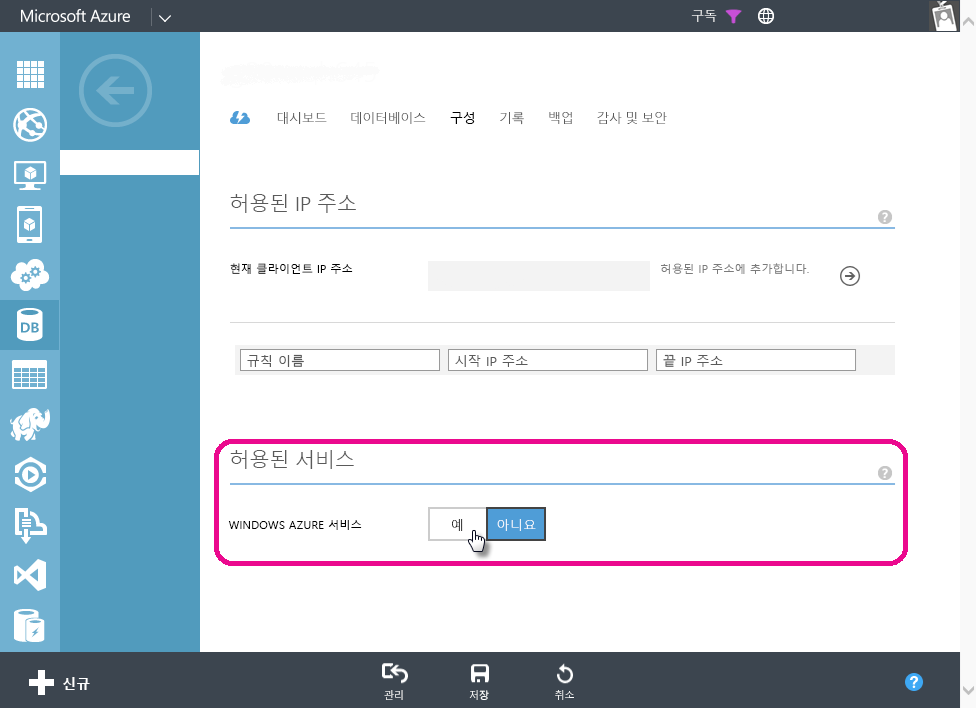

# Power BI에서 Azure SQL Database에 대해 예약된 새로 고침의 문제 해결 
예약 새로 고침 설정에 대한 자세한 단계는 [Power BI에서 데이터 새로 고침](refresh-data.md)을 반드시 참조하세요.

Azure SQL Database에 예약 새로 고침을 설정할 때 자격 증명 편집 중에 오류 코드 400의 오류가 발생할 경우 다음에 따라 적합한 방화벽 규칙을 구성합니다.

1. Azure 관리 포털에 로그인
2. 새로 고침을 구성할 Azure SQL 서버로 이동
3. 허용된 서비스 섹션에서 ‘Windows Azure 서비스’ 켜기

  

궁금한 점이 더 있나요? [Power BI 커뮤니티를 이용하세요.](http://community.powerbi.com/)

