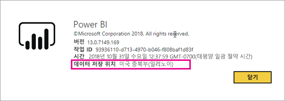
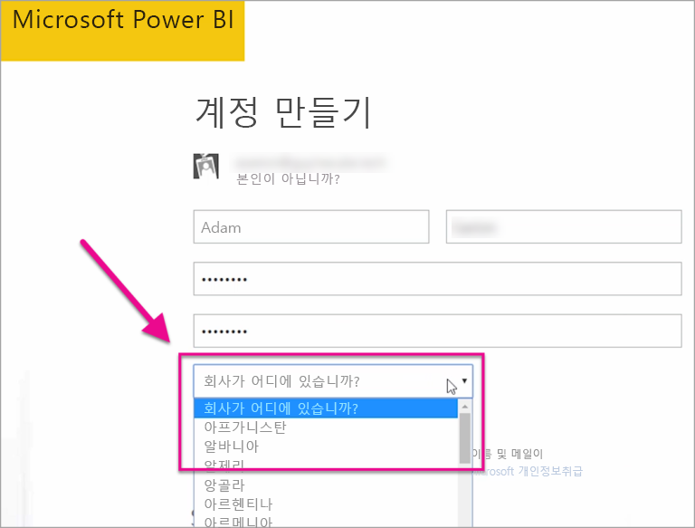

# 내 Power BI 테넌트는 어디에 있습니까?
<iframe width="560" height="315" src="https://www.youtube.com/embed/0fOxaHJPvdM?showinfo=0" frameborder="0" allowfullscreen></iframe>

Power BI 테넌트의 위치와 해당 위치를 선택하는 방법에 대해 알아보세요. 이는 사용하는 서비스와의 상호 작용에 영향을 줄 수 있기 때문에 알아두는 것이 중요합니다.

## Power BI 테넌트 위치를 확인하는 방법
테넌트가 있는 지역을 찾기 위해 다음을 수행할 수 있습니다.

1. Power BI 서비스의 오른쪽 위에서 **?** 를 선택합니다.
2. **Power BI 정보**를 선택합니다.
3. **데이터 저장 위치** 옆에 있는 값을 확인합니다. 이것은 사용자가 있는 지역입니다.

## 데이터 영역을 선택하는 방법
데이터 영역은 테넌트를 처음 만들 때 선택한 국가에 따라 다릅니다. 이는 이 정보를 공유할 때 Power BI뿐만 아니라 Office 365 등록에도 적용됩니다. 등록할 때 새 테넌트인 경우 드롭다운에 국가가 표시됩니다.

이 선택은 데이터를 저장할 드라이브의 위치입니다. Power BI는 이 선택에 가장 가까운 데이터 영역을 선택합니다.

> [!WARNING]
> 이 선택은 변경할 수 없습니다!
> 
> 

궁금한 점이 더 있나요? [Power BI 커뮤니티를 이용하세요.](http://community.powerbi.com/)

