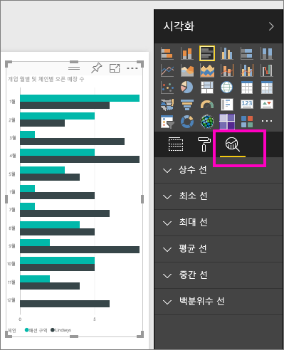
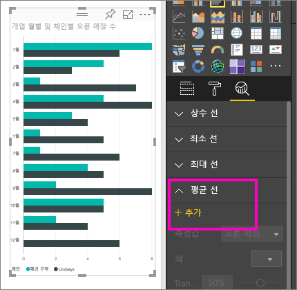
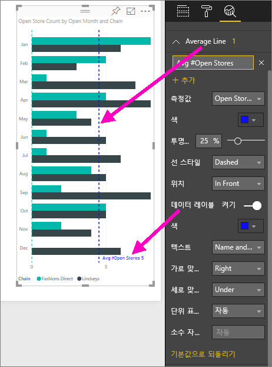
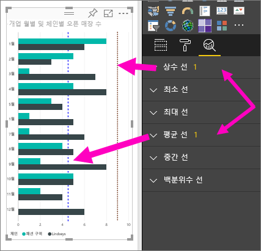
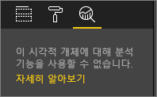

# Power BI 서비스의 분석 창
**Power BI 서비스**의 **분석** 창에서 시각적 개체에 동적 참조 줄을 추가하고, 중요한 추세 또는 통찰력에 대한 포커스를 제공할 수 있습니다.

> [!NOTE]
> **분석** 창은 보고서 캔버스에서 시각적 개체를 선택하는 경우에만 나타납니다.
> 
> 

## 분석 창 사용
**분석** 창을 사용하여 다음과 같은 유형의 동적 참조 줄을 만들 수 있습니다(모든 시각적 개체 유형에 모든 줄을 사용할 수 있는 것은 아님).

* X축 상수 선
* Y축 상수 선
* 최소 선
* 최대 선
* 평균 선
* 중간 선
* 백분위수 선

시각적 개체에 사용 가능한 동적 참조 선을 보려면 단계를 수행하세요.

1. 시각적 개체를 선택하거나 만든 후 **시각화** 창에서 **분석** 아이콘 을 선택합니다.

2. 만들려는 선 유형에 대한 아래쪽 화살표를 선택하여 해당 옵션을 확장 합니다. 이 예에서는 **평균 선**을 선택하겠습니다.
   
   

3. 새로운 선을 만들려면 **+추가**를 선택하고 선을 만드는 데 사용할 측정값을 결정합니다.  **측정값** 드롭다운에 선택된 시각화의 사용 가능한 데이터가 자동으로 채워집니다. **오픈 매장 수**를 사용하겠습니다.

5. 색상, 투명도, 스타일, 위치(시각적 개체의 데이터 요소 기준) 등 선에 대한 모든 옵션이 제공됩니다. 선에 레이블을 지정하려면 제목을 지정한 후 **데이터 레이블** 슬라이더를 **설정**으로 옮겨야 합니다.  이 예에서는 아래와 같이 선에 *평균 오픈 매장 수*라는 제목을 지정하고, 기타 옵션 몇 가지를 사용자 지정하겠습니다.
   
   

1. **분석** 창의 **평균 선** 항목 옆에 표시되는 숫자를 잘 보세요. 현재 시각적 개체에 있는 동적 선의 수와 유형을 알려줍니다. 스토어 개수 목표를 9로 **상수 선**을 추가하면 **분석** 창에서 이 시각적 개체에 **상수 선**이 적용된 것을 확인할 수 있습니다.
   
   
   

**분석** 창을 통해 동적 참조 선을 만들어서 강조할 수 있는 온갖 종류의 흥미로운 통찰력이 있습니다.

## 고려 사항 및 문제 해결

선택한 시각적 개체에 동적 참조 선을 적용할 수 없는 경우(이 예에서는 **맵** 시각적 개체) **분석** 창을 선택하면 다음과 같이 표시됩니다.
   

동적 참조 선을 사용하는 기능은 사용 중인 시각적 개체의 유형을 기반으로 합니다. 다음 목록에는 시각적 개체에 대해 현재 사용 가능한 동적 선이 나와 있습니다.

다음 시각적 개체에서는 전체 동적 선을 사용할 수 있습니다.

* 영역 차트
* 꺾은선형 차트
* 분산형 차트
* 묶은 세로 막대형 차트
* 묶은 가로 막대형 차트

다음 시각적 개체는 **분석** 창에서 상수 선만 사용할 수 있습니다.

* 누적 영역형
* 누적 가로 막대형
* 누적 세로 막대형
* 100% 기준 누적 가로 막대형
* 100% 기준 누적 세로 막대형

다음 시각적 개체에서는 현재 추세선이 유일한 옵션입니다.

* 비 누적 꺾은선형
* 묶은 세로 막대형 차트

마지막으로, 비카티전 시각적 개체는 현재 **분석** 창에서 다음과 같은 동적 선을 적용할 수 없습니다.

* 행렬
* 원형 차트
* 도넛
* 테이블

## 다음 단계
[Power BI Desktop의 분석 창](desktop-analytics-pane.md)

궁금한 점이 더 있나요? [Power BI 커뮤니티를 이용하세요.](http://community.powerbi.com/)

